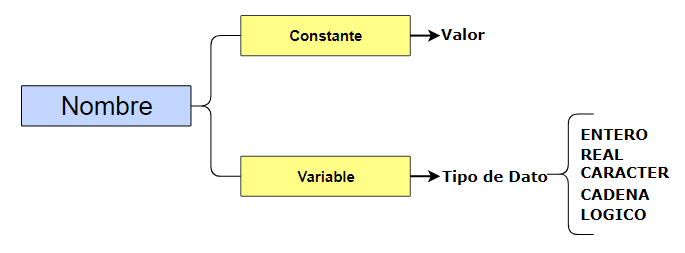
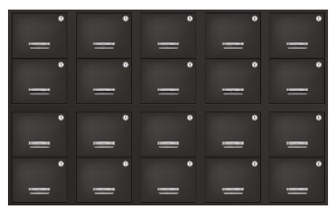
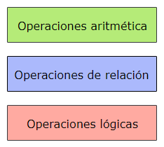
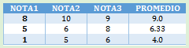
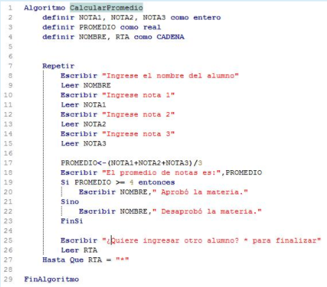
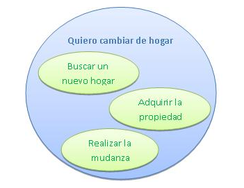
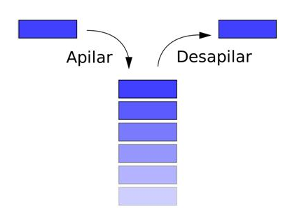

**Introducción a los sistemas**

**¿Qué es un sistema?**

Iniciamos el recorrido introduciendo los conceptos básicos relacionados con sistemas, sistemas informáticos y software. Esta unidad nos servirá para unificar las definiciones que debemos conocer antes de comenzar a programar. 

Seguramente el término “**sistema**” lo habrán conocido cuando cursaban su escuela secundaria, en la asignatura Biología. 

También, en la vida cotidiana utilizamos este concepto para hablar del sistema ferroviario, sistema de salud, sistema inmunológico, por nombrar algunos.

Entonces... ¿Cómo definimos un sistema?

**Un sistema es un conjunto de elementos relacionados entre sí que tienen un cierto orden u organización y que cumplen una función.**

Te contamos que el concepto de sistema surge del denominado enfoque sistémico, basado en la Teoría General de los Sistemas formulada a mediados del siglo XX.

Inicialmente, esta teoría estaba basada en el estudio de los organismos como sistemas biológicos, pero luego se generalizó su alcance a todo tipo de sistemas. De tal manera que hoy se utiliza el término sistema en todas las áreas del conocimiento humano. 

En este curso nos interesan los **sistemas de información**, que son aquellos *sistemas que procesan datos con la finalidad de generar, transformar y distribuir la información.*

` `Los sistemas de información están formados por **hardware** (elementos físicos) y **software** (elementos lógicos que se llaman programas). En este curso nos ocuparemos del desarrollo del software, estudiando distintas técnicas de programación para la construcción de los programas.

**¿Qué es un software?**

El software en un sistema corresponde a todos los elementos lógicos, intangibles.

**Ahora bien, las computadoras, los cables, los celulares, los dispositivos en donde guardamos información, ¿son Software?**

Seguramente estarás pensando que no, todos estos elementos son tangibles. 

El software de un sistema informático es el **conjunto de programas** necesarios para que una computadora funcione. Un **programa** es un conjunto de instrucciones que indican a una computadora las tareas que tiene que realizar.

Para la construcción de **software** se debe seguir un determinado procedimiento que garantice que el resultado sea un producto de calidad. Hay varios modelos o procedimientos a seguir, lo que se traducirá en distintas metodologías de desarrollo, algunas de las cuales veremos más adelante.
###
### **Ciclo de vida de software**
Todo programa está formado por un conjunto de **módulos o subprogramas** que interactúan entre sí. En muchos casos, durante todo el proceso de desarrollo, intervienen distintas personas con diferentes responsabilidades. Es por eso que los programas atraviesan diferentes etapas durante su proceso de construcción, y es lo que se conoce como **"ciclo de vida**".

El desarrollo de un sistema se realiza durante todo el ciclo de vida, que es el período de tiempo que se extiende desde la idea original del problema a resolver hasta el mantenimiento y desarrollo de las mejoras.

Independientemente de las metodologías de desarrollo que se utilicen, podemos identificar las siguientes **etapas o momentos en el desarrollo del software:**  
##### **Análisis del problema**
En esta etapa se debe determinar cuál es el problema a resolver y los límites y alcances que tendrá el software que lo resolverá. Es el momento de reunirse con quien nos solicita el programa para saber cuáles son los requerimientos.
##### **Especificación del software**
En este momento los profesionales de sistemas se encargan de definir las entradas y las salidas del software, y qué restricciones tendrán los datos. También se describen los componentes que se deberán desarrollar, qué características y comportamiento tendrán y cómo estarán relacionados.
##### **Desarrollo del software**
Corresponde al proceso de construcción de software propiamente dicho. Es en donde los programadores escriben el código fuente utilizando algún lenguaje de programación.
##### **Verificación del software**
Una vez que el software está desarrollado se debe probar para verificar que responde a las definiciones y no tiene errores.
##### **Mantenimiento del software**
Todo sistema debería tener mantenimiento ya que siempre habrá que realizar alguna modificación, agregando nueva funcionalidad o bien cambiando alguna característica porque se ha modificado alguna especificación.

El siguiente esquema nos presenta una visualización del ciclo de vida del software: 
###
### **Metodologías de desarrollo de sistemas**
Como definimos anteriormente, las **etapas del ciclo de vida del software** son los procesos generales que suele tener todo desarrollo. Ahora bien, a lo largo de las últimas décadas se han estudiado estos procesos para buscar cuál es el método óptimo. Como resultados de esos trabajos se han desarrollado diferentes metodologías de desarrollo de sistemas. Cada una de ellas presenta ventajas y desventajas, y no hay una que sea mejor que las otras en todos los casos. 

Dependiendo del proyecto, la cantidad de personas que intervengan y hasta los plazos de desarrollo y entrega del producto, algunas metodologías serán mucho más eficientes que otras. Por eso es importante conocer cuáles son las principales metodologías, para poder tomar tus propias decisiones.

**Una metodología de desarrollo de software es un entorno de trabajo que es usado para estructurar, planear y controlar el proceso de desarrollo de sistemas.**

La **metodología** define una representación que facilita la manipulación de modelos, junto con la comunicación e intercambio de información entre todas las personas involucradas en el desarrollo del sistema. 

Les presentaremos a continuación los principales **modelos de desarrollo**: 

1. Modelo de cascada, 
1. Modelo espiral, 
1. Modelos de desarrollo iterativo e incremental, 
1. Modelo de desarrollo ágil.
1. **El modelo cascada** define las siguientes etapas que deben cumplirse de forma sucesiva:

Este modelo es el denominado **modelo clásico de software**, ya que está relacionado con las etapas del **ciclo de vida**.

El nombre de **cascada** se debe a que las etapas se realizan de forma individual y en secuencia, es decir, hasta que no finaliza una fase no comienza la otra. Es por eso que se va avanzando en las etapas de una en una.
Este es el modelo de construcción de los primeros sistemas informáticos. Hoy en día se sigue utilizando, pero tiene como desventaja que debe pasar mucho tiempo antes de que el cliente pueda llegar a ver el sistema.
### **2. Modelo espiral**
En el **modelo espiral**, durante cada ciclo se realizarán cuatro actividades:

Este modelo se basa en el desarrollo en cascada, pero a diferencia de ser una serie de pasos de manera sucesiva, se desarrolla en ciclos que se repiten en forma de espiral.
Comenzando desde el centro, se suele interpretar como que dentro de cada ciclo de la espiral se sigue un Modelo Cascada, pero no necesariamente debe ser así.
### **3. Modelos de desarrollo iterativo e incremental**
En estos modelos también se realiza un **desarrollo por ciclos.**

Si estamos realizando un **desarrollo iterativo,** en cada ciclo o iteración, se revisa y mejora el producto desarrollado. Es importante señalar que este ciclo no implica añadir funcionalidades en el producto, pero si la revisión y la mejora.

Énfasis en validación y verificación con usuarios.

Un ejemplo de **desarrollo iterativo** es aquel basado en refactorizaciones, en el que cada ciclo mejora más la calidad del producto.

Si estamos realizando un **desarrollo incremental**, en cada ciclo iremos liberando partes del software (prototipos) periódicamente, en cada iteración, y cada nueva versión, normalmente, aumenta la funcionalidad y mejora en calidad respecto a la anterior.
### **4. Modelo de desarrollo ágil**
El **modelo de desarrollo ágil** se basa en los modelos iterativos e incrementales, en donde los ciclos son muy cortos (en general una o dos semanas) y con la distinción que dentro de ellos no se encuentran etapas en cascada.

El modelo ágil está centrado en las personas, ya que, en lugar de haber una planificación bien específica de todo el desarrollo al principio, se basa en la presentación en muy corto plazo de módulos y en la retroalimentación de esas validaciones. 
De esta manera el cliente se encuentra involucrado desde el principio del desarrollo y participa durante todo el proceso de construcción.
### **Lenguajes de programación**
Para que una computadora pueda realizar un proceso es necesario que se le brinde una lista de instrucciones que sea capaz de comprender y de ejecutar. Como vimos anteriormente, un programa o software es ese conjunto de instrucciones. Esos programas se escriben utilizando un lenguaje de programación. 

¿Qué es un lenguaje de programación?

**Un lenguaje de programación es un lenguaje utilizado para escribir programas que sean entendidos y procesados por una computadora.**

Ahora te presentaremos los principales **tipos de lenguajes de programación** utilizados en la actualidad:
#### ***Lenguaje de máquina***
Este lenguaje es el que entiende directamente una computadora. Está formado por instrucciones binarias (dígitos 0 y 1) que especifican operaciones y las direcciones de memoria implicadas en dichas operaciones. 

El código máquina es el denominado código binario. Estas instrucciones dependen del hardware de la computadora, y por lo tanto, varían de una en otra. 

Este lenguaje al ser entendible por computadoras es muy poco legible y claro para los programadores, es por eso que se han desarrollado otros lenguajes de programación más cercanos a los idiomas para que sea mucho más fácil programar. Estos lenguajes se dividen en lenguajes de bajo y de alto nivel.
#### ***Lenguaje de bajo nivel***
Es más simple de utilizar que el lenguaje máquina, pero también depende del hardware en donde se esté ejecutando. 
**El principal lenguaje de bajo nivel es el ensamblador**.

#### ***Lenguajes de alto nivel***
Estos lenguajes son los más utilizados por los programadores, ya que están diseñados para que las personas lo pueden entender de manera mucho más fácil que los lenguajes de bajo nivel. 
Otra ventaja que tiene es que un programa escrito en este tipo de lenguaje es independiente del hardware en donde se va a ejecutar. 

Los principales lenguajes de alto nivel son C, C++, Pascal, Java, VisualBasic. 

Los programas fuente escritos en estos lenguajes tiene que ser traducidos al lenguaje máquina. Para eso se utiliza un **programa traductor** que es un intérprete o un compilador. 

**Lenguajes interpretados y compilados**

Como hemos visto, un programa escrito en un lenguaje de alto nivel es entendible solo por una persona, es decir, el programador. Por lo tanto, para que pueda ser entendible y ejecutado por una computadora debe ser traducido al lenguaje máquina, por medio de un intérprete o un compilador. De esta manera tenemos **lenguajes interpretados o compilados**.

**¿Qué es un lenguaje interpretado?**

**Los lenguajes interpretados son aquellos que se ejecutan por medio de un intérprete. 
Un intérprete es un traductor que toma el código fuente, lo traduce y luego lo ejecuta.**

Un lenguaje interpretado clásico es el "Basic" que hoy, prácticamente no se utiliza.

Por otro lado, los **lenguajes compilados** son aquellos que necesitan un compilador para poder ejecutarse.

**¿Qué es un compilador?**

**Un compilador es un programa especial que toma el código fuente de alto nivel y lo convierte en instrucciones de código entendible por una computadora, denominado código objeto.**

En general, el **programa objeto** es la traducción al código máquina, y que depende de cada modelo de computadora. Por lo tanto, el compilador debe ser específico para el modelo de computadora que va a ejecutar el programa.

**El proceso de compilación abarca las siguientes etapas:**

1. Escritura del programa fuente.
1. Compilación del programa fuente.
1. Verificación de errores de compilación.
1. Obtención del programa objeto.
1. Enlace del programa objeto con todos los programas necesarios del sistema operativo.
1. Ejecución del programa.

**Síntesis de unidad 1 (introducción a los sistemas):** un tipo de sistema es el sistema de información, conformado por hardware (tangible) y software (intangible/lógico), el software pasa diferentes etapas de construcción (ciclos de vida de software). Se utilizan diferentes metodologías de desarrollo de software (procesos de construcción de sistemas c/u con sus ventajas y desventajas), dependiendo de las características del software, cantidad de recursos y tiempo de entrega, algunas metodologías serán mejores que otras (modelo cascada – desarrollo incremental – modelo espiral – desarrollo iterativo – desarrollo ágil). Los diferentes tipos de lenguajes son de bajo nivel (ensamblador) o alto nivel (que requieren ser interpretados por un intérprete ó compilados por un compilador).

**Resolución de problemas**

En esta unidad vamos a presentarles una metodología de **Análisis de Problemas** que les permitirá identificar los componentes que forman un problema y comprender qué es lo que hay que resolver, qué datos se necesitan, con qué valores y cuáles serán las salidas y los resultados del problema.

**¿Qué es un problema?**

Podemos decir que un problema **es el planteamiento de una situación a resolver mediante la aplicación de algún método**. 

En la vida cotidiana resolvemos muchos problemas sin darse cuenta y de forma automatizada pero también lo hacemos de forma innovadora o creativa. 

**En esta materia nos ocuparemos de problemas que se resuelven programando una computadora y que se describen por medio de enunciados.**

Debemos entonces hacer una diferencia entre problema y enunciado. 

**Los enunciados** son la descripción de un problema que se puede resolver mediante una computadora. Es decir, **los problemas se plantean mediante enunciados**. 
En los enunciados debería incluirse toda la información necesaria para poder resolver el problema.

Volviendo a los problemas generales, ante un problema, lo que debemos hacer es resolverlo, utilizando un método propio o planeamiento para encontrar una solución.
### **¿Cómo empezar a resolver un problema?**
Para poder resolver un problema, la primera cuestión a plantearse parece bastante evidente. Pero esta "evidencia" es lo que hace que en la mayoría de los casos se pase por alto, o bien se realice muy rápido, con la consecuencia de traernos inconvenientes futuros a lo largo de toda la resolución del problema. 

Entonces, debemos enfocarnos en:

**Comprender el problema**

Comprender un problema implica "saber" cuál es el problema. Así, si no sabemos cuál es el problema ni la información para resolverlo, difícilmente podamos llegar a una solución adecuada. 

Esto que resulta tan simple decirlo, no siempre se realiza de la forma apropiada. Por ello, es que nos planteamos una **metodología** para poder determinar un orden y así realizar el análisis del problema. 

¿Cómo podemos realizar un adecuado análisis?

Para comprender un problema debemos realizar lo que se denomina ***Análisis del Problema** (también llamado **Análisis de Enunciados**).*

Pasamos a explicar cómo podemos realizar un adecuado análisis de un problema...
### **Análisis del problema**
Consideremos un problema que se nos presenta descripto en un enunciado.

Entonces, el primer paso será **leer el enunciado del problema**. Ahora bien, ¿cuántas veces debe leerse un problema? La cantidad de veces que sea necesario. 
Seguramente, no alcanzará con leer el enunciado una sola vez, ni otra más, recién en una tercera lectura podremos empezar a comprender el problema con todos sus datos.

La lectura tampoco finalizará acá, ya que será necesario volver a releer el enunciado ante cuestiones, dudas o situaciones que no se puedan definir en las siguientes etapas.

Este primer paso de una lectura reiterada del problema, los programadores muchas veces la suelen pasar por alto, o bien, leen el enunciado “por arriba” comenzando rápidamente a escribir el programa.
Nuestra experiencia nos hizo ver que hay que tomarse todo el tiempo necesario en el momento del **análisis del problema**, porque los errores arrastrados serán luego más costosos de resolver.

Proponemos como ejemplo de un **problema**: un viaje de vacaciones.

Una de las primeras cuestiones que nos planteamos es el propósito del viaje. Si bien un viaje de vacaciones, es de esperar que sean para descansar, podemos tener varios propósitos como ser: conocer un lugar distinto, ir a una playa, disfrutar de sierras o montañas, practicar un deporte como esquiar, compartir unos días con familiares o amigos, etc.

Es decir, que el **problema tiene un propósito, un OBJETIVO.** Este objetivo del problema será el primero de los componentes que debemos identificar. 

Veamos a continuación cuáles son todas las componentes que debemos identificar de un problema...

**Componentes de un problema**

Como hemos dicho, el objetivo del problema es el primero de los componentes que debemos identificar en un problema para luego continuar con los demás componentes, que se muestran en el siguiente esquema:

### **1. Objetivos**
Como hemos mencionado, el objetivo es el primero de los componentes que debemos identificar en un problema.

El **objetivo** explica el problema a resolver, lo que hay que realizar. Es importante destacar que el objetivo indica el **QUÉ** y no el **CÓMO**. En el objetivo se plantea lo que se tiene que realizar, pero no de qué manera se va a resolver.

¿Cómo definimos un objetivo?

- El objetivo, es un párrafo en el que se tiene que explicar de manera coloquial desde dónde se parte y hacia dónde se debe llegar.
- El objetivo explica el problema a resolver, lo que se tiene que realizar.

Retomando nuestro ejemplo del viaje de vacaciones...

Una vez planteado el objetivo del viaje, llegarán otras varias preguntas como, por ejemplo, qué presupuesto disponemos, cuántos días durará el viaje, si viajaremos en algún medio de transporte en particular, quiénes van a viajar, etc.

Todos estos datos representan la información con la que contamos para llegar a una solución, es decir que, de acuerdo a estas respuestas, a estos **DATOS**, serán las vacaciones.

Entonces, luego de tener bien en claro qué es lo que se tiene que hacer, el paso siguiente es identificar la información con la que se cuenta para poder lograr el objetivo. Esto se realizará especificando los **Datos de Entrada.**

**2. Datos de entrada**

Los Datos de Entrada especifican la información que se tiene antes de comenzar a resolver el problema. 
Son los datos con los que se cuenta para poder llegar a una solución.

Las **características** que se deben especificar para cada dato de entrada son:

- Nombre.
- Constantes y variables.
- Tipos de datos.

En el siguiente esquema presentamos cómo es la relación de los elementos de cada Dato de Entrada.

###
### 2\.1. Nombre
A cada Dato de Entrada le vamos a definir un NOMBRE. El nombre debe ser representativo del dato para no tener confusiones sobre su valor. Por ejemplo, si el dato va a representar la **Edad de una persona**, lo ideal es que el dato se llame EDAD.

Una de las buenas prácticas de programación establece que el nombre del dato debe representar su valor. 
Es importante evitar los nombres genéricos, que muchas veces son muy tentadores, como N1, N2, Dato, NÚMERO,  X, etc. , ya que dificultan la lectura y comprensión del problema.

Volviendo a nuestro ejemplo del viaje de vacaciones...

Los **datos de entrada** podrían ser: PRESUPUESTO, DÍAS DE DURACIÓN, MEDIO DE TRANSPORTE. 

Suponiendo que te gusta manejar y disfrutar de un viaje en auto, ¿Vas a destinar el mismo presupuesto y la misma cantidad de días para todas las vacaciones? 
Seguramente que no, ya que más allá de la variación de precios, el presupuesto seguramente será distinto. Lo mismo sucederá con la cantidad de días, en algún viaje le podrás destinar un fin de semana largo, 2 días, o en otro viaje podrás destinar 14 días. En cambio, siempre viajarás en auto, ya que te gusta y disfrutás del manejo. 

Llegamos a la conclusión que el medio de transporte, uno de los datos de entrada identificados, permanece siempre igual (es su auto), por lo tanto, será un dato CONSTANTE, ya que para todos los viajes será el mismo. 
Por otro lado, los otros dos datos de entrada identificados, *presupuesto* y *días de duración*, serán datos VARIABLES ya que serán distintos para cada viaje. 

Resumiendo:

|**DATO**|**TIPO** |
| :- | :- |
|**MEDIO DE TRANSPORTE**|**CONSTANTE**|
|**PRESUPUESTO** |**VARIABLE** |
|**DURACIÓN** |**VARIABLE**|

Esto que acabamos de realizar es una clasificación de los datos de entrada en VARIABLES y CONSTANTES, y que desarrollaremos en la siguiente sección.
### 2\.2. Constantes y variables
Además de indicar el nombre, debemos realizar una clasificación adicional por cada Dato de entrada, y será de acuerdo a si el valor del dato va a ser el mismo o si puede cambiar durante la ejecución del programa.

Si el dato tiene siempre el mismo valor para todos los problemas, entonces el dato de entrada es **CONSTANTE** si en cambio, su valor puede ser distinto para cada problema o bien puede cambiar dentro del mismo problema, el dato de entrada es **VARIABLE.**

Las constantes matemáticas son ejemplos de **datos Constantes**, como, por ejemplo, el número PI.
Mientras que **datos Variables** pueden ser los datos de una factura (fecha, productos, importe), ya que lo usual es que los datos de cada factura sean distintos.

Para tener en cuenta: 
Los Datos de Entrada Constantes deben indicarse con su valor. 
Por ejemplo, **PI = 3,14**   o **IVA = 0,21.** 
Siempre debe haber, por lo menos, un dato de entrada **Variable**.

Volvamos a nuestro ejemplo de las vacaciones y los datos de entrada que definimos…

Sabemos que los **DÍAS DE DURACIÓN**, es un dato VARIABLE. Analizando un poco más en profundidad, qué valores posibles podrá tener, como se trata de días, el valor será un número. Si queremos ser más específicos, debería ser un NÚMERO NATURAL. 
Del mismo modo, el otro dato variable, el **PRESUPUESTO**, también será un número, pero en este caso, el número podrá ser un [NÚMERO REAL](https://es.wikipedia.org/wiki/N%C3%BAmero_real). (decimales, por ejemplo)

Esta especificación que acabamos de mencionar con los datos corresponde a lo que llamaremos TIPOS DE DATOS y se lo desarrollaremos en el siguiente apartado.
### 2\.3. Tipos de datos
Ya sabemos que **el Tipo de Dato indica cuál es el conjunto de valores posibles del dato**. Además, permite definir cuáles serán las operaciones que se podrán aplicar a este dato.

**El tipo de dato se debe especificar para los Datos de Entrada Variables, ya que en los Constantes se deducen de acuerdo a su valor.** 

Vimos también que los tipos de datos pueden ser números (enteros, reales, por ejemplo). Pero esos no son los únicos. Se estarán imaginando que algunos problemas necesitan trabajar con nombres de personas, letras o símbolos para indicar algún código, y hasta con valores de tipo SI-NO.  

Es por eso que en la etapa del Análisis del problema vamos a trabajar con los siguientes tipos de datos estándar: 

|**Tipo de Dato**|**Valor**|
| :- | :- |
|**Entero (Integer)**|Números enteros|
|**Real (Float)**|Números reales|
|**Caracter (Character)**|Un solo símbolo (letra, dígito, signo, etc.)|
|**Cadena (String)**|Un conjunto de caracteres (palabra, frase, etc.)|
|**Lógico (Boolean)**|Verdadero o Falso|

Las operaciones sobre cada tipo de datos las veremos más adelante, ya que por ahora solo interesa saber los tipos de datos y sus posibles valores.

Retomando nuevamente el ejemplo del viaje de vacaciones... 

Sabemos que DÍAS DE DURACIÓN es un dato VARIABLE de tipo ENTERO, pero...¿cualquier valor dentro de los números enteros es correcto? 

Sabemos que por lo menos podemos tomarnos 1 día de vacaciones. Esa será la cantidad mínima de días que se podrá viajar, no tiene sentido irse 0 días o -5 días de viaje. Por lo tanto, solo serán válidos algunos números enteros.  En este caso podemos pensar en un subconjunto que está formado por los números enteros mayores o iguales a 1. 

Por otro lado, si bien tener muchos días de vacaciones sería algo que deseamos todos, nuestras obligaciones (y nuestro jefe) nos limitarán la cantidad máxima de días ¿Cuál será? ¿30, 60, 28? Será un aspecto a definir con mayor profundidad en las próximas unidades, pero sabemos que existe un límite máximo en los datos. 

Estos límites o subconjuntos que acabamos de indicar sobre los TIPOS de DATOS es lo que llamamos **PRECONDICIONES** o, también, RESTRICCIONES, y lo veremos en la próxima sección. 
### **3. Precondiciones**
Con las **Precondiciones** se indican los valores posibles que deberán tener los Datos de Entrada Variables.

Acá tenemos que prestar mucha atención para poder diferenciar el Tipo de dato de las precondiciones, ya que son conceptos similares, aunque indican cosas distintas.

El **tipo de dato** indica el conjunto posible de valores, por ejemplo, los números reales, mientras que las **precondiciones** establecen cuáles de esos números reales serán válidos para el problema.

Por ejemplo, ante un dato de entrada que indica la longitud del lado de un cuadrado, el tipo de dato será REAL. Ahora bien, ¿cualquier número REAL es válido para la longitud de un lado? 
Por supuesto que no, ya que para que sea lado, deberá ser un número mayor a 0. 
**Esa es la precondición.** 
Las precondiciones las podemos especificar como condiciones matemáticas o expresarlas en palabras, siempre y cuando no haya ambigüedades y quede bien claro cuáles son los valores posibles.

Por ejemplo, la **precondición de la longitud del lado de un cuadrado**, se puede expresar de la siguiente manera:

**LADO > 0**

O también: 

**LADO tiene que ser mayor a 0.**

Las precondiciones son importantes porque indican cuándo un dato es un dato válido para el problema. Así, tenemos que tener en cuenta que: **un dato de entrada será válido cuando cumpla con todas las Precondiciones**.
### **4. Datos de salida**
Hasta el momento hemos especificado todo lo relacionado con los datos que necesitamos para resolver el problema, es decir la ENTRADA del problema. Así como se indica la entrada, se debe especificar los datos que se generarán al resolver el problema, que se llaman **Datos de Salida.** 

Los **Datos de salida** se utilizan para especificar la información que se tiene después de resolver el problema.

Para este tipo de datos no será necesario realizar ninguna otra clasificación porque es de esperar que todos los datos de salida sean siempre VARIABLES, pues dependerán de los Datos de Entrada. 

Es decir, que solo alcanza con definir la lista de nombres de los Datos de Salida.
### **5. Lote de Datos de Prueba**
Hemos analizado y especificado la Entrada y la Salida del problema, para luego plantear un *conjunto de datos de prueba*. Este lote de datos servirá para más adelante, luego de escribir el programa, para poder realizar lo que se denomina *Prueba de Escritorio*.

Una forma de verificar que el programa no tenga errores lógicos es mediante la *realización de la Prueba de Escritorio*, tomando como datos de entrada los especificados en este **Lote de Datos de Prueba.**

Una vez desarrollado el programa, nos preguntamos: ¿Cómo sabemos si está bien?

**Tendremos que usar el Lote de Datos de Prueba. Si el programa produce las salidas esperadas en este lote, entonces podremos afirmar que el programa funciona.**

**El lote de datos de prueba** se compone de *una lista de valores para los datos de entrada y las salidas correspondientes* a esos datos. Podemos representarlo en forma de tabla de valores, sin necesidad de especificar cómo se llegó a ese resultado, ya que de eso se ocupará el programa. 

|**ENTRADAS**|**SALIDAS**||||||
| :-: | :-: | :- | :- | :- | :- | :- |
|Dato Entrada 1|Dato Entrada 2|...|Dato Entrada N|Dato Salida 1|...|Dato Salida N|
|-|-|-|-|-|-|-|
|-|-|-|-|-|-|-|

Armar el lote de Datos no es una tarea para tomar a la ligera, ya que serán los datos con los que se probará el programa. Si el lote es erróneo o hay situaciones que no se contemplan, entonces la prueba será incompleta y no se sabrá si el programa funcionará correctamente para todas las situaciones. 

Veamos un ejemplo:

**Tenemos un programa que realiza la suma de dos números si ambos son positivos o realiza la resta si ambos son negativos.** 

El lote de datos de prueba deberá abarcar las dos situaciones, ambos números negativos o ambos números positivos. No tiene sentido realizar una tabla de cientos de valores, ambos positivos, ya que todos contemplan una misma situación y no se está evaluando cuando ambos números son negativos. Para este caso, un lote de datos ideal estaría formado por un par de números positivos y otro par de números negativos. 
Por ejemplo, podemos probar con los números  -2;-3;-5; 7; 8; 15; 1000.

**Ejercicio**

A continuación, te proponemos una actividad en la que tenés que hacer un "Análisis del problema" tal como vimos en las secciones anteriores.

Partiendo del enunciado del problema, tendrás que identificar un **Objetivo, los Datos de Entrada, las Precondiciones, los Datos de Salida** y crear un **Lote de Datos de Prueba.**

**Enunciado del problema 1:**

Ingresar un número entero positivo y calcular la suma de los números naturales hasta ese número. Por ejemplo, si ingresás 5, la suma de los naturales hasta 5 se calcula como: 1+2+3+4+5 = 15.

**Enunciado del problema 2:**

Ingresar **edad** (en años) y **sexo** (F: femenino, M: masculino) de los alumnos de un curso. Se pide informar:

- Total de alumnos, cantidad y porcentaje de alumnos de cada sexo.
- Promedio general de las edades ingresadas.
- Promedio de edad de los varones.
- Promedio de edad de las mujeres.

Antes de pasar a la página siguiente te recomendamos hacer "tu Análisis del problema". Cuando finalices, podrás comparar tu solución con la que nosotros proponemos.
## **Resolución de problemas**
Solución del Problema 1

Recordemos el **enunciado del problema 1**:

Ingresar un número entero positivo y calcular la suma de los números naturales hasta ese número. Por ejemplo, si ingresás 5, la suma de los naturales hasta 5 se calcula como: 1+2+3+4+5 = 15.

**Objetivo**: Informar la suma de los números naturales desde 1 hasta el número que ingresa el usuario. 
**Datos de Entrada**: NÚMERO: ENTERO 
**Precondiciones**: NÚMERO > = 1 
**Datos de Salida**: Suma de los números naturales desde 1 hasta NÚMERO 

**Lote de Datos de Prueba:**

|**ENTRADAS**|**SALIDAS**|
| :- | :- |
|1|1|
|5|15|
|7|28|
|10|55|

Solución del Problema 2

Recordemos el **enunciado del problema 2**: 

Ingresar **edad** (en años) y **sexo** (F: femenino, M: masculino) de los alumnos de un curso. Se pide informar: 

- Total de alumnos, cantidad y porcentaje de alumnos de cada sexo.
- Promedio general de las edades ingresadas.
- Promedio de edad de los varones.
- Promedio de edad de las mujeres.

**Objetivo**:  
A parir de la edad y el sexo de los alumnos de un curso generar un reporte con los siguientes resultados: 

- Total de alumnos, cantidad y porcentaje de alumnos de cada sexo.
- Promedio general de las edades ingresadas.
- Promedio de edad de los varones.
- Promedio de edad de las mujeres.

**Datos de Entrada**: 
`    `EDAD: ENTERO 
`    `SEXO: CARACTER 

**Precondiciones** 
`    `EDAD > 0   *(También podría limitarse el valor máximo, por ejemplo EDAD <= 120)* 
`    `SEXO = ´F´ o SEXO = ´M´ 
`    `NÚMERO > = 1

**Datos de Salida** 

`    `TOTAL\_ALU, TOTALM, TOTALF, PORCM, PORCF, PROM, PROMM, PROMF

**Lote de Datos 1:**

|**ENTRADA**||
| :-: | :- |
|EDAD|SEXO|
|20|M|
|18|F|
|17|M|

|**SALIDA**||||||||
| :-: | :- | :- | :- | :- | :- | :- | :- |
|TOTAL ALUMNOS|TOTAL HOMBRES|TOTAL MUJERES|PORC. HOMBRES|PORC. MUJERES|PROM. EDADES|PROM. HOMBRES|PROM. MUJERES|
|3|2|1|66|33|18\.33|18\.5|18|

**Lote de Datos 2:**

|**ENTRADA**||
| :-: | :- |
|EDAD|SEXO|
|19|M|
|25|M|

|**SALIDA**||||||||
| :-: | :- | :- | :- | :- | :- | :- | :- |
|TOTAL ALUMNOS|TOTAL HOMBRES|TOTAL MUJERES|PORC. HOMBRES|PORC. MUJERES|PROM. EDADES|PROM. HOMBRES|PROM. MUJERES|
|2|2|0|100|0|22|22|No hay mujeres|

**Lote de Datos 3:**

|**ENTRADA**||
| :-: | :- |
|EDAD|SEXO|
|21|F|

|**SALIDA**||||||||
| :-: | :- | :- | :- | :- | :- | :- | :- |
|TOTAL ALUMNOS|TOTAL HOMBRES|TOTAL MUJERES|PORC. HOMBRES|PORC. MUJERES|PROM. EDADES|PROM. HOMBRES|PROM. MUJERES|
|1|0|1|0|100|21|No hay hombres|21|

Se plantean **lotes de datos con las siguientes situaciones**:

- Caso donde hay hombres y mujeres.
- Caso donde hay alumnos de un solo sexo (hombres). Es importante destacar que el porcentaje de mujeres es 0%, pero el promedio de edad de mujeres no se puede calcular ya que no hay mujeres.
- Caso donde hay alumnos de un solo sexo (mujeres). Es importante destacar que el porcentaje de hombres es 0%, pero el promedio de edad de hombres no se puede calcular ya que no hay hombres.

Síntesis de unidad 2 (resolución de problemas): En la **Unidad 2** vimos el proceso y los componentes de un Análisis de Problema. Así, comenzamos el desarrollo definiendo un PROBLEMA. Recuerden que en este módulo nos ocuparemos de problemas que se resuelven programando una computadora, es decir, problemas algorítmicos. 

Todo problema debe ser analizado para poder comprenderlo, debemos identificar el **Objetivo** (que cumple), los datos de **Entrada** (que necesite), los datos de **Salida** (que va a generar). Los datos de entrada deben poseer un Nombre, y pueden ser **constantes** o **variables,** las variables deben cumplir **precondiciones (valores posibles validos). L**os datos de entrada pueden ser del tipo **entero, real, carácter, cadena y lógico**. A la resolución del problema la podemos verificar con **Lotes de datos de prueba**. Con esta metodología se busca comprender **que es lo que hay que resolver**, que datos se necesitan, con que valores y cuáles serán las salidas y resultados del problema.

**Estructuras de datos**
### **Datos de información**
En la unidad 2 aprendimos a reconocer un problema y a especificar todos los elementos del mismo. Seguramente estarás recordando que, dentro de esos elementos que identificamos, se encontraban **los Datos de Entrada y los Datos de Salida**. 

En esta unidad, veremos cómo se representan esos datos y para eso introduciremos las ideas de tipos de datos, variables y constantes. También presentaremos los tipos de datos a utilizar en los algoritmos y las operaciones que podremos realizar con cada uno de ellos.

Cuando hablamos de datos, tanto de entrada como de salida y decimos que tienen que tener un nombre para poder identificarlos, pero... 

¿Dónde se identifican los datos?

**Para poder utilizar y repetir los datos, debemos guardarlos en la memoria. La computadora tiene también una memoria para almacenar los datos, la información que necesita y que genera todo algoritmo.**

No entraremos en detalle sobre cuestiones físicas o características de la memoria, ya que es un tema de otra asignatura.  Lo que nos interesa en esta materia, son los datos y sus posibles valores. Entonces: 

Volvamos al ejemplo que planteamos sobre nuestro viaje de vacaciones....

recordemos que definimos varios datos, entre ellos DÍAS DE DURACIÓN y PRESUPUESTO. Ya habíamos determinado que ambos datos tendrán valores numéricos, pero no nos quedamos ahí, ya que establecimos que los DÍAS son números **enteros** y el PRESUPUESTO es un número **real.**

Ahora bien, ¿qué significa esto? Evidentemente un número real tiene características distintas que un número entero, por ejemplo, la parte decimal. Del mismo modo que si nosotros escribimos un número entero o real en un papel, utilizamos distintos espacios, estos números ocuparán en memoria una cantidad de espacio diferente. 
### **Estructura de datos primitivas**
Además del espacio que ocupan estos números de distinto formato en la memoria, hay otras características distintivas.

Pensemos en un **número entero**, por ejemplo, **la edad de una persona**. Con esta edad habrá operaciones o acciones que podremos hacer, como determinar si la edad supera los 18 años para determinar si es una persona mayor de edad. También, si tenemos muchas edades, podremos calcular el promedio de esas edades. 

Es decir, con la edad, al ser un dato numérico, podremos hacer operaciones que se aplican a números, como por ejemplo sumar, restar, calcular promedios, obtener un máximo, entre otras operaciones.
Ahora bien, con el nombre de la persona, no podremos calcular el promedio, ya que no tiene sentido. Seguramente, usted ya se dio cuenta que con un nombre no se pueden hacer operaciones matemáticas, debido a que el dato no es un número. 

En definitiva, seguramente pudieron identificar que hay **dos características** que dependen del valor de los datos:

- **El espacio que ocupa en memoria.**
- **Las operaciones disponibles.**

Por lo tanto, es necesario poder identificar de alguna manera el conjunto de datos posibles para poder definir el **espacio** y las **operaciones**, y es debido a ello que surge la necesidad de tener un Tipo de Dato.

De este modo podemos definir al **Tipo de Dato** como la característica que tiene un valor que determina las operaciones que se pueden realizar y cómo es almacenado en la memoria.

En este módulo, en el momento de desarrollar un algoritmo, trabajaremos con los Tipos de Datos simples, también llamados primitivos o estándares, que se encuentran definidos en la mayoría de los lenguajes de programación. En las siguientes unidades veremos la posibilidad de crear nuevos Tipos de Datos.
### **Tipos de datos**
Los tipos de datos estándares son los mismos que definimos en el Análisis previo, y son los siguientes: 

|**Tipo de Dato**|**Valor**|
| :- | :- |
|**Entero (Integer)**|Números enteros|
|**Real (Float)**|Números reales|
|**Caracter (Character)**|Un solo símbolo (letra, dígito, signo, etc.)|
|**Cadena (String)**|Un conjunto de caracteres (palabra, frase, etc.)|
|**Lógico (Boolean)**|Verdadero o Falso|

##### [**Tipo de dato: Entero**](http://aulavirtual.codoacodo.com.ar/mod/lesson/view.php?id=43&pageid=47#collapse1)
El dato de tipo Entero será un **valor numérico dentro** del conjunto de los números enteros. Algunos ejemplos de valores enteros son: **5 ; 257 ; 0 ; -734 ; -1 ; 1**
Recordemos que no nos interesan las cuestiones físicas de los lenguajes o del límite de memoria, por lo tanto, no pondremos límites a los valores, teniendo disponible el conjunto de números enteros desde -∞ hasta ∞. 
En un lenguaje de programación los tipos de datos están acotados ya que ocupan una cantidad finita de espacio en la memoria, pero de este tema nos ocuparemos cuando veamos ejemplos de lenguajes.
##### [**Tipo de dato: Real**](http://aulavirtual.codoacodo.com.ar/mod/lesson/view.php?id=43&pageid=47#collapse2)
El dato de tipo Real será de un **valor numérico** que forma parte del conjunto de los números reales. Algunos ejemplos de valores reales son: **2,25 ; 1429,1456 ; 0,0 ; -12,0 ; -27,34.**
##### [**Tipo de dato: Caracter**](http://aulavirtual.codoacodo.com.ar/mod/lesson/view.php?id=43&pageid=47#collapse3)
El valor de tipo caracter está formado por **un único elemento** que puede ser un dígito, una letra o un símbolo de puntuación o de los llamados símbolos especiales, como por ejemplo, los de pregunta, exclamación, etc. Es decir, que un valor de tipo caracter está limitado por el conjunto de símbolos que se pueden escribir en una computadora. Algunos ejemplos de valores de tipo caracter son: **‘a’ , ‘B’ , ‘1’ , ‘:’ , ‘^’ , ‘ ‘ , ‘%’ , ‘F’ , ‘!’** 
Tené en cuenta que los valores están encerrados entre comillas simples. Esta notación la utilizamos para poder diferenciar los números de los caracteres. Por ejemplo, el **número entero 1** es un valor distinto que el caracter que representa al número 1. 
De esta forma indicamos que 1 es distinto del **caracter ‘1’.** Este tipo de dato es muy útil cuando trabajamos con valores o códigos de una sola letra o dígito. 
##### [**Tipo de dato: Cadena**](http://aulavirtual.codoacodo.com.ar/mod/lesson/view.php?id=43&pageid=47#collapse4)
Este valor de tipo cadena está formado por un **conjunto de caracteres**. También se suele llamar cadena de caracteres, pero para simplificar, nosotros lo llamamos **cadena**. En nuestros programas no será necesario limitar a una cantidad máxima esta cadena de caracteres, ya que forma parte de una característica física de los lenguajes de programación que, como les contamos previamente, no nos preocupa. 
Ejemplos de datos de cadena pueden ser nombres, direcciones y cualquier otro valor que esté representado por palabras o textos, como, por ejemplo: **“Juan Pérez” , “Av. Rivadavia 950” , “AUX-130” , “”.** Este último dato es lo que conocemos como una cadena vacía (sin caracteres) y la representamos con dos comillas seguidas.
##### [**Tipo de dato: Lógico**](http://aulavirtual.codoacodo.com.ar/mod/lesson/view.php?id=43&pageid=47#collapse5)
Un dato lógico está formado por alguno de los siguientes valores: **VERDADERO o FALSO**. Estos datos los utilizaremos para realizar operaciones lógicas o para trabajar con condiciones. Por ahora solo lo mencionamos, ya que le dedicaremos bastante tiempo y realizaremos muchos ejercicios para afianzar este tema más adelante. 
El tipo de dato lógico también se conoce como **Boolean**, en inglés.
### **Variables y constantes**
Ahora es el momento de desarrollar los conceptos de programación para trabajar con los datos.

Para eso, recordemos que los datos se almacenan en la memoria, por lo tanto, habrá un espacio dedicado a guardar cada dato. 

Seguramente estarás pensando que, como todo algoritmo tendrá varios datos, habrá en la memoria varios espacios destinados al almacenamiento de todos los datos. Evidentemente deberá haber alguna forma de no confundir estos espacios y poder trabajar con los datos correctamente. Para evitar esas confusiones utilizaremos un nombre único para ese espacio de memoria a lo largo de todo el algoritmo.

De esta manera podemos definir lo que es una **variable:**

Una **variable** es un espacio en memoria, asociado a un nombre lógico y a un valor, con un tipo de dato particular.
### **1. Variables**
Suele ser común relacionar una **variable** con una caja en donde guardar un valor de un tipo de dato. La caja debe ser lo suficientemente espaciosa para poder contener el valor. Y la **memoria**, sería un gran fichero en donde guardar elementos con nombre para poder identificarlos.

Gráficamente, podemos imaginarlo así:

Una variable tendrá un ***nombre*** y un ***tipo de dato*** asociado, es decir, que tendrá un nombre y un valor. Así, tendrás que prestar mucha atención porque es muy fácil confundir el nombre de la variable con su valor. Pero...

¿Cómo sabemos el espacio que ocupará el valor?

Para saber el espacio que ocupará el valor, contamos con el Tipo de Dato.

**Las variables tienen este nombre porque el valor puede modificarse (variar) durante la ejecución del algoritmo.**
##### **Variables en seudocódigo**
Seguramente te estarás preguntando cómo definir una variable en un algoritmo.

Una variable se define declarando su nombre y el tipo de dato. De forma genérica, lo definimos como NOMBRE:TIPO DE DATO.

Por ejemplo, si queremos guardar la edad y el nombre de una persona, podemos definir dos variables de la siguiente manera:

*SEUDOCÓDIGO*

EDAD: ENTERO
NOMBRE: CADENA
###
### **2. Concepto de Constante**
Una Constante, al igual que una Variable, tiene un nombre asociado a un valor de un tipo de dato. 

Ahora bien, ¿cuál es la diferencia? 

Como su nombre lo indica, una **Constante** tiene el mismo valor durante toda la ejecución del algoritmo, no se puede cambiar.

Ejemplos de constantes son las constantes matemáticas, por ejemplo, PI, e, etc.  Además, cada programa podrá tener sus propias constantes para ese problema.
##### **Constantes en seudocódigo**
Para definir una Constante tendremos que especificar su nombre y su valor. El tipo de dato no es necesario indicarlo ya que será deducido de acuerdo al valor de la constante.

De forma genérica lo definimos como **NOMBRE=VALOR**

Veamos algunos ejemplos de definiciones de Constantes:

*SEUDOCÓDIGO*

PI = 3,14
IVA = 0,21
VELOCIDAD = 200
SALIDA = 'X'
### **Operaciones**
Hasta el momento, hemos podido especificar un problema algorítmico, y además conocer los tipos de datos con los que es posible definir los Datos de Entrada y los Datos de Salida. 

Continuando con nuestros temas presentamos las operaciones que podemos realizar con cada tipo de dato. Así, agruparemos las operaciones en **tres categorías** de acuerdo al tipo de operaciones. De esta manera tenemos:

### **1. Operaciones aritméticas**
Las operaciones aritméticas son las que se aplican a los datos numéricos. 

|**Operando**|**Operación**|**Se aplica a.....**|
| :- | :- | :- |
|**+**|Suma|` `ENTERO Y REAL                |
|**-**|Resta|`  `ENTERO Y REAL |
|**\***|Multiplicación|`  `ENTERO Y REAL |
|**/**|División|`  `ENTERO Y REAL |
|` `**DIV**|División entera|` `ENTERO|
|**RESTO**|Resto de la División entera|` `ENTERO|

Las operaciones **+ - \*** son las operaciones aritméticas que ya conocés. 

La **División**, cuyo operador es el signo **/** se conoce como División Real, ya que devuelve el cociente real entre dos números, ya sean Enteros o Reales.  

En cambio, la **División Entera**, cuyo operador es **DIV** devuelve el cociente entero entre dos números también enteros. 

La operación **RESTO** es el módulo o resto de la división entre dos números enteros. 

Veamos un ejemplo para aclarar estas operaciones:

7 / 2 = 3,5

7 DIV 2 = 3

7 RESTO 2 = 1

Las operaciones DIV y RESTO se aplican solamente a valores enteros. 
###
### **2. Operaciones de relación**
Estos operadores se utilizan para establecer relaciones de orden entre los datos. Son muy prácticas cuando queremos saber, por ejemplo, si dos variables tienen el mismo valor, o si alguna es mayor que otra. 

Pensemos que le estamos pidiendo datos a un usuario y le decimos que ingrese un **\*** (asterisco) cuando quiera finalizar. Vamos a necesitar el **operador =** para comparar cada valor que ingresa el usuario con el **carácter \*** para poder determinar que el usuario ya no tiene datos para ingresar, de la siguiente manera:

DATO = '\*'

Del mismo modo, podemos verificar que una nota tenga un valor mayor o igual a 4 para saber si un alumno está aprobado. La operación la escribimos como:

NOTA >= 4

El conjunto de operaciones de relación se presentan en la siguiente tabla: 

|**Operando**|**Operación**|**Se aplica a...**|
| :- | :- | :- |
|**<**|Menor|ENTERO, REAL, CARACTE0|
|**<=**|Menor o igual|ENTERO, REAL, CARACTER|
|**>**|Mayor|ENTERO, REAL, CARACTER|
|**>=**|Mayor o igual|ENTERO, REAL, CARACTER|
|` `**=**|Igual|ENTERO, REAL, CARACTER, CADENA, LÓGICO|
|**≠**|Distinto|ENTERO, REAL, CARACTER, CADENA, LÓGICO|

Veamos algunos ejemplos para aclarar estas operaciones:  

*SEUDOCÓDIGO*

4 < 90
'C' = 'C'
VERDADERO = VERDADERO
'120' ≠ '1'
###
### **3. Operaciones lógicas**
Son aquellas que se aplican a los valores booleanos y representan las operaciones de la lógica proposicional. Estas operaciones ya las conoce porque se utilizan en la vida diaria. 

Veamos algunos ejemplos:

Supongamos que tenemos ganas de salir un sábado a la noche, entonces podremos decir: *"Vamos a ir al cine **o** a una pizzería."* Esta afirmación indica que vamos a ir a ver una película o iremos a comer a una pizzería, es decir, que realizaremos alguna de las dos cosas. 

En cambio, si decimos: *"Vamos a ir al cine **y** a una pizzería"*. Queremos indicar que vamos a hacer las dos cosas, veremos una película y también comeremos en una pizzería. 

Con este ejemplo habrán notado la diferencia entre el **“o”** y el **“y”.** Estas son las operaciones lógicas de disyunción y conjunción, y que representamos en la siguiente tabla: 

|**Operando**|**Operación**|**Se aplica a...**|
| :- | :- | :- |
|**Y**|Conjunción|LÓGICO|
|**O**|Disyunción|LÓGICO|
|**NO**|Negación|LÓGICO|

##### **Presentamos a continuación las operaciones y cuáles son las tablas de verdad correspondientes:**

|**p**|**q**|**p Y q**|
| :-: | :-: | :-: |
|VERDADERO|VERDADERO|**VERDADERO**|
|VERDADERO|FALSO|**FALSO**|
|FALSO|VERDADERO|**FALSO**|
|FALSE|FALSO|**FALSO**|

|**p**|**q**|**p O q**|
| :-: | :-: | :-: |
|VERDADERO|VERDADERO|**VERDADERO**|
|VERDADERO|FALSO|**VERDADERO**|
|FALSO|VERDADERO|**VERDADERO**|
|FALSO|FALSO|**FALSO**|

|**p**|**NO p**|
| :-: | :-: |
|VERDADERO|**FALSO**|
|FALSO|**VERDADERO**|
###
### **Actividad**
Volvamos a las actividades que realizó en la **Unidad 2.** Te** planteamos dos problemas para que hicieras el Análisis de enunciados.

Ahora, te proponemos que para cada uno de los problemas, presentes las definiciones de **Variables** y **Constantes** que consideres necesarias.

Antes de pasar a la página siguiente te recomendamos resolver la consigna y, cuando finalices, podrás comparar tu solución con la que nosotros proponemos.

**Solución**

Recordemos el **enunciado del problema 1:**

Ingresar un número entero positivo y calcular la suma de los números naturales hasta ese número. Por ejemplo, si ingresás 5, la suma de los naturales hasta 5 se calcula como: 1+2+3+4+5 = 15.

Las variables para este problema son:

*SEUDOCÓDIGO*

VARIABLES
`    `NÚMERO, SUMA: ENTERO

Ahora, el **enunciado del problema 2**: 

Ingresar **edad** (en años) y **sexo** (F: femenino, M: masculino) de los alumnos de un curso. Se pide informar:

- Total de alumnos, cantidad y porcentaje de alumnos de cada sexo.
- Promedio general de las edades ingresadas.
- Promedio de edad de los varones.
- Promedio de edad de las mujeres.

Las variables para el problema 2 son:

*SEUDOCÓDIGO*

VARIABLES
`    `EDAD, TOTAL\_ALU, TOTAL\_M, TOTAL\_F, PORC\_M, PORC\_F: ENTERO
`    `PROMEDIO\_EDAD, PROMEDIO\_EDAD\_M, PROMEDIO\_EDAD\_F: REAL
`    `SEXO: CARACTER

**Síntesis de unidad 3 (Estructura de datos):** Un **problema** trabaja con **datos**, que pueden ser **constantes** (no varían durante la ejecución del algoritmo que resuelve el problema) ó **Variables**, que pueden ser de diferentes tipos (**estándar [entero, real, carácter, cadena y lógico]** o **definidas por el usuario**), es **el tipo** el que define el espacio en la memoria, también define las operaciones que se pueden realizar (**aritméticas, de relación y lógicas**), cada variable se identifica por un **nombre**.

**Algoritmos**
### **¿Qué es un algoritmo?**
Es el momento de realizar el algoritmo que resolverá el problema!

En esta unidad, vamos a explicarles **qué es un algoritmo, sus características y componentes.** 

Comenzamos con el siguiente algoritmo de ejemplo. Te proponemos un desafío: leé detenidamente el siguiente algoritmo. ¿Podés darte cuenta qué es lo que hace? Seguramente que sí! Ponéte a prueba: 

*SEUDOCÓDIGO*

VARIABLES
`    `NOTA1, NOTA2, NOTA3: ENTERO
`    `PROMEDIO: REAL

INICIO
`    `Mostrar ("Ingrese nota 1")
`    `Ingresar (NOTA1)
`    `Mostrar ("Ingrese nota 2")
`    `Ingresar (NOTA2)
`    `Mostrar ("Ingrese nota 3")
`    `Ingresar (NOTA3)
`    `PROMEDIO <- (NOTA1+NOTA2+NOTA3) / 3
`    `Mostrar ("El promedio de las notas es:", PROMEDIO)
FIN

**¿Qué podés deducir de este algoritmo?** 

Seguramente te habrás dado cuenta de que el algoritmo solicita tres notas al usuario y luego informa el promedio de dichas notas. 

**¿Cómo pudiste darte cuenta?** 
Porque el algoritmo está escrito en castellano, es bien claro y preciso con las instrucciones que describe, las variables tienen nombres que representan su valor y, además, no presenta ambigüedades. 

Pensá unos instantes en las características de este ejemplo...

Habrás notado que el algoritmo está formado por una **lista de acciones** (como una receta de cocina) que van describiendo una tarea a realizar y una **lista de ingredientes**, que en nuestro caso son las Variables. También habrás notado que el algoritmo comienza y termina y que al finalizar, llegamos al **resultado deseado**.
### **Características de un algoritmo.**
Te presentamos ahora las **características** que tiene que tener todo algoritmo.  
#### ***Es Finito:***
Todo algoritmo está compuesto por una lista finita de instrucciones. Es decir que la cantidad de acciones del algoritmo siempre está limitada, todo algoritmo tiene un Inicio y un Final..
#### ***Es Preciso:***
La lista de acciones es bien clara y precisa, no debe haber ambigüedades ni dejar valores o instrucciones sobreentendidas o presupuestas. Para lograr esta precisión trabajaremos con un lenguaje especial para escribir nuestros algoritmos, definiendo las normas de sintaxis y semántica. Este lenguaje se llama seudocódigo, y comenzaremos a trabajar con él en esta misma unidad.
#### ***Tiene Comienzo y Fin:***
Todo algoritmo comienza en un tiempo determinado y en algún momento finaliza su ejecución. Es decir que todo algoritmo siempre tiene que terminar, no puede haber algoritmos infinitos. Por ejemplo, pensemos en listar todos los números enteros, esto no sería un algoritmo, como seguramente estará pensando, porque como hay infinitos números enteros, este listado no finalizaría nunca. 
#### ***Es Efectivo:***
El algoritmo resuelve un problema que forma parte de un conjunto o familia de problemas. Todo algoritmo debe funcionar correctamente, generando las salidas esperables y dando solución al problema. 
### **Definición de algoritmo**
Una lista finita de instrucciones que describe paso a paso y de manera precisa un proceso que garantiza que, al finalizar, resuelve un problema perteneciente a una familia de problemas. 

### **Etapas de un algoritmo**
Como explicamos antes, una de las características que tiene que cumplir un algoritmo es que se ejecute a lo largo de un tiempo finito. Es por eso que durante la ejecución podemos encontrarnos con distintas **etapas**, las cuales presentamos a continuación:
- ##### Entrada: **Representa la información que necesitan los pasos del algoritmo para ejecutarse.**
- ##### Proceso: **Es el conjunto de acciones elementales, organizadas en el tiempo.**
- ##### Salida: **Es el resultado que se obtiene ejecutando los pasos del algoritmo con los datos de entrada.**
También podemos definir el **estado del algoritmo**: corresponde a la instantánea que describe el valor de los indicadores (que son las variables y las constantes) en un determinado momento de la ejecución.

### **Seudocódigo, el lenguaje algorítmico.**
Ahora te proponemos repasar las características que presentamos de un algoritmo y luego continuamos con la lectura.

Volvamos a nuestro algoritmo de **ejemplo:**

*SEUDOCÓDIGO*

VARIABLES
`    `NOTA1, NOTA2, NOTA3: ENTERO
`    `PROMEDIO: REAL

INICIO
`    `Mostrar ("Ingrese nota 1")
`    `Ingresar (NOTA1)
`    `Mostrar ("Ingrese nota 2")
`    `Ingresar (NOTA2)
`    `Mostrar ("Ingrese nota 3")
`    `Ingresar (NOTA3)
`    `PROMEDIO <- (NOTA1+NOTA2+NOTA3) / 3
`    `Mostrar ("El promedio de las notas es:", PROMEDIO)
FIN

Ya pudimos determinar qué hace este algoritmo gracias a una de sus características fundamentales: ser preciso, sin ambigüedades. 

¿Cómo podemos lograr esto? 
Debemos tener **un lenguaje en común**. Al igual que las personas, que nos comunicamos por medio de un lenguaje compartido que tiene sus reglas de sintaxis y semántica, para expresar los algoritmos utilizaremos un lenguaje que también tendrá su vocabulario y sus reglas sintácticas y semánticas.

Este lenguaje algorítmico se llama **seudocódigo.** A lo largo de las siguientes unidades te vamos a ir presentando las distintas palabras y reglas que te permitirán especificar un algoritmo de forma correcta y precisa.

En el ejemplo, podemos ver que el lenguaje utiliza palabras del idioma castellano y además es muy simple y claro.

Verás que, si se cumplen las reglas del seudocódigo, no tendrás inconveniente en leer y comprender esos algoritmos, aunque hayan sido escritos por otros programadores. De esta manera, podrás intercambiar algoritmos con otras personas!

Además de las **reglas de sintaxis y semántica**, existen buenas **pautas de desarrollo de algoritmos**, que vamos a ir comentando a medida que vayamos avanzando con la incorporación de nuevos conceptos.

**Instrucciones básicas del seudocódigo.**

Ahora vamos a comenzar a definir nuestro lenguaje algorítmico con las instrucciones básicas que utilizarás en la mayoría de tus programas. Repasando nuestro algoritmo de ejemplo, habrás notado que se solicitan datos al usuario por teclado, se modifican los valores de las variables y, finalmente, se muestran datos por pantalla. Es decir que trabajamos con instrucciones de entrada y de salida que ya hemos identificado. A continuación te las presentamos formalmente.

Esas son las primeras instrucciones que aprenderás y con las que podrás resolver una gran cantidad de problemas.

*SEUDOCÓDIGO*

- Asignación
- Ingresar
- Mostrar

**1.Asignación**

La asignación de un valor a una variable es la operación básica que se encuentra en la mayoría de los algoritmos. Con esta instrucción se modifica el valor de una variable. La forma de indicar una asignación en seudocódigo es la siguiente:

Siendo EDAD una variable de tipo ENTERO:

EDAD <- 20

Esta asignación se lee como: “**Edad toma el valor 20**”. 

La operación de asignación está representada por una flecha de derecha a izquierda <-. En la parte izquierda debes escribir una variable, mientras que a la derecha de la flecha deberás escribir una expresión que devuelva un valor del mismo tipo de dato de la variable. 

¿Qué es una Expresión?

Una expresión es toda operación que **devuelve un resultado**.
Puede estar formada por **una variable o una constante**, o puede ser el **resultado** de alguna de las operaciones que se realizan sobre los datos, que presentamos en la Unidad 3.

Veamos algunos ejemplos de asignaciones:

*SEUDOCÓDIGO*

- EDAD <-18
  SUMA <- A + B
  ÉXITO <- VERDADERO
  COD <- ‘A’

Quizás estés acostumbrado al signo igual, en lugar de la flecha de asignación, pero en este lenguaje tenemos que diferenciar la asignación con la comparación de igualdad. Es importante esta distinción ya que **el signo igual (=) corresponde al operador para comparar** el valor de dos expresiones. 
Por lo tanto, para evitar ambigüedades, es que se define **un signo especial para la asignación, y ese es el  <-**

**1.1.Contadores y Acumuladores**

Volvamos a nuestro primer algoritmo de ejemplo:
Para calcular el promedio tuvimos que sumar las tres notas y dividirlas por 3, ya que corresponde a la cantidad de notas del alumno. De forma genérica, un promedio se obtiene dividiendo el total acumulado por la cantidad de elementos. De esta manera, surge la necesidad de contar la cantidad de notas y, por otro lado, la de acumular la suma de esas notas. 

Hagamos una nueva versión de nuestro algoritmo original:

*SEUDOCÓDIGO*

VARIABLES
`    `NOTA1, NOTA2, NOTA3, TOTAL\_NOTAS, CANT\_NOTAS : ENTERO
`    `PROMEDIO : REAL

INICIO
`    `TOTAL\_NOTAS <- 0
`    `CANT\_NOTAS <- 0
`    `Mostrar (“Ingrese nota 1”)
`    `Ingresar (NOTA1)
`    `TOTAL\_NOTAS <- TOTAL\_NOTAS + NOTA1
`    `CANT\_NOTAS <- CANT\_NOTAS + 1
`    `Mostrar (“Ingrese nota 2”)
`    `Ingresar (NOTA2)
`    `TOTAL\_NOTAS <- TOTAL\_NOTAS + NOTA2
`    `CANT\_NOTAS <- CANT\_NOTAS + 1
`    `Mostrar (“Ingrese nota 3”)
`    `Ingresar (NOTA3)
`    `TOTAL\_NOTAS <- TOTAL\_NOTAS + NOTA3
`    `CANT\_NOTAS <- CANT\_NOTAS + 1
`    `PROMEDIO <- TOTAL\_NOTAS / CANT\_NOTAS
`    `Mostrar (“El promedio de las notas es:”, PROMEDIO)
FIN

Como habrás observado, agregamos dos variables: **TOTAL\_NOTAS** y **CANT\_NOTAS**. 

En **TOTAL\_NOTAS** iremos **acumulando la sumatoria de todas las notas**. Para acumular las notas comenzamos en 0 y luego, por cada nota que se ingresa, sumamos ese valor al total acumulado. 

Del mismo modo iremos contando la cantidad de notas en la variable **CANT\_NOTAS**. Para c**ontar las notas** comenzamos en 0 y luego, por cada nota que se ingresa, contamos esa nota sumándole 1 a CANT\_NOTAS.

El comportamiento que toman las variables que van acumulando y contando se conoce en programación como:
**TOTAL\_NOTAS: Acumulador**
**CANT\_NOTAS:** **Contador**.

Los acumuladores y contadores son muy comunes en programación y seguramente los vas a utilizar en muchos de tus algoritmos.

Veamos otro ejemplo:

NUM <- 1

NUM <- NUM + 1

Veamos qué sucede con estas instrucciones...
NUM toma el valor 1
NUM toma el valor NUM + 1. 

¿Qué valor tendrá NUM luego de la asignación? 
NUM tendrá el valor 1 + 1, es decir, 2.

Esta **asignación** que acabamos de realizar (sumarle un número más a una variable), es lo que en programación se conoce como **Contado**

¿Qué es un contador?

Cuando a una variable se le asigna el mismo valor de la variable, incrementado en 1.

Veamos otro ejemplo más:

TOTAL <- 1

NUM <- 2

TOTAL <- TOTAL + NUM

Veamos qué sucede con estas instrucciones...

TOTAL toma el valor 1.

NUM toma el valor 2.

TOTAL toma el valor de TOTAL + el valor de NUM. Es decir 1 + 2. Por lo tanto, TOTAL tendrá el valor 3

En este caso, a una variable se le está acumulando su mismo valor con el valor de otra variable. 

Esta operación es lo que en programación se conoce como **Acumulador.** 

¿Qué es un acumulador?

Cuando a una variable se le asigna el mismo valor de la variable incrementado en un valor distinto de 1.

**2. Ingresar**

Te proponemos que vuelvas a leer el ejemplo de nuestro primer algoritmo y observes que el programa necesita que el usuario ingrese datos. En ese ejemplo, el algoritmo solicita al usuario la primera nota en la siguiente instrucción:

Ingresar (NOTA1)

De esa manera nuestro seudocódigo nos brinda la acción para ingresar un dato desde el teclado, ya que, como recordarás, un programa debe trabajar con datos de entrada. 
De forma genérica, la instrucción para ingresar un dato por teclado es:

Ingresar (VARIABLE)

La instrucción **Ingresar** realiza una lectura de lo que el usuario ingresa por medio del teclado y guarda ese contenido en la variable que se encuentra entre paréntesis.

Por ejemplo, si tenemos la siguiente instrucción:

Ingresar (EDAD)

Cuando el algoritmo llegue a esta sentencia quedará a la espera de que el usuario ingrese un número, y luego de presionar la tecla ENTER, ese número escrito será almacenado como el valor de la variable de tipo entero EDAD.

**Con una instrucción ingresar se pueden cargar datos desde el teclado para variables del tipo ENTERO, REAL, CARÁCTER y CADENA.**

**3.Mostrar**

Siguiendo con nuestro primer algoritmo, podrás observar que en la última instrucción **se informa al usuario** cuál es el promedio; es decir que estamos **mostrando por pantalla el resultado de una expresión**. Esa instrucción que informa al usuario es la siguiente:

**Mostrar** ("El promedio de las notas es:", PROMEDIO)

Seguramente recordarás que **el objetivo de un programa es generar un resultado.** En los algoritmos que realicemos en nuestra materia, ese resultado será informado al usuario desde la pantalla. Entonces, surge la necesidad de que un algoritmo pueda mostrar un dato por pantalla. Para eso tenemos la siguiente acción**:**

**Mostrar** (EXPRESIÓN)

Cuando el algoritmo llegue a esta sentencia se resolverá la expresión que está entre los paréntesis y **su valor se mostrará por la pantalla**.

Veamos algunos ejemplos.

Mostrar (EDAD)

Siendo EDAD una Variable de tipo ENTERO, mostrará por pantalla el valor de la variable.

Mostrar (10+5)

Muestra por pantalla el número 15

Mostrar (“El resultado es: ”, TOTAL)

Siendo TOTAL una Variable de tipo REAL, **muestra por pantalla el texto encerrado entre las comillas** y a continuación el valor de la variable TOTAL. Es decir que, si TOTAL tiene un valor 125.5, mostrará:

El resultado es 125,5.
###
### **Primer algoritmo**
Repasemos nuestro primer ejemplo y supongamos el siguiente problema:
**Ingresar por teclado las notas de 3 alumnos y luego calcular y mostrar el promedio de esas notas.**

**Realicemos el Análisis Previo:**

OBJETIVO

A partir de 3 notas de tipo ENTERO, calcular e informar el promedio de esas notas

DATOS DE ENTRADA

NOTA1, NOTA2, NOTA3 : Variables de tipo ENTERO.

PRECONDICIONES: 

NOTA1 >= 1

`        `NOTA1 <= 10

NOTA2 >= 1

`        `NOTA2 <= 10

NOTA3 >= 1

`        `NOTA3 <= 10

DATOS DE SALIDA

PROMEDIO

LOTE DE DATOS DE PRUEBA.

`                                    `![http://aulavirtual.codoacodo.com.ar/pluginfile.php/157/mod_lesson/page_contents/110/tabla1%20%282%29.png]

**Y ahora veamos nuestro primer algoritmo:**

*SEUDOCÓDIGO*

VARIABLES	

NOTA1, NOTA2, NOTA3 : ENTERO	

PROMEDIO : REAL

INICIO	

Mostrar (“Ingrese nota 1”)        

Ingresar (NOTA1)	

Mostrar (“Ingrese nota 2”)        

Ingresar (NOTA2)	

Mostrar (“Ingrese nota 3”)        

Ingresar (NOTA3)	

PROMEDIO <- (NOTA1+NOTA2+NOTA3) / 3	

Mostrar (“El promedio de las notas es:”, PROMEDIO)

FIN

**Veamos algunos comentarios sobre este primer algoritmo:**

- Ya aprendimos que **todo algoritmo comienza y**, al ser una lista finita de instrucciones, **tiene un final.** Entonces tendremos dos palabras especiales en el seudocódigo que nos van a limitar las sentencias de ejecución del algoritmo, ellas son **“INICIO” y “FIN”**.
- Todo algoritmo tiene **una sección especial**, separada de las acciones ejecutables, **que se utiliza para definir las variables.**  La sección **se llama VARIABLES**, y puede ir antes o después del algoritmo. En esta sección, en el ejemplo, definimos cuatro variables. Observe que las tres primeras están agrupadas en una misma definición, ya que son del mismo tipo de dato. Esta notación se suele usar para simplificar y hacer el algoritmo más claro, aunque también puede definir una variable por vez y en cada renglón.  En la siguiente línea definimos la variable PROMEDIO, ya que es REAL, un tipo de dato distinto que las variables agrupadas.
- Ahora analicemos en el algoritmo: Lo primero que hace nuestro pseudocódigo es mostrar por pantalla el **mensaje “Ingrese nota 1”**. En la siguiente **instrucción** hay una **acción Ingresar**, por lo tanto, el algoritmo quedará esperando que el usuario escriba algo por teclado, y al presionar la tecla ENTER guardará ese valor en la **variable NOTA1**. Lo mismo sucede con las otras 4 instrucciones siguientes, se piden dos notas al usuario. Por lo tanto, hasta este momento lo que hicimos fue pedir al usuario los **datos de Entrada** (3 notas).
- Ahora el algoritmo procede a **calcular el promedio y almacenarlo** en la variable. ¿Cómo se hace esto? En la asignación, **primero se resuelve la expresión de la derecha, se sumarán las tres notas y se dividirán por 3**. Observá el uso de los paréntesis para sumar primero las tres notas. Ese número real se asignará a la variable PROMEDIO, también definida como una **variable de tipo REAL.**

- Luego se muestra por pantalla el resultado, es decir la **leyenda “El promedio de las notas es”** y al lado se mostrará el **valor de la variable PROMEDIO**.
- Finaliza el algoritmo, ya que se llega a la **instrucción FIN**.

**Ejemplos**

Te presentaremos a continuación algunos ejemplos utilizando todo lo que vimos en esta Unidad.

**Problema 1:**

Realizar un algoritmo que permita calcular el volumen de un cilindro. Se ingresarán la altura del cuerpo y el radio de la base.

ALGORITMO

*SEUDOCÓDIGO*

VARIABLES	ALTURA, RADIO, VOLUMEN: REAL

CONSTANTES	PI = 3.14

INICIO	

Mostrar (“Ingrese la altura del cilindro”)        

Ingresar (ALTURA)	

Mostrar (“Ingrese el radio de la base del cilindro”)        

Ingresar (RADIO)

`	`VOLUMEN <- (PI \* RADIO \* RADIO \* ALTURA) 	

Mostrar (“El volumen del cilindro es:”, VOLUMEN)

FIN

Observá que, como no se encuentra definida la operación potencia, para calcular RADIO al cuadrado debemos hacer RADIO\*RADIO.

**Problema 2:**

A partir del peso inicial y final que registró una persona en un tratamiento para adelgazar, calcular e informar el porcentaje de variación de peso al finalizar el tratamiento.

ALGORITMO:

*SEUDOCÓDIGO*

VARIABLES	PESONICIAL, PESOFINAL, VARIACION: REAL

INICIO	

Mostrar (“Ingrese el peso al iniciar el tratamiento”)        

Ingresar (PESOINICIAL)	

Mostrar (“Ingrese el peso al finalizar el tratamiento”)        

Ingresar (PESOFINAL)

VARIACION <- -100+(PESOFINAL\*100/PESOINICIAL) 	

Mostrar (“Al finalizar el tratamiento, el peso del paciente varió en un ”, VARIACION,”%”)

FIN
###
###
### **Actividad**
##### **Análizá el siguiente problema y luego desarrollá el algoritmo.**
**Problema:**
A partir del importe de una venta efectuada en un comercio y, teniendo en cuenta que se le debe aplicar el 21% del IVA,  informe cual sería el valor neto de la venta, cuál el correspondiente al impuesto y cuál el importe total a pagar.

A continuación, te presentamos nuestro algoritmo para que puedas comparar y realizar tus propias conclusiones.

**Solución:**

Análisis previo:

**Objetivo:** 
A partir del valor neto de una venta, emitir el importe neto de la operación, el correspondiente al IVA y el total a abonar.

**Datos de Entrada:** 
IMPORTE\_NETO VARIABLE, Tipo de datos: REAL
IVA, Constante = 21

**Precondiciones:** 
IMPORTE\_NETO >0

**Datos de Salida:**
Importe neto, importe del IVA, importe total a pagar 

**Lote de datos:**

|**ENTRADA**|**→**|**SALIDA**||||
| :-: | :-: | :-: | :- | :- | :- |
|IMPORTE NETO|IVA %|→|IMPORTE NETO|IMPORTE IVA|IMPORTE TOTAL|
|100|21|→|100|21|121|
|530|21|→|530|111,30|641,30|
|120,50|21|→|120,50|25,30|145,80|

**Algoritmo:**

*SEUDOCÓDIGO*

Algoritmo Ventas
`      `Definir IMPORTE\_NETO, IMPORTE\_IVA, IMPORTE\_TOTAL como Real
`      `IVA<-21

`      `Escribir "Ingrese el importe neto"
`      `Leer IMPORTE\_NETO
`      `IMPORTE\_IVA<-IMPORTE\_NETO\*IVA/100
`      `IMPORTE\_TOTAL<-IMPORTE\_NETO+IMPORTE\_IVA
`      `Escribir "El importe neto es:", IMPORTE\_NETO
`      `Escribir "El importe del IVA es:", IMPORTE\_IVA
`      `Escribir "El tota a pagar es:", IMPORTE\_TOTALFinAlgoritmo

**Ejecución:**
`        `![http://aulavirtual.codoacodo.com.ar/pluginfile.php/157/mod_lesson/page_contents/112/Ejecuci%C3%B3n2.png][http://aulavirtual.codoacodo.com.ar/pluginfile.php/157/mod_lesson/page_contents/110/tabla1%20%282%29.png]

##### Si pudiste resolver el ejercicio correctamente habrás logrado desarrollar tus primeros algoritmos. ¡Felicitaciones!

**Síntesis de unidad 4(Algoritmos y seudocódigo):** Un algoritmo (serie de pasos lógicamente ordenados que realizamos para resolver un problema dado) tiene ciertas características (**finito**, **preciso**, tiene una **finalización**, y debe ser **efectivo**), Consta de **3 etapas (entrada, proceso y salida)**. Se utiliza el lenguaje seudocódigo (implementado con palabras simples) y diagrama de flujos (figuras, grafico para cada paso del algoritmo) para implementarlo, que permite básicamente **asignar** valores a las variables, **ingresar** datos, y **mostrar** en pantalla las salidas.
## **Estructuras de control**
### **Estructuras de control**
En esta unidad nos proponemos explicarte las estructuras de control elementales de un programa. Te presentaremos estructuras condicionales para la toma de decisiones, estructuras iterativas para realizar una acción varias veces y estructuras de selección para realizar alguna acción de acuerdo al valor de una variable. 
#####
**Estructuras de control condicionales

En los algoritmos presentados previamente te has familiarizado con las instrucciones del lenguaje seudocódigo para ingresar y mostrar datos y para asignar un valor a una variable.**
-------------------------------------------------------------------------------------------------------------------------------------------------------------------------------------
Retomemos el algoritmo de la unidad anterior: 

*SEUDOCÓDIGO PseInt* 

**Algoritmo** CalcularPromedio

`    `**Definir** NOTA1**,** NOTA2**,** NOTA3 **Como** **Entero**

`    `**Definir** PROMEDIO **Como** **Real**

`    `**Escribir** "Ingrese nota 1"

`    `**Leer** NOTA1

`    `**Escribir** "Ingrese nota 2"

`    `**Leer** NOTA2

`    `**Escribir** "Ingrese nota 3"

`    `**Leer** NOTA3

`    `PROMEDIO **<-** **(**NOTA1**+**NOTA2**+**NOTA3**) /** 3

`    `**Escribir** "El promedio de notas es:"**,** PROMEDIO

**FinAlgoritmo**

En todos los algoritmos que realizamos hasta ahora, como este ejemplo, seguramente habrás observado que, sin importar los valores de los datos o alguna condición en especial, siempre se ejecutaban todas las instrucciones. 

Ahora bien, como en la vida diaria, donde por ejemplo ante el resultado de un promedio hay que decir si se aprobó o no, en los algoritmos también nos encontramos con estas situaciones. Hay momentos donde, de acuerdo a una determinada situación, el programa deberá realizar alguna instrucción. Por lo tanto, tenemos la necesidad de contar con una herramienta que nos permita poder ejecutar o no, un grupo de acciones ante una situación. Para esto vamos a utilizar el **condicional**.

**Condicional simple**

*SEUDOCÓDIGO*

VARIABLES
`     `TEMPERATURA: REAL
INICIO    
`    `Mostrar (“Ingrese la temperatura”)
`    `Ingresar (TEMPERATURA)
`    `Si (TEMPERATURA < 20) entonces
`        `Mostrar (“Hace frío, no olvide llevar abrigo”)
`    `FinSi
FIN

Analicemos un poco el ejemplo:

Lo primero que hace es mostrar al usuario que tiene que ingresar una temperatura, luego almacena ese valor en la variable **TEMPERATURA**.

La palabra **“SI”** da comienzo a la estructura condicional.

Inmediatamente después se encuentra la condición, en este caso TEMPERATURA < 20. La condición podrá evaluarse como:

**VERDADERO:** Cuando el valor de la variable TEMPERATURA sea un n° menor a 20.

**FALSO:** Cuando el valor de la variable TEMPERATURA no sea un n° menor a 20. Dicho de otro modo, cuando sea un valor mayor o igual a 20.

Luego de la condición se encuentra la palabra “entonces”, la cual forma parte de la estructura condicional. Luego de la palabra “entonces” se encuentra la acción que mostrará al usuario que debe llevar un abrigo. Y finalmente la estructura finaliza con una palabra **“FinSi”**.

¿Cómo funciona el condicional simple?

Al detectar la palabra **“SI”** el algoritmo procede a evaluar el valor lógico de la condición. 

Si el valor es **VERDADERO**, el algoritmo ejecuta las acciones que se encuentran entre las palabras “entonces” y “FinSi”. Si, por otro lado, el valor de la condición es **FALSO**, el algoritmo salta a la palabra “FinSi” y continúa con las siguientes acciones.

La principal característica del condicional simple es que puede ejecutarse, o no, un grupo de acciones. Puede suceder que no se ejecute nada, en el caso de que el valor de la condición sea FALSO.

Un **Condicional Simple** indicará que, si se cumple una condición, se ejecutará 
un conjunto de instrucciones.

**Una condición es una expresión de la cual se puede decir que es 
VERDADERO o FALSO**. 

Seguramente recordarás los valores lógicos que te presentamos en la Unidad 3, donde abordamos las operaciones lógicas. Estas operaciones lógicas, junto con las variables booleanas, se utilizan en condiciones.

De forma genérica definimos un condicional simple de la siguiente manera:

*SEUDOCÓDIGO*

Si (CONDICIÓN VERDADERA) entonces

`     `Instrucción1

`     `Instrucción2

................

`     `InstrucciónN

FinSi

**Condicional alternativo**

Supongamos ahora la situación que se presenta en el siguiente ejemplo:

SEUDOCÓDIGO

VARIABLES
`     `EDAD: ENTERO
INICIO     Mostrar ("Ingrese su edad")
`     `INGRESAR (EDAD)
`     `Si (EDAD >= 18) entonces
`     `Mostrar ("Es mayor de edad")
`     `Sino
`           `Mostrar ("Es menor de edad")
`     `FinSi
FIN

Este algoritmo nos permite saber si una persona es, o no, mayor de edad. Toda persona será mayor o menor de edad, pero no simultáneamente, es decir, que deberá ocurrir alguna de las dos situaciones, dependiendo de la edad. En el caso de definir la mayoría de edad a los 18 años, para saber si una persona es mayor se deberá evaluar la edad, y si es mayor o igual a 18 se podrá decir que es mayor de edad, en caso contrario se podrá decir que es menor de edad. 

Esta situación es lo que llamamos en **programación condicional alternativo**, ya que ocurrirá alguna de las dos situaciones alternativamente. 

El funcionamiento del condicional alternativo es muy similar a un condicional simple, con la diferencia que acá tenemos dos grupos de acciones. Estos grupos se ejecutarán alternativamente de acuerdo al valor de la Condición.

Analizando el ejemplo, podemos comentar:

*Lo primero que hace es mostrar al usuario que tiene que ingresar su edad, luego almacena ese valor en la variable **EDAD**.*

*La palabra **“SI”** da comienzo a la estructura condicional.*

*Inmediatamente después se encuentra la condición, en este caso EDAD >= 18.*

*Luego de la condición se encuentra la palabra **“entonces”**, que forma parte de la estructura condicional.* 

*Luego de la palabra “entonces” se encuentra una acción para mostrar por pantalla la leyenda **“Es mayor de edad”**.*

*Luego se encuentra la palabra **“sino”** que marca el fin del bloque de acciones que comenzó con la palabra “entonces” y el inicio de otro bloque de acciones.* 

*Luego de la palabra “sino” se encuentra una acción para mostrar por pantalla la leyenda **“Es menor de edad”**.*

*Y finalmente la estructura finaliza con una palabra **“FinSi”**.*

**¿Cómo funciona el condicional alternativo?**

Al detectar la palabra **“SI”,** el algoritmo procede a evaluar el valor lógico de la condición. 

Si el valor es **VERDADERO**, el algoritmo ejecuta las acciones que se encuentran entre las palabras “entonces” y “sino”. Si, por otro lado, el valor de la condición es **FALSO**, el algoritmo ejecuta las acciones que se encuentran entre las palabras “sino” y “FinSi”.

**La principal característica del condicional alternativo es que siempre se ejecutará un bloque de acciones**. Si la condición es VERDADERA se ejecutará el bloque “entonces”, en cambio si la condición es FALSA se ejecutará el bloque “sino”.

Un **Condicional Alternativo** indicará que, si se cumple una condición, se ejecutará un conjunto de instrucciones; de lo contrario, se ejecutará otro conjunto de instrucciones.

De forma genérica definimos un condicional alternativo de la siguiente manera:

*SEUDOCÓDIGO*

Si (CONDICIÓN) entonces
`     `Instrucción1
.......          Condición VERDADERA
`     `InstrucciónM
Sino
`     `InstrucciónN
......            Condición FALSA     
`     `InstrucciónP
FinSi

**Condicional alternativo: ejemplo "Algoritmo Calcular el Promedio"**

Veamos ahora en el ejemplo que te presentamos al comenzar la unidad, cómo debería modificarse el algoritmo para que, al calcular el promedio de 3 notas, informe si aprobó (promedio >= a 4) o desaprobó (promedio < a 4). 

*SEUDOCÓDIGO PseInt* 

**Algoritmo** CalcularPromedio

`    `**Definir** NOTA1**,** NOTA2**,** NOTA3 **Como** **Entero**

`    `**Definir** PROMEDIO **Como** **Real**

`    `**Escribir** "Ingrese nota 1"

`    `**Leer** NOTA1

`    `**Escribir** "Ingrese nota 2"

`    `**Leer** NOTA2

`    `**Escribir** "Ingrese nota 3"

`    `**Leer** NOTA3

`    `PROMEDIO **<-** **(**NOTA1**+**NOTA2**+**NOTA3**)** **/** 3

`    `**Escribir** "El promedio de notas es:"**,** PROMEDIO

`    `**Si** PROMEDIO **>=** 4 **Entonces**

`        `**Escribir** "Aprobó la materia."

`    `**Sino**

`        `**Escribir** "Desaprobó la materia."

`    `**FinSi**

**FinAlgoritmo**

**Estructuras de control iterativas**

En todos los ejemplos que vimos previamente las instrucciones se realizan una única vez. 

**Te pedimos que vuelvas al algoritmo que vimos en la sección Condicional alternativo, donde se informa si la persona es o no mayor de edad.**

Este algoritmo pide una sola edad, es decir que, cada vez que se ejecute, funcionará para una sola persona. Seguramente estarás pensando que sería mucho mejor que se pudieran ingresar las edades de muchas personas, sin tener la necesidad de ejecutarlo nuevamente. 

En otras palabras, sería útil que hiciera lo mismo que hace para una persona, pero para muchas, de forma reiterativa. 

Por lo tanto, se presenta la necesidad de tener que ejecutar una o más acciones más de una vez, de forma reiterativa. En este caso haremos uso de las estructuras de control iterativas.

Nuestro lenguaje seudocódigo nos permite controlar las repeticiones de distintas maneras y es por eso que a continuación veremos **tres estructuras de control iterativas**. 

**1. Ciclo Mientras**

Ahora te proponemos que leas detenidamente el siguiente algoritmo y trates de averiguar qué es lo que hace. No te parecerá difícil ya que el seudocódigo es muy similar al idioma castellano.

*SEUDOCÓDIGO*

INICIO
`    `Mostrar (“Ingrese un número mayor a 0”)
`    `Ingresar (NUM)
`    `Mientras (NUM <= 0) hacer
`          `Mostrar (“Error. Ingrese un número. Deber ser mayor a 0”)
`          `Ingresar (NUM)
`    `FinMientras
`    `Mostrar (“Ingresó el número:”,NUM)
FIN

Lo primero que realiza este algoritmo es mostrar una leyenda al usuario y luego queda a la espera de que ingrese un número por teclado.
Luego, se encuentra esta nueva estructura de control **MIENTRAS**, seguida de una condición. 

Si leemos literalmente el algoritmo podremos deducir que **mientas el valor de la variable NUM sea menor o igual a 0,** mostrará el mensaje de error y luego pedirá nuevamente el ingreso del dato. 

Sabemos que el algoritmo realizará estas dos acciones porque están encerradas en el bloque **Mientras – FinMientras.**

De esta manera podemos explicar el modo de trabajar de la estructura Mientras.

Cuando se llega a una estructura Mientras, primero se evalúa la condición, en el caso de ser **VERDADERA**, se ejecutarán las acciones comprendidas en este bloque, que son aquellas que están hasta encontrar la palabra “**FinMientras**”. 

En el caso de que la condición sea **FALSA**, se dice que “sale” del **Mientras**, dando por finalizado el ciclo iterativo, y continuando la ejecución luego del **FinMientras**.

La estructura genérica de un **Mientras** es la siguiente:

*SEUDOCÓDIGO*

Mientras (CONDICIÓN) hacer
`     `Instrucción1
............    Condición VERDADERA
`     `InstrucciónN
FinMientras
### Retomamos el ejemplo de la Unidad 1...
Repasemos las características del **Mientras**:

• Se evalúa primero la condición y luego se ejecuta el bloque, si corresponde.
• Cuando la condición es Verdadera se ejecutan las acciones del cuerpo del bucle.
• Cuando la condición es Falsa finaliza el bucle.
• El cuerpo del bucle puede no ejecutarse, en el caso de que la condición inicialmente sea Falsa. Por lo tanto, puede ejecutarse 0, 1 o más veces.

Ahora te pedimos que vuelvas al ejemplo que te planteamos en la Unidad 1, donde nuestro objetivo es **ir de viaje por vacaciones**. 

Pensá qué tareas se podrían realizar repetidamente para lograr el objetivo… Nosotros te damos un ejemplo. Como todo viaje, necesita un presupuesto de dinero, y no podremos viajar hasta no tener el dinero suficiente, podríamos pensar en una estructura Mientras de la siguiente manera: 

**Mientras DINERO sea menor que el PRESUPUESTO trabajar para ganar dinero.**

Esta tarea de trabajar para ganar dinero finalizará cuando tengas el mismo DINERO (o más) que requiere el PRESUPUESTO, es decir, que funciona como un ciclo Mientras de nuestros algoritmos.

**Veamos ahora otro ejemplo**...
### Retomamos el algoritmo de notas y promedios
Volvemos el algoritmo de las notas y de los promedios para continuar el análisis del algoritmo.... 

El programa sirve para determinar si aprobó o desaprobó un solo alumno. Seguramente estarás pensando que sería más interesante poder realizarlo para todo un curso. Para poder realizar ese cambio, necesitaremos de una **estructura Mientras** para poder iterar el proceso para cada alumno que ingrese el usuario. De este modo, agreguemos la posibilidad de que el usuario ingrese, además de las notas, el nombre del alumno, y que para finalizar ingrese un asterisco (\*) como nombre.

El algoritmo nos quedaría de la siguiente forma:

Como habrás notado, encerramos todo el proceso que se realizó para 1 alumno, dentro de un **ciclo Mientras,** para poder hacerlo muchas veces. Pero...

¿Cómo controla la iteración del bucle?

Por medio de la **condición NOMBRE <> “\*”** De esta manera, mientas el usuario ingrese un apellido distinto de un asterisco, ingresará al ciclo para pedir las 3 notas, calcular el promedio e informar si ha aprobado o desaprobado la materia.

**2. Ciclo Repetir**

Veamos ahora qué sucede con este otro ciclo Repetir y para eso te proponemos reflexionar sobre el siguiente caso:

*SEUDOCÓDIGO*

INICIO
`   `Repetir
`        `Mostrar (“Ingrese un número mayor a 0”)
`        `Ingresar (NUM)
`   `Hasta que (NUM > 0)
`   `Mostrar (“Ingresó el número:”,NUM)
FIN

Es muy similar al caso anterior, pero cuidado, porque los pequeños cambios son realmente muy significativos y originan la diferencia de comportamiento entre el “Mientras” y el “Repetir”.

Lo primero que encontramos es la acción **Repetir**, lo que produce que “entre” al bucle y se ejecuten las acciones que se encuentran hasta el momento de encontrar la frase “**Hasta que**”. Luego se encuentra una condición que habrá que evaluar. 

En el caso de que la condición sea **FALSA**, se realiza una nueva iteración del ciclo, es decir, que vuelve a repetir las acciones que se encuentran entre las palabras “**Repetir”** y **“Hasta Que**”. Si en cambio, la condición es **VERDADERA**, se da por finalizado el ciclo y continúa con la próxima acción.

La estructura genérica de un **Repetir** es la siguiente:

*SEUDOCÓDIGO*

Repetir
`      `Instrucción1
..........       Condición FALSA
`      `InstrucciónN
Hasta que (CONDICIÓN)

Antes de continuar, repasemos las características del **Repetir:**

• Se evalúa la condición luego de ejecutar el bloque.

• Cuando la condición es Falsa se ejecutan las acciones del cuerpo del bucle.

• Cuando la condición es Verdadera finaliza el bucle.

• El cuerpo del bucle se ejecuta al menos una sola vez, ya que, si bien inicialmente la condición puede ser Verdadera, se evalúa después de ejecutarse el bloque.
### ¿Resolvemos el algoritmo de notas y promedios con un Repetir?
Como habrás notado en estos ciclos, tanto en el **Mientras** como en el **Repetir**,** no sabemos previamente la cantidad de veces que se ejecutará. 

En ambos casos, un usuario puede ingresar un número mayor a 0 la primera vez o bien podrá ingresar miles de números negativos. El ciclo se repetirá esa misma cantidad de veces, hasta que se ingrese un valor positivo. Esta característica nos hace definir a estas dos operaciones, el “Mientras” y el “Repetir”, como **Estructuras de Control Condicionales**, ya que el control del ciclo está manejado por una condición.

Esta misma característica trae como consecuencia que si cometemos algún error en la programación, podremos hacer que un ciclo sea infinito, es decir, que no finalice ya que estará iterando siempre en el mismo ciclo. Para eso alcanzará con quitar la instrucción ingresar (NUM) del cuerpo del ciclo. 

Este cambio provocará que el usuario no pueda volver a ingresar un número, por lo tanto, la variable nunca cambiará de valor, provocando que el ciclo se ejecute eternamente. 

Esta condición es lo que se conoce como **loop o ciclo infinito** y es considerado como un error grave de programación, ya que el control del programa quedará repitiendo el ciclo y nunca podrá salir. De esta manera el programa nunca finalizará ni producirá el resultado esperado.

**Dentro de las tareas de pruebas que se realizan en el algoritmo se debe asegurar que todos los ciclos lleguen a un fin en algún momento.**
##### **Resumiendo...**
Tanto en un **Mientras** como en un **Repetir**, hay que garantizar que alguna de las instrucciones del cuerpo del ciclo cambie el valor de verdad de la condición. De lo contrario el bucle no finalizará, provocando lo que se conoce como loop o ciclo infinito.

Ahora te proponemos repasar el ejemplo de los promedios de un curso, y realizarlo con un Repetir. Seguramente no tendrás dificultades para realizarlo. 

Seguramente habrás notado que la principal diferencia con el Mientras, es que el **Repetir se ejecuta por lo menos una vez**. Es por eso que siempre debemos ingresar un alumno, y luego habrá que indicar si tenemos o no más datos. A este funcionamiento se llega debido a que la condición se evalúa luego de haber ejecutado el cuerpo del ciclo.

### **3. Ciclo Para**
Veamos ahora otro ciclo, pero con características distintas a los ciclos que te presentamos anteriormente.

Antes de continuar con la explicación, te proponemos que analices este ejemplo para que puedas deducir qué es lo que hace.

*SEUDOCÓDIGO*

VARIABLES
`    `N : ENTERO
INICIO
`    `Para N <- 1 hasta 10 Hacer
`        `Mostrar (N)
`    `FinPara
FIN

¿Qué tal resultó el análisis?  

Seguramente estarás pensando que se muestran los números del 1 al 10. Si es así, ¡felicitaciones! Porque este ciclo realiza precisamente eso.

Analicémoslo en profundidad para poder comprenderlo, ya que este ciclo es completamente distinto al “Mientras” y al “Repetir”.

En el ciclo **Para** se utiliza lo que se llama la **variable del índice**. Esta variable tiene que estar definida como una variable de tipo Entero. En nuestro ejemplo, la variable de control es N. La variable de control se inicializa con el número 1 e irá tomando todos los valores enteros hasta llegar al número 10 ¿Cómo se realiza esta asignación? 

Luego de inicializarse en 1 (su valor inicial), se ejecuta el cuerpo del ciclo, en este caso una sola acción que muestra el valor de N. 
Luego de ejecutar el cuerpo del ciclo, se incrementa en uno el valor de N, es decir, que internamente se realiza una asignación N <- N + 1. 

El **ciclo “Para” evalúa el valor de N** y como todavía no llego a 10 (el valor final) vuelve a ejecutar el cuerpo del ciclo. Y así sucesivamente hasta que N alcanza su valor final.

Es importante destacar que el incremento de la variable del índice no se debe realizar en el algoritmo, ya que forma parte del funcionamiento de la estructura del **“Para”**. Esta es una diferencia con respecto a los otros dos ciclos en donde debemos asegurarnos que la condición se modifique para poder finalizar. 

También es importante que comprendas que los valores iniciales y finales son también válidos, es decir que la primera iteración se ejecutará con N = 1, y la última iteración se ejecutará con N = 10.
### ¿Resolvemos el algoritmo de notas y promedios con un Para?
Otra característica de este **ciclo Para** es que nosotros sabemos cuántas veces se va a ejecutar el ciclo, ya que debemos especificar el valor inicial y final que tendrá la variable del ciclo. 

En el ejemplo que vimos en la sección anterior,   

¿Cuántas veces se ejecuta el Para?

Se ejecuta diez veces, ya que N toma los valores desde 1 hasta 10.

La estructura genérica de un **Para** es la siguiente:

*SEUDOCÓDIGO*

Para N <- ValorInicial hasta ValorFinal Hacer
`     `Instrucción1
.........
`     `InstrucciónN
FinPara

Destacamos algunas características del **Para:** 

• La variable del índice del Para debe ser una Variable de tipo Entero. 
• **ValorInicial** y **ValorFinal** deben ser variables o expresiones de tipo entero.
• ValorInicial debe ser menor o igual a ValorFinal para que el ciclo se ejecute, de lo contrario no se ejecutará.
• La cantidad de veces que se ejecuta un ciclo “Para” es ValorFinal – ValorInicial +1.
• Dentro del cuerpo del ciclo es un error grave modificar el valor del índice o bien del ValorInicial o del ValorFinal.

Ahora, hagamos una modificación al algoritmo ya conocido de las notas. El cambio será que, al comenzar el programa, le preguntaremos al usuario cuántos alumnos quiere ingresar. Y de ese modo realizaremos el ciclo la cantidad de veces que nos diga el usuario, ¿te animás a proponer el algoritmo? 

### **Estructuras de control selectiva**
Ahora te presentaremos la última estructura de control de esta unidad, con la que podrás evaluar el valor de una variable y seleccionar distintos caminos de ejecución. Esta acción forma parte de una **estructura condicional** también **llamada “múltiple”,** pero la vemos en una sección aparte porque presenta muchas características especiales.
#####
##### **Estructura Según**
Te presentamos un ejemplo para que lo analices y puedas determinar qué es lo que hace:

*SEUDOCÓDIGO*

VARIABLES
`       `OPCION : ENTERO
INICIO
`   `Mostrar (“Ingrese su opción”)
`   `Ingresar (OPCION)
`   `Según (OPCION) Hacer
`       `Caso 1: Mostrar (“Seleccionó opción 1”)
`       `Caso 2: Mostrar (“Seleccionó opción 2”)
`       `Caso 3: Mostrar (“Seleccionó opción 3”)
`   `FinSegún
FIN

En este ejemplo habrás notado que el dato de entrada es uno solo (en este caso se llama **opción** pero podemos asignarle el nombre de variable que queramos), y podrá tener múltiples valores o alternativas a seguir. De esta forma, se evalúa el valor ingresado y dependiendo de ese valor será el conjunto de instrucciones que se van a ejecutar.

En el algoritmo que te presentamos, **OPCION** deberá ser una variable de tipo ENTERO. Se evalúa el valor de la variable OPCION. 

Si el valor es 1 se mostrará **“Seleccionó opción 1”** y luego el control pasa al “FinSegún”, continuando con la ejecución de la siguiente instrucción. 

En cambio, si el valor de OPCION es 2, se mostrará “Seleccionó opción 2”. Y, si en cambio, el valor es 3 se mostrará “Seleccionó opción 3”.

De esta forma podemos, en este ejemplo, tomar tres caminos distintos ante la evaluación de una variable.

La instrucción **“Según”** se utiliza cuando tenemos que **decidir entre más de dos alternativas de acuerdo al valor de una sola variable,** de esa manera es mucho más práctica que el uso anidado de sentencias Si – Sino – Finsi.

¿Cómo funciona la estructura "Según"?

Para ayudar a que aclares su funcionamiento te proponemos que pienses, por ejemplo, en el menú de un sistema. El menú se presenta como una lista de opciones y, en general, se suele identificar cada una ellas con un número o una letra. Luego, el usuario debe indicar ese número o letra para informar cuál es la acción a realizar. El sistema tomará el camino del menú de acuerdo a la opción ingresada. 

Veamos la estructura genérica del **Según:**

*SEUDOCÓDIGO*

Según (OPCION) Hacer
`    `Caso 1: Instrucción 1
`    `Caso 2: Instrucción 2
`    `Caso N: Instrucción N
Sino
`       `Instrucción P
FinSegún

Habrás notado que dentro del **“Según”** se encuentra un **“Sino”**. Esta sentencia es opcional y se utilizará en el caso de que la variable del “Según” no tenga ninguno de los valores que se encuentran en la lista. 

Veamos otro ejemplo que es de la vida diaria...

**Supongamos que nos dicen el número del día de la semana (1 al 7) y tenemos que decir cuál es ese día. Por ejemplo, si es 2, el día será martes (asumimos que la semana comienza el lunes).**

Te proponemos que realices el algoritmo y luego revises nuestra versión.

Aquí te presentamos nuestra propuesta...   

*SEUDOCÓDIGO*

VARIABLES
`    `DIA : ENTERO

INICIO
`   `Mostrar (“Ingrese el número del día (1 a 7)”)
`   `Ingresar (DIA)
`   `Según (DIA) Hacer
`       `Caso 1: Mostrar (“Es Lunes”)
`       `Caso 2: Mostrar (“Es Martes”)
`       `Caso 3: Mostrar (“Es Miércoles”)
`       `Caso 4: Mostrar (“Es Jueves”)
`       `Caso 5: Mostrar (“Es Viernes”)
`       `Caso 6: Mostrar (“Es Sábado”)
`       `Caso 7: Mostrar (“Es Domingo”)
`   `Sino
`      `Mostrar (“No es un día válido”)
`   `FinSegún
FIN

### Ejercicio
Te proponemos que realices el análisis del siguiente problema y luego desarrolles el algoritmo.
##### **Problema**
Hacer un algoritmo que lea las ventas efectuadas por una farmacia. Por cada venta se ingresa un código indicador (O, E ó T) y un importe.

• Si el código es O, significa que corresponde a una obra social (se abona sólo en efectivo), le corresponde un 40% de descuento.
• Si el código es E, significa que se abona en efectivo, le corresponde un 10% de descuento.
• Si el código es T, significa que se abona con tarjeta, le corresponde un 15% de recargo.

Al terminar el día se ingresa un movimiento con ‘\*’ en el código.

Se pide informar:
a) Total de operaciones y monto del día.

b) Total de operaciones y total de montos en efectivo, discriminando cuáles fueron por obra social y cuáles no.

c) Total de operaciones y montos por tarjeta.

**Tener en cuenta**: el total de montos debe ser el efectivamente cobrado luego de efectuar los descuentos o recargos correspondientes.

Antes de pasas a la siguiente página, te recomendamos que hagas tu propio algoritmo. Cuando finalices, podrás comparar tu solución con la que nosotros proponemos.

**Síntesis de unidad 5(Estructuras de control):** En todos los algoritmos que realizamos hasta la unidad 4 inclusive, **siempre se ejecutaban todas las instrucciones del algoritmo,** sin importar los valores de los datos o alguna condición en especial. 

En la **unidad 5** pudimos observar que **no** siempre se ejecutan todas las instrucciones y en forma secuencial. Es decir, que, con los nuevos contenidos, podemos controlar la ejecución del algoritmo, por eso se engloban dentro de lo que se denomina, estructura de control. 

Por lo tanto: **Una estructura de control es una instrucción que permite controlar la ejecución del programa.**

Las estructuras de control pueden ser: **condicionales** (simple(que se ejecute una acción si se cumple una determinada condición) ó alternativo(que se ejecute un grupo de acción si una condición es verdadera, o bien otro grupo de acción si esa condición es falsa)), las estructuras de control que podrán ejecutar una acción más de una ves son las **iterativas** (mientras(cuando la condición es verdadera se va a ejecutar el ciclo), repetir(se ejecutaran las acciones cuando las condición sea falsa), y para(crear un ciclo que se ejecute una determinada cantidad de veces, usando la variable del índice que tendrá un valor inicial y llegara a un valor final)), y **estructura selectiva según** que permiten evaluar el valor de una variable y tomar distintos caminos según sea ese valor, muy útil para programar un menú de opciones. 

Las estructuras de control selectiva y condicionales permiten determinar si se va a ejecutar una acción, y la iterativas permiten repetir varias veces una acción.

## **Funciones y Procedimientos**
### **Subalgoritmo**
En esta unidad nos proponemos explicarte el concepto de división por módulos, sus principales características y las razones para utilizarlo. También te explicaremos cómo dividir en módulos tus programas utilizando funciones y procedimientos.

En la unidad anterior abordaste las estructuras de control para la toma de decisiones. También conociste los ciclos iterativos con los cuales se pueden realizar un conjunto de instrucciones más de una vez. 

Como habrás observado a lo largo de las actividades, los algoritmos se van haciendo cada vez más complejos y con una mayor cantidad de acciones. Es por eso que necesitamos una estrategia para poder construir **programas más complejos**. Utilizaremos la división por módulos para dividir el problema en subproblemas y, de esa manera, simplificar el desarrollo. 

En esta unidad veremos cómo dividir en módulos un algoritmo utilizando rutinas que serán Funciones o Procedimientos.
#####
##### **Subalgoritmo**
Comenzamos entonces planteándote un **problema de la vida real.** 

Imagínate que decidís mudarte, no importa el motivo, pensá solamente que te vas a mudar. Ahora bien, para resolver este “problema” necesitas hacer varias tareas, por ejemplo, buscar un nuevo hogar, adquirir la propiedad y, finalmente, realizar la mudanza. 

Esto que acabamos de realizar fue dividir un problema muy grande en tres problemas más pequeños. Al resolver estos tres problemas, estarás resolviendo el problema que los abarca.

En el problema de *buscar un nuevo hogar*, se puede dividir, a su vez, en otros subproblemas como pueden ser: 

- visitar inmobiliarias,
- navegar sitios web,
- comparar propiedades, 
- visitar las propiedades, 
- decidir cuál adquirir. 

Como habrás notado, estamos dividiendo cada problema en problemas menores. 

Ahora, **¿por qué hacemos esto?** Principalmente porque es mucho más fácil resolver un problema pequeño que uno mayor. 

### **Desarrollo Top Down**
La **metodología de división por módulo**s se conoce habitualmente como “**divide y vencerás**” y en programación se llama **Desarrollo Top Down.**

Pensar en el problema general e ir descomponiéndolo en subproblemas. A su vez, estos subproblemas se podrán seguir dividiendo hasta llegar a un subproblema lo bastante simple como para poder resolverse de forma sencilla.

Así es como realizaremos un algoritmo principal y subalgoritmos para ir resolviendo cada uno de los subproblemas.

Estos **subalgoritmos**, en programación, tienen distintos nombres pero representan el mismo concepto. Es por eso que podrás encontrar en la bibliografía los nombres de **módulos**, **subprogramas, rutinas, subrutinas**, son todos sinónimos para definir el mismo concepto de “**subproblema**”.
#### ***Razones para definir rutinas***
Ya vimos que una de las razones para definir rutinas es que resolver un problema más simple es mucho más fácil que resolver un problema complejo. Ahora bien, hay otros motivos por los cuales debemos definir rutinas al desarrollar un algoritmo. 

Veamos los principales:
##### [**Simplifica el programa**](http://aulavirtual.codoacodo.com.ar/mod/lesson/view.php?id=89&pageid=129&startlastseen=yes#collapse1)
Una rutina es simple de programar.
##### [**Permite la reutilización de código**](http://aulavirtual.codoacodo.com.ar/mod/lesson/view.php?id=89&pageid=129&startlastseen=yes#collapse2)
La reutilización de código es una característica fundamental de la programación. Una vez que se programa un módulo, si ese mismo módulo hace falta para resolver otro problema, se puede utilizar sin necesidad de pensar nuevamente cómo resolverlo. Por ejemplo, si realizaste un módulo para calcular una raíz cuadrada, ese módulo lo podrás reutilizar en cualquier algoritmo que tenga que calcular una raíz cuadrada. Es un subproblema que ya resolviste en otro momento y no tenés que pensar nuevamente en él, porque ya sabes que está resuelto. De esta manera evitamos lo que llamamos comúnmente “reinventar la rueda”.
##### [**El algoritmo resulta más simple y más claro**](http://aulavirtual.codoacodo.com.ar/mod/lesson/view.php?id=89&pageid=129&startlastseen=yes#collapse3)
En lugar de tener una lista muy larga de instrucciones que puede llegar a ser ilegible, el algoritmo principal será una pequeña lista de módulos. De esta manera, al leer el algoritmo principal, se entenderá la idea de lo que realiza, sin necesidad de acceder a los detalles de cómo lo resuelve.
##### [**El programa es más simple de verificar**](http://aulavirtual.codoacodo.com.ar/mod/lesson/view.php?id=89&pageid=129&startlastseen=yes#collapse4)
Las pruebas se pueden realizar en cada módulo de forma independiente, en lugar de tener que probar todo el programa a la vez.
##### [**Reduce los tiempos de mantenimiento**](http://aulavirtual.codoacodo.com.ar/mod/lesson/view.php?id=89&pageid=129&startlastseen=yes#collapse5)
Realizar modificaciones en un programa es más simple y rápido porque dividir en módulos aísla los cambios. Una vez que se detecta en dónde realizar el cambio se deberá modificar ese módulo solamente.
### **Abstracción**
Veremos ahora un concepto fundamental en el desarrollo de programas que se deriva de la técnica de división por módulos. Este concepto es la **Abstracción.**

Concretamente, la abstracción se produce cuando creamos módulos. 

Por ejemplo; si tenemos un algoritmo principal que se encuentra dividido en tres módulos de la siguiente manera:

**Algoritmo Principal
`      `Obtener Notas de Un alumno
`      `Calcular Promedio De Notas
`      `Mostrar Promedio de Notas
Fin AlgoritmoPrincipal**

Acá estamos aprovechando una de las ventajas de la división en módulos. Como te comentamos previamente, el algoritmo es más claro ya que, con los nombres que hemos dado a los módulos, queda bien especificado qué es lo que hace cada uno de ellos.
##### **Analicemos qué sucede con el Módulo “Calcular Promedio De Notas” ...**
Seguramente estarás pensando que este módulo calcula el promedio de unas notas, pero no se ocupará ni de pedir las notas ni de mostrar los resultados. Este **módulo está abstraído del resto**, solo se ocupará de calcular el promedio. No sabemos tampoco cómo lo resolverá, ya que de eso nos ocuparemos cuando pasemos a desarrollar este módulo. 
Es la idea de una “**caja negra**”, sabemos qué necesita y qué hace el módulo, pero no sabemos cómo lo realiza.

Los módulos son independientes entre sí, aunque algunos pueden necesitar colaborar con otros, o trabajar de forma conjunta. Veremos, en esta misma unidad, cómo lograr que los módulos se puedan “comunicar” o transmitir datos entre ellos a través de los parámetros. 

Lo importante** en este momento, para entender el **concepto de abstracción**, es comprender que **cada módulo es independiente de los demás módulos y que es ideal que realice una sola tarea**.

**Podemos definir la abstracción como el aislamiento de un elemento de su contexto o del resto de los elementos que lo acompañan. En programación la abstracción está relacionada con “qué hace”.**
### **Ocultamiento de la información**
Un concepto que se deriva de la abstracción es el de **Ocultamiento de la información**. 

Continuamos con el ejemplo "Calcular Promedio con Notas"....

Para calcular el promedio, seguramente estarás deduciendo que se realizarán operaciones intermedias, por ejemplo, sumar todos los números, contar la cantidad de números, etc. Esa información forma parte de la manera en que el módulo va a resolver su problema, no es de interés para el resto de los módulos, es por eso que esa información queda “oculta” para el resto del sistema. 

Continuando con el concepto de **“caja negra” un módulo resuelve un único problema dejando “oculto” el cómo lo realiza**. 

El **ocultamiento de la información** también se realiza cuando hacemos el análisis previo del problema, donde definimos qué datos necesita el programa y qué resultados va a generar, sin especificar cómo se resolverá. 

Una estrategia de desarrollo podría ser lo que se conoce como Análisis descendente (*top - down).*  Debemos partir de analizar el problema a resolver, como bien lo hicimos cuando planteamos al Análisis Previo. 

Luego, cuando pasamos a desarrollar el algoritmo, debemos plantear el algoritmo principal como una lista de acciones genéricas, dividiendo lógicamente el programa en acciones para **Entrada de datos, Proceso y Salida de Datos.**

**¿Recordás que esas eran las etapas de todo programa?** 

Esa separación en etapas nos servirá para dividir en módulos el problema

Finalmente, debemos analizar cada uno de esos módulos y hacer el mismo proceso, es decir, **dividirlos en submódulos hasta llegar a una funcionalidad mínima, en donde cada módulo realice una sola tarea**.

**Este proceso nos permitirá ir descendiendo en la complejidad para tener módulos, o lo que luego serán las rutinas, cada vez más simples.** 

Una vez que tenemos realizado el análisis debemos realizar el seudocódigo, y para eso cada una de las **rutinas** pasarán a ser **Funciones** o **Procedimientos**. Esta distinción entre Funciones y Procedimientos la veremos a continuación.

**Función**

*SEUDOCÓDIGO*

**FUNCIÓN** Promedio (NUM1:ENTERO, NUM2:ENTERO, NUM3:ENTERO):REAL
`     `**VAR** SUMA:ENTERO
`     `SUMA <- NUM1+NUM2+NUM3
`     `Devolver (SUMA/3)
**FINFUNCIÓN**

En líneas generales no habrás tenido problemas en ver qué es lo que hace la función, qué datos necesita, y qué resultado devuelve. Pero te explicaremos en detalle cómo es la sintaxis y cuáles son sus elementos.

- Lo primero que aparece es la palabra clave en **seudocódigo** para indicar que estamos definiendo una Función.
- A continuación, se define el **nombre de la función.** Del mismo modo que las variables y constantes, el nombre de la función debe ser claro y dar a entender qué es lo que devuelve la función, sin ambigüedades. 
- Luego del nombre, entre paréntesis, se describe la **lista de datos** que necesita la función. Estos datos se llaman parámetros de entrada. Cada parámetro se define de la siguiente manera:

`    `o **NOMBRE : TIPO DE DATO**. Se define de la misma forma que una variable.

- Finalmente, luego de la lista de parámetros, se define el **Tipo de Dato del resultado** que devolverá la función. El valor que retorna la función es uno solo y está asociado a su nombre, lo que significa que no se debe crear ninguna otra variable para guardar ese dato. En este caso, como se devolverá un promedio, el número será un dato REAL.
- Hasta este momento se definió en la línea 1 de la **Función** lo que se denomina el **encabezado de la rutina.** Es allí donde se especifica el nombre de la función, qué datos necesita y qué devuelve.
- A continuación, se debe definir cuáles serán las **instrucciones de la función**. Es en este momento donde se definen los detalles que quedarán “ocultos” al resto de las rutinas, ya que forma parte de cómo se resuelve el problema.
- Habrás notado que dentro de las acciones de la función se encuentra una **definición de Variables.** Se creó una Variable nueva, denominada SUMA, que servirá para almacenar el resultado de la suma de los tres parámetros de tipo de dato ENTERO. Por ese motivo la variable SUMA también es un ENTERO.
- Verás que la última acción tiene la forma **Devolver (SUMA/3).** ¿Cómo se resuelve? Se ejecuta la expresión que está entre los paréntesis y el resultado es lo que devuelve la función, el cual estará asignado a su nombre. Es fundamental que el resultado de la expresión que devuelve la función sea del mismo tipo de dato que fue definido en el encabezado, sino será un error de sintaxis.
### **1. Función como rutina (I)**
El concepto “función” seguramente te recordará al concepto de función matemática. 

Una función matemática tiene parámetros que pertenecen al Dominio de esa función y las funciones devuelven un resultado de acuerdo al valor de dichos parámetros. 

En programación las **rutinas** que se llaman Funciones tienen el mismo comportamiento, de allí su nombre. En general son rutinas que realizan alguna operación numérica sobre sus parámetros o, como lo llamaremos, datos de entrada, y devuelven un único resultado. 

Toda **función** deberá tener, al menos, un **parámetro de entrada para poder resolver el problema y devolver su resultado.** No tendrá sentido realizar funciones sin parámetros.

También es importante destacar que el resultado de la función está asociado a su nombre. Lo veremos ahora en el siguiente ejemplo en donde te mostramos cómo usar o llamar (invocar), la función *Promedio*.

*SEUDOCÓDIGO*

**VAR** PROM:REAL
PROM <- Promedio (10,8,9)
Mostrar (“El promedio es:”, PROM)

Primero, se define una variable de tipo REAL, en donde se almacenará el resultado de la función. Luego se realiza la invocación a la rutina, utilizándola con su nombre junto con la lista de los valores que tomaran los parámetros. Esta lista de valores se encuentra entre paréntesis. 

Cuando en un algoritmo se encuentra la llamada a una rutina, el control del programa “salta” hacia el encabezado de la misma. De esta manera la ejecución del programa continúa dentro del subalgoritmo de la propia rutina y se ejecutan las acciones definidas en la función.

¿Qué valor tomará la variable PROM?

Como habrás pensado, su valor será 9. Surge de realizar la suma de 10+8+9 y luego dividirla por 3.
### **2. Función como rutina (II)**
También, podemos invocar a una función dentro de una expresión. 

Retomemos el ejemplo de la Unidad 5, en donde calculamos el **promedio de tres notas que ingresa un usuario:**

*SEUDOCÓDIGO*

**VAR NOTA1, NOTA2, NOTA3: ENTERO**

**INICIO
`    `Mostrar ("Ingrese Nota1")
`    `Ingresar (NOTA1)
`    `Mostrar ("Ingrese Nota2")
`    `Ingresar (NOTA2)
`    `Mostrar ("Ingrese Nota3")
`    `Ingresar (NOTA3)
`    `Si (Promedio(NOTA1, NOTA2, NOTA3) >=4) entonces
`       `Mostrar ("Aprobó la materia")
`    `Sino
`       `Mostrar ("Desaprobó la materia")
`    `Finsi
FIN**

En este caso, invocamos a la función Promedio dentro de una condición. 

Se invoca a la función Promedio con los valores que ingresó el usuario para las tres variables NOTA1, NOTA2 y NOTA3. 
El resultado de ese promedio se compara con 4, y si es mayor o igual a 4, se muestra la leyenda que el alumno aprobó la materia, de lo contrario (el promedio es menor a 4) se informa al usuario que desaprobó la materia.

Con estos dos ejemplos te presentamos las distintas maneras de invocar a una función. Recordá que con el resultado que devuelve la función se debe o bien asignarlo a una variable o utilizarlo en una expresión.

Ahora te presentamos cómo se define una función de manera general:

**Una Función es una rutina que devuelve un único resultado, el cual depende de sus parámetros de entrada.**

*SEUDOCÓDIGO*

**FUNCIÓN** Nombre(lista de parámetros):TIPO\_DE\_DATO
`     `Acción1
`     `Acción2
....
`     `AcciónN
`     `Devolver (EXPRESION)
**FINFUNCIÓN**

**ACTIVIDAD 1**

Realizá el algoritmo de una **Función que devuelva el Valor Absoluto de un número entero**.  
Recordá que el valor absoluto es el valor numérico sin tener en cuenta su signo. Luego realizá un programa que lea números por teclado (hasta ingresar un 0) y emita el valor absoluto de cada número.

A continuación, te proponemos nuestra versión para que puedas compararla con tu propuesta.

*SEUDOCÓDIGO*

**Función** ValorAbsoluto (NUM:ENTERO):ENTERO
`     `**VAR** ABSOLUTO : ENTERO
`     `**Si** (NUM < 0) **entonces**
`          `ABSOLUTO <- NUM\*(-1)
`     `**Sino**
`          `ABSOLUTO <- NUM
`     `**FinSi**
`     `Devolver (ABSOLUTO)
**FinFunción**

**-----------------------------------------------------------**

**VARIABLES
`     `N, ABS : ENTERO
INICIO**
`     `Mostrar (“Ingrese un número o 0 para finalizar”)   
`     `Ingresar (N)
`     `**Mientras** (N <> 0) **Hacer**
`          `ABS **<-** ValorAbsoluto(N)
`          `Mostrar (“El valor absoluto de ”,N,” es:”, ABS
`          `Mostrar (“Ingrese un número o 0 para finalizar”)   
`          `Ingresar (N)
`     `**FinMientras** 
**FIN**

**Procedimiento**

Ahora te proponemos que realices una rutina que, dados dos números, devuelva el cociente entero y el resto de la división entera. Por ejemplo, si los números son 7 y 3, que devuelva 2 y 1.

Seguramente ya te habrás dado cuenta que con una Función no se puede realizar, necesitás desarrollar dos funciones, una para que devuelva el cociente y otra para que devuelva el resto.

Pero hay una manera de realizarlo con una sola rutina....

Te presentamos la otra clase de rutina que podrás utilizar en tus algoritmos y se llama **Procedimiento**.

1\. Procedimientos con parámetros de entrada y salida

*SEUDOCÓDIGO*

**PROCEDIMIENTO** Division(NUM1, NUM2: ENTERO; C, R: ENTERO)
`    `C <- NUM1 **DIV** NUM2
`    `R <- NUM1 **RESTO** NUM2
**FINPROCEDIMIENTO**

En este caso tenemos dos parámetros de entrada: **NUM1 y NUM2**. También tenemos dos parámetros de salida, que son **C y R.** 

El parámetro C toma el valor de la división entera entre los dos parámetros NUM1 y NUM2, y queremos que ese sea el resultado devuelto por el procedimiento. Es por eso que se define como un parámetro de salida. 

Del mismo modo, la variable R toma el valor del resto de la división entera entre los dos parámetros NUM1 y NUM2 y, como también será un resultado del procedimiento, será definido como un parámetro de salida.

Observá que los valores de **NUM1 y NUM2** son utilizados para realizar las operaciones, es decir, que esos valores se utilizarán para generar los dos resultados. Debido a eso es que son considerados parámetros de entrada.

En la siguiente sección nos dedicaremos con más detalle a los parámetros y te explicaremos cómo especificar aquellos que son de entrada y aquellos que son de salida.

¿Cómo se puede invocar a este procedimiento?

*SEUDOCÓDIGO*

**VAR** N1, N2, C, R: ENTERO 
**INICIO
`    `Mostrar** (“Ingrese el Dividendo:”)
`    `**Ingresar** (N1)
`    `**Mostrar** (“Ingrese el Divisor:”)    
`    `**Ingresar** (N2)
`    `**Division (**N1, N2, C, R**)
`    `Mostrar (**“La división entera es:”, C**)
`    `Mostrar (**“El resto de la división entera es:”, R**)
FIN**

**A un procedimiento se lo invoca por medio de su nombre. Luego, entre paréntesis, debe aparecer la lista de parámetros que se le pasarán en la llamada**.

Del mismo modo que te explicamos anteriormente lo que sucede con las funciones, cuando en un algoritmo se encuentra la llamada a un procedimiento, el programa continúa su ejecución dentro de la rutina que se está invocando.
### 2\. Procedimientos solo con parámetros de entrada o salida
##### **Procedimientos solo con parámetros de entrada**
*SEUDOCÓDIGO*

**PROCEDIMIENTO** InformarResultado(TOTAL: REAL)
`    `Mostrar (“Informe de Resultados”)
`    `Mostrar (“El total es: ”,TOTAL)
**FINPROCEDIMIENTO**

En este caso, hay un solo parámetro y es de entrada, ya que su valor se utiliza para ser informado al usuario. 
##### **Procedimientos solo con parámetros de salida**
*SEUDOCÓDIGO*

**PROCEDIMIENTO** ObtenerEdad(EDAD: ENTERO)
`    `Mostrar (“Ingrese su edad”)
`    `Ingresar (EDAD)
**FINPROCEDIMIENTO**

En este procedimiento, el valor con el que comienza EDAD no nos interesa, ya que el usuario ingresa por teclado un dato y este se almacena en el parámetro EDAD. De esta manera, la edad ingresada es devuelta por el procedimiento al programa que lo invoca.

3\. Procedimientos sin parámetros

*SEUDOCÓDIGO*

**PROCEDIMIENTO** Saludo()
`     `Mostrar (“Bienvenido al sistema”)
`     `Mostrar (“Este programa fue desarrollado por Juan Pérez”)
**FINPROCEDIMIENTO**

En general, se suelen definir procedimientos para mostrar mensajes al inicio o al final de un programa. También se definen procedimientos sin parámetros para presentar encabezados de reportes, es decir, los títulos de los informes que pueden contener la fecha de emisión o el nombre de quien lo realiza. **Estos procedimientos no tienen parámetros ya que no hay que comunicar ningún dato entre el programa principal y la rutina**.

Veamos cómo se define un procedimiento de manera general...

*SEUDOCÓDIGO*

**PROCEDIMIENTO** Nombre(lista de parámetros)
`     `Acción1
`     `Acción2 
....
`     `AcciónN
**FINPROCEDIMIENTO**

Del mismo modo que las Funciones, para definir un Procedimiento tenemos la palabra reservada **PROCEDIMIENTO,** la cual indicará que todo lo que se encuentre hasta el FINPROCEDIMIENTO corresponderá a la rutina.

Los **PROCEDIMIENTOS no devuelven un resultado asociado a su nombre,** es por eso que no tienen un Tipo de Dato asociado. Si el procedimiento tuviese que devolver uno o más resultados, los devolverá a través de los parámetros de salida.

Así,

**Un Procedimiento es una rutina que puede devolver uno, muchos o incluso ningún resultado, dependiendo de sus parámetros de entrada y de salida.**

**Concluimos entonces que con un procedimiento podremos realizar más tareas que con una función, ya que los procedimientos son más flexibles porque pueden tener tanto parámetros de entrada como de salida.** 

**ACTIVIDAD 2**

Realizá el algoritmo de un **Procedimiento que solicite al usuario un número entero por teclado y valide** que se trate de un número mayor o igual a cero. Luego, elaborá un programa que lea números por teclado (hasta ingresar un 0) y emita la suma de todos los números leídos.

A continuación, te proponemos nuestra versión para que puedas compararla con tu propuesta.

*SEUDOCÓDIGO*

**Procedimiento** ObtenerEnteroPositivo (NUM:ENTERO) 
`    `**Repetir
`        `Mostrar** (“Ingrese un número entero mayor o igual a cero”)
`        `**Ingresar** (NUM)
`    `**Hasta que NUM >= 0
FinProcedimiento**

**--------------------------------------------------------------**

**VARIABLES
`    `N, SUMA : ENTERO
INICIO**
`    `SUMA <- 0
`    `ObtenerEnteroPositivo(N)
`    `**Mientras** (N <> 0) **Hacer**
`        `SUMA **<-** SUMA + N
`        `ObtenerEnteroPositivo(N)
`    `**FinMientras**
`    `Mostrar (“La suma de los números ingresados es:”, SUMA)
FIN

**Pasaje de parámetros**

**La comunicación entre las rutinas y el algoritmo que las invoca se realiza por medio de Parámetros.**

Mediante los Parámetros podremos lograr la Abstracción y el Ocultamiento de la información, características fundamentales en el momento de dividir un algoritmo en módulos. 

A los parámetros que se encuentran en la definición de la rutina se los conoce como **Parámetros formales o efectivos**. A los parámetros que se encuentran en la invocación de la rutina se los llama **Parámetros actuales o reales**.

Cuando se invoca a una rutina que presenta parámetros, los mismos deben sustituirse por algunos de los métodos de sustitución, los cuales pueden ser sustitución por valor o sustitución por referencia. 

**1. Parámetros por Valor**

Cuando un parámetro se sustituye por Valor, se crea en el área de memoria asignado a la rutina, un nuevo espacio para almacenar el valor del parámetro. Es como si se realizara una copia del parámetro actual (el parámetro de la llamada) pero ahora será identificada con el nombre del parámetro formal (el parámetro del encabezado).

Es importante aclarar que los nombres de los parámetros no tienen por qué coincidir. Ya habrás notado esto en los ejemplos anteriores. Lo que sí tiene que coincidir es el tipo de datos de los parámetros, de lo contrario no se podrá realizar la asignación del valor. 

**La sustitución de parámetros se realiza de manera posicional, y debe haber en la llamada a la rutina la misma cantidad de parámetros que los definidos en el encabezado**.

Identificamos a los parámetros que se sustituyen por valor anteponiendo la palabra reservada **VALOR**. De esta manera, el encabezado de una función podría ser de la siguiente manera:

**FUNCIÓN** Promedio (VALOR NUM1:ENTERO, VALOR NUM2:ENTERO):REAL

También, podemos agrupar la definición en una forma equivalente: 

**FUNCIÓN** Promedio (VALOR NUM1, NUM2:ENTERO):REAL

Ambas definiciones nos indican que los dos parámetros de tipo de dato ENTERO, **NUM1 y NUM2 se sustituyen por valor.**

¿Qué pasa si se realiza una asignación a un parámetro que se sustituye por valor?

Te proponemos que pienses esta pregunta que te hacemos y observes los gráficos que te presentamos anteriormente. 

Seguramente notarás que el valor del parámetro formal se modifica, pero como ocupa un área de memoria distinta al parámetro actual, este no se ve alterado. Por lo tanto, **a un parámetro que se sustituya por valor nunca se le cambiará su contenido desde la rutina**. 

Como conclusión podemos decir que:

**Los parámetros de Entrada se deben sustituir por Valor.**

**2. Parámetros por Referencia**

Cuando un parámetro se sustituye por referencia, se crea en el área de memoria asignado a la rutina, un enlace hacia el parámetro actual. De este modo, el nombre del parámetro formal (el del encabezado de la rutina) estará asociado a la misma área de memoria del parámetro actual. 

Tendremos dos identificadores apuntando al mismo espacio de memoria.

Identificamos a los parámetros que se sustituyen por referencia anteponiendo la palabra reservada **REF**. De esta manera, el encabezado de un **procedimiento** podría ser de la siguiente manera:

**PROCEDIMIENTO** ObtenerEdad(REF EDAD: ENTERO)

Esta definición nos indica que el parámetro de tipo de dato **ENTERO, EDAD se sustituye por referencia.**

¿Qué pasa si se realiza una asignación a un parámetro que se sustituye por referencia?

Te proponemos que pienses esta pregunta que te hacemos y observes los gráficos que te presentamos anteriormente. 

Seguramente notarás que el valor del parámetro formal se modifica y, además, como ocupa la misma área de memoria que el parámetro actual, este también se verá actualizado. Por lo tanto, a un parámetro que se sustituya por referencia se le podrá cambiar su contenido desde la rutina. 

Como conclusión podemos decir que

**Los parámetros de Salida se deben sustituir por Referencia.**

**ACTIVIDAD 3**

Te proponemos que retomes la función y el procedimiento que definiste en las **actividades 1 y 2** para agregarles a los parámetros el método de sustitución que corresponda.

A continuación, te proponemos nuestra versión para que puedas compararla con tu propuesta.

*SEUDOCÓDIGO*

Función ValorAbsoluto (valor NUM:ENTERO):ENTERO     VAR ABSOLUTO : ENTERO
`     `Si (NUM < 0) entonces
`         `ABSOLUTO <- NUM\*(-1)
`     `Sino 
`         `ABSOLUTO <- NUM
`     `FinSi
`     `Devolver (ABSOLUTO)
FinFunción
------------------------------------------------------------Procedimiento ObtenerEnteroPositivo (referencia NUM:ENTERO)
`     `Repetir
`        `Mostrar (“Ingrese un número entero mayor o igual a cero”)
`        `Ingresar (NUM)
`     `Hasta que NUM >= 0
FinProcedimiento

**Ámbito de las Variables**

Como vimos en la Unidad 2, una **variable es un espacio en memoria asociado a un nombre lógico.** 

La **memoria total** que se encuentra disponible en un equipo informático está dividida en distintas áreas o sectores destinados a diferentes componentes del sistema. Por ejemplo, habrá un área de memoria para el sistema operativo, otra área de memoria para administrar las aplicaciones, y también habrá un área de memoria específica dedicada exclusivamente para nuestro programa. 

Es por eso que las variables y todos los componentes de nuestro algoritmo utilizarán ese espacio de memoria. Estas secciones son conocidas como ámbitos de ejecución.

Las **variables, constantes, rutinas y todo el algoritmo** serán almacenados en el ámbito del programa. Pero del mismo modo que te explicamos el concepto de dividir por módulos un algoritmo, el área de memoria se encuentra, también, dividida generando los distintos ámbitos de memoria de cada rutina.

Por lo tanto, tendremos un ámbito de memoria global para nuestro algoritmo principal, y cada rutina tendrá definido un ámbito de memoria local, el cual será de acceso exclusivo dentro de esa rutina. 

La división de estos ámbitos nos permite clasificar las **variables en globales y locales**.

### **1. Variables Globales y Locales**
##### **Variables Globales**
Las Variables Globales son aquellas que se definen en el programa principal. Si bien estas variables están accesibles desde el algoritmo principal y desde todas las rutinas, es un error grave acceder directamente a ellas desde una rutina. 

Para acceder a una variable global desde una rutina se debe pasar a la variable como un parámetro. De esta manera logramos mantener la abstracción, ya que desde la rutina no se tendrá acceso directamente a un componente que no se encuentra definido en ella. 

**A las Variables Globales se deben acceder solamente desde el programa principal, de lo contrario no estaremos realizando una abstracción de los módulos.**

##### **Variables Locales** 
Las variables locales son aquellas que se definen dentro de una rutina. A estas variables se pueden acceder solamente dentro de la misma rutina, ya que se encuentran almacenadas en el ámbito de la propia rutina. Cuando una rutina se invoca, se crea en memoria el ámbito de ese módulo, que es donde se almacenan los parámetros y las variables locales. 

Una vez que finaliza la rutina, se elimina su ámbito de memoria, borrándose todos los parámetros y variables locales.

**A las Variables Locales se deben acceder solamente desde la rutina en que se definieron, de lo contrario no estaremos realizando un ocultamiento de la información apropiado.**

**ACTIVIDAD 4**

Realizá el análisis del siguiente problema y luego desarrollá el algoritmo.

**Problema:**

Desarrollar una **rutina que muestre todos los divisores positivos de un entero y, otra rutina, que devuelva la cantidad total de los mismos.** Luego escribir un programa que ingrese un número positivo y muestre sus divisores y la cantidad de divisores que posee.

A continuación, te proponemos nuestra versión para que puedas compararla con tu propuesta.

*SEUDOCÓDIGO*

**Procedimiento MostrarDivisores** (valor N:ENTERO)
`     `**VAR** I : ENTERO
`     `**Para** I <- 1 **hasta** N **Hacer
`         `Si** (N RESTO I = 0) **entonces**
`             `Mostrar (I)
`         `**FinSi
`     `FinPara
FinProcedimiento****  
**

**Función** **CantidadDivisores** (valor NUM:ENTERO):ENTERO
`     `**VAR** I,CANT : ENTERO
`     `CANT <- 0
`     `**Para** I <- 1 **hasta** N **Hacer
`          `Si** (N RESTO I = 0) **entonces**
`              `CANT <- CANT + 1
`          `**FinSi
`     `FinPara**
`     `Devolver (CANT)
**FinFunción**
**

**VARIABLES**
`     `NUM : ENTERO
**INICIO
`     `Mostrar** (“Ingrese un número entero”)
`     `**Ingresar** (NUM)
`     `**MostrarDivisores** (NUM)
`     `**Mostrar** (NUM, “tiene”, CantidadDivisores(NUM), “divisores”)
**FIN**

**Síntesis de unidad 6(Funciones y procedimientos):** En esta unidad te presentamos una estrategia para poder construir **PROGRAMAS** más complejos. Utilizamos la **DIVISIÓN POR MÓDULOS** para dividir el PROBLEMA en subproblemas y, de esa manera, simplificar el desarrollo.  

También te comentamos cuáles son los beneficios de desarrollar **módulos o RUTINAS.** Luego, vimos los conceptos de ABSTRACCIÓN y OCULTAMIENTO DE LA INFORMACIÓN, que surgen como consecuencia de dividir un programa en módulos.

Te explicamos que los módulos en nuestros programas serán **FUNCIONES o PROCEDIMIENTOS.** La diferencia entre ambos tipos de rutinas es que una **Función devuelve un único RESULTADO asociado a su nombre**, mientras que un **Procedimiento puede devolver uno, muchos o incluso ningún resultado**. 

En esta sexta unidad te presentamos **ejemplos** de Funciones y de Procedimientos con **PARÁMETROS DE ENTRADA, PARÁMETROS DE SALIDA y sin parámetros**. Luego, te comentamos **los métodos de sustitución de parámetros, que pueden ser por VALOR o por REFERENCIA**. 

Finalmente, te contamos cómo es el ámbito de **ejecución del algoritmo principal y de las rutinas,** en donde vimos las variables Globales y Locales de cada Función y Procedimiento.

## **Estructuras lineales de datos**
### Introducción
En esta unidad nos proponemos presentarte nuevas estructuras de datos para almacenar varios elementos. Te explicaremos qué son los arreglos y las matrices y cómo utilizarlos. Además, te mostraremos **qué son los Registros y los archivos secuenciales,** que podrás utilizar para almacenar y recuperar tus datos.

En las unidades anteriores trabajaste almacenando los datos de los programas en variables y constantes. Estos identificadores tienen la particularidad de que almacenan un único valor. Las **variables y constantes de tipos de datos simples** son muy útiles, pero hay algoritmos más complejos en los que necesitarás guardar múltiples datos. Es por eso que serán necesarias otras estructuras de datos para poder trabajar con muchos valores y de distintos tipos de datos.

En esta unidad, como anticipamos, veremos **cómo trabajar con arreglos, matrices, registros y cómo almacenar y recuperar los datos en archivos secuenciales**.
### **Arreglo**
Supongamos que queremos calcular el promedio de edades de los alumnos de un curso. Seguramente no tendrás ningún problema en resolverlo, ya que deberás realizar un programa en el que el usuario vaya ingresando las edades, y por cada edad ingresada se deberá acumular y contar. De esta manera tendrás la suma total de las edades y la cantidad de alumnos, datos necesarios para obtener el promedio.

Ahora bien, le agregaremos un resultado más: **queremos saber cuántos alumnos superan la edad promedio.**

¿Cómo realizarlo?

Una vez que obtuviste el promedio de edades, deberás comparar cada edad para determinar si supera la edad promedio, y en caso afirmativo, contarla como una edad que supera la edad promedio.   

Pero, ¿Cómo hacerlo si los datos que ingresó el usuario ya no los tenés? … no los pudiste guardar porque no sabías la cantidad de alumnos, puede ser 10, 50 o un curso de 500. 

` `Si la cantidad de alumnos es, por ejemplo, 500:

¿Utilizarás 500 variables para almacenar los datos de 500 alumnos?

Te estarás imaginando que esta no es una solución práctica. Por lo tanto necesitarás alguna otra estructura de datos para poder almacenar todas las edades de los alumnos y poder consultarlas nuevamente. Es en este momento donde te presentamos a los arreglos.

**¿Qué es un arreglo?**

Un **arreglo** puede guardar varios datos asociados a un mismo nombre. Es una variable que, en lugar de tener un único valor, tiene asociado una cantidad finita de valores. ¿Y por qué finita? Porque al crear un arreglo debés indicar cuál es la cantidad de elementos que vas a guardar en él.

Los arreglos también se denominan **arreglos unidimensionales**, **vectores o arrays.**

Veamos un ejemplo....

Para definir un arreglo, como te contamos antes, necesitás conocer la cantidad de elementos que tendrá. De ahí surge que un arreglo es una estructura de datos estática, ya que siempre tiene la misma cantidad de elementos.

*SEUDOCÓDIGO*

**CONSTANTES**
`    `MAX = 10

**TIPOS**
`    `T\_ARR\_ENTERO = arreglo de MAX de ENTEROS

**VARIABLES**
`    `EDADES : T\_ARR\_ENTERO
`    `CE : ENTERO

Te explicamos qué declaramos en cada línea....

Para declarar un arreglo debemos tener definido un nuevo Tipo de Dato. En este momento es donde tenemos que “crear” un tipo de dato para nuestro programa que no se encuentra dentro de los tipos de datos simples. **Estos tipos de datos se conocen como Tipo de Dato definido por el Usuario, o Tipo Abstracto de Datos** (**TDA**, **TAD**).

En el ejemplo definimos un nuevo tipo, en la sección TIPOS, que llamaremos **T\_ARR\_ENTERO** el cual será un arreglo de **MAX** elementos y cada elemento será un ENTERO. En esta definición vemos que se declara un arreglo con la cantidad de elementos que tendrá y el tipo de dato de cada uno de ellos. Es decir que estamos definiendo un vector que tiene 10 elementos de tipo **ENTERO.**

La cantidad de elementos la pondremos en una Constante ya que nos facilitará la modificación del algoritmo en caso de querer trabajar con un arreglo de enteros de otra cantidad.

Finalmente, ya podremos declarar una Variable del nuevo Tipo de dato que llamaremos EDADES (porque en nuestro arreglo, cada elemento será una edad).

Declaramos un nuevo **Tipo de dato**. El arreglo será una Variable de ese Tipo de dato.

**La variable CE** la utilizaremos para indicar la Cantidad de elementos lógica con la que estamos trabajando en el arreglo, es decir los que tenemos en uso. Esta cantidad de elementos debe ser menor o igual al Máximo, ya que un arreglo lo podemos usar como un espacio para guardar MAX elementos.

A un arreglo lo llamaremos Arreglo vacío cuando CE = 0 (un vector sin elementos)

Siempre se deben cumplir las siguientes condiciones:

CE >= 0 Y CE <= MAX

### **Características de un arreglo**
Una vez que ya hemos definido las estructuras de datos y variables, estamos listos para trabajar con el arreglo en nuestro algoritmo.

Podemos definir un **arreglo** de la siguiente manera:

**Un arreglo es un conjunto finito de elementos del mismo tipo de dato y naturaleza que ocupan posiciones contiguas de memoria y se encuentran asociados a un mismo nombre en común.**

` `Analicemos la definición de arreglo...

• **Conjunto finito:** La cantidad de elementos de un arreglo es finita y se conoce en el momento de definir el arreglo. No se pueden agregar o eliminar elementos, ya que un arreglo tiene siempre la misma cantidad de componentes. Sin embargo, podemos manejar un tope o cantidad lógica de elementos para indicar aquellos con los que trabajaremos en el arreglo.

• **Elementos del mismo tipo de dato y naturaleza:** Todos los elementos son del mismo tipo de dato. Además, los elementos deben representar el mismo dato. Por ejemplo, si vamos a utilizar un arreglo para guardar edades de personas, todos los elementos serán del tipo de dato ENTERO y además representarán una edad y no cualquier otro valor como puede ser la cantidad de materias aprobadas.

• **Ocupan posiciones contiguas de memoria:** Los elementos se almacenan en la memoria uno a continuación de otro. Como cada uno de los elementos ocupa el mismo espacio, se puede acceder a cualquier elemento conociendo la posición de memoria del primer elemento.

• **Asociados a un mismo nombre:** Un arreglo es una VARIABLE, por lo tanto, tendrá un solo nombre que estará asociado a un conjunto de valores. A cada uno de los elementos se accede directamente a través de su posición, utilizando lo que llamaremos el Índice.

### 1\. Acceso a cada elemento
##### **Índice**
Como te contamos previamente, todos los elementos del arreglo están asociados a un mismo nombre, pero tenemos una manera de acceder a cada uno de los elementos de forma individual, y eso se hace a través del índice.

**El índice es la posición relativa que tiene cada elemento en el arreglo.**
##### **Posición inicial**
En nuestros ejemplos, el primer elemento comienza en la posición 1, es decir que para acceder al primer elemento debemos acceder a la posición 1; para acceder al segundo elemento accederemos a la posición 2 y así sucesivamente.
##### **Acceso directo**
Se puede acceder directamente a cada elemento particular por medio del índice sin necesidad de tener que pasar por los elementos anteriores. Esto es lo que llamamos acceso directo a cada elemento.

Como vimos antes, el acceso a cada elemento se realiza por su posición a través del índice, y lo especificamos encerrando la posición entre corchetes (**[]**) de la siguiente manera:

EDADES [POS]

*Donde **POS** es la posición del elemento al que queremos acceder*.

Recordemos que se tienen que cumplir las siguientes condiciones:

**POS >= 1 Y POS <= CE
CE >= 0 Y CE <= MAX**

Veamos un ejemplo para entender el acceso a cada elemento.....

*SEUDOCÓDIGO*

EDADES[1] <- 20
EDADES[2] <- 21
Mostrar (EDADES[1])

1. En la primera acción asignamos el valor 20 al elemento de la posición 1.
1. En la segunda acción asignamos el valor 21 al elemento de la posición 2
1. En la tercera acción mostramos el valor de la posición 1.

¿Qué valor se mostrará por pantalla?

El número 20.

Cuando trabajamos con arreglos es fundamental poder identificar el elemento y el valor de ese elemento. **El elemento está relacionado por la posición que ocupa (el índice)**, mientras que **el valor es el contenido (el dato) que se encuentra almacenado en esa posición**. 

En el ejemplo tenemos que el elemento de la posición 1 tiene el valor 20, y el elemento de la posición 2 tiene el valor 21.

2\. Representación gráfica

Gráficamente el arreglo definido lo podemos ver de la siguiente manera:

En este ejemplo se puede decir que:

• Edades sub 2 es igual a 21.

• El valor del elemento de la posición 2 es 21.

• Si bien tenemos 10 elementos en EDADES, al haber cargado valores para los dos primeros, diremos que el arreglo tiene 2 elementos. Por eso es que CE = 2.

• Las posiciones que debemos recorrer para acceder a los elementos deben ser 1 o 2, ya que son las que tienen datos. De ahí surge la utilización de CE para acceder a todos los elementos disponibles. CE será nuestro tope lógico para acceder a los elementos del arreglo.

• Las posiciones a visitar serán las que se encuentren entre 1 y CE.
### 3\. Rutinas básicas: Cargar Arreglo
##### **Cargar Arreglo**
Veamos una rutina que utilizaremos para cargar un arreglo con los datos que ingresa un usuario por teclado. 

*SEUDOCÓDIGO*

*PRE{}*
**Procedimiento** CargarArreglo (ref A: T\_ARR\_ENTERO, ref CE: ENTERO)
**VAR LOCALES**
`     `CONTINUAR : LOGICO
`     `DATO : ENTERO
**INICIO**     CE <- 0
`     `RevisarFinDatos(CONTNUAR)
`     `Mientras (CONTINUAR Y CE < MAX) Hacer
`        `ObtenerEnteroPositivo(DATO)
`        `A[CE] <- DATO
`        `RevisarFinDatos(CONTINUAR)
`     `FinMientras
`     `Si (CONTINUAR) entonces
`        `Finanormal()
`     `finSi
**FIN** 
*POS {Carga el arreglo A con los datos que ingresa el usuario. Cada elemento es un entero positivo >= 0. En caso de querer cargar más de MAX elementos finalizara la ejecución}*

Necesitaremos definir las siguientes rutinas adicionales:

*SEUDOCÓDIGO - RUTINA 1*

*RE{}***Procedimiento** RevisarFinDatos (ref HAY\_DATOS:LOGICO)
**VAR LOCALES**
`     `RTA : CARACTER**INICIO**
`     `Repetir
`        `Mostrar (“¿Quiere ingresar datos? (s/n)”)
`        `Ingresar (RTA)
`     `Hasta que (RTA = ‘s’) O (RTA = ‘n’)
`     `Si RTA = ‘s’ entonces
`        `HAY\_DATOS <- VERDADERO
`     `Sino
`        `HAY\_DATOS <- FALSO
`     `finsi
**FIN** 
*POS {HAY\_DATOS es Verdadero si el usuario tiene más datos para ingresar}*

*SEUDOCÓDIGO - RUTINA 2*

*PRE{}* **Procedimiento** ObtenerEnteroPositivo (ref N:ENTERO) 
**INICIO**
`     `Repetir 
`        `Mostrar (“Ingrese un número entero positivo >= 0”)
`        `Ingresar (N)
`     `Hasta que (N >= 0)
**FIN** 
*POS{N es un entero positivo >= 0}*
### 3\. Rutinas básicas: Mostrar Arreglo
##### **Mostrar Arreglo**
Ahora veremos una forma de mostrar todos los elementos junto con la posición. Este procedimiento lo podremos utilizar cada vez que necesitemos mostrar todo un arreglo.

*SEUDOCÓDIGO*

*PRE {CE >= 0, CE <= MAX}* **Procedimiento** MostrarArreglo(ref A:T\_ARR\_ENTERO, val CE:ENTERO)
**VAR LOCALES**
`     `POS : ENTERO
**INICIO**
`     `Para POS <- 1 hasta CE hacer
`        `Mostrar (“Posicion:”, POS)
`        `Mostrar (“Valor:”, A[POS])
`     `Finpara
**FIN**
*POS {Muestra todas las posiciones y cada uno de los elementos de A}*

**Analizaremos aquí un programa completo para cargar los elementos en un arreglo y mostrarlos por pantalla.**

*SEUDOCÓDIGO*

**CONSTANTES**
`    `MAX = 10
**TIPOS**
`    `T\_ARR\_ENTERO = arreglo de MAX ENTERO
**VARIABLES**
`    `EDADES : T\_ARR\_ENTERO
`    `CE : ENTERO 
**INICIO**
`    `CargarArreglo (EDADES, CE)
`    `MostrarArreglo (EDADES, CE)
**FIN**

### 4\. Arreglos con parámetros
Ya sabemos que los parámetros los podemos pasar po**r Valor o por Referencia.** 

Ahora bien, 

¿Qué sucede si pasamos un arreglo como parámetro en una rutina?

` `Si el **arreglo pasa por valor** se crea, en el ámbito de la rutina, el espacio suficiente para almacenar el valor del parámetro actual. Es decir, que se tendrá que disponer en memoria del espacio que ocupa todo el arreglo y además, ese espacio deberá estar disponible de manera contigua. 

Podemos decir que es un requerimiento importante, ya que un arreglo puede tener muchos elementos, o bien, los elementos pueden ser complejos. 

Por lo tanto, pasar un arreglo por valor necesitará mucho espacio de forma contigua, algo que no siempre puede llegar a estar disponible, causando un error en tiempo de ejecución por no haber memoria suficiente.

¿Cómo podemos evitar esto? 

Recordemos que, si pasamos un parámetro por referencia, en el ámbito de la rutina se creará un puntero (una referencia) al parámetro actual. En este caso, al pasar un arreglo por referencia, no será necesario tener disponible el área de memoria que ocupa todo el arreglo, ya que solamente se necesita el puntero al vector. Por lo tanto, pasar un arreglo por referencia será mucho más eficiente, veloz y ocupará menos espacio en memoria. 

**Debido a los requerimientos de memoria siempre pasaremos un arreglo por Referencia.**
**
ACTIVIDAD 1
-----------
Te proponemos realizar el análisis del siguiente problema y luego desarrollar el algoritmo.

*Dado un **arreglo de enteros (Max = 1000)** se pide desarrollar una rutina que devuelva la posición del elemento mayor en el arreglo. Si el mayor aparece varias veces devolver la posición de la primera aparición del mismo.*

A continuación, te proponemos nuestra versión para que puedas compararla con tu propuesta.

*SEUDOCÓDIGO*

PRE {CE >= 0; CE <= 1000}
Función PosicionMayor (ref A:T\_ARR\_ENTERO; valor CE:ENTERO)
`    `VAR I, POSMAYOR : ENTERO
`    `POSMAYOR <- 1
`    `Para I <- 2 hasta CE Hacer
`        `Si (A[I] > A[POSMAYOR]) entonces
`            `POSMAYOR <- I
`        `FinSi
`    `FinPara
`    `Devolver (POSMAYOR)
FinFunción

En **PSeInt** la función nos quedaría de la siguiente manera:   

### **Matriz**
En esta sección te presentaremos qué es una matriz y cómo trabajar con ella. Para eso te contamos que podemos clasificar a los arreglos según el número de dimensiones que tienen. Así se tienen los:

**Unidimensionales (vectores)**

**Bidimensionales (tablas o matrices)**

**Multidimensionales (tres o más dimensiones)**

**Una matriz es un arreglo en donde a cada elemento se accede por medio de dos direcciones.** 

Al igual que con los arreglos unidimensionales, en este tipo de estructura de datos también debemos definir su tamaño antes de utilizarla, con el agregado de la segunda dimensión.

Y te proponemos el siguiente ejemplo, en el que te explicamos qué declaramos en cada línea.

*SEUDOCÓDIGO*

CONSTANTES
MAXFILAS = 5
MAXCOLUMNAS = 10
TIPOS
T\_MAT\_ENTERO = matriz de MAXFILAS x MAXCOLUMNAS de ENTEROS
VARIABLES
MAT : T\_MAT\_ENTERO

Para **declarar una matriz,** del mismo modo que hicimos con los arreglos, debemos tener definido un nuevo Tipo de Dato.
En el ejemplo, definimos un nuevo tipo, en la sección **TIPOS,** que llamaremos **T\_MAT\_ENTERO**el cual será una matriz de MAXFILAS x MAXCOLUMNAS y cada elemento será un ENTERO. Es decir que es  una matriz de 50 elementos de tipo ENTERO.
Finalmente, ya podremos declarar una Variable del nuevo Tipo de dato la cual llamaremos MAT.

### 1\. Acceso a cada elemento
##### **Índice**
En el caso de las matrices, como es un arreglo con dos dimensiones, a cada elemento se accede por medio de dos índices, el primero corresponde a la fila y, el segundo, corresponde a la columna.

Veamos un ejemplo para entender el acceso a cada elemento:

*SEUDOCÓDIGO*

AMAT[1,3] <- 20
MAT[2,5] <- 21
Mostrar (MAT[1,3])

1. En la primera acción, asignamos el valor 20 al elemento de la fila 1, columna 3.
1. En la segunda acción asignamos el valor 21 al elemento de la fila 2, columna 5.
1. En la tercera acción mostramos el valor del elemento de la fila1, columna 3. 

¿Qué valor se mostrará por pantalla?

El número 20.

La posición de la fila y la columna se indica por medio de los dos números, teniendo en cuenta que el primero corresponde a la fila y, el segundo, a la columna. 

Se puede escribir de la siguiente manera:

**MATRIZ [1,3]** o bien **MATRIZ [1][3]** 

hace referencia al mismo elemento, ubicado en la fila 1 columna 3.
### 2\. Representación gráfica
Gráficamente la matriz definida la podemos ver de la siguiente manera:

• **MAT sub 1, 3** es igual a 20.

• El valor del elemento de la posición de la fila 1 y columna 3 es 20.
### 3\. Rutinas básicas: Cargar Matriz
##### **Cargar Matriz**
Veamos una rutina que utilizaremos para cargar una matriz con los datos que ingresa un usuario por teclado.

*SEUDOCÓDIGO*

PRE{}

**Procedimiento** CargarMatrizPorFila (ref M: T\_MAT\_ENTERO, valor CF, CC: ENTERO)**
`   `F, C : ENTERO
**INICIO
`     `Para** F <- 1 **hasta** CF **Hacer
`        `Para** C <- 1 **hasta** CC **Hacer**
`            `ObtenerEnteroPositivo(DATO)
`            `M[F,C] <- DATO
`        `**FinPara**
`     `**FinPara
FIN**

POS {Carga la matriz M con los datos que ingresa el usuario. Cada elemento es un entero positivo >= 0.}**  

En este ejemplo se cargan todas las **posiciones de matriz y el orden de carga es por filas.** Es decir que el primer elemento que ingrese el usuario se cargará en la posición fila 1, columna 1. El segundo elemento que ingrese el usuario se cargará en la posición de la fila 1, columna 2. Y así sucesivamente, recorriendo la matriz primero por la fila 1, cuando llegue al último elemento de la fila 1, se pasará a la fila 2 …. Y así hasta recorrer y cargar toda la matriz.
### 3\. Rutinas básicas: Mostrar Matriz
##### **Mostrar Matriz**
Del mismo modo que al cargar una matriz se puede recorrer por filas o por columnas, el mostrar los elementos de una matriz también podemos hacer ambos recorridos.

Veamos ahora una rutina que muestra los elementos de una matriz, pero recorriéndola por columnas. Es decir que el primer elemento que se muestra será el de la fila 1 columna 1, luego el de la fila 2, columna 1, y cuando finalice la columna 1 se pasará a la columna 2. Y así hasta llegar hasta la última columna. 

*SEUDOCÓDIGO*

PRE{}

**Procedimiento** MostrarMatrizPorColumna (ref M: T\_MAT\_ENTERO, valor CF, CC:ENTERO) 
**VAR LOCALES**
`    `F, C : ENTERO
**INICIO
`    `Para** C <- 1 **hasta** CC **Hacer
`        `Para** F <- 1 **hasta** CF **Hacer**
`            `Mostrar M[F,C]
`        `**FinPara
`    `FinPara
FIN**

POS {Muestra los elementos de la matriz M recorriéndola por columnas.}

##### **Algoritmo principal**
Veamos un programa completo para cargar los elementos en una matriz y mostrarla por pantalla:

*SEUDOCÓDIGO*

CONSTANTES
`   `**MAXFILAS = 10
`   `MAXCOLUMNAS = 10**
TIPOS
`   `**T\_MAT\_ENTERO = matriz de MAXFILAS x MAXCOLUMNAS de ENTERO**
VARIABLES
`   `MAT : T\_MAT\_ENTERO   

**INICIO**
`   `CargarMatrizPorFila (MAT, MAXFILAS, MAXCOLUMNAS)
`   `MostrarMatrizPorColumna (MAT, MAXFILAS, MAXCOLUMNAS)
**FIN**

ACTIVIDAD 2

Te proponemos realizar el análisis del siguiente problema y luego desarrollar el algoritmo.

Con el fin de lograr un control sobre el movimiento de personas en un edificio se necesita registrar, para cada día del mes de marzo, cuántas personas se dirigen a cada uno de los 14 pisos de edificio. 

Ingresar los datos realizando las validaciones necesarias. 

Luego, emitir: 

**a)** Para cada piso y cada día, la cantidad de personas que ingresaron. 

**b)** Cantidad total de personas ingresadas al edificio durante el mes. 

**c)** Promedio diario de personas que ingresaron a cada piso. 

A continuación, te proponemos nuestra versión para que puedas compararla con tu propuesta.

*SEUDOCÓDIGO*

**CONSTANTES**
`   `MAXFILAS = 14
`   `MAXCOLUMNAS = 31**TIPOS**
`   `T\_MAT\_ENTERO = matriz de MAXFILAS x MAXCOLUMNAS de ENTEROS**VARIABLES**
`   `MAT : T\_MAT\_ENTERO**INICIO**
`    `CargarMatrizPorFila (MAT, MAXFILAS, MAXCOLUMNAS)    Para F <- 1 hasta MAXFILAS Hacer
`         `Para C <- 1 hasta MAXCOLUMNAS Hacer
`             `Mostrar ("Al piso:",F," el día:",C,"ingresaron:",                M[F,C])
`         `FinPara
`    `FinPara
`    `Mostrar ("En todo el mes ingresaron:",
`    `TotalMatriz(MAT,MAXFILAS,MAXCOLUMNAS)
`    `Para F <- 1 hasta MAXFILAS Hacer
`          `Mostrar ("Al piso:",F," ingresaron en promedio:",
`          `PromedioFila(MAT,F,MAXCOLUMNAS))
`    `FinPara
**FIN**
*PRE{C <> 0}*

**Función** PromedioFila (ref M: T\_MAT\_ENTERO, valor F,C:ENTERO):REAL**VAR LOCALES**
`     `I, SUMA : ENTERO
**INICIO**
`     `SUMA <- 0
`     `Para I <- 1 hasta C Hacer
`        `SUMA <- SUMA + M[F,I]
`     `FinPara
`     `Devolver (SUMA/C)
**FIN**
*POS{Devuelve el promedio de los elementos de la fila F}*

En **PSeInt** el programa quedaría de la siguiente manera.

**Registro**

Comenzamos con esta sección y para eso te proponemos el siguiente problema:

Supongamos que ahora además de **pedir la edad de un alumno, también queremos saber el nombre y la cantidad de materias aprobadas.** Es decir que por cada alumno tendremos tres valores que guardaremos en tres variables distintas. En el caso en que se necesite hacer un procedimiento que imprima los datos de cada alumno, tendrá que tener esos tres datos como parámetros. 

Hasta ahora no habrás encontrado ninguna dificultad en este problema, pero qué sucede si te decimos que, además de los datos mencionados, también queremos guardar otros valores, como, por ejemplo, el número de documento, el sexo, la cantidad de materias que está cursando…. Tendrás que agregar todos esos datos en la lista de parámetros de cada rutina que quiera trabajar con los datos de un alumno. Como habrás notado, se estará haciendo más complejo el algoritmo, y hasta cierto punto, difícil para entenderlo y hasta para probarlo.

Evidentemente necesitamos una nueva estructura de datos para poder guardar de forma más apropiada estos valores. Es en este momento donde necesitamos utilizar los Registros.

Veamos cómo definimos un registro para guardar los datos de un alumno:

*SEUDOCÓDIGO*

TIPOS
`    `**T\_REG\_ALUMNO = REGISTRO**
`      `NOMBRE : CADENA
`      `EDAD : ENTERO
`      `CANT\_MAT\_APROB : ENTERO
`    `**FIN REGISTRO** 
VARIABLES
`    `ALUMNO : T\_REG\_ALUMNO

Para definir un **Registro** debemos definir un nuevo tipo de dato que indique los elementos que contiene y cuáles serán sus nombres. 
En este ejemplo estamos definiendo un nuevo tipo de datos que se llama **T\_REG\_AGLUMNO** como un Registro. Este Registro tiene tres campos que son: Nombre, de tipo de dato Cadena; Edad, de tipo de dato Entero y **Cant\_mat\_aprob** que también es de tipo de dato Entero. 
Luego definimos una v**ariable que se llama ALUMNO que es un Registro del tipo de dato T\_REG\_ALUMNO.** Es decir, que la variable ALUMNO guardará tres valores bajo su mismo nombre lógico. 

Uno de los principales motivos por el que definimos Registros es para asociar bajo una misma variable a un conjunto de elementos que representan el mismo concepto. 

En el ejemplo que te estamos presentando, esos tres valores, **el nombre, la edad y la cantidad de materias aprobadas,** en su conjunto representan los datos de un alumno, es decir, en otras palabras, que un alumno está formado por esos tres valores.
### 1\. Campos
Seguramente te estarás preguntando que, si bien los tres elementos están asociados a un mismo nombre lógico, debe haber alguna manera de poder acceder a cada dato. Esa manera es utilizando el nombre de cada elemento. Cada elemento del Registro se denomina “**campo**”. 

En nuestro ejemplo, el **registro ALUMNO tiene tres campos.** Y podrás acceder a cada campo por medio del operador punto “.” y el nombre del campo.

Te mostramos un ejemplo de cómo utilizar los registros...

*SEUDOCÓDIGO*

INICIO
`     `Mostrar (“Ingrese la edad del alumno”)
`     `Ingresar (ALUMNO.EDAD)
FIN

- **ALUMNO** -> Nombre de Registro
- "**.**" -> Operador punto
- **EDAD** -> Nombre del Campo

Para acceder a la **EDAD** debemos indicarlo con el nombre de la variable **ALUMNO** seguido del operador punto. y luego el nombre del campo al que queremos acceder, en este caso EDAD. 

Del mismo modo, si queremos asignar el nombre “Juan” como nombre del alumno debemos hacerlo de siguiente manera: 

ALUMNO.NOMBRE <- "Juan"

2\. Rutinas básicas

Una de las ventajas de utilizar registros es que se pueden agrupar en una misma variable todos los datos relacionados lógicamente. De esta manera, podemos manejar la abstracción para el ingreso y la salida de los datos. 

Por ejemplo, si estamos trabajando con datos de alumnos, lo más simple sería pensar en una entidad ALUMNO como un único conjunto de datos (ocultando los datos que tiene un alumno).

Siguiendo con este concepto, podemos desarrollar los siguientes procedimientos.

*SEUDOCÓDIGO*

PRE{}
**Procedimiento** ObtenerAlumno (ref A:T\_REG\_ALUMNO)
**INICIO
`    `ObtenerNombre(**A.NOMBRE**)
`    `ObtenerEdad(**A.NOMBRE**)
`    `ObtenerCantidadMateriasAprobadas(**CANT\_MAT\_APROB**)
FIN**
POS{A está formado por los datos del alumno que cargó el usuario}

PRE{}

**Procedimiento** MostrarAlumno (valor A:T\_REG\_ALUMNO)
**INICIO
`    `Mostrar** (“Nombre:”, A.NOMBRE)
`    `**Mostrar** (“Edad:”, A.EDAD)
`    `**Mostrar** (“Cant. De materias aprobadas”, A.CANT\_MAT\_APROB)

**FIN**

POS{Muestra por pantalla los datos del alumno A}

En el procedimiento **ObtenerAlumno,** habrás notado que está pasando el parámetro de tipo registro **T\_REG\_ALUMNO**. Esto nos permite simplificar y abstraer el tipo de dato, ya que estamos manejando un alumno como concepto de una entidad (sin importar los datos que tenga). 
De esta manera será mucho más simple el mantenimiento, ya que si querés agregar o eliminar datos al alumno, solo vas a tener que modificar la estructura del registro. Las especificaciones de las rutinas que utilizan estos registros no se ven modificadas ya que siempre se estará pasando como parámetro un registro.

ACTIVIDAD 3

Ahora, te proponemos realizar el análisis del siguiente problema y luego desarrollar el algoritmo.

Ingresar los siguientes datos de los alumnos de un curso: nombre, documento y promedio académico. El máximo es de 250 alumnos Mostrar el listado de alumnos cuyo promedio es mayor o igual al promedio general de todos los alumnos.

A continuación, te proponemos nuestra versión para que puedas compararla con tu propuesta.

*SEUDOCÓDIGO*

**CONSTANTES**
`   `MAX = 250
**TIPOS**
`  `T\_REG\_ALUMNO = REGISTRO
`      `NOMBRE: CADENA
`      `DOCUMENTO: ENTERO
`      `PROMEDIO: REAL
`  `FIN REGISTRO
`  `T\_ARR\_ALUMNOS = arreglo de MAX de T\_REG\_ALUMNO
**VARIABLES**
`   `CURSO : T\_ARR\_ALUMNOS
`   `CE,I : ENTERO
**INICIO**	   CargarAlumnos (CURSO,CE)
`   `PROM <- PromedioArreglo(CURSO,CE)
`   `Para I <- 1 hasta CE hacer
`      `Si CURSO[I].PROMEDIO >= PROM entonces
`         `MostrarAlumno(CURSO[I])
`      `FinSi
`   `FinPara**FIN**

**Procedimiento** CargarAlumnos (ref A: T\_ARR\_ALUMNOS, ref CE: ENTERO)
**VAR LOCALES**
`    `CONTINUAR : LOGICO
`    `ALUMNO : T\_REG\_ALUMNO

**INICIO**
**
`    `CE <- 0
`    `RevisarFinDatos(CONTNUAR)
`    `**Mientras** (CONTINUAR Y CE < MAX) **Hacer**
`         `ObtenerAlumno(ALUMNO)
`         `CE <- CE + 1
`         `A[CE] <- ALUMNO
`         `RevisarFinDatos(CONTINUAR)
`    `**FinMientras**
`    `**Si** (CONTINUAR) **entonces**
`        `Finanormal()
`    `**finSi
FIN**

*POS {Carga el arreglo A con los datos que ingresa el usuario. Cada elemento es un registro T\_REG\_ALUMNO. En caso de querer cargar más de MAX elementos finalizara la ejecución}*

**Procedimiento** ObtenerAlumno (ref A: T\_REG\_ALUMNO)
**INICIO**
`      `Mostrar (“Ingrese el nombre:”)
`      `Ingresar (A.NOMBRE)
`      `Mostrar (“Ingrese el documento:”)
`      `Ingresar (A.DOCUMENTO)
`      `Repetir
`            `Mostrar (“Ingrese el promedio:”)
`            `Ingresar (A.PROMEDIO)
`      `Hasta que A.PROMEDIO >= 0
**FIN

Procedimiento** MostrarAlumno (valor A: T\_REG\_ALUMNO)
**INICIO**
`      `Mostrar (“Datos del alumno:”)
`      `Mostrar (“Nombre:”,A.NOMBRE)
`      `Mostrar (“Documento:”,A.DOCUMENTO)
`      `Mostrar (“Promedio:”,A.PROMEDIO)
**FIN**

*PRE{C <> 0}*

**Función** PromedioArreglo (ref C: T\_ARR\_ALUMNOS, valor C:ENTERO):REAL
**VAR LOCALES**
`     `I, SUMA : ENTERO

**INICIO**
`     `SUMA <- 0
`     `Para I <- 1 hasta C Hacer
`         `SUMA <- SUMA + C[I]
`     `FinPara
`     `Devolver (SUMA/C)
**FIN**

*POS{Devuelve el promedio de los elementos del arreglo C}*

### **Archivo secuencial**
Hasta ahora hemos trabajado con estructuras de datos que residían en la memoria principal, por lo general los datos se almacenaban en arreglos u otras estructuras de datos en memoria dinámica que eran referenciada por apuntadores. 

¿qué sucede cuando finaliza la ejecución de un programa?

Los datos de la **memoria principal** se eliminan y ese espacio queda disponible para otro programa. Seguramente estarás pensando que debe haber alguna manera para guardar los datos y que se vuelvan a utilizar en otros programas. Y es ahí en donde aparece la necesidad de contar con **Archivos**.
##### [**Archivo**](http://aulavirtual.codoacodo.com.ar/mod/lesson/view.php?id=97&pageid=168#collapse1)
Un **archivo es una colección de registros lógicamente relacionados**.

Recordá que un registro es una estructura de campos o de elementos de información lógicamente relacionados. Por lo general, todos los registros de un archivo tienen un mismo formato, aunque hay archivos especiales que tienen múltiples tipos de registros. Es importante destacar que los registros almacenados en un mismo archivo guardan una relación entre ellos por el hecho de pertenecer al mismo archivo.
##### [**Razones para utilizar archivos**](http://aulavirtual.codoacodo.com.ar/mod/lesson/view.php?id=97&pageid=168#collapse2)
Hay varias buenas razones para organizar los datos en una misma estructura de archivo, entre las principales te podemos mencionar: 
• Para almacenar datos independientemente del programa que los vaya a procesar. Un archivo proporciona un medio de almacenamiento permanente, que se mantiene una vez finalizado el programa.
• Para almacenar grandes volúmenes de información. La memoria principal es muy limitada y puede almacenar pocos datos.
• Para acceder a una parte de los datos almacenados. Si el programa debe acceder solamente a algunos datos no es necesario tener cargados todos los datos en la memoria principal.
• Para reducir el costo de almacenamiento. La memoria secundaria es mucho más económica que la memoria principal.
##### [**Organización de archivos**](http://aulavirtual.codoacodo.com.ar/mod/lesson/view.php?id=97&pageid=168#collapse3)
La técnica utilizada para representar y almacenar registros en un archivo es llamada organización de archivos. Las cuatro técnicas fundamentales de organización de archivos son
**•** **Secuencial
• Relativa
• Secuencial indexado
• Multi llave**
La organización más apropiada para un archivo en particular está determinada por las características operacionales del medio de almacenamiento utilizado y por la naturaleza de las operaciones a ejecutar sobre los datos. En esta materia nos ocuparemos de los Archivos Secuenciales. 

### **Operaciones sobre Archivos**
` `Las operaciones básicas que se ejecutan sobre archivos secuenciales son las siguientes:

- **Asignación**
- **Apertura y Creación**
- **Inserción de registros**
- **Consulta**
- **Cierre**

[**Asignación**](http://aulavirtual.codoacodo.com.ar/mod/lesson/view.php?id=97&pageid=169#collapse1)

Cuando se hace referencia a un archivo en una unidad física se entiende a un conjunto particular de bytes almacenados allí. El archivo tiene una existencia física en una unidad de almacenamiento que, a su vez, puede tener miles de archivos.
Desde el punto de vista de un programa, la idea de archivo es distinta. El concepto de archivo es de archivo lógico, ya que el programa realiza operaciones sobre el archivo lógico, pero no las aplica directamente sobre el archivo físico. **A nivel de aplicación el programa trabaja con el archivo lógico, mientras que el encargado de realizar las operaciones sobre los bytes del archivo físico es el Sistema Operativo.** Debido a eso hay que establecer una relación entre el archivo lógico, que será manejado por el programa, y el archivo físico, al cual accede el S.O. Dicha vinculación entre el archivo lógico y el archivo físico es la operación ASIGNACIÓN

**asignar** (archivoLogico, “archivo físico”)

##### [**Apertura y Creación**](http://aulavirtual.codoacodo.com.ar/mod/lesson/view.php?id=97&pageid=169#collapse2)
Una vez que se tiene un identificador de archivo lógico enlazado con un archivo físico, es necesario declarar lo que se desea hacer con él. En general se tienen dos opciones

`   `**1. Abrir un archivo existente**

**abrir** (archivoLogico)

La apertura de un archivo implica que está listo para que el programa lo use. El usuario estará colocado al principio del archivo y listo para leer. El contenido del archivo no se altera con la operación ABRIR.

**2. Crear un archivo nuevo**, eliminando cualquier contenido ya existente en el archivo físico

crear (archivoLogico)

Crear un archivo es también abrirlo en el sentido de que estará listo para usarse después de crearlo. Ya que un archivo recién creado no tiene contenido, el único uso que tiene sentido al inicio es la escritura
##### [**Consulta**](http://aulavirtual.codoacodo.com.ar/mod/lesson/view.php?id=97&pageid=169#collapse3)
Dado un archivo lógico podés obtener el dato actual para consultarlo.

**leer** (archivoLogico, dato)

Al consultar también tenés que saber si ya llegaste el final del archivo. Y para eso podés usar la siguiente función que devuelve VERDADERO si se alcanzó el final y FALSO en caso contrario.

**fin (archivoLogico)**

##### [**Actualización**](http://aulavirtual.codoacodo.com.ar/mod/lesson/view.php?id=97&pageid=169#collapse4)
Dado un dato, se agrega al final del contenido del archivologico:

grabar(archivoLogico,dato)
##### [**Cierre**](http://aulavirtual.codoacodo.com.ar/mod/lesson/view.php?id=97&pageid=169#collapse5)
Cuando cerrás un archivo, el nombre lógico del archivo queda disponible para usarse con otro archivo. Además, el cierre del archivo de escritura asegura que todo se ha escrito correctamente.

**cerrar (archivoLogico)**

**Lectura y escritura de archivos**

La forma de trabajar con los **archivos secuenciales** será de lectura o de escritura. Es decir que, con un archivo secuencial, se puede abrir para leerlo o bien crearlo en blanco para almacenar datos en él. 

Cuando trabajas con un archivo de lectura, el primer registro que se lee es el que se encuentra al comienzo del archivo, luego se lee el segundo, y así sucesivamente hasta llegar hasta el último registro, pasando por todos los anteriores. 

En el siguiente ejemplo te presentamos cómo trabajar con un archivo secuencial de lectura. En donde leemos todos los registros desde el primero hasta el último:

*SEUDOCÓDIGO*

VARIABLESARCH : Archivo de T\_REG
REG : T\_REG
Abrir (ARCH)
Leer (ARCH,REG)
Mientras NO Fin(ARCH) Hacer
`       `TratarRegistro(REG) 
`       `Leer (ARCH,REG)
FinMientras
Cerrar(ARCH)

Cuando trabajas con un archivo de escritura, al crear el archivo siempre se crea sin datos. Luego se guardan los registros de a uno por vez. El registro que se agrega siempre se almacena al final del archivo. De esta manera, en el archivo, se mantienen los datos en el orden en que fueron almacenados.

**En el siguiente ejemplo te presentamos cómo trabajar con un archivo secuencial de escritura.**

*SEUDOCÓDIGO*

VARIABLES
ARCH : Archivo de T\_REG
REG : T\_REG
CONTINUAR : LOGICO
Crear(ARCH)
RevisarFinDatos(CONTNUAR)
Mientras (CONTINUAR) Hacer
`        `ObtenerReg(REG)
`        `Grabar (ARCH,REG)
`        `RevisarFinDatos(CONTNUAR)
FinMientras
Cerrar(ARCH)

ACTIVIDAD 4

Te proponemos realizar el análisis del siguiente problema y luego desarrollar el algoritmo.

Desarrollar un **programa que permita ingresar los apellidos y los sueldos de los empleados de una empresa y que los grabe en un archivo de registros.** Luego **generar un informe que, a partir de los datos del archivo creado, los muestre por pantalla y finalmente emita el total de sueldos a pagar.**

A continuación, te proponemos nuestra versión para que puedas compararla con tu propuesta.

*SEUDOCÓDIGO*

TIPOS
`   `T\_REG\_EMPLEADO = REGISTRO
`      `APELLIDO:CADENA
`      `SUELDO:REAL
`   `FIN REGISTROVARIABLES
`   `ARCH\_EMPLEADOS : Archivo de T\_REG\_EMPLEADO
`   `CONTINUAR : LOGICO
`   `EMPLEADO : T\_REG\_EMPLEADO
`   `TOTAL : REAL	INICIO   Crear(ARCH\_EMPLEADOS)
`   `RevisarFinDatos(CONTNUAR)
`   `Mientras (CONTINUAR) Hacer
`        `ObtenerEmpleado(EMPLEADO)
`        `Grabar (ARCH\_EMPLEADOS,EMPLEADO)
`        `RevisarFinDatos(CONTNUAR)
`   `FinMientras
`   `Cerrar(ARCH\_EMPLEADOS)
`   `TOTAL <- 0
`   `Abrir (ARCH\_EMPLEADOS)
`   `Leer (ARCH\_EMPLEADOS,EMPLEADO)
`   `Mientras NO Fin(ARCH\_EMPLEADOS) Hacer
`        `MostrarEmpleado (EMPLEADO)
`        `TOTAL <- TOTAL + EMPLEADO.SUELDO
`        `Leer (ARCH\_EMPLEADOS,EMPLEADO)
`   `FinMientras
`   `Cerrar(ARCH\_EMPLEADOS)
`   `Mostrar (“Total de sueldos a pagar:”, TOTAL)
FIN

**Síntesis de unidad 7(Estructuras lineales de Datos)**: En esta unidad te presentamos las **ESTRUCTURAS DE DATOS LINEALES,** con las cuales podrás almacenar un conjunto de elementos agrupados bajo una misma variable. 

Te presentamos los **VECTORES**, en donde podés guardar, en una misma variable, un conjunto finito (unidimensional) de elementos del mismo tipo de dato y naturaleza. Luego te comentamos cómo trabajar con **arreglos** de dos dimensiones, que también se denominan **MATRICES**, conjunto finito de más de una dimensión de un mismo tipo de dato. 

Además, te mostramos el tipo de dato **REGISTRO**, con el cual podrás agrupar un **conjunto de CAMPOS de distinto TIPO DE DATO** que pertenezcan a una misma entidad. 

Finalmente, te mostramos cómo almacenar tus registros de forma permanente y luego cómo recuperar esos datos. Para eso usamos los **ARCHIVOS SECUENCIALES** que son un tipo de archivo, no veremos los otros tipos en esta materia.

AUTOEVALUACIÓN:

- Un arreglo es una estructura de datos estática porque tiene una cantidad fija de elementos. **VERDADERO**
- En un arreglo se puede acceder directamente a un elemento determinado. **VERDADERO**
- Una matriz es otra forma de llamar a un arreglo unidimensional. **FALSO**
- Con un Registro se puede lograr la abstracción de los tipos de datos **VERDADERO**
- Un archivo es una estructura de datos que, al finalizar el programa, se pierde la información almacenada. **FALSO**

  **Estructuras de datos definidas por el usuario**

Introducción

En esta unidad nos proponemos presentarte nuevas estructuras de datos para almacenar varios elementos. Te explicaremos qué son las pilas y las colas y cómo es el funcionamiento de estas estructuras de datos. 
Además, te mostraremos qué son las listas enlazadas y cómo podrás hacer uso de ellas en tus programas.

En las unidades anteriores trabajaste con nuevos tipos de datos para almacenar un conjunto de valores. A ese conjunto de valores se podía acceder de forma directa a través de los índices, es decir que podías consultar cualquier elemento y agregar o eliminar un dato en cualquier posición de la estructura.

Te traemos el mapa síntesis de la unidad anterior para que lo recuerdes y puedas organizar al final de esta unidad los nuevos conceptos dentro de este mapa. 

Así, esta unidad veremos cómo trabajar también con un conjunto de datos, pero esta vez con **pilas, colas y listas**. Estas estructuras de datos se consideran ordenadas porque el acceso se realiza dependiendo del orden en el que se ingresaron los datos. 
### **PILA**
##### **Funcionalidad**
Comenzamos comentándote un ejemplo de la vida diaria. 

Seguramente en tu ropero guardas en algún estante tus remeras o sweaters. Ahora bien, supongamos que tenés 3 remeras ubicadas en este orden, la azul, la blanca y la negra, de modo que la remera que está arriba es la negra.  Si querés agregar una nueva remera, supongamos una de color verde, al estante, ¿en dónde la ubicarías? 
Seguramente arriba de la remera negra. Y ahora la nueva remera es la que se encuentra en la cima. 

¿Qué pasa si querés sacar la remera blanca? ¿Podés sacarla directamente?

No, porque arriba de la remera blanca están la negra y la verde. Por lo tanto, primero debés sacar la verde, luego la negra y recién ahí podrás sacar la blanca.

La forma de agregar y quitar las remeras es lo que se define como el funcionamiento de una estructura de datos Pila. **En una pila, todos los elementos se agregan y se quitan desde la cima**. 

El nombre **Pila** surge precisamente de los casos que suceden en la vida diaria en donde se “**apilan**” objetos. Podemos encontrar numerosos casos de pilas con esta funcionalidad, por ejemplo, una pila de platos, el tráfico de una calle sin salida, etc. 

### ¿Cómo definimos una Pila?
**Una Pila es un conjunto finito de elementos del mismo tipo de dato donde agregar o eliminar elementos se realiza solamente desde un extremo de la estructura, que llamaremos cima de la pila**

La Pila es una estructura ordenada porque sus componentes están ordenados de acuerdo al tiempo que llevan en la pila. Debido a que los elementos se insertan y eliminan solo por el extremo de la Pila, se dice que es una estructura de tipo **LIFO (Last In First Out), el último elemento en ingresar es el primero en salir**.
### **Operadores de Pilas**
Hasta el momento te explicamos cómo es la funcionalidad de una estructura Pila, que corresponde a la definición del tipo de dato abstracto. Además, **debemos utilizar un conjunto de operadores para poder acceder y manipular los elementos de la estructura**.

**Una Pila es una estructura cambiante**, ya que se pueden agregar y eliminar elementos. 
Para comenzar a usar una Pila debemos crearla en un estado vacío. Del mismo modo, tendrás la necesidad de evaluar el estado antes de agregar elementos para saber si la pila tiene lugar o se encuentra llena. 

Todas estas acciones, necesarias para el funcionamiento de una pila, se encuentran implementadas en el siguiente conjunto de operadores.

*SEUDOCÓDIGO*

TIPO
`     `TPILA = Pila de TDATO
Función Pvacía (ref P: TPILA): LÓGICO
Función Pllena (ref P: TPILA): LÓGICO
Procedimiento Pcrear (ref P: TPILA)
Procedimiento Pponer (ref P: TPILA; Valor X: TDATO)
Procedimiento Psacar (ref P: TPILA; Ref X: TDATO)

Recordá que las **funciones** son rutinas que devuelven un único resultado asociado a su nombre. En cambio, los **procedimientos**, son rutinas que pueden devolver uno, muchos o ningún resultado, y todos ellos vuelven a través de los parámetros de salida. 

Los parámetros que pasan por **valor** son parámetros de entrada, mientras que los **parámetros** de salida son aquellos que se sustituyen por referencia. 
##### [**Pvacia**](http://aulavirtual.codoacodo.com.ar/mod/lesson/view.php?id=98&pageid=176#collapse1)
Devuelve verdadero si la pila no tiene ningún elemento. 
##### [**Pllena**](http://aulavirtual.codoacodo.com.ar/mod/lesson/view.php?id=98&pageid=176#collapse2)
Devuelve verdadero si la pila agotó su capacidad, esto quiere decir no hay espacio para agregar ningún otro elemento.
##### [**Pcrear**](http://aulavirtual.codoacodo.com.ar/mod/lesson/view.php?id=98&pageid=176#collapse3)
Es el operador de creación. Prepara la estructura para comenzar a trabajar con ella. Luego de crear la estructura, la pila se encuentra vacía. 
##### [**Pponer**](http://aulavirtual.codoacodo.com.ar/mod/lesson/view.php?id=98&pageid=176#collapse4)
Tiene como precondición que la pila no esté llena. Agrega a la pila el elemento X de tipo TDATO.
##### [**Psacar**](http://aulavirtual.codoacodo.com.ar/mod/lesson/view.php?id=98&pageid=176#collapse5)
Tiene como precondición que la pila no esté vacía. Quita el dato que se encuentra en la cima y lo almacena en X 

**Un ejemplo de Pila**

Te presentamos un ejemplo para que veas cómo es el funcionamiento de una pila y cómo utilizar los operadores.

**Ingresar un conjunto de números enteros y mostrarlos por pantalla en el orden inverso al que se ingresaron.**

*SEUDOCÓDIGO*

**TIPOS**
`     `TDATO = ENTERO
`     `TPILA = PILA de TDATO

**VARIABLES**
`     `PILA : TPILA
`     `DATO : TDATO
`     `CONTINUAR : LOGICO

**INICIO**
`     `Pcrear(PILA)
`     `RevisarFinDatos(CONTNUAR)
`     `Mientras (CONTINUAR Y NO Pllena(PILA)) Hacer
`        `ObtenerEntero(DATO)
`        `Pponer(PILA,DATO)
`        `RevisarFinDatos(CONTNUAR)
`     `FinMientras

`     `Mientras (NO Pvacia(PILA)) Hacer
`        `Psacar(PILA,DATO)
`        `Mostrar(DATO)
`     `FinMientras

**FIN**

***Para declarar una Pila debemos tener definido un nuevo Tipo de Dato***. 

Como vimos en la unidad anterior, que **estamos precisando un Tipo de Dato definido por el Usuario, o Tipo Abstracto de Datos (TDA, TAD).**

En el ejemplo definimos un nuevo tipo, en la sección TIPOS, que llamaremos TPILA, que será una Pila en donde los elementos son del Tipo TDATO. Del mismo modo, TDATO es un Tipo de dato definido por el usuario, y está formado por un ENTERO.

Luego definimos dos variables: PILA, que será la variable en donde se almacenará nuestra estructura PILA; y DATO, que será el elemento de la pila que vamos a apilar y a desapilar.

Ahora pasemos al algoritmo principal. Lo primero que se realiza es crear la pila, con el operador **pcrear.** Luego se invoca al procedimiento RevisarFinDatos, que explicamos en la Unidad anterior. 

En este momento ya estamos listos para apilar los elementos en la pila, es por eso que comienza el ciclo Mientras, que va a continuar mientras el usuario quiera ingresar datos y, además, la pila tenga espacio libre para ese elemento (es decir que NO está llena). 

En este ciclo se pide le dato al usuario y luego lo guarda en la pila utilizando el operador **pponer**.

Cuando sale del ciclo, ya se encuentran todos los elementos cargados en la pila. 

Como es una pila, el último elemento que se ingresó es el primero que saldrá, por lo tanto, es una estructura ideal para invertir el orden de los elementos. Lo que falta hacer, ahora, es ir desapilando los elementos y mostrarlos. Esto se realiza con el segundo ciclo Mientras, ya que mientras la Pila NO está vacía (es decir que hay algún elemento) se saca el elemento de la cima, con el operador **psacar** y luego se muestra.

De esta manera utilizamos una Pila para guardar los elementos y mostrarlos desde el último al primero.

ACTIVIDAD 1

Te proponemos realizar el análisis del siguiente problema y luego desarrollar el algoritmo.

**Leer un número entero e imprimir el mismo número, pero con los millares separados con un “.”.** 

Por ejemplo:  **Se lee 123456 y se imprime 123.456**.

A continuación, te mostramos nuestra versión para que puedas compararla con tu propuesta.

*SEUDOCÓDIGO*

TIPOS	TDATO = CARACTER	TPILA = PILA de TDATOVARIABLES
`     `PILA : TPILA
`     `DATO : TDATO
`     `NUM,CANT : ENTERO
INICIO     Pcrear(PILA)
`     `ObtenerEntero(NUM)
`     `CANT <- 0
`     `Mientras (NO Pllena(PILA) Y NUM > 0 ) Hacer
`         `Pponer(PILA, Carácter(NUM RESTO 10))
`         `CANT <- CANT + 1
`         `NUM <- NUM DIV 10	
`         `Si (CANT = 3 y NUM > 0) entonces
`             `Pponer(PILA, “.”)
`             `CANT <- 0
`         `Finsi
`     `FinMientras
`     `Mientras (No Pvacia(PILA)) Hacer
`         `Psacar(PILA, DATO)
`         `Mostrar (DATO)
`     `FinMientras
FINFUNCIÓN Caracter (valor N: ENTERO) : CARACTERVAR
`    `CAR : CARACTER
INICIO
`    `Según N hacer
`        `1 : CAR <- “1” 
`        `2 : CAR <- “2”
`        `3 : CAR <- “3”
`        `4 : CAR <- “4”
`        `5 : CAR <- “5”
`        `6 : CAR <- “6”
`        `7 : CAR <- “7”
`        `8 : CAR <- “8”
`        `9 : CAR <- “9”
`        `0 : CAR <- “0”
`    `FinSegún
`    `Devolver CAR
FIN

### **COLA**
##### **Funcionalidad**
Ahora te comentamos otro ejemplo de la vida diaria y para eso te proponemos que pienses en las colas de espera de un supermercado o los clientes de un Banco que esperan ser atendidos.

Cuando llega un nuevo cliente, se ubica en la fila, pero no en cualquier lugar, se ubica al final. En cambio, cuando el empleado se desocupa y llama al próximo cliente, ¿Quién es la persona en ser atendida? Es aquella que se encuentra al comienzo de la cola.

Habrás notado que las personas ingresan y salen por los extremos opuestos de la fila. 

Esta forma en la cual ingresan y salen las personas de las filas es lo que se define como el funcionamiento de una **estructura de datos Cola**. 
**En una cola, los elementos se agregan por un extremo (el final) y se sacan desde el otro extremo (el principio o frente).**

Podemos encontrar numerosos casos de colas con esta funcionalidad.

Ahora, te pedimos que pienses, en un contexto informático, la gestión de los trabajos de una impresora de red: 

¿Cómo se realiza?

Seguramente nos estarás respondiendo que lo hace mediante una cola, ya que todos los archivos a imprimir se van guardando y se irán imprimiendo **según el orden de llegada**.
### ¿Cómo definimos una Cola?
**Una Cola es un conjunto finito de elementos del mismo tipo de dato donde los elementos se agregan en un extremo, denominado final, y se eliminan por el otro extremo, denominado frente.**

Del mismo modo que una Pila, **una Cola es una estructura ordenada porque sus componentes están ordenados de acuerdo al tiempo que llevan en la cola**. Debido a que los elementos se insertar y eliminan por extremos opuestos, se dice que una Cola es una estructura de tipo FIFO (First In First Out), **el primer elemento en ingresar es el primero en salir**.
### **Operadores de Cola**
Hasta el momento te explicamos cómo es la funcionalidad de esta estructura Cola, que corresponde a la definición del tipo de dato abstracto.  Ahora conoceremos cómo utilizar un conjunto de operadores para poder acceder y manipular los elementos de la estructura.

Todas las acciones necesarias para el funcionamiento de una cola se encuentran implementadas en el siguiente conjunto de operadores:

*SEUDOCÓDIGO*

TIPO
`    `TCOLA = Cola de TDATO
Función Cvacía (ref C: TCOLA): LÓGICO
Función Cllena (ref C: TCOLA): LÓGICO
Procedimiento Ccrear (ref C: TCOLA)
Procedimiento Cponer (ref C: TCOLA; Valor X: TDATO)
Procedimiento Csacar (ref C: TCOLA; Ref X: TDATO)
</i>

##### [**Cvacia**](http://aulavirtual.codoacodo.com.ar/mod/lesson/view.php?id=98&pageid=181#collapse1)
Devuelve verdadero si la cola no tiene ningún elemento. 
##### [**Cllena**](http://aulavirtual.codoacodo.com.ar/mod/lesson/view.php?id=98&pageid=181#collapse2)
Devuelve verdadero si la cola agotó su capacidad, esto quiere decir no hay espacio para agregar ningún otro elemento.
##### [**Ccrear**](http://aulavirtual.codoacodo.com.ar/mod/lesson/view.php?id=98&pageid=181#collapse3)
Es el operador de creación. Prepara la estructura para comenzar a trabajar con ella. Luego de crear la estructura, la cola se encuentra vacía. 
##### [**Cponer**](http://aulavirtual.codoacodo.com.ar/mod/lesson/view.php?id=98&pageid=181#collapse4)
Tiene como precondición que la cola no esté llena. Agrega a la cola el elemento X de tipo TDATO.
##### [**Csacar**](http://aulavirtual.codoacodo.com.ar/mod/lesson/view.php?id=98&pageid=181#collapse5)
Tiene como precondición que la cola no esté vacía. Quita el dato que se encuentra en la cima y lo almacena en X 

Un ejemplo de Cola

Te presentamos un ejemplo para que veas cómo es el funcionamiento de una cola y cómo utilizar los operadores.

**Leer un conjunto de caracteres y luego ingresar un número N positivo menor o igual que la cantidad de ese conjunto de caracteres ingresados. Informar los primeros N caracteres. Ej. se lee “Técnicas de Programación” y el número 8, se debe imprimir “Técnicas”.**

*SEUDOCÓDIGO*

**TIPOS**
`     `TDATO = CARACTER
`     `TCOLA = COLA de TDATO

**VARIABLES**
`     `COLA : TCOLA
`     `DATO : TDATO
`     `CANT, N : ENTERO
`     `CONTINUAR : LOGICO

**INICIO**
`     `Ccrear(COLA)
`     `CANT <- 0
`     `RevisarFinDatos(CONTNUAR)
`     `Mientras (CONTINUAR Y NO Cllena(COLA)) Hacer
`         `ObtenerCaracter(DATO)
`         `Cponer(COLA,DATO)
`         `CANT <- CANT + 1
`         `RevisarFinDatos(CONTNUAR)
`     `FinMientras

`     `Repetir
`         `Mostrar ("Ingrese un entero positivo menor o igual a ", CANT)
`         `Ingresar (N)
`     `Hasta que (N >= 0) Y (N <= CANT)
`     `Para I desde 1 hasta N hacer
`         `Csacar(COLA,DATO)
`         `Mostrar(DATO)
`     `FinPara
**FIN**

***Para declarar una Cola debemos tener definido un nuevo Tipo de Dato.***

En el ejemplo definimos un nuevo tipo, en la sección TIPOS, que llamaremos **TCOLA**, el cual será una Cola en donde los elementos son del Tipo TDATO. Del mismo modo, **TDATO** es un Tipo de dato definido por el usuario, y está formado por un CARACTER.

Luego definimos la variable COLA, donde se almacenará nuestra estructura COLA; DATO, que será el elemento de la cola que vamos a poner y a sacar; y CANT que será el contador de caracteres que ingresó el usuario.

Ahora pasemos al algoritmo principal. Lo primero que se realiza es crear la cola, con el operador ccrear. Luego se inicializa el contador de caracteres en 0 y se invoca al procedimiento RevisarFinDatos. Ahora pasamos el ciclo con el cual vamos a cargar en una cola todos los elementos que vaya ingresando el usuario, utilizando el operador Cponer.

Cuando el usuario finaliza el ingreso de datos, se procede a pedir un entero N que sea menor a la cantidad de los datos, para poder quedarnos con esos N primeros. Luego, vamos sacando de la cola, con el operador Csacar, la cantidad de elementos que nos indicó el usuario. Como los elementos de la cola salen por el frente, el primero que mostramos es el primero que ingresó. De esa manera, utilizamos una cola para mostrar los elementos en el mismo orden en que fueron ingresados.

ACTIVIDAD 2

Te proponemos ahora realizar el análisis del siguiente problema y luego desarrollar el algoritmo.

**Leer un número entero e informar el reverso.**
Por ejemplo:  **Si el número es 123456, el reverso es 654321**

A continuación, te mostramos nuestra versión para que puedas compararla con tu propuesta.

*SEUDOCÓDIGO*

TIPOS
`     `TDATO = ENTERO
`     `TCOLA = COLA de TDATOVARIABLES
`     `COLA : TCOLA
`     `DATO : TDATO
`     `NUM : ENTERO	INICIO
`     `Ccrear(COLA)
`     `ObtenerEntero(NUM)
`     `Mientras (NUM >0 Y NO Cllena(COLA)) Hacer
`         `Cponer(COLA,NUM RESTO 10)
`         `NUM <- NUM DIV 10
`     `FinMientras
`     `Mientras (NO Cvacia(COLA)) Hacer
`         `Csacar(COLA,DATO)
`         `Mostrar(DATO)
`     `FinMientrasFIN

### **LISTA**
##### **Funcionalidad**
Ahora te comentamos otro ejemplo de la vida diaria y para eso te proponemos que pienses en una lista de compras. Seguramente, cuando vas al supermercado, o a realizar una compra de muchos productos, previamente los escribís en un papel.

¿Cómo vas armando esa lista?

Aquí hay que escribir el contenido colapsable.

Seguramente nos estarás respondiendo que vas escribiendo los productos a medida que recordás qué necesitás comprar. Luego vas agregando elementos en cualquier lugar, puede ser al final, al comienzo, o en cualquier ubicación. Por otro lado, a medida que vas comprando esos productos, vas tachando o eliminando los productos en cualquier orden. Es decir que en esa lista vas agregando o eliminando elementos, sin importar en qué lugar se encuentren.

En una lista, los elementos se agregan o eliminan en cualquier ubicación.

**Una Lista es un conjunto finito de elementos del mismo tipo de dato donde los elementos tienen un orden de sucesión lineal. Es decir, que cada elemento, excepto el último, tiene un sucesor.**

### **Operadores de Listas**
Hasta el momento te explicamos cómo es la funcionalidad de una estructura Lista, que corresponde a la definición del tipo de dato abstracto. Además, debemos utilizar un conjunto de operadores para poder acceder y manipular los elementos de la estructura.

Todas las acciones necesarias para el funcionamiento de una lista se encuentran implementadas en el siguiente conjunto de operadores:

*SEUDOCÓDIGO*

**TIPO**
`    `TLISTA = Lista de TDATO
Función Lvacía (ref C: TLISTA): LÓGICO
Función Lllena (ref C: TLISTA): LÓGICO
Procedimiento Lcrear (ref L: TLISTA)
Procedimiento Linsertar (ref L:TLISTA; Val X:TDATO, POS:ENTERO)
Procedimiento Linsertarprincipio (ref L:TLISTA; Val X:TDATO)
Procedimiento Linsertarfinal (ref L:TLISTA; Val X:TDATO)
Función LEstaenlista (ref L: TLISTA; Valor X: TDATO): LÓGICO
Función Lbuscar (ref L: TLISTA; Valor X: TDATO): ENTERO
Función Lsiguiente (ref L: TLISTA; Valor POS: ENTERO): ENTERO
Función Lprimero (ref L: TLISTA): ENTERO
Procedimiento Lsacar (ref L:TLISTA; val POS:ENTERO; ref X:TDATO)

##### [**Lvacia**](http://aulavirtual.codoacodo.com.ar/mod/lesson/view.php?id=98&pageid=185#collapse1)
Devuelve verdadero si la lista no tiene ningún elemento.
##### [**Lllena**](http://aulavirtual.codoacodo.com.ar/mod/lesson/view.php?id=98&pageid=185#collapse2)
Devuelve verdadero si la lista agotó su capacidad, esto quiere decir no hay espacio para agregar ningún otro elemento.
##### [**Lcrear**](http://aulavirtual.codoacodo.com.ar/mod/lesson/view.php?id=98&pageid=185#collapse3)
Es el operador de creación. Prepara la estructura para comenzar a trabajar con ella. Luego de crear la estructura, la lista se encuentra vacía
##### [**Linsertar**](http://aulavirtual.codoacodo.com.ar/mod/lesson/view.php?id=98&pageid=185#collapse4)
Tiene como precondición que la lista no esté llena y pos es una posición válida.
Agrega a la lista el elemento X de tipo TDATO en la posición POS
##### [**Linsertarprincipio**](http://aulavirtual.codoacodo.com.ar/mod/lesson/view.php?id=98&pageid=185#collapse5)
Tiene como precondición que la lista no esté llena.
Agrega al principio de la lista el elemento X de tipo TDATO.
##### [**Linsertarfinal**](http://aulavirtual.codoacodo.com.ar/mod/lesson/view.php?id=98&pageid=185#collapse6)
Tiene como precondición que la lista no esté llena.
Agrega al final de la lista el elemento X de tipo TDATO.
##### [**Lestarenlista**](http://aulavirtual.codoacodo.com.ar/mod/lesson/view.php?id=98&pageid=185#collapse7)
Devuelve verdadero si el elemento X se encuentra en la lista.
##### [**Lbuscar**](http://aulavirtual.codoacodo.com.ar/mod/lesson/view.php?id=98&pageid=185#collapse8)
Tiene como precondición que el elemento X se encuentra en la lista.
Devuelve la posición del elemento X.
##### [**Lsiguiente**](http://aulavirtual.codoacodo.com.ar/mod/lesson/view.php?id=98&pageid=185#collapse9)
Devuelve la posición del siguiente elemento al de la posición POS.
##### [**Lprimero**](http://aulavirtual.codoacodo.com.ar/mod/lesson/view.php?id=98&pageid=185#collapse10)
Devuelve la posición del primer elemento de la lista.
##### [**Lsacar**](http://aulavirtual.codoacodo.com.ar/mod/lesson/view.php?id=98&pageid=185#collapse11)
Tiene como precondición que la posición es válida.
Quita el elemento que se encuentra en la posición POS y lo devuelve en X.

Un ejemplo de Lista

**Ingresar números enteros por teclado. Luego, volver a ingresar números e informar si ese número ya fue ingresado previamente y en qué orden.**

*SEUDOCÓDIGO*

**TIPOS**
`    `TDATO = ENTERO
`    `TLISTA = LISTA de TDATO 

**VARIABLES**
`    `LISTA : TLISTA
`    `DATO : TDATO
`    `CONTINUAR : LOGICO 

**INICIO**
`    `Lcrear(LISTA)
`    `RevisarFinDatos(CONTNUAR)
`    `**Mientras** (CONTINUAR Y NO Lllena(LISTA)) **Hacer**
`         `ObtenerEntero(DATO)
`         `Linsertarfinal (LISTA,DATO)
`         `RevisarFinDatos(CONTNUAR)
`    `**FinMientras** 
`    `RevisarFinDatos(CONTNUAR)
`    `**Mientras** (CONTINUAR) **Hacer**
`         `ObtenerEntero(DATO)
`         `**Si** (Lestaenlista (LISTA,DATO)) **entonces**
`             `Mostrar (“El número fue ingresado en orden:”,Lbuscar (LISTA,DATO))
`         `**Finsi**
`         `RevisarFinDatos(CONTNUAR)
`    `**FinMientras
FIN**

***Para declarar una Lista debemos tener definido un nuevo Tipo de Dato.***

En el ejemplo definimos un nuevo tipo, en la sección TIPOS, que llamaremos TLISTA, que será una Lista en donde los elementos son del Tipo TDATO. Del mismo modo, TDATO es un Tipo de dato definido por el usuario, y está formado por un ENTERO.

Luego definimos la variable LISTA, donde se almacenará nuestra estructura LISTA y DATO, que será el elemento de la lista que vamos a insertar y a buscar.

Ahora pasemos al algoritmo principal. Lo primero que se realiza es crear la lista, con el operador **lcrear.** Luego se van pidiendo al usuario los números enteros y se los va cargando uno a uno, al final de la lista con el operador **linsertarfinal**. De tal manera que en la lista se mantiene el mismo orden en que fueron ingresados por el usuario.

Una vez que el usuario ingresó todos los datos. Se debe pedir nuevamente otro conjunto de números enteros, y por cada uno de ellos se busca en la lista, con el operador **Lestaenlista**. Si el elemento se encuentra, significa que ya fue ingresado, por lo tanto, la ubicación que tenga en la lista será el orden que le dio el usuario al ingresarlo. De esta manera se busca la posición utilizando el operador **lbuscar**.

ACTIVIDAD 3

Para finalizar, te proponemos realizar el análisis del siguiente problema y luego desarrollar el algoritmo.

Ingresar una **cadena de caracteres de a un caracter por vez**. Luego, ingresar un entero positivo menor o igual a la cantidad de caracteres e informar el elemento que ocupa esa posición. Por ejemplo si se lee: “Me gusta programar” y el número 4, se deberá mostrar “g” (los espacios entre palabras cuentan como un caracter).

*SEUDOCÓDIGO*

**TIPOS**
`     `TDATO = CARACTER
`     `TLISTA = LISTA de TDATO

**VARIABLES**
`     `LISTA : TLISTA
`     `DATO : TDATO
`     `CONTINUAR : LOGICO
`     `N, CANT : ENTERO

**INICIO**
`     `Lcrear(LISTA)
`     `RevisarFinDatos(CONTNUAR)
`     `CANT <- 0
`     `Mientras (CONTINUAR Y NO Lllena(LISTA)) Hacer
`           `ObtenerCaracter(DATO)
`           `Linsertarfinal (LISTA,DATO)
`           `CANT <- CANT + 1
`           `RevisarFinDatos(CONTNUAR)
`     `FinMientras

`     `Repetir
`           `Mostrar ("Ingrese un entero positivo menor o igual a " ,CANT)
`           `Ingresar (N)
`     `Hasta que (N >= 0) Y (N <= CANT)
`     `Para I <- 1 hasta N hacer 
`          `Lsacar (LISTA, Lprimero (LISTA), DATO)
`          `Mostrar (DATO)
`     `Finpara
**FIN**

**Síntesis de unidad 8(Estructuras de Datos Definidas por el Usuario)**: te presentamos otro tipo de ESTRUCTURAS DE DATOS, las **ESTRUCTURA DE DATOS ORDENADAS**, ya que con ellas podrás almacenar y recuperar los datos de acuerdo al orden en que fueron cargados. 

Te presentamos las **PILAS,** donde cada elemento se accede desde un mismo extremo, denominado CIMA. Luego te presentamos las **COLAS**, donde los elementos se cargan desde un extremo (POSICIÓN FINAL) y se quitan desde el otro extremo (POSICIÓN INICIAL). Finalmente te mostramos las **LISTAS**, donde los elementos se pueden agregar y eliminar desde cualquier POSICIÓN. 

- Una Pila es una estructura de datos a la cual se accede desde un único extremo. VERDADERO
- En una Pila se pueden guardar elementos de diferentes tipos de datos. FALSO
- Una Cola es una estructura de datos a la cual se accede desde un único extremo. FALSO
- En una Cola se pueden guardar elemento del mismo tipo de dato. VERDADERO
- Una Lista es una estructura de datos a la cual se accede desde cualquier posición. VERDADERO

[http://aulavirtual.codoacodo.com.ar/pluginfile.php/157/mod_lesson/page_contents/110/tabla1%20%282%29.png]: Aspose.Words.a077f016-e6d3-47dc-a32a-46a7fbce649d.011.png
