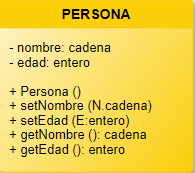
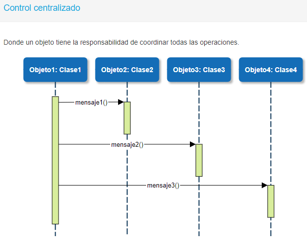

**Introducción al paradigma de objetos**

**¿Qué es un paradigma de programación?**

En el módulo Técnicas de Programación te presentamos a la programación estructurada, en donde se definen funciones y procedimientos. En este módulo nos dedicaremos al estudio de la **Programación Orientada a Objetos (POO).**

**Cambiamos entonces de paradigma.... ¿Y esto qué significa? ¿Nos servirá lo que aprendimos de técnicas? ¡Por supuesto!** 

Nos servirán muchas cosas como, por ejemplo, las estructuras de datos y las estructuras de control. Seguiremos utilizando las definiciones de variables, tipos de datos estándares, arreglos, matrices, pilas, colas y listas. También utilizaremos los condicionales y los ciclos. Es decir, que seguiremos utilizando muchas de las herramientas que vimos en Técnicas de programación, pero ahora adaptadas a un nuevo paradigma, como te comentaremos a partir de esta Unidad. 

Podemos definir a un **paradigma de programación** como un enfoque particular o criterio para la creación de software.

Hay diferentes paradigmas de programación, que determinan distintos estilos de programación y diferentes formas de resolver un problema.

Para mostrar más claro los diferentes enfoques de los paradigmas, te presentamos un mismo ejemplo abordado desde ambos paradigmas. 

Supongamos que tenemos que **guardar el nombre y la edad de un alumno.** Ingresamos todos los datos por teclado y luego mostramos el nombre si la persona es mayor de edad.

PARADIGMA ESTRUCTURADO:

***SEUDOCÓDIGO***

**TIPOS
T\_REG\_PERSONA** = **REGISTRO**
`        `NOMBRE : CADENA
`        `EDAD : ENTERO
**FINREGISTRO**

**VARIABLES**
`       `ALUMNO : **T\_REG\_PERSONA**

**INICIO
`    `ObtenerPersona** (ALUMNO)
`    `**Si** **EsMayor** (ALUMNO) **entonces**
`          `Mostrar (**GetNombre**(ALUMNO), “ es mayor de edad”)
`    `**Finsi
FIN**

**PROCEDIMIENTO ObtenerPersona** (ref P : **T\_REG\_PERSONA**)

**INICIO**
`    `Mostrar (“Ingrese nombre”)
`    `Ingresar (P.NOMBRE)
`    `**Repetir**
`         `Mostrar (“Ingrese edad”)
`         `Ingresar (P.EDAD)
`    `**Hasta** **que** P.EDAD > 0
**FINPROCEDIMIENTO**

**FUNCIÓN EsMayor** (ref P : **T\_REG\_PERSONA**) : Boolean

**VARIABLES**
`    `ES : BOOLEAN

**INICIO**
`    `ES <- FALSO
`    `**Si** P.EDAD > 18 **entonces**
`        `ES <- VERDADERO
`    `**Finsi**
`    `Devolver ES
**FINFUNCIÓN** 

**FUNCIÓN GetNombre** (ref P : **T\_REG\_PERSONA**) : Boolean

**INICIO**
`     `Devolver P.NOMBRE
**FINFUNCIÓN**

PARADIGMA ORIENTADO A OBJETOS:

***SEUDOCÓDIGO***

**CLASE Persona**

`  `**Atributos
`      `NOMBRE** : CADENA
`      `**EDAD** : ENTERO

`  `**Métodos
`      `Obtener** ()
`      `**EsMayor**():BOOLEAN
`      `**GetNombre**():CADENA

`  `**Implementación
`      `PROCEDIMIENTO Obtener** ()
`      `**INICIO**
`          `Mostrar (“Ingrese nombre”)
`          `Ingresar (**NOMBRE**)
`          `**Repetir**
`              `Mostrar (“Ingrese edad”)
`              `Ingresar (**EDAD**)
`          `**Hasta que** **EDAD** > 0
`      `**FIN**

`      `**FUNCIÓN EsMayor** (): Boolean
`      `**VARIABLES**
`          `ES : BOOLEAN
`      `**INICIO**
`          `ES <- FALSO
`          `**Si** **EDAD** > 18 **entonces**
`             `ES <- VERDADERO
`          `**Finsi**
`          `Devolver ES
`      `**FINFUNCIÓN**

`     `**FUNCIÓN GetNombre** (): Boolean
`     `**INICIO**
`          `Devolver **NOMBRE**
`     `**FINFUNCIÓN
FINCLASE**

**INICIO**

`    `Alumno = nuevo Persona()
`    `Alumno.**obtener**()
`    `**Si** Alumno.**EsMayor**() **entonces**
`       `Mostrar (Alumno.**GetNombre**(), “ es mayor de edad”)
`    `**Finsi
FIN**

*Analicemos a continuación cada uno de los paradigmas…*

En la **versión estructurada**: se realiza la definición de los datos, por medio de un registro y sus campos. Luego, se definen funciones y procedimientos que reciben al registro como parámetro para poder realizar su tarea. Es decir, que se definen los datos y su comportamiento de manera separada. Es por eso que hay que enviar los datos por parámetro. Si alguna definición de datos cambia, deberemos cambiar las rutinas definidas en el programa.

En cambio, en la **versión de Objetos**, habrás notado que hay algo nuevo. Hay una **clase** que contiene **atributos y métodos.** Es decir que, en este mismo componente, en la clase, vamos a tener los datos y la forma en que se manipulan esos datos. Luego, en el programa principal, se crea un objeto en base a una clase. También habrás notado que no hay llamadas a rutinas, sino que hay invocaciones a los métodos definidos en la clase Persona utilizando el objeto **ALUMNO**. Es decir que creamos un Objeto a partir de una clase y luego usamos el objeto para llamar a los métodos. En el mismo objeto se encuentran los datos y sus comportamientos, de tal manera que, ante un cambio en los datos, no se deberá cambiar nada del programa principal, sino que los cambios deberán realizarse solamente en la clase. 

A partir de estas deferencias, entonces te contamos qué es el paradigma de la Programación Orientada a Objetos y luego las diferencias que hay con la programación estructurada.
### **El paradigma de la POO**
La **Programación Orientada a Objetos** (POO u OOP según sus siglas en inglés) define los programas por medio de “clases de objetos”. Los objetos, por lo tanto, son el elemento fundamental del programa, ya que son entidades que combinan:

- **Estado:** Los datos de los programas.
- **Comportamiento:** Las acciones que pueden hacer los objetos.
- **Identidad:** Un objeto que lo diferencia de los demás objetos del programa.

Así, la **programación orientada a objetos define un programa como un conjunto de estos objetos**, que colaboran entre ellos para realizar tareas. Como consecuencia, los programas y módulos te serán más fáciles de escribir, mantener y reutilizar.
### **Objetos**
Antes de ver la definición de objeto, te pedimos que te tomes un momento para observar los objetos que hay a tu alrededor, por ejemplo, una mesa, una silla, tu perro, cualquier elemento. 

Podrás notar que a cada objeto se le puede asociar un conjunto de características, por ejemplo: color, peso, dimensiones, raza, etc. También, cada objeto tendrá un comportamiento: el perro ladra, camina, salta, etc. Así, cada objeto tendrá sus propias características y comportamiento.

` `Esta misma idea es la de Objetos en la POO. 

Un **Objeto** es un elemento que posee características, denominadas **atributos**, y comportamientos, denominados **métodos**, que puede interactuar con otros objetos del sistema, enviando mensajes, y tiene asociado una identidad que lo distingue entre todos los objetos del sistema.

### **Clases**
Volvamos a los casos de los objetos de la vida real y tomemos el ejemplo de un perro. 

Nosotros sabemos qué es un perro porque conocemos la idea de un perro. Todos los perros presentan las características y tienen el mismo comportamiento. Ahora bien, cada perro en particular se diferencia porque tiene diferentes atributos, por ejemplo, son de distinta raza, de distinto tamaño, de distinto peso, etc. Por lo tanto, la idea de un perro es el equivalente a una Clase. 

` `Podemos ver a **una clase** como un modelo o plantilla que representa entidades o conceptos. 

**En una clase se definen los datos y el comportamiento que tendrá la entidad que representa**. Los datos se denominan **atributos**, mientras que el comportamiento está definido por funciones y procedimientos que se denominan **métodos**. Una clase se utiliza para crear objetos, es por eso que también se dice que **un objeto es una instancia de una clase**. 

Una clase es un modelo abstracto que define cómo será un objeto real.
###
### **Origen de la POO**
Los conceptos de la **programación orientada a objetos tienen origen en Simula 67**, un lenguaje diseñado para hacer simulaciones, creado por Ole-Johan Dahl y Kristen Nygaard del Centro de Cómputo Noruego en Oslo. 
Según se dice, la historia es que trabajaban en simulaciones de naves, y se sintieron confundidos por la explosión combinatoria de cómo las diversas cualidades de diversas naves podían afectar unas a las otras. Se les ocurrió la idea de agrupar los diversos tipos de naves en diversas clases de objetos, siendo responsable cada clase de objetos de definir sus propios datos y comportamiento. 
Fueron refinados más tarde en Smalltalk, que fue desarrollado en Simula en Xerox PARC (y cuya primera versión fue escrita sobre Basic) pero diseñado para ser un sistema completamente dinámico en el cual los objetos se podrían crear y modificar "en marcha" en lugar de tener un sistema basado en programas estáticos.

La **programación orientada a objetos** tomó posición como el estilo de programación dominante a mediados de los años ochenta, en gran parte debido a la influencia de C++, una extensión del lenguaje de programación C. Su dominación fue consolidada gracias al auge de las Interfaces gráficas de usuario, para los cuales la programación orientada a objetos está particularmente bien adaptada. En este caso, se habla también de programación dirigida por eventos, también conocida como programación visual.

Las características de orientación a objetos fueron agregadas a muchos lenguajes existentes durante ese tiempo, incluyendo Ada, BASIC, Lisp, Pascal, y otros. 
El agregado de estas características a los lenguajes que no fueron diseñados inicialmente para ellas condujo a menudo a problemas de compatibilidad y a la capacidad de mantenimiento del código. Los lenguajes orientados a objetos "puros", por otra parte, carecían de las características que los programadores estaban acostumbrados a utilizar, por ej: definiciones de variables globales y un uso excesivo de funciones y procedimientos poco reutilizables.

Para saltar este obstáculo, se hicieron muchas tentativas para crear nuevos lenguajes basados en métodos orientados a objetos, pero permitiendo algunas características imperativas de maneras "seguras". 

El Eiffel de Bertrand Meyer fue un temprano y moderadamente acertado lenguaje con esos objetivos, pero luego fue reemplazado por Java, en gran parte debido a la aparición de Internet y a la implementación de la máquina virtual de Java en la mayoría de los navegadores.

**¿Cuáles son las diferencias de la POO con el paradigma estructurado?**

La **principal diferencia con la programación estructurada tradicional** es que ahora deberás pensar simultáneamente en el conjunto de atributos que tendrá una clase y en los métodos para poder tratarlos. Es decir, que los datos son tan importantes como su comportamiento y deben ir íntimamente entrelazados. 
En cambio, en el **paradigma estructurado,** los datos y los procedimientos están separados y sin relación, ya que lo único que se busca es el procesamiento de unos datos de entrada para obtener otros de salida. 

Cuando programás de forma estructurada, lo que hacés es pensar sobre todo en términos de procedimientos o funciones, y en segundo lugar en las estructuras de datos que esas rutinas manejan. En la programación estructurada se escriben funciones y después se les pasan datos. Ahora, cuando programes con objetos, definirás los objetos con sus datos y sus métodos relacionados.

Ahora te contaremos otras diferencias con la programación estructurada:

- La programación orientada a objetos es más moderna, es una evolución de la programación estructurada. 
- La programación orientada a objetos se basa en lenguajes que soportan sintáctica y semánticamente la unión entre los tipos abstractos de datos y sus operaciones (a esta unión se la suele llamar clase). 
- La programación orientada a objetos incorpora en su entorno de ejecución mecanismos tales como el polimorfismo y el envío de mensajes entre objetos. 
- Modelo mental. Nuestra imagen del mundo se apoya en los seres, a los que asignamos nombres sustantivos, mientras la programación clásica se basa en el comportamiento, representado usualmente por verbos. 
- En general, es difícil reutilizar los programas, ya que no siempre se aprovechan en una aplicación nueva las subrutinas que se diseñaron para otra. 
- En la programación estructurada es compleja la coordinación y organización entre programadores para la creación de aplicaciones de media y gran envergadura

### **Conceptos básicos de la POO**
Como habrás notado, la POO es una nueva forma de programar que trata de encontrar soluciones a los problemas de la programación clásica estructurada. 

Es por eso que la POO introduce nuevos conceptos, que superan y amplían conceptos antiguos ya conocidos. 
##### [**Objeto**](http://aulavirtual.codoacodo.com.ar/mod/lesson/view.php?id=108&pageid=199#collapse1)
Es una entidad provista de un conjunto de atributos (datos) y de comportamiento (métodos). Los objetos se corresponden a los objetos reales del mundo que nos rodea, o a objetos internos del sistema (del programa). 
##### [**Clase**](http://aulavirtual.codoacodo.com.ar/mod/lesson/view.php?id=108&pageid=199#collapse2)
Es el modelo en el que se definen las propiedades y comportamiento de un tipo de objeto.
##### [**Método**](http://aulavirtual.codoacodo.com.ar/mod/lesson/view.php?id=108&pageid=199#collapse3)
Algoritmo asociado a un objeto (o a una clase de objetos), cuya ejecución se desencadena tras la recepción de un "mensaje". Desde el punto de vista del comportamiento, es lo que el objeto puede hacer. Un método puede producir un cambio en las propiedades del objeto, o la generación de un "evento" con un nuevo mensaje para otro objeto del sistema.
##### [**Evento**](http://aulavirtual.codoacodo.com.ar/mod/lesson/view.php?id=108&pageid=199#collapse4)
Es un suceso en el sistema (tal como una interacción del usuario con la máquina, o un mensaje enviado por un objeto). El sistema maneja el evento enviando el mensaje adecuado al objeto pertinente. También se puede definir como evento a la reacción que puede desencadenar un objeto, es decir, la acción que genera.
##### [**Mensaje**](http://aulavirtual.codoacodo.com.ar/mod/lesson/view.php?id=108&pageid=199#collapse5)
Una comunicación dirigida a un objeto que le ordena que ejecute uno de sus métodos con ciertos parámetros asociados al evento que lo generó.
##### [**Propiedad o atributo**](http://aulavirtual.codoacodo.com.ar/mod/lesson/view.php?id=108&pageid=199#collapse6)
Contenedor de un tipo de datos asociados a un objeto (o a una clase de objetos), que hace los datos visibles desde fuera del objeto, y cuyo valor puede ser alterado por la ejecución de algún método. 
##### [**Estado interno**](http://aulavirtual.codoacodo.com.ar/mod/lesson/view.php?id=108&pageid=199#collapse7)
Es una propiedad invisible de los objetos, que puede ser únicamente accedida y alterada por un método del objeto, y que se utiliza para indicar distintas situaciones posibles para el objeto (o clase de objetos). 
##### [**Componente de un objeto**](http://aulavirtual.codoacodo.com.ar/mod/lesson/view.php?id=108&pageid=199#collapse8)
Atributos, identidad, relaciones y métodos. 
##### [**Representación de objetos**](http://aulavirtual.codoacodo.com.ar/mod/lesson/view.php?id=108&pageid=199#collapse9)
Un objeto se representa por medio de una tabla o entidad que esté compuesta por sus atributos y funciones correspondientes. 

### **Características de la POO**
Dentro de las características más importantes podemos destacar a las siguientes:
##### **Abstracción**
Cada objeto en el sistema puede realizar trabajo, informar y cambiar su estado, y "comunicarse" con otros objetos en el sistema sin revelar cómo se implementan estas características. El objeto tendrá una parte pública que es la que permitirá la comunicación con el resto de los objetos, dejando de manera privada los detalles de implementación de la parte pública.
#####
##### **Encapsulamiento**
También llamado "ocultación de la información". Cada objeto está aislado del exterior, es un módulo natural, y cada tipo de objeto expone una interfaz (parte pública) a otros objetos que especifica cómo pueden interactuar con los objetos de la clase. El aislamiento protege a las propiedades de un objeto contra su modificación por quien no tenga derecho a acceder a ellas, solamente los propios métodos internos del objeto pueden acceder a su estado. Esto asegura que otros objetos no pueden cambiar el estado interno de un objeto de manera inesperada, eliminando efectos secundarios e interacciones no previstas. 
#####
##### **Polimorfismo** 
Comportamientos diferentes, asociados a objetos distintos, pueden compartir el mismo nombre; al llamarlos por ese nombre se utilizará el comportamiento correspondiente al objeto que se esté usando.
#####
##### **Herencia**
Las clases no están aisladas, sino que se relacionan entre sí, formando una jerarquía de clasificación. Los objetos heredan las propiedades y el comportamiento de todas las clases a las que pertenecen. La herencia organiza y facilita el polimorfismo y el encapsulamiento permitiendo a los objetos ser definidos y creados como tipos especializados de objetos preexistentes, tal como sucede con los objetos de la vida real.

### **Diseño de clases**
Como te contamos antes, una clase es un modelo, un esqueleto para generar objetos. La clase está compuesta por **atributos** (datos, variables), también llamadas variables de instancia, que nos indican en qué estado se encuentra cada objeto, y **métodos** (funciones) que indican cuál es el comportamiento que posee el objeto.

Las **clases** habitualmente se denotan con nombres generales como Animal, Factura. 

Toda clase está compuesta por **atributos y métodos**. Los atributos son características de los objetos. Cuando definas un atributo tendrás que especificar su nombre y su tipo. En definitiva, **la definición de un atributo no es más que la declaración de una variable.**

Habitualmente, a los atributos se los denomina variables miembro de la clase, que por lo general son privadas al objeto (siguiendo las directrices de diseño del Principio de ocultamiento de la información) y su acceso se realiza mediante los métodos que se definan para manejar esos atributos.

También dentro de las clases tendrás que definir e implementar la funcionalidad asociada al objeto. **Los métodos son el equivalente a las funciones en los lenguajes estructurados**. Se diferencian de ellos en que es posible acceder a las variables de la clase de forma implícita. Por eso cuando se desea realizar una acción sobre un objeto, se dice que se le manda un mensaje invocando a un método que realizará la acción.

Veamos un ejemplo de una clase y su ejecución y a partir del ejemplo iremos mostrando sus componentes...

### **Ejemplo de diseño de una clase**
Comenzamos con un ejemplo muy simple, en el que definimos una clase denominada **PERSONA**. 
Dentro de sus componentes podemos identificar **2 atributos** y **5 métodos**.

*CLASE PERSONA*

**CLASE Persona**
` `**Atributos**
`   `Nombre : cadena
`   `Edad : entero

` `**Métodos**
`   `Persona ( )
`   `setNombre (valor :  cadena)
`   `getNombre ( ) : cadena
`   `getEdad ( ) : entero

### **Atributos y Métodos**
##### **Atributos**
Con los atributos estamos definiendo que los datos de una **PERSONA** serán su nombre y su domicilio. 

Los atributos nombre y domicilio se denominan atributos de clase. Cada vez que se genere un objeto de la clase PERSONA tendrá una copia de estos atributos. Por eso, también se los denomina atributos de instancia.

En nuestro ejemplo de la Clase Persona, los **atributos son Nombre y Edad**.

##### **Métodos**
Con los métodos estamos definiendo el comportamiento que tendrá una PERSONA.

En nuestro ejemplo, los **métodos son 5:** Persona, setNombre, setEdad, getNombre y getEdad.

Cuando se crea un objeto se genera una copia de los métodos en cada objeto creado. A esto se lo denomina método de instancia.

Es importante que sepas que, junto con el nombre del método, la declaración lleva información del tipo de retorno del método, el número y el tipo de los parámetros necesarios, y qué otras clases y objetos pueden llamar al método.

Los métodos pueden poseer argumentos (parámetros) o no. En caso de no tenerlos solo se escriben los paréntesis vacíos, en caso de tenerlos se define el conjunto de argumentos de cualquier método en una lista de declaraciones de variables delimitadas por comas donde cada declaración de variable es un par nombre / tipo.

**¿Qué es el método constructor?**

Si observás la lista de métodos verás que hay uno que tiene el mismo nombre de la clase.  En nuestro ejemplo, es el método **Persona**. Este es un método especial que se denomina constructor. El constructor es el método invocado en el momento en que se crean las instancias de las clases, es decir, los objetos. Los constructores no deben retornan un valor, **pero sí pueden tener o no argumentos**.

**¿Qué son los métodos setters y getters? (métodos de acceso)**

Seguramente habrás notado que los métodos de la clase comienzan con la palabra set o get. A estos se los denomina getters y setters. Por lo general suele haber uno para atributo definido. 

Los **setters** comienzan con la palabra set, es un método que no retorna nada, y que posee como argumento un dato cuyo tipo de dato es el mismo del atributo que se trata. En nuestro ejemplo tenemos setNombre cuyo argumento es una cadena debido a que el atributo Nombre es de tipo cadena. El método setter lo que hará es asignar el valor del parámetro al atributo correspondiente.

En cambio, los **getters,** no poseen argumento alguno, pero devuelven un dato. En nuestro ejemplo tenemos getEdad que no tiene argumentos, pero devuelve un entero debido a que el atributo Edad es de tipo entero. El método getter lo que hará es devolver el valor del atributo correspondiente.
### **I - Alcance de atributos y métodos**
El **alcance** es una característica fundamental de la POO ya que te permitirá definir el encapsulamiento de la información y del comportamiento. Los métodos, atributos y clases deben tener un solo alcance, también lo llamamos tipo de acceso. 

Cuando diseñes clases, es importante que pienses en términos de **quién debe tener acceso a qué**. 
Qué cosas son parte de la implementación privada y deberían ocultarse (y en qué grado) y qué cosas forman parte de la interface y deberían ser públicas.

Podrás definir alguno de los siguientes **cuatro tipos de acceso**:

|**ALCANCE**|
| :-: |
|Privado|
|Público|
|Protegido|
|Paquete|

##### [**Privado**](http://aulavirtual.codoacodo.com.ar/mod/lesson/view.php?id=108&pageid=204#collapse1)
Si un atributo o método tiene alcance de tipo privado, este solo podrá ser accedido por los métodos miembros definidos en la misma clase. Es importante que sepas que las clases no pueden declararse como privadas.
##### [**Público**](http://aulavirtual.codoacodo.com.ar/mod/lesson/view.php?id=108&pageid=204#collapse2)
Si un atributo o método tiene un acceso de tipo público es accedido desde cualquier clase, no tiene restricciones de ningún tipo (no respeta la ocultación de la información). Las clases solo pueden tomar dos tipos de modificadores público o de paquete. Las clases no pueden declararse ni protected, ni private.
##### [**Protegido**](http://aulavirtual.codoacodo.com.ar/mod/lesson/view.php?id=108&pageid=204#collapse3)
Este alcance es muy importante cuando se utilizan relaciones de herencia entre las clases, y significa que los atributos y métodos serán accesibles desde las clases heredades. 
##### [**Paquete**](http://aulavirtual.codoacodo.com.ar/mod/lesson/view.php?id=108&pageid=204#collapse4)
Con este alcance podrás establecer relaciones de 'confianza' entre clases afines dentro del mismo paquete. Un paquete lo podrás ver como si fuera una carpeta de archivos, por lo tanto, una clase definida con un alcance de tipo Paquete será accesible desde cualquier clase dentro de la misma “carpeta”.

Las clases tienen un comportamiento definido para quienes las usan, conformado por los elementos que tienen un acceso público, y una implementación oculta formada por los elementos privados, de la que no tienen que preocuparse los usuarios
### **II - Alcance de atributos y métodos**
Las **clases** tienen un comportamiento definido para quienes las usan, conformado por los elementos que tienen un acceso público, y una implementación oculta formada por los elementos privados, de la que no tienen que preocuparse los usuarios de la clase.  

Con respecto a los métodos, por lo general, aquellos que definas dentro de la clase tendrán un especificador de acceso público, que muestra la interface que provee la clase. En el caso de querer definir un método y que este no forme parte de la interface, lo que tendrás que hacer es declararlo como privado. Este método privado puede ser invocado dentro de cualquier otro método de la misma clase.

` `Ahora que ya te contamos el tipo de alcance que podrás aplicar a cada atributo o método, es momento de modificar la clase PERSONA para agregar el acceso. 

La clase modificada quedará de la siguiente manera:

*CLASE PERSONA*

**CLASE Persona**
**Atributos**
`   `[privado] Nombre : cadena
`   `[privado] Edad : entero

` `**Métodos**
`   `[público] Persona ( )
`   `[público] setNombre (valor :  cadena)
`   `[público] setEntero (valor : cadena)
`   `[público] getNombre ( ) : cadena
`   `[público] getEntero ( ) : entero 

### **Atributos y métodos de clase**
##### **Atributos de clase**
Hasta el momento, cuando hemos definido atributos dentro de la clase, hemos dicho que se denominan atributos de instancia, porque cuando se crea un objeto en memoria ese objeto tendrá una copia tanto de los atributos como también de sus métodos. 

Existe un modificador que aplicado a las variables hace que el atributo de instancia se convierta en atributo de clase. **La diferencia que existe con el anterior es que al momento de crear un objeto ese atributo de clase no se crea en el objeto, por lo que si se llegaran a crear más objetos ninguno de ellos tendría una copia del original, sino que todos compartirían el mismo atributo**. Esto implica que, si un objeto modifica el valor de ese atributo, se verá reflejado el cambio en todos los objetos.

**Para poder definir un** **atributo de clase tendrás que utilizar la palabra estático, anteponiéndola al nombre del atributo.**

##### **Métodos de clase**
Si aplicás la palabra estático a los métodos, se los denomina método de clase. Los métodos de clase permiten acceder a código cuando no se tiene una instancia en particular de un objeto. 

**Al definir un método de clase, tenés que tener en cuenta que no pueden acceder a atributos que no están definidos como estáticos.** 

### **ACTIVIDAD**
Realizá el diseño de una clase que defina los datos y comportamientos de un vehículo.

A continuación, te mostramos nuestra propuesta para que la compares con tu versión.  

*CLASE VEHÍCULO*

**CLASE Vehículo**
**Atributos**
`   `[privado] Fabricante : cadena
`   `[privado] Matrícula : cadena
`   `[privado] Año de fabricación: entero
`   `[privado] Velocidad máxima : real

` `**Métodos**
`   `[público] Vehículo ( )
`   `[público] setFabricante (valor :  cadena)
`   `[público] setMatrícula (valor : cadena)
`   `[público] setAñoFabricación (valor : entero) 
`   `[público] setVelocidadMax (valor : real) 
`   `[público]  getFabricante ( ) : cadena 
`   `[público]  getMatricula ( ) : cadena 
`   `[público]  getAñoFabricacion ( ) : entero 
`   `[público]  getVelocidadMax ( ) : real
`   `[público]  arrancar ( )
`   `[público]  acelerar (real)
`   `[público]  frenar (real)
`   `[público]  apagar ( )

### **Síntesis de la Unidad**
En esta unidad te presentamos a la **PROGRAMACIÓN ORIENTADA A OBJETOS**, que es otro PARADIGMA DE PROGRAMACIÓN diferente del que veníamos trabajando, el de PROGRAMACIÓN ESTRUCTURADA. 

Como recordarás, esta última trabajaba dentro de los PROGRAMAS con FUNCIONES y PROCEDIMIENTOS. En la programación orientada a objetos, los programas están formados por OBJETOS que son las instancias de las CLASES. Los objetos se comunican enviando MENSAJES a otros objetos de la misma o de otra clase. 

También te contamos que los objetos están formados por **Atributos y Métodos**, que pueden ser de **Acceso público, Acceso privado, Acceso protegido** o de **Paquete**, según sea la VISIBILIDAD que tengan en relación a los otros objetos. 

Finalmente, te contamos que los atributos o métodos estáticos son los denominados de clase y tiene la particularidad de que existe una sola copia asociada a la clase y no a cada objeto instanciado.

**Herencia**
**¿Qué es la herencia?**

------------------------
Seguramente, al haber leído la palabra herencia, te habrá venido a la mente lo que sucede con una persona que puede heredar algunos rasgos físicos o personales de sus padres o abuelos. La herencia es la característica por la cual los padres transmiten algunas características a sus hijos. Del mismo modo que en biología, en el plano económico, una persona le puede heredar sus bienes a otra persona, es decir que se los puede traspasar a otra persona por medio de una relación de jerarquía. 

Pasando a nuestra materia, te presentamos un **ejemplo de lo que sería la herencia, partiendo de la clase Persona que definimos en la Unidad 1.** 

Recordemos cómo está definida la clase Persona.

*CLASE PERSONA*

**CLASE Persona**

**Atributos**
`   `Nombre : cadena
`   `Edad : entero

` `**Métodos**
`   `Persona ( )
`   `setNombre (valor :  cadena)
`   `getNombre ( ) : cadena
`   `getEdad ( ) : entero

Ahora bien, te proponemos que pienses qué agregados deberías hacer si queremos, además, que nuestro programa registre la información de un alumno. 

Seguramente habrás pensado que un alumno tiene un nombre, una edad y algún dato propio por ser alumno, por ejemplo, la matrícula. Esto se debe a que un alumno, ante todo, es una persona y luego tiene datos y comportamientos propios que le corresponde por ser un alumno. De esta manera, podemos decir que un alumno debe tener todos los atributos de una persona (ya que es una persona) y, además, agregar atributos propios. 

**¿Cómo resolvemos esto sin tener que repetir todo lo de una persona en un alumno?** 

Es en este momento donde deberás hacer uso de la herencia. Es así como nuestra nueva clase quedaría con el siguiente modelo.

*CLASE ALUMNO*

**CLASE Alumno**

**Atributos**
`   `Matrícula : cadena

` `**Métodos**
`   `Alumno ( )
`   `setMatrícula (valor :  cadena)
`   `getMatrícula ( ) : cadena

Como habrás notado, **utilizamos la herencia para transmitir los datos y atributos de una clase a otra**. De esta manera podemos decir que:

**La herencia es una propiedad esencial de la Programación Orientada a Objetos que consiste en la creación de nuevas clases a partir de otras ya existentes.**

**Subclases y superclases**

En nuestro ejemplo, la **clase Persona es una Superclase de la clase Alumno**. Y del mismo modo, la **clase Alumno es una subclase de la clase Persona.**

Un lenguaje orientado a objetos permite heredar a las clases características y conductas, es decir los atributos y métodos, de una o varias clases denominadas superclases, clases bases o padres. A las clases que heredan de otras clases se las denominan subclases, clases derivadas o hijas. Las clases derivadas, a su vez, pueden ser clases bases para otras clases derivadas. De esta manera podrás establecer una clasificación jerárquica similar a la existente en Biología con los animales y plantas.

La herencia te permitirá lograr una de las principales características de la programación, que es la reutilización de código.  

¿...Y cómo logramos esto?

Una vez que una clase ha sido probada, el código fuente de dicha clase no necesita modificarse. Su funcionalidad se puede cambiar derivando una nueva clase que herede la funcionalidad de la clase base y le añada otros comportamientos. De esta manera podrás reutilizar el código existente, ahorrando tiempo y dinero, ya que solamente tendrás que verificar la nueva conducta que proporciona la clase derivada.

La herencia es un mecanismo mediante el cual una clase hereda todo el comportamiento y atributos de otra clase. La clase que hereda se denomina clase hija, clase derivada o subclase. La clase que provee la herencia se llama clase padre, base, o superclase.

**La herencia está dada por la relación “es un”.**

Un ejemplo de herencia....

Veamos cómo implementamos nuestro ejemplo de herencia en pseudocódigo.

*SEUDOCÓDIGO*

**CLASE** Persona 

**Atributos**

`	`NOMBRE : CADENA
`      `EDAD : ENTERO
**Métodos**
`        `Persona ()
`        `EsMayor():BOOLEAN
`        `GetNombre():CADENA

**Implementación**

`	`**PROCEDIMIENTO** Obtener ()
`      `**INICIO**
`              `Mostrar ("Ingrese nombre")
`              `Ingresar (NOMBRE)
`              `Repetir
`                    `Mostrar ("Ingrese edad")
`                    `Ingresar (EDAD)
`              `Hasta que EDAD > 0 
`       `**FIN**

`	 `**FUNCIÓN** EsMayor (): Boolean
`       `**VARIABLES**
`               `ES : BOOLEAN	 

**INICIO**
`               `ES <- FALSO
`               `Si EDAD > 18 entonces
`                  `ES <- VERDADERO
`               `Finsi
`               `Devolver ES	

**FINFUNCIÓN**

`	`**FUNCIÓN** GetNombre (): Boolean	

**INICIO**
`              `Devolver NOMBRE	

**FINFUNCIÓN**

**FINCLASE

CLASE** Alumno **extiende de** Persona

` 	`**Atributos**
`     `MATRICULA : CADENA

`	`**Métodos**
`     `Obtener ()
`     `GetMatricula():CADENA
`     `SetMatricula(MAT:CADENA)

**Implementación**
`     `**PROCEDIMIENTO** Obtener ()
`     `**INICIO**
`          `Super.Obtener()
`          `Mostrar ("Ingrese matrícula")
`          `Ingresar (MATRICULA)
`     `**FIN**

` `**FUNCIÓN** GetMatricula (): CADENA
`     		`**INICIO**
`         	`Devolver MATRICULA
`    	 `**FINFUNCIÓN**

`     `**PROCEDIMIENTO** SetMatricula (MAT: CADENA)

`     `**INICIO**
`          `MATRICULA <- MAT
`     `**FIN**

**FINCLASE**

**INICIO**
`     `Alu = nuevo Alumno()
`     `Alu.obtener()
`     `Si Alu.EsMayor() entonces
`         `Mostrar (Alu.GetNombre(), “ es mayor de edad”)
`     `Finsi

**FIN**

En la definición de la clase Alumno, se encuentra la palabra reservada **extiende** para especificar que es una clase que hereda de la clase Persona. 

Clase Alumno extiende de Persona.

Si observás el algoritmo principal...

verás que ahora se crea un objeto de la clase Alumno. Lo primero que se hace es invocar al método Obtener. ¿Qué ocurre entonces? Se ejecuta el método Obtener de la clase Alumno, que realiza la siguiente acción: Super.Obtener(). En esta llamada se encuentra la palabra **super** que se utiliza para invocar a los métodos de la clase base. Este mensaje invoca al método Obtener de la clase Base (en nuestro ejemplo, la clase Persona). Luego se ingresan los datos propios del alumno, en este caso, la matrícula. Esto que te contamos es la característica fundamental de la herencia, que logra la reutilización de código y la abstracción, ya que los detalles de implementación de la obtención de los datos de la persona quedan en la clase Persona. La clase Alumno implementa los detalles propios de un alumno, de esta forma se logra la abstracción en cada una de las clases.
### **Tipo de herencia: 1- Herencia Simple**
En la **POO existen dos tipos de herencia.**
##### **1- Herencia Simple**
Como habrás notado, la clase Alumno de nuestro ejemplo anterior hereda de una sola clase. Este es el caso de una herencia Simple.

` `En este tipo de herencia, una clase puede extender las características de una sola clase, o sea sólo puede tener un padre. 

Ejemplos de herencia simple los podrás ver en la siguiente imagen.

En el **caso de la izquierda,** las clases B y C poseen las mismas características y comportamiento de la clase A. 
En cambio, en el **gráfico de la derecha,** la clase B posee las mismas características y comportamiento de la clase A. mientras que la clase C tiene las mismas características y comportamiento de la clase B, pero al haber heredado de A, se dice que C posee las mismas características y comportamiento de la clase A y B.

### **Tipo de herencia: 2- Herencia Múltiple**
##### **2- Herencia Múltiple**
Hay otro tipo de herencia y es en el caso en que una clase puede extender las características de varias clases, es decir, puede tener varios padres. En este aspecto hay discrepancias entre los diseñadores de lenguajes. Algunos de ellos han preferido no admitir la herencia múltiple por las posibles coincidencias en nombres de métodos o datos miembros.

Si una clase cualquiera tiene más de una superclase directa en la jerarquía de clases, se considera que existe herencia múltiple. 

En términos concretos, **una instancia de objeto de la clase hija poseerá todos los atributos y métodos de sus clases padres**.

En este ejemplo, la Clase C posee las mismas características y comportamiento de las Clases A y B. Ante la posibilidad de poder combinar estos tipos de herencia surge el problema del esquema del rombo, que se muestra en la siguiente imagen.

Observando, el problema no se da en lo que se denomina el primer nivel de derivación (herencia entre A, B y C), sino que el problema se encuentra en el segundo nivel de derivación ya que la clase D tendría características de B y C, pero en definitiva tendría una copia doble de la clase A ya que B y C tienen heredadas esas características.

### **Especificadores de alcance**
En el caso de la herencia, utilizamos los mismos especificadores que se utilizan para definir una clase, método o atributo; la única diferencia es el alcance que tienen en la clase derivada. Esto quiere decir que dependiendo del tipo de acceso que se especifique al componente en la clase base, será cómo se lo pueda utilizar en las clases derivadas. 

En la siguiente tabla especificamos el alcance en la clase derivada según el alcance que tenga el componente en la clase base.

|**CLASE BASE**|`    `**CLASE DERIVADA**|` `**ACCESO**|
| :- | :- | :-: |
|Privado|**Privado**|Solo mediante métodos|
|Protegido|**Público**|Directo|
|Público|**Público**|Directo|

¿Qué indica entonces esta tabla?

• Que, si los datos en la clase base son **privados**, en la clase derivada también lo serán y que su acceso sólo será mediante los métodos

• Que, si los datos en la clase base son **protegidos**, en la clase derivada se convierten en públicos y que su acceso sólo será directo, o sea, no hará falta acceder mediante la invocación de ningún método.

• Que si los datos en la clase base son **públicos** en la clase derivada también lo serán y que su acceso sólo será directo, o sea, no hará falta acceder mediante la invocación de ningún método.

Como habrás notado, entonces, no es necesario, si vas a tener un esquema de herencia, poner en la clase base los atributos de la misma como privados, sino que los podés poner como **atributos protegidos**. 

¿Qué características tienen en caso de ser protegidos?

Una es la que nombramos antes: que en la **clase derivada** tienen una visibilidad pública, pero en la **clase base** un atributo protegido es igual que un atributo privado, o sea que no puede ser accedido más que a través de métodos, es decir, que no se pierde el ocultamiento de la información en la clase base.

**Composición**

Ahora te presentamos **otro tipo de relación** que se puede establecer entre Clases, y para eso te proponemos agregar a nuestro modelo de clases la información del domicilio de una persona.
Podemos modelar el domicilio como una clase, por lo tanto, tendríamos la siguiente definición de clase. 

Para simplificar el ejemplo, definiremos solamente los métodos para mostrar y para obtener el domicilio.

*CLASE DOMICILIO*

**CLASE Domicilio**

` `**Atributos**
`   `Calle : cadena
`   `Piso : entero
`   `Departamento : cadena
`   `Localidad : cadena
`   `Provincia : cadena

` `**Métodos**
`   `Domicilio ( )
`   `Obtener ( ) 
`   `Mostrar ( ) 

¿cómo se relaciona el Domicilio con la Persona?

Una **Persona NO es un Domicilio,** tampoco un **Domicilio es una Persona.** Por lo tanto, no podemos definir una relación de herencia, tendremos que buscar algún otro tipo de relación. 

Podemos decir que una **Persona está compuesta por un Domicilio,** ya que de los atributos de Persona (nombre y edad), además tenemos el domicilio. De esta manera podemos agregar el domicilio a la persona.

**Algoritmo de la composición**

En nuestro algoritmo, a la **clase Persona** la definiremos así:

*SEUDOCÓDIGO*

**CLASE** Persona 
**Atributos**
`     `NOMBRE : CADENA
`     `EDAD : ENTERO
`     `DOM : objeto Domicilio
**Métodos**
`     `Persona ()
`     `EsMayor(): BOOLEAN
`     `GetNombre(): CADENA
**FINCLASE**

**CLASE** Domicilio 
**Atributos**
`     `CALLE : CADENA
`     `PISO : ENTERO
`     `DEPARTAMENTO : CADENA
`     `LOCALIDAD : CADENA
`     `PROVINCIA : CADENA
**Métodos**
`     `Domicilio ()
`     `Obtener()
`     `Mostrar()

**FINCLASE**

Si observamos el código **tenemos dos clases:** **Clase Domicilio** que es solo una clase que contiene los atributos propios de un domicilio, y la **Clase Persona** que contiene sus propios atributos como Persona además de un objeto de la Clase Domicilio. 

 La inclusión de este objeto hace que haya composición, o sea que la Clase Persona está compuesta por la clase Domicilio. A diferencia de la herencia, ahora, si querés acceder a los datos de la Clase Domicilio lo debés hacer mediante el objeto, invocando sus métodos.

**Existe composición cuando una clase está compuesta por un objeto de otra clase. En este caso, el rol de la relación es “tiene un” o “está compuesto por”.**

**En la composición no se habla ni de clase base ni de derivada.**

### **Herencias vs. Composición**
Seguramente te estarás preguntando:

**¿En qué situación utilizar le herencia o la composición?**

Te comentamos nuestras conclusiones para ayudarte a tomar esa decisión.

Las **dos técnicas fundamentales para construir nuevas clases a partir de otras ya existentes son la herencia y la composición**. Es importante que entiendas que ambos tipos de relaciones pueden existir al mismo tiempo en un problema en donde hay varias clases y diversos tipos de relaciones. 

- La **herencia** permite construir una clase derivada a partir de una clase base. La clase derivada hereda todas las propiedades de la clase base, es decir, sus atributos (datos), y su comportamiento (métodos). Todas las nuevas características que quieras dar a la clase derivada se las tendrás que brindar por medio de nuevos atributos y métodos.
- La **composición de clases** es un concepto distinto al de la herencia, ya que expresa el hecho de que se pueden componer o constituir clases nuevas a partir de objetos de otras clases. Esto lo podés notar en el mundo real, en donde podés observar objetos formados por otros objetos: por ejemplo, computadoras formadas por teclado y pantalla; vehículos formados por motor, transmisión y chasis, etc. 

En ambas técnicas, el código de las clases originales o clases bases no presenta ningún tipo de modificación.

**La cláusula final**

A veces tenemos la necesidad de **evitar que una clase sea derivada o bien un método sea implementado en otra clase derivada**. 

Por ejemplo, pensemos en una clase que define un método **AumentarSueldo**. Sería lógico que ninguna otra clase pueda implementarla, por lo tanto, necesitaremos indicar de alguna manera que ese método solamente será definido por la propia clase. Para eso, la POO, tiene la característica de las clases o métodos finales. 

Veamos el siguiente ejemplo:

*SEUDOCÓDIGO*

**CLASE** Empleado
`     `Publico Final AumentarSueldo()
**FINCLASE**

**Final CLASE** Ejecutivo **extiende** Empleado
**FINCLASE**

En este ejemplo, la **clase Ejecutivo,** **clase derivada de Empleado no podría reescribir el método aumentarSueldo,** y por tanto cambiar su comportamiento, ya que este método está definido como final en la clase Empleado. 
Por lo tanto, solamente será implementado en la misma clase Empleado.

Por otro lado, evitamos que se pueda seguir extendiendo el árbol jerárquico, es decir, que la Clase Ejecutivo no puede derivarse. Esto se debe a que la clase Ejecutivo la definimos como clase final. 

**ACTIVIDAD**

A partir de la clase vehículo, realizada en la Actividad 1 de la Unidad 1, realizá el diseño de las clases Auto, Avión y Motor. Definí las relaciones de Herencia y Composición que consideres necesarias.

A continuación, te mostramos nuestra propuesta para que la compares con tu versión.

SEUDOCÓDIGO

**CLASE Vehículo**
**Atributos**
`   `[privado] Fabricante : cadena
`   `[privado] Matrícula : cadena
`   `[privado] Año de fabricación: entero
`   `[privado] Velocidad máxima : real
`   `[privado] Motor: **objeto** Motor
**Métodos**
`   `[público] Vehículo ( )
`   `[público] setFabricante (valor :  cadena)
`   `[público] setMatrícula (valor : cadena)
`   `[público] setAñoFabricación (valor : entero) 
`   `[público] setVelocidadMax (valor : real) 
`   `[público] getFabricante ( ) : cadena 
`   `[público] getMatricula ( ) : cadena 
`   `[público] getAñoFabricacion ( ) : entero 
`   `[público] getVelocidadMax ( ) : real
`   `[público] arrancar ( )
`   `[público] acelerar (real)
`   `[público] frenar (real)
`   `[público] apagar ( )

**CLASE Motor**
**Atributos**
`   `[privado] Fabricante : cadena
`   `[privado] Cilindrada : entero
**Métodos**
`   `[público] Motor ( )
`   `[público] setFabricante (valor :  cadena)
`   `[público] setCilindrada (valor : entero)
`   `[público] getFabricante ( ) : cadena 
`   `[público] getCilindrada ( ) : entero
`   `[público] encender ( )
`   `[público] apagar ( )

**CLASE Auto**
**Atributos**
`   `[privado] Modelo: entero
`   `[privado] Patente : cadena

` `**Métodos**
`   `[público] Auto ( )
`   `[público] setModelo (valor :  entero)
`   `[público] setPatente (valor : cadena)
`   `[público] getModelo ( ) : entero 
`   `[público] getPatente ( ) : cadena
`   `[público] tocarBocina ( )
`   `[público] apagar ( )

**CLASE Avión**
**Atributos**
`   `[privado] cantPasajeros: entero
**Métodos**
`   `[público] Avión ( )
`   `[público] setCantPasajeros (valor :  entero)
`   `[público] getCantPasajeros ( ) : entero 
`   `[público] despegar ( )
`   `[público] aterrizar ( )

### **Síntesis de la Unidad**
La **HERENCIA,** es una de las maneras de construir clases a partir de otras. Mediante esta herencia podrás establecer una relación jerárquica entre **CLASES,** definiendo CLASES BASES y CLASES DERIVADAS. 

También te contamos que la herencia puede ser SIMPLE(cuando se hereda de una sola clase) o MÚLTIPLE (cuando se hereda de más de una clase), dependiendo de la cantidad de clases padres de las cuales hereden las clases hijas. Finalmente, te presentamos la **COMPOSICIÓN**, que es otra manera de definir clases, pero en este caso para construir clases a partir de objetos de otras clases.
#### Autoevaluación*:* 

Indicar que una clase hereda de otra. 

Se define de la siguiente manera: clase “derivada” extiende clase “base”: Verdadero

Para invocar a un método heredado de una clase padre se utiliza la palabra: super

Un atributo que es privado en la clase base al heredarse se convierte en protegido: Falso

El atributo privado de la clase base mantiene el alcance privado en la clase derivada

Los atributos de una clase base definidos como protegidos funcionan como privados en la misma clase: Verdadero

Solo se accede desde la misma clase o desde las clases derivadas.

**¿Qué es el polimorfismo?**

Esta palabra está relacionada con la idea de tener muchas formas. Si consultamos el diccionario de la Real Academia Española, nos dirá que una de las acepciones de polimorfismo es: “***Cualidad de lo que tiene o puede tener distintas formas***”. ¿qué tiene que ver esto con la Programación a Objetos?

` `Te lo contamos con un simple ejemplo. 

Volvamos a la actividad que te planteamos en la Unidad 2, en donde definimos una jerarquía de clases con la **clase Vehículo** como base y las **clases Avión y Auto** como clases derivadas. 

Un método de la clase Vehículo es ***arrancar()***. Esto significa que todos los objetos vehículos podrán arrancar.

¿Pero cómo lo harán?

La implementación de este método no podrá definirse en la clase Vehículo, ya que todos los vehículos no tienen la misma forma de arrancar. 

Un avión tendrá una manera de arrancar distinta a la de un auto, por ejemplo en el auto habrá que colocar una llave y girarla.

Por lo tanto, en cada clase derivada se deberá implementar el método arrancar. 

¿Entonces? ¿Qué tiene que ver todo esto con el polimorfismo? 
¿Cómo funciona el polimorfismo? 

Ahora es donde aparece la magia del polimorfismo, ya que podremos tener en nuestro programa un objeto que sea un Vehículo, sin importar a qué clase derivada pertenezca, e invocar al método arrancar. El objeto por ser un vehículo tiene el método arrancar, y este objeto podrá ser un Avión o un Auto, y se resolverá en el momento de la ejecución a qué método se invoca (si al del Auto o al del Avión).

**De esta manera, en la POO, se denomina polimorfismo a la capacidad que tiene un objeto de responder al mismo mensaje que se encuentra en distintas clases.**

### **Polimorfismos, sobrecarga y sobre escritura**
Una de las características del polimorfismo es que no se habla de sobrecarga de métodos, sino de **sobre escritura**. 

Veamos, ahora, la definición de cada concepto.

- La **sobrecarga** se produce dentro de una misma clase sobre un método que tiene igual nombre, pero distintos parámetros. Dependiendo de los parámetros que se encuentren en la invocación será el método que se termine llamando.
- La **sobre escritura** se produce con métodos de distintas clases, donde se encuentra definido un método con el mismo nombre y con los mismos parámetros. Dependiendo del objeto que invoque al método será la clase que resolverá ese llamado.
### **Clases abstractas**
Como te contamos, el polimorfismo es la habilidad que tiene un objeto de tomar diferentes formas en tiempo de ejecución. Nosotros vamos a representar el polimorfismo con la palabra reservada “**abstracto**”, la cual puede ser utilizada tanto en clases como en métodos. 

Es importante que entiendas, también, que para que exista polimorfismo tiene que haber una jerarquía de clases.

Si un método tiene antepuesto a su definición la palabra “**abstracto**”, entonces decimos que es un método abstracto, es decir que su cabecera se encuentra en la clase base y su implementación se encuentra en alguna clase derivada. 

**Una clase que posee, al menos, un método abstracto se denomina clase abstracta.**

Una **clase abstracta**, por lo tanto, tendrá que derivarse, ya que **no podrá hacerse un nuevo objeto de esa clase abstracta** 

### **Ejemplo 1 de polimorfismo**
`  `Veamos cómo implementamos nuestro ejemplo de polimorfismo en pseudocódigo. 

Para ello, retomemos el ejemplo de la Unidad 3, en donde definimos las clases Persona y Alumno.

*SEUDOCÓDIGO*

**Abstracto CLASE Persona** 
**Atributos**
`    `NOMBRE : CADENA
`    `EDAD : ENTERO
**Métodos**
`    `Persona ()
`    `EsMayor():BOOLEAN
`    `GetNombre():CADENA
`    `Abstracto presentarse()

**Implementación**
`    `**PROCEDIMIENTO** Obtener ()
`    `**INICIO**
`        `Mostrar ("Ingrese nombre")
`        `Ingresar (NOMBRE)
`        `Repetir
`            `Mostrar ("Ingrese edad")
`            `Ingresar (EDAD)
`        `Hasta que EDAD > 0 
`    `**FIN**

`    `**FUNCIÓN** EsMayor (): Boolean
`    `**VARIABLES**
`        `ES : BOOLEAN
`    `**INICIO**
`        `ES <- FALSO
`        `Si EDAD > 18 entonces
`            `ES <- VERDADERO
`        `Finsi
`        `Devolver ES
`    `**FINFUNCIÓN**

`    `**FUNCIÓN** GetNombre (): Boolean
`    `**INICIO**
`        `Devolver NOMBRE
`    `**FINFUNCIÓN**
**FINCLASE**

**CLASE Alumno extiende de Persona** 
**Atributos**
`    `MATRICULA : CADENA
**Métodos**
`    `Obtener ()
`    `GetMatricula():CADENA
`    `SetMatricula(MAT:CADENA)

**Implementación**
`    `**PROCEDIMIENTO**
`    `**INICIO**
`        `Super.Obtener()
`        `Mostrar ("Ingrese matrícula")
`        `Ingresar (MATRICULA)
`    `**FIN**

`    `**FUNCIÓN** GetMatricula (): CADENA
`    `**INICIO**
`        `Devolver MATRICULA
`    `**FINFUNCIÓN**

`    `**PROCEDIMIENTO** SetMatricula (MAT: CADENA)
`    `**INICIO**
`        `MATRICULA <- MAT
`    `**FIN**

`    `**PROCEDIMIENTO** Presentarse ()
`    `**INICIO**
`        `Mostrar ("Soy el alumno " NOMBRE)
`        `Mostrar ("Mi matrícula es " MATRICULA)
`    `**FIN**
**FINCLASE**

**CLASE Docente extiende de Persona** 
**Atributos**
`    `LEGAJO : CADENA
**Métodos**
`    `Obtener ()
`    `GetLegajo():CADENA
`    `SetLegajo(MAT:CADENA)

**Implementación**
`    `**PROCEDIMIENTO** Obtener ()
`    `**INICIO**
`        `Super.Obtener()
`        `Mostrar ("Ingrese legajo")
`        `Ingresar (LEGAJO)
`    `**FIN**

`    `**FUNCIÓN** GetLegajo (): CADENA
`    `**INICIO**
`        `Devolver LEGAJO
`    `**FINFUNCIÓN**

`    `**PROCEDIMIENTO** SetLegajo (MAT: CADENA)
`    `**INICIO**
`        `LEGAJO <- MAT
`    `**FIN**

`    `**PROCEDIMIENTO** presentarse ()
`    `**INICIO**
`        `Mostrar ("Soy el docente " NOMBRE)
`        `Mostrar ("mi legajo es " LEGAJO)
`    `**FIN**
**FINCLASE**

**VARIABLES**
`    `Pers = Persona
**INICIO**
`    `Pers = nuevo Alumno()
`    `Pers.presentarse()
`    `Pers = nuevo Docente ()
`    `Pers.presentarse()
**FIN**

A la jerarquía original le agregamos la **clase Docente**, derivada de Persona para que quede más claro cómo funciona el polimorfismo.

Habrás notado que la **clase Persona**, ahora es una clase abstracta, ya que tiene un nuevo método que es abstracto, denominado presentarse.

¿Qué significa?

Esto significa que cada persona se podrá presentar, pero en nuestro programa, las personas serán alumnos o docentes. Es decir que los objetos serán instancias de las clases Alumno o Docente, no tendremos objetos de Personas. 

Ahora bien, cada uno de los objetos se podrá presentar. Un alumno se presentará con su matrícula, mientras que un docente lo realizará con su legajo. Por lo tanto, ante el mismo mensaje, las clases responderán con acciones diferentes. 

Aquí es donde tenemos que utilizar el polimorfismo para simplificar el desarrollo.

Para eso, definimos un objeto que será Persona, llamado **Pers**. Este es el **objeto polimórfico,** ya que en principio será un Alumno y luego lo instanciaremos como un Docente.

Seguramente te habrás dado cuenta que estamos realizando la misma llamada 

Pers**.presentarse**()

Pero... ¿qué ocurre?

Ese es el momento en que dinámicamente, en tiempo de ejecución, se resuelve a qué clase se estará invocando.

- En la **primera llamada** se invocará al método presentarse de la clase Alumno, ya que Pers es un Alumno.
- En la **segunda llamada** se invocará al método presentarse de la clase Docente, ya que Pers es un Docente

De esta manera es como, ante el mismo llamado del mismo objeto, puede responder de manera distinta ya que **el objeto Pers es polimórfico**.

**Ejemplo 2 de polimorfismo**

*SEUDOCÓDIGO*

**Abstracto CLASE Figura** 
**Atributos**
`    `Privado POS\_X, POS\_Y : ENTERO
**Métodos**
`    `Abstracto Area():REAL
**FINCLASE**

**CLASE Triangulo extiende de Figura**
**Atributos**
`    `BASE; ALTURA : REAL
**Métodos**
`    `Triangulo (B, A: REAL)
**Implementación**
`    `**PROCEDIMIENTO** Triangulo (B, A: REAL)
`    `**INICIO**
`        `BASE <- B
`        `ALTURA <- A
`    `**FIN**

`    `**FUNCIÓN** Area():REAL
`    `**INICIO**
`        `Devolver (BASE \* ALTURA) / 2
`    `**FIN**
**FINCLASE**

**CLASE Cuadrado extiende de Figura**
**Atributos**
`    `LADO : REAL    
**Métodos**
`    `Cuadrado (L: REAL)
**Implementación**
`    `**PROCEDIMIENTO** Cuadrado (L: REAL)
`    `**INICIO**
`        `LADO <- L
`    `**FIN**

`    `**FUNCIÓN** Area():REAL
`    `**INICIO**
`        `Devolver (LADO \* LADO)
`    `**FIN**
**FINCLASE**

**VARIABLES**
`    `Fig = Figura
**INICIO**
`    `Fig = nuevo Triangulo(1,3)
`    `Mostrar ("El área es: ", Fig.area())
`    `Fig = nuevo Cuadrado (2)
`    `Mostrar ("El área es: ", Fig.area())
**FIN**

En este ejemplo, partimos de una **clase abstracta** (*Figura*), que define una función abstracta que será la funcionalidad que deberá implementar cada una de las clases derivadas.

Luego, tenemos dos clases que hereden de la *clase Figura*. Las *clases Triangulo* y *Cuadrado* deberán implementar la función *área*, ya que la superficie de cada figura se obtiene con distintas fórmulas.

El **polimorfismo** lo podrás observar en el programa principal, en donde se define un objeto que será una *Figura*. El objeto **Fig**, por lo tanto, será una instancia de un *Triángulo* y luego de un *Cuadrado*, pero siempre será una *Figura* ya que es la clase base. De esta manera, **al invocar al método *Fig.area()* se estará resolviendo, en tiempo de ejecución, cuál es la clase que responderá, y eso es el Polimorfismo**.

### **Interfaces**
Antes de explicarte este concepto, te hacemos una aclaración con respecto a la palabra interface. Nuevamente, consultamos a la Real Academia Española y nos dice que la palabra “interface” no existe. 

El **vocablo correcto, en nuestro idioma, es “interfaz**”, el cual está definido como:

***1. f. Conexión o frontera común entre dos aparatos o sistemas independientes.
2\. f. Inform. Conexión, física o lógica, entre una computadora y el usuario, un dispositivo periférico o un enlace de comunicaciones.***

Sin embargo, en éste como en muchos otros casos, prevalece el uso de un anglicismo – palabra copiada del inglés – y en la jerga de la profesión **solemos encontrar “interface” y no exactamente con el sentido que le da el diccionario**.

Ahora bien, **volviendo a nuestras interfaces en programación**, te presentamos el siguiente ejemplo:

*SEUDOCÓDIGO*

**publico Interface** Cantante 
**Métodos**
`    `publico Abstracto cantar()
**Fin Interface**

**CLASE** Canario implementa Cantante 
**Atributos**
`    `TIPO : CADENA        
**Métodos**
`    `público Canario ()
**Implementación**
`    `**PROCEDIMIENTO** cantar()
`    `**INICIO**
`        `Mostrar (“Pío Pío Pío”) 
`    `**FIN PROCEDIMIENTO**
**FINCLASE**

**VARIABLES**
`    `Piolin = Canario
**INICIO**
`    `Piolin = nuevo Canario ()
`    `Piolin.cantar()
**FIN**

**Definimos una interfaz**

Como habrás notado en el ejemplo, hemos definido una interface llamada *Cantante*, que posee un método abstracto ***cantar()***. 

**La interfaz es una clase**, pero definida con la palabra reservada “interface o interfaz”. Ésta es una clase especial que **contiene todos sus métodos abstractos**, por lo tanto, tendrán que ser definidos en las clases que lo implementen. 

En el ejemplo, también está definida la **clase *Canario* que implementa la interfaz *Cantante*,** por medio de la palabra reservada “implementa”. Esta definición significa que la clase *Canario* tendrá que definir todos los métodos de la clase *Cantante*. De esta manera es que se encuentra implementado el método ***cantar()*** en *Canario*, el cual dice pio pio pio ya que es un Canario.

Luego de haber analizado este ejemplo, podemos generalizar diciendo que:

Una **interface es una colección de declaraciones de métodos sin definirse.** 
Las interfaces se implementan en una clase para poder modelar el comportamiento en común.

Es importante explicarte que una clase puede implementar más de una interface. De esta manera podrás simular el comportamiento de una herencia múltiple. Esta es una característica fundamental ya que mediante las interfaces podrás definir compartimientos comunes sin necesidad de forzar una herencia de clases.

` `A diferencia de lo que sucede con la Herencia, la **implementación de interfaces** no fuerza una relación jerárquica, simplemente permite que clases no relacionadas puedan tener algunas características de comportamiento similares. 

**Un ejemplo de Interfaces y Polimorfismo**

Volvamos al ejemplo de la jerarquía de clases Persona que te presentamos en las secciones anteriores..

Le realizaremos algunos cambios para agregar un comportamiento común en una interfaz.

*SEUDOCÓDIGO*

**Abstracto CLASE Persona implementa Cantante**
**Atributos**
`    `NOMBRE : CADENA
`    `EDAD : ENTERO
**Métodos**
`    `Persona ()
`    `EsMayor():BOOLEAN
`    `GetNombre():CADENA
`    `publico Abstracto cantar()
**Implementación**
`    `**PROCEDIMIENTO** Obtener ()
`    `**INICIO**
`        `Mostrar ("Ingrese nombre")
`        `Ingresar (NOMBRE)
`        `Repetir
`            `Mostrar ("Ingrese edad")
`            `Ingresar (EDAD)
`        `Hasta que EDAD > 0 
`    `**FIN**

`    `**FUNCIÓN** EsMayor (): Boolean
`    `**VARIABLES**
`        `ES : BOOLEAN
`    `**INICIO**
`        `ES <- FALSO
`        `Si EDAD > 18 entonces
`             `ES <- VERDADERO
`        `Finsi
`        `Devolver ES
`    `**FINFUNCIÓN**

`    `**FUNCIÓN** GetNombre (): Boolean
`    `**INICIO**
`        `Devolver NOMBRE
`    `**FINFUNCIÓN**
**FINCLASE**
**CLASE Alumno extiende de Persona** 
**Atributos**
`    `MATRICULA : CADENA
**Métodos**
`    `Obtener ()
`    `GetMatricula():CADENA
`    `SetMatricula(MAT:CADENA)
**Implementación**
`    `**PROCEDIMIENTO** Obtener ()
`    `**INICIO**
`        `Super.Obtener()
`        `Mostrar ("Ingrese matrícula")
`        `Ingresar (MATRICULA)
`    `**FIN**

`    `**FUNCIÓN** GetMatricula (): CADENA
`    `**INICIO**
`        `Devolver MATRICULA
`    `**FINFUNCIÓN**

`    `**PROCEDIMIENTO** SetMatricula (MAT: CADENA)
`    `**INICIO**
`        `MATRICULA <- MAT
`    `**FIN**

`    `**PROCEDIMIENTO** cantar()
`    `**INICIO**
`        `Mostrar ("Soy un alumno, la la la") 
`    `**FIN PROCEDIMIENTO**
**FINCLASE**

**PROCEDIMIENTO** HazleCantar (interprete : CANTANTE)
`    `Interprete.Cantar()
**FIN PROCEDIMIEN**

**VARIABLES**
`    `Alu = Alumno
`    `Ave = Canario
**INICIO**
`    `Alu = nuevo Alumno()
`    `HazleCantar(Alu)    
`    `Ave = nuevo Canario()
`    `HazleCantar(Ave)
**FIN**

Habrás notado que la *clase Persona*, ahora implementa la *interfaz Cantante*. **Esto quiere decir que las personas tendrán el comportamiento de Cantante**.

La implementación del procedimiento Cantar está definida en la clase Alumno. De esta manera podemos definir un mismo comportamiento para un alumno y para un Canario, ya que lo único que tienen en común es que ambos pueden cantar. 

En este momento, seguramente estás notando la diferencia entre una jerarquía de clases por medio de la herencia y la implementación de interfaces. 
**Un alumno es una persona (por medio de la herencia) y tiene el comportamiento de un Cantante (por medio de la interfaz)**. Alumno y Canario no son objetos que tengan una clase base en común, ya que corresponden a tipos de objetos distintos, un canario no es un alumno, y viceversa. Pero, como te contamos previamente, sí tienen un comportamiento en común que es que ambos pueden cantar. Es por eso que hay que definir ese comportamiento en una interfaz.

` `En este ejemplo, cuando se ejecute, el programa mostrará “soy un alumno, la la la” porque al procedimiento *hazleCantar* se le pasa un objeto de la clase *Alumno*; y luego “pío pío pío” porque al procedimiento *hazleCantar* se le pasa un objeto de la clase *Canario*.

**ACTIVIDAD 1**

Ahora te proponemos, como ejercicio, que agregues a esta jerarquía de clases alguna otra que pueda implementar la interface Cantante

¿Cómo quedaría la nueva clase y el programa principal?

A continuación, te contamos nuestra propuesta...

*SEUDOCÓDIGO*

**CLASE Artista extiende de Persona** 		
**Implementación**
`    `**PROCEDIMIENTO** cantar()
`    `**INICIO**
`        `Mostrar ("Soy un artista que canta, laa laaa") 
`    `**FIN PROCEDIMIENTO**
**FINCLASE**

**PROCEDIMIENTO** hazleCantar (interprete : CANTANTE)
`      `Interprete.Cantar()
**FIN PROCEDIMIENTO**

**VARIABLES**
`    `Alu = Alumno
`    `Ave = Canario
`    `Actor = Artista

**INICIO**
`    `Alu = nuevo Alumno()
`    `HazleCantar(Alu)
`    `Ave = nuevo Canario()
`    `HazleCantar(Ave)
`    `Actor = nuevo Artista()
`    `HazleCantar(Actor)
**FIN**

### **Interfaces y clases abstractas**
Ahora te contamos algunas características entre ambos tipos de clases.

• Las **interfaces** son completamente abstractas, no tienen ninguna implementación.

• Con **interfaces** no hay herencia de métodos, con **clases abstractas** sí.

• De una **clase abstracta** no es posible crear instancias; de las **interfaces** tampoco.

• Una clase solamente puede extender una c**lase abstracta** (o concreta) pero puede implementar más de una **interface**.

**ACTIVIDAD 2**

A partir de la **jerarquía de clases realizada en la Actividad 1 de la Unidad** 2, realizá la implementación de las mismas, pero ahora utilizando polimorfismo.

A continuación, te mostramos nuestra propuesta para que la compares con tu versión.

*SEUDOCÓDIGO*

**Abstracto CLASE Vehiculo** 
**Atributos**
`    `FABRICANTE, MATRICULA : CADENA
`    `AÑO\_FAB : ENTERO
**Métodos**
`    `Vehiculo ()
`    `publico setFabricante(valor F:CADENA)
`    `publico getFabricante():CADENA
`    `Abstracto arrancar()
**Implementación**
`    `**FUNCIÓN** getFabricante (): CADENA
`    `**INICIO**
`        `Devolver FABRICANTE
`    `**FINFUNCIÓN**

`    `**FUNCIÓN** setFabricante (valor F:CADENA)
`    `**INICIO**
`        `FABRICANTE <- F
`    `**FIN**
**FINCLASE**

**CLASE Auto extiende de Vehiculo** 
**Atributos**
`    `PATENTE : CADENA    
**Métodos**
`    `público Auto ()
`    `público GetPatente():CADENA
`    `público SetPatente(PAT:CADENA)
**Implementación**
`    `**FUNCIÓN** GetPatente (): CADENA
`    `**INICIO**
`        `Devolver PATENTE
`    `**FINFUNCIÓN**

`    `**PROCEDIMIENTO** SetPatente (P: CADENA)
`    `**INICIO**
`        `PATENTE <- P
`    `**FIN**

`    `**PROCEDIMIENTO** arrancar ()
`    `**INICIO**
`        `*// Acciones propias para arrancar un auto*
`    `**FIN**
**FINCLASE**

**CLASE Avion extiende de Vehiculo** 
**Atributos**
`    `CANT\_PASAJEROS : ENTERO    
**Métodos**
`    `público Avion ()
`    `público GetCantPasajeros():ENTERO
`    `público SetCantPasajeros(CANT:ENTERO)
**Implementación**
`    `**FUNCIÓN** GetCantPasajeros ():ENTERO
`    `**INICIO**
`        `Devolver CANT\_PASAJEROS
`    `**FINFUNCIÓN**

`    `**PROCEDIMIENTO** SetCantPasajeros (CANT: ENTERO)
`    `**INICIO**
`        `CANT\_PASAJEROS <- CANT
`    `**FIN**

`    `**PROCEDIMIENTO** arrancar ()
`    `**INICIO**
`        `*// Acciones propias para arrancar un avión*
`    `**FIN**
**FINCLASE**

**VARIABLES**
`    `Veh = Vehiculo
**INICIO**
`    `Veh = nuevo Avion()
`    `Veh.arrancar()
`    `Veh = nuevo Auto()
`    `Veh.arrancar()
**FIN**

### **Síntesis de unidad**
**POLIMORFISMO**, es la capacidad que tiene un OBJETO de responder al mismo mensaje que se encuentra en distintas CLASES. 

Para implementar el POLIMORFISMO en necesario definir **CLASES ABSTRACTAS** que son las que tienen, al menos, un MÉTODO ABSTRACTO. 

Finalmente vimos las **INTERFACES** que son CLASES que definen un comportamiento en común con MÉTODOS ABSTRACTOS. Estos MÉTODOS ABSTRACTOS tiene que ser definidos en las CLASES DERIVADAS(hijas).
#### *Autoevaluación:*
polimorfismo se hace sobre clases o métodos abstractos. V

clase abstracta se puede instanciar. F

Una clase puede extender a otra clase e implementar varias interfaces.  V

interfaces se utilizan para simular la herencia. V

palabra reservada “implementa”. Indica que una clase implementa una interface.

**Introducción a Java**
### **Historia de JAVA**
En el año 1991 la empresa Sun Microsystem crea el proyecto *The Green Project* dedicado al desarrollo de la tecnología Java, que se crearía como una herramienta de programación.

Este proyecto estaba en manos de un equipo de trece personas, dirigido por James Gosling. El resultado de su trabajo fue un lenguaje de programación que no dependía de los dispositivos, denominado "Oak". 

La idea de este lenguaje era contribuir al futuro de los dispositivos digitales, por eso este equipo desarrolló un controlador de mano destinado al uso de implementos domésticos, por ejemplo, la televisión digital por cable. No dio resultado debido a que el sector de la televisión digital por cable no estaba listo para el gran avance que la tecnología Java ofrecía. 

Con la aparición en la **década de los 90** de Internet y la utilización de los navegadores como Netscape Navigator, alrededor del año 1996 se comenzó la incorporación de la tecnología Java en estos navegadores. 

Ya para **comienzos del año 2000**, la plataforma Java ha resultado muy atractiva para los desarrolladores de software. Se la utiliza en los principales sectores de la industria de todo el mundo y está presente en un gran número de dispositivos, computadores y redes de cualquier tecnología de programación. Su versatilidad y eficiencia, la portabilidad de su plataforma y la seguridad que aporta, la han convertido en la tecnología ideal para redes.

**¿Por qué se diseñó JAVA?**

A través de los años se han utilizado lenguajes de programación como C o Fortran para diseñar sistemas complejos a partir de la programación estructurada, creando de esta forma procedimientos complejos, de esto provienen los términos “código espagueti” o “programas sábana”, que se refieren a programas que son muy extensos o cuya lógica es muy difícil de seguir. 

` `Como te contamos en la Unidad 1, a partir de ello se planteó un cambio en la programación estructurada mediante la aparición de un **nuevo paradigma,** denominado **programación orientada a objetos**. 

Con la **aparición de este paradigma,** muchos de los lenguajes existentes decidieron migrar a este estilo de programación. Un ejemplo de esto es el lenguaje C++, en el que se intentó tomar los principios del lenguaje C y tratar de sacarle ciertas restricciones, creando de esta manera un lenguaje híbrido y no netamente orientado a objetos. 

Todos los compiladores de C++ son capaces de compilar código en ANSI C como así también en C++, por lo que hace que el lenguaje sea débil, ya que en un estilo de programación se puede incluir el otro.

**Java** fue concebido desde su nacimiento como un **lenguaje orientado a objetos puros** y está basado en ciertas convenciones que posee el lenguaje C, como, por ejemplo, declaración de variables, paso de parámetros y demás, pero sólo considera las partes de C++ que no estaban ya en C.

#### ***Las principales características que Java no hereda de C++:***
##### [**Punteros**](http://aulavirtual.codoacodo.com.ar/mod/lesson/view.php?id=124&pageid=238#collapse1)
Las direcciones de memoria son la característica más poderosa de C++. El inadecuado uso de los punteros provoca la mayoría de los errores de colisión de memoria, errores muy difíciles de detectar. En Java no existen punteros, lo que evita el acceso directo a la memoria volátil. 
##### [**Variables globales**](http://aulavirtual.codoacodo.com.ar/mod/lesson/view.php?id=124&pageid=238#collapse2)
Con ellas, cualquier función puede producir efectos laterales, e incluso se pueden producir fallos catastróficos cuando algún otro método cambia el estado de la variable global necesaria para la realización de otros procesos. En Java lo único global es el nombre de las clases. 
##### [**Sentencias goto**](http://aulavirtual.codoacodo.com.ar/mod/lesson/view.php?id=124&pageid=238#collapse3)
Son la forma más rápida de arreglar un programa rompiendo su estructura secuencia. Java no tiene ninguna sentencia goto, pero posee las sentencias break y continue que cubren los casos importantes de goto. 
##### [**Asignación de memoria**](http://aulavirtual.codoacodo.com.ar/mod/lesson/view.php?id=124&pageid=238#collapse4)
Reservar memoria en C o C++ implicaba la utilización de sentencias como new o mallocs, que creaban objetos en memoria, que el mismo programador era responsable de eliminar de la memoria una vez que se los dejaba de utilizar y en la mayoría de los casos se omitía hacerlo. Java, ante esta vicisitud, posee un Garbage Collector (recolector de basura) que permite al programador desligarse de tener que eliminar los objetos de memoria.
##### [**Conversión de tipos insegura**](http://aulavirtual.codoacodo.com.ar/mod/lesson/view.php?id=124&pageid=238#collapse5)
Los cambios de tipo (casting) son un mecanismo de C y C++ que permite cambiar el tipo de un puntero. Java provee una comprobación de tipos de datos al momento de castear un tipo en otro. El casting (a veces denominado casteo en el lenguaje informático) es la conversión automática de tipos. Por ejemplo, si asignamos un número entero a  una variable de tipo real, se debe hacer un “casteo” del tipo entero al real. 

**Un poco de historia...**

Como ya te hemos comentado al inicio de la unidad, J**ava fue diseñado en la década del 90 por Sun Microsystems,** como software para dispositivos electrónicos. 

Curiosamente, este lenguaje fue diseñado antes de la explosión de la era de Internet, para dispositivos electrónicos como calculadoras, microondas y la televisión interactiva (electrodomésticos principalmente).

Originalmente **Java se llamó Oak (roble),** pero el nombre tuvo que cambiarse porque ya se encontraba registrado por otra empresa.

Algunas de las principales razones que llevaron a crear Java son:

Creciente necesidad de **interfaces mucho más cómodas** e intuitivas que los sistemas que proliferaban hasta el momento. 

**Fiabilidad del código y facilidad de desarrollo**. Se había observado que muchas de las características que ofrecían otros lenguajes como C++ aumentaban el gran costo de pruebas y depuración. 

Enorme **diversidad de controladores electrónicos.** Los dispositivos electrónicos se controlan mediante la utilización de microprocesadores de bajo precio y reducidas prestaciones, que varían a menudo y que utilizan diversos conjuntos de instrucciones. Java permite escribir un código común para todos los dispositivos. 

Así, en vez de tratar únicamente de optimizar las técnicas de desarrollo, el Green Team se planteó que tal vez los lenguajes existentes eran demasiado complicados para reducir de forma apreciable la complejidad de desarrollo asociada a ese campo. 

**Axial** surge como la primera propuesta, que fue idear un nuevo lenguaje de programación lo más sencillo posible, con el objeto de que se pudiese adaptar con facilidad a cualquier entorno de ejecución, otorgándole de esta manera el beneficio de la portabilidad entre plataformas.

Tras la obtención de un gran conocimiento y estudio de distintos lenguajes, el **Green Team** decidió adoptar las características esenciales de varios, pero eliminando todas aquellas funciones que no eran absolutamente imprescindibles, para obtener así un lenguaje de programación moderno y potente.

¿Cuál fue el primer proyecto en que se aplicó JAVA?

El primer proyecto en que se aplicó Java consistía en un sistema de control completo de los aparatos electrónicos y el entorno de un hogar (DOMOTICA). 
Para tal fin, se construyó un ordenador experimental denominado Star Seve (\*7), que poseía un sistema que presentaba una interfaz basada en la representación de la casa de forma animada y el control se llevaba a cabo mediante una pantalla sensible al tacto. En el sistema aparecía la actual mascota de Java.

Otro **proyecto en el que se aplicó Java fue Video On Demand (VOD)**, en el que se empleaba como interfaz para la televisión interactiva, que se pensaba, iba a ser el principal campo de aplicación de Java. 
Ninguno de estos proyectos se convirtió nunca en un sistema comercial, y fueron desarrollados enteramente en un Java primitivo.

Una vez que los expertos de Sun se dieron cuenta de que, a corto plazo, la televisión interactiva no iba a ser un gran éxito, instaron a **FirstPerson** a desarrollar nuevas estrategias, que produjeran beneficios. Entre ellas, se encontraba la aplicación de Java a Internet, la cual no se consideró productiva en ese momento.

Aunque Java no llegó a caer en el olvido, lo cierto es que **Bill Joy, cofundador de Sun y uno de los desarrolladores principales del sistema operativo Unix de Berckley, reflotó a Java,** que había sido dejado de lado. 
Joy tuvo la visión que Internet llegaría a ser el campo adecuado para disputar a Microsoft su primacía en el terreno del software, y vio en el lenguaje creado por su empresa el instrumento idóneo para llevar a cabo estos planes.

Para poder presentarlo en sociedad, se tuvo que modificar el nombre de este lenguaje de programación y realizar una serie de modificaciones de diseño para poderlo adaptar al nuevo propósito. Así, Java fue presentado en forma oficial en agosto de 1995, conjuntamente con el explorador Netscape.

¿Qué razones habrán llevado a Joy a pensar en JAVA rentable?

• Java es un lenguaje orientado a objetos.

• Es un lenguaje sencillo, aunque sin duda potente. 

• La ejecución del código Java es segura y fiable.

• Es totalmente multiplataforma.

Existen varias críticas a Java, debido que es lento en su velocidad de ejecución, aproximadamente unas 20 veces más lento que un programa en lenguaje C ¿Cuál es el problema? ¿Cuál sería la solución?

El problema fundamental de Java es que utiliza una representación intermedia denominada byte codes para solventar los problemas de portabilidad. Estos códigos se deben transformar en códigos máquina en cada máquina en que son utilizados, lo que enlentece considerablemente su ejecución.

Una solución factible a este problema parece bastante obvia: fabricar computadoras capaces de comprender directamente los códigos de byte. Éstas serían unas máquinas que utilizarían Java como sistema operativo y que no requerirían, en principio, de disco duro, porque obtendrían sus recursos de la red.

En abril de 2009 Oracle adquirió Sun Microsystems, lo que generó temor en la comunidad ante la posible mercantilización del lenguaje de programación orientado a objetos más popular actualmente. Por ahora Oracle ha seguido manteniendo Java, estando las versiones posteriores a la 6 bajo su control.

### **Características del lenguaje JAVA**
Las características principales que nos ofrece Java y que lo distinguen de cualquier otro lenguaje de programación, son:
##### [**Simple**](http://aulavirtual.codoacodo.com.ar/mod/lesson/view.php?id=124&pageid=243#collapse1)
Java ofrece toda la funcionalidad de un lenguaje potente, pero sin las características menos usadas y más confusas de éstos. C++ es un lenguaje que adolece de falta de seguridad, pero C y C++ son lenguajes muy difundidos, por ello Java se diseñó para ser parecido a C++ y así facilitar un rápido y fácil aprendizaje.

Java elimina muchas de las características de otros lenguajes como C++, para mantener reducidas las especificaciones del lenguaje y añadir características muy útiles como el Garbage Collector. En JAVA no tendrás que preocuparte para liberar memoria, el Garbage Collector se encarga de ello liberando bloques de memoria muy grandes, lo que reduce la fragmentación de la memoria. Java reduce en un 50% los errores más comunes de programación con lenguajes como C y C++, al eliminar muchas de sus características, entre las que se destacan: 

- Aritmética de punteros 
- No existen referencias 
- Registros (struct) 
- Definición de tipos (typedef) 
- Macros (#define) 
- Necesidad de liberar memoria (free) 
##### [**Orientado a objeto**](http://aulavirtual.codoacodo.com.ar/mod/lesson/view.php?id=124&pageid=243#collapse2)
Java implementa la tecnología básica de C++ con algunas mejoras y elimina algunas características para mantener el objetivo de la simplicidad del lenguaje. Java trabaja con sus datos como objetos y con interfaces a esos objetos. Soporta las tres características propias del paradigma de la orientación a objetos que te estuvimos explicando en las unidades anteriores: abstracción de datos, herencia y polimorfismo. Las plantillas de objetos son llamadas clases y sus copias, instancias. Estas instancias, como en C++, necesitan ser construidas y destruidas en espacios de memoria.
##### [**Distribuido**](http://aulavirtual.codoacodo.com.ar/mod/lesson/view.php?id=124&pageid=243#collapse3)
Java se ha construido con extensas capacidades de interconexión con el protocolo TCP/IP. Existen rutinas para acceder e interactuar con protocolos como http y ftp. El protocolo http se utiliza para conectarse a un recurso (por ejemplo, un archivo o un servidor) dentro de una misma red de datos; mientras que el protocolo ftp se utiliza para transmitir archivos de un dispositivo a otro. Esto permite a los programadores acceder a la información a través de la red con tanta facilidad como a los archivos locales.
##### [**Robusto**](http://aulavirtual.codoacodo.com.ar/mod/lesson/view.php?id=124&pageid=243#collapse4)
Java realiza verificaciones en busca de problemas tanto en tiempo de compilación como en tiempo de ejecución. La comprobación de tipos en Java ayuda a detectar errores, lo antes posible, en el ciclo de desarrollo. Java obliga a la declaración explícita de métodos, reduciendo así las posibilidades de error. Maneja la memoria para eliminar las preocupaciones por parte del programador de la liberación o corrupción de memoria.
También implementa los arrays o arreglos auténticos, en vez de listas enlazadas de punteros, con comprobación de límites, para evitar la posibilidad de sobrescribir o corromper memoria.
##### [**Arquitectura neutral**](http://aulavirtual.codoacodo.com.ar/mod/lesson/view.php?id=124&pageid=243#collapse5)
Para establecer Java como parte integral de la red, el compilador Java compila su código a un archivo objeto de formato independiente de la arquitectura de la máquina en que se ejecutará. Cualquier máquina que tenga el run-time puede ejecutar ese código objeto, sin importar en modo alguno la máquina en que ha sido generado. El código fuente Java se "compila" a un código de bytes de alto nivel independiente de la máquina. Este bytecodes está diseñado para ejecutarse en una máquina hipotética que es implementada por un sistema run-time, que sí es dependiente de la máquina.
##### [**Seguro**](http://aulavirtual.codoacodo.com.ar/mod/lesson/view.php?id=124&pageid=243#collapse6)
La seguridad en Java tiene dos facetas. En el lenguaje, se eliminan características como los punteros o el casting implícito que hacen los compiladores de C y C++, para prevenir el acceso ilegal a la memoria. 
El código de Java pasa muchos tests antes de ejecutarse en una máquina. El código se pasa a través de un verificador de bytecodes que comprueba el formato de los fragmentos de código y aplica un tester de teoremas para detectar fragmentos de código ilegal (código que falsea punteros, viola derechos de acceso sobre objetos o intenta cambiar el tipo o clase de un objeto).

Si los **byte-codes** pasan la verificación sin generar ningún mensaje de error, entonces sabemos que:

- El código no produce desbordamiento de operandos en la pila 
- El tipo de los parámetros de todos los códigos de operación es conocido y correcto. 
- No ha ocurrido ninguna conversión ilegal de datos, tal como convertir enteros en punteros. 
- El acceso a los campos de un objeto se sabe que es legal: public, private, protected. 
- No hay ningún intento de violar las reglas de acceso y seguridad establecidas.
##### [**Portable**](http://aulavirtual.codoacodo.com.ar/mod/lesson/view.php?id=124&pageid=243#collapse7)
Más allá de la portabilidad básica por ser de arquitectura independiente, Java implementa otros estándares de portabilidad para facilitar el desarrollo. Java construye sus interfaces de usuario a través de un sistema abstracto de ventanas de forma que las ventanas puedan ser implementadas en entornos Unix, Pc o Mac.
##### [**Integrado**](http://aulavirtual.codoacodo.com.ar/mod/lesson/view.php?id=124&pageid=243#collapse8)
El intérprete Java (run-time) puede ejecutar directamente el código objeto. Enlazar un programa, normalmente, consume menos recursos que compilarlo, por lo que los desarrolladores con Java pasarán más tiempo desarrollando y menos esperando por la ejecución. No obstante, el compilador actual del JDK es bastante lento. Por ahora, que todavía no hay compiladores específicos de Java para las diversas plataformas, Java es más lento que otros lenguajes de programación, como C++, ya que debe ser interpretado y no ejecutado como sucede en cualquier programa tradicional. 
##### [**Multithreaded**](http://aulavirtual.codoacodo.com.ar/mod/lesson/view.php?id=124&pageid=243#collapse9)
Primero, te contamos que los threads (**hilos** en español) son básicamente pequeños procesos o piezas independientes de un gran proceso. Java, al ser multithreaded, permite muchas actividades simultáneas en un programa. De esta manera, al estar los threads construidos en el lenguaje, son más fáciles de usar y más robustos que sus homólogos en C o C++. 
El beneficio de ser miltithreaded consiste en un mejor rendimiento interactivo y mejor comportamiento en tiempo real. Aunque el comportamiento en tiempo real está limitado a las capacidades del sistema operativo subyacente (Unix, Windows, etc.), aún supera a los entornos de flujo único de programa (single-threaded) tanto en facilidad de desarrollo como en rendimiento
##### [**Dinámico**](http://aulavirtual.codoacodo.com.ar/mod/lesson/view.php?id=124&pageid=243#collapse10)
Java se beneficia todo lo posible de la tecnología orientada a objetos. Java no intenta conectar todos los módulos que comprenden una aplicación hasta el tiempo de ejecución. Las librerías nuevas o actualizadas no paralizarán las aplicaciones actuales. 
Para evitar que haya que estar trayendo los módulos de byte-codes o los objetos o nuevas clases de la red cada vez que se necesiten, se implementan las opciones de persistencia, para que no se eliminen cuando se limpie la caché de la máquina.

### **Ventajas y Desventajas del lenguaje JAVA**
#### ***VENTAJAS*** 
• **No tenés que volver a escribir el código si querés ejecutar el programa en otra máquina.** Un solo código funciona para todos los browsers compatibles con Java o donde se tenga una Máquina Virtual de Java (Mac's, PC's, Sun's, etc). 

**• Java es un lenguaje de programación orientado a objetos**, y tiene todos los beneficios que ofrece esta metodología de programación.

• **Un browser compatible con Java** deberá ejecutar cualquier programa hecho en Java, esto ahorra a los usuarios tener que estar insertando "plug-ins" y demás programas que a veces nos quitan tiempo y espacio en disco. 

• **Java es un lenguaje** y por lo tanto puede hacer todo lo que suele brindar un lenguaje de programación: Cálculos matemáticos, procesadores de palabras, bases de datos, aplicaciones gráficas, animaciones, sonido, hojas de cálculo, etc. 

**• Si lo que interesa son** las páginas Web, ya no tienen que ser estáticas, se le pueden poner toda clase de elementos multimedia y permiten un alto nivel de interactividad, sin tener que gastar en paquetes carísimos de multimedia.

#### ***DESVENTAJAS***
• **La velocidad.** Los programas hechos en Java no tienden a ser muy rápidos, supuestamente se está trabajando para mejorar esto. Como los programas de Java son interpretados nunca alcanzan la velocidad de un verdadero ejecutable. 

• **Java es un lenguaje de programación.** Esta es otra gran limitación, por más que digan que es orientado a objetos y que es muy fácil de aprender, sigue siendo un lenguaje y por lo tanto aprenderlo no es cosa fácil. Especialmente para los no programadores. 

**Java Virtual Machine (JVM)**

Ahora te explicaremos una de las características fundamentales para la ejecución de un programa en Java. 

La **máquina virtual de Java** (en inglés *Java Virtual Machine,* JVM) es un programa nativo, es decir, ejecutable en una plataforma específica, capaz de interpretar y ejecutar instrucciones expresadas en un código binario especial (el Java bytecode), que es generado por el compilador del lenguaje Java.

El código binario de Java no es un lenguaje de alto nivel, sino un verdadero código máquina de bajo nivel, viable incluso como lenguaje de entrada para un microprocesador físico.

La **gran ventaja de la máquina virtual Java** es aportar portabilidad al lenguaje de manera que desde SUN se han creado diferentes máquinas virtuales Java para diferentes arquitecturas y así un programa ***.class*** escrito en un Windows puede ser interpretado en un entorno Linux. Tan solo es necesario disponer de dicha máquina virtual para estos entornos.

Existen varias versiones, en orden cronológico, de la máquina virtual de Java. En general la definición del Java bytecode no cambia significativamente entre versiones, y si lo hacen, los desarrolladores del lenguaje procuran que exista compatibilidad hacia atrás con los productos anteriores.
### **Ejecutando un programa en JAVA**
Hasta este momento te has familiarizado con las principales características de Java. Ahora podés comenzar a estudiar las etapas de la compilación y ejecución. Para ello, no sólo vamos a darte las explicaciones necesarias, sino que te guiaremos para que obtengas de la Web los programas necesarios y los instales en tu computadora.

Existe cierta serie de pasos que se deben realizar para poder ejecutar una aplicación en Java. 
Lo primero que hay que tener en cuenta es que los programas en Java no se ejecutan, ya que el lenguaje es un lenguaje interpretado. Para ello se hace uso de la máquina virtual de Java, que se encarga de interpretar los Bytecodes.

***Etapas de compilación y ejecución de java***

---------------------------------------------------------------------------
##### Paso 1
**Escribir el código de Java,** ya sea en un editor de texto común y corriente como el notepad, o en un entorno integrado de programación (IDE) como es el Netbeans, entre varios que existen en el mercado.
Paso 2
Grabar el archivo **del código fuente con una extensión “.Java”, por ejemplo “HolaMundo.Java”.**
------------------------------------------------------------------------------------------------
Paso 3
Compilar.
**En esta etapa se verifican errores de sintaxis de lenguaje, como así también errores en pasaje de parámetros y diferencia de tipos en las asignaciones, entre otras cosas.** 
-------------------------------------------------------------------------------------------------------------------------------------------------------------------------------
Paso 4
**Si la compilación fue exitosa (libre de errores),** se** genera otro archivo con el mismo nombre, **pero distinta extensión, en nuestro caso, se obtiene el archivo “HolaMundo.class”.** 
-------------------------------------------------------------------------------------------------------------------------------------------------------------------------------------------

En el archivo "HolaMundo.class” se encuentran los Bytecodes de nuestros programas, que, cuando los pasemos por la máquina virtual, serán interpretados, produciendo de esta manera la “ejecución” de nuestro programa.

¿Qué ocurre si se utiliza un IDE?

Todo resulta transparente para nosotros, debido a que el mismo entorno es quien se encarga de invocar a las herramientas del JDK, ya sea tanto para la compilación como así también para la ejecución. 

¿Qué ocurre en caso de no poseer un entorno IDE?

En ese caso, tanto la compilación como la ejecución del programa se deben realizar mediante la línea de comando.
### **Compilación en Java**
La compilación de código Java por línea de comando se hace por medio del programa "**javac**" (Java  Compiler). En la línea de comandos se escribe: Javac ArchivoJava.java y genera ArchivoJava.class

### **Instalación del entorno de desarrollo**
A continuación, te guiaremos en la instalación del entorno de desarrollo, para que puedas contar con las herramientas necesarias en tu computadora para comenzar tus trabajos en Java.
***Instalación J2SDK***

-----------------------
El **JDK** (o J2SE) es una distribución de herramientas de software para desarrollo de aplicaciones en Java, que incluye bibliotecas, documentación, debugger y el ambiente de software para tiempo de ejecución, más conocido como JRE (Java Runtime Environment). Este último provee la máquina virtual de Java y las bibliotecas runtime requeridas para ejecutar una aplicación Java.

`   `**Podés obtener el J2SE desde**: < [enlace](http://www.oracle.com/technetwork/java/javase/downloads/jdk8-downloads-2133151.html) >

Para instalar el J2SE, bastará con ejecutar el instalador que corresponda a la plataforma de trabajo y seguir el happy path, esto es, presionar “Next” en cada ventana de diálogo hasta que la instalación termine. Si sos un usuario de Linux, BSD, etc., deberás seguir los pasos que van apareciendo en la consola.

Las herramientas que se incluyen dentro del JDK son:

• **Compilador de Java (Javac)**: Compila programas escritos en el lenguaje de programación Java convirtiéndolos en Bytecodes.

• **Interprete de Java (Java):** Ejecuta los bytecodes Java, es decir, ejecuta los programas Java.

• **Interprete de ejecución de Java (jre)**: Similar a Java, pero simplificado para los usuarios que no necesiten herramientas de desarrollo para Java.

• **Java AppletViewer (appletviewer)**: Herramienta para depurar y ejecutar applets.

• **Depurador de Java (jdb)**: Herramienta para encontrar los fallos dentro de los programas Java.

• **Desensamblador de ficheros de clases (Javap)**: Herramienta que a partir de bytecode, genera archivos de código en Java.

• **Generador de documentación Java (Javadoc):** Analiza las declaraciones y los comentarios que están dentro de un conjunto de archivos fuentes Java y genera un conjunto de páginas HTML describiendo las clases “public” y “protected”, las interfaces, los métodos, los constructores y los campos. También genera una jerarquía de clases y un índice con todos los miembros de la aplicación.

• **Generador de cabeceras y cabos para C (Javah)**: Para utilizar métodos nativos en lenguaje C desde Java.

• **Herramienta de archivos de Java (jar)**: Combina varias clases Java y sus recursos asociados en un único archivo.

• **Herramienta de firmas digitales (Javakey)**: Gestiona entidades, incluyendo sus claves y certificados.

• **Convertidor Native-To-ASCII (native2ascii):** Convierte un archivo con codificación nativa a un fichero ascii en el que los caracteres no ascii aparecen con la notación de Unicode \udddd.

• **Generador de cabos para aplicaciones Java RMI (rmic)**.

• **Registro de Objetos Remotos Java (rmiregistry)**: Servidor de directorio para objetos de RMI.

• **Comando para control de versiones (serialver)**: Proporciona el “serialVersionUID” para una o más clases en un formato adecuado para copiarlo en clases en desarrollo.

• **Utilidad de conversión AWT 1.1 (updateAWT)**: Actualiza los nombres que han cambiado en los métodos de AWT 1.02 en una aplicación.

**Sintaxis de Java**
### **Definición de variables y tipos de datos**
` `Recordemos lo que abordamos en la materia Técnicas de Programación. 

**Una variable es un identificador que se representa mediante una palabra. Toda variable ocupa un lugar en memoria y este identificador contiene información. La información almacenada en una variable puede ser de un solo tipo y almacenará datos del tipo con que se declaró esa variable.** 

Veamos a continuación los distintos **tipos de datos** que pueden contener las variables....
### **Tipos de datos**
En **Java**, los tipos de datos se pueden dividir en dos categorías: 

- los **primitivos**, que son aquellos tipos de datos que provee el compilador y 
- los **abstractos,** que son los creados por el programador. 

A continuación, te detallamos los tipos de datos primitivos que posee Java:

||**TIPO**|**LONGITUD**|` `**RANGO**|**Inicializado**|
| :- | :-: | :-: | :-: | :-: |
|**Lógico**|boolean|1 byte| |False              |
|**Textual**|char|2 bytes|Comprende el código ASCII (0..255)||
|**Integral**|byte|1 byte|-128...127|0|
||short|2 bytes |-32678...32677|0|
|** |int|4 bytes |-2.147.483.648 y 2.147.483.647|0|
|** |long|8 bytes |-9.223.372.036.854.775.808 y 9.223.372.036.854.775.807|0L|
|` `**Punto flotante**|float|4 bytes|
(6 y 7 cifras decimales equivalentes)

De -3.402823E38 a -1.401298E-45 y de 1.401298E-45 a 3.402823E38
|0\.0F|
||double|8 bytes |
(15 cifras decimales equivalentes).

De -1.79769313486232E308 a -4.94065645841247E-324 y de 4.94065645841247E-324 a 1.79769313486232E308
|0\.0D|

Habrás notado que todos los tipos de datos primitivos en Java se escriben en minúsculas. Esto se debe a que el lenguaje es **“Case sensitive” (sensible a mayúsculas)**, lo que significa que el lenguaje hace diferencias entre mayúsculas y minúsculas, es decir, que no es lo mismo int que Int o inT.

**Todas las palabras reservadas del lenguaje Java se escriben en minúsculas.**

Ahora te explicaremos con más detalle cada uno de los tipos de datos.
##### [**Tipo de dato: Lógicos**](http://aulavirtual.codoacodo.com.ar/mod/lesson/view.php?id=142&pageid=262#collapse1)
Son variables que pueden almacenar dos tipos de valores true o false (verdadero o false). Por lo general los utilizarás para almacenar resultados de evaluaciones lógicas.
##### [**Tipo de dato: Textuales**](http://aulavirtual.codoacodo.com.ar/mod/lesson/view.php?id=142&pageid=262#collapse4)
Son variables en las cuales se almacenan caracteres. Al asignar sus valores, deben encerrarse entre apóstrofes (“’“ , comilla simple ). Los usarás para almacenar caracteres simples.
##### [**Tipo de dato: Integrales**](http://aulavirtual.codoacodo.com.ar/mod/lesson/view.php?id=142&pageid=262#collapse5)
Son variables en las cuales se almacenan valores numéricos de tipo entero con signo (+/-). Dentro de ellas podrás almacenar valores en cualquiera de las siguientes formas:

- **Decimal:** los literales decimales aparecen como números ordinarios sin ninguna notación especial.
- **Hexadecimal:** los hexadecimales (base 16) aparecen con un 0x ó 0X inicial, notación similar a la utilizada en C y C++.
- **Octal:** los octales aparecen con un 0 inicial delante de los dígitos.

Por ejemplo, un literal entero para el número decimal 12 se representa en Java como 12 en decimal, como 0xC en hexadecimal, y como 014 en octal. 

### **Definición de Variables**
En **Java**, la definición de una variable es muy sencilla, primero se declara el tipo y luego el nombre de la misma.

Veamos un ejemplo:

int numero;

Cada definición de variables se termina con un punto y coma (“;”). En caso de querer definir más de una variable del mismo tipo se utiliza la coma (“,”) como separador.

Veamos un ejemplo:

int numero, exponente, base;

También se puede dar un valor inicial a las variables en el momento de definirlas:

Veamos un ejemplo:

int numero, exponente = 1;

### **Operadores**
Dentro de los operadores podemos encontrar **cinco diferentes tipos**, los cuales te detallamos a continuación:
#### ***1. Operador de asignación***
El operador de asignación es el signo igual “=”. Mediante este operador podrás asignar valores a las variables.

Maximo = 100

#### ***2. Operadores matemáticos: Binarios***

Son los operadores que te permiten realizar operaciones matemáticas. Dentro de este grupo existen dos tipos de operadores matemáticos: los **binarios** y los **unarios**.
##### **Binarios:**

**Se los denomina operadores matemáticos binarios porque el operador se aplica a dos operandos.**

Veamos la siguiente tabla...

|**Operador** |**Uso**|**Descripción**|
| :-: | :-: | :-: |
|**+**|op1 **+** op2|` `**Suma** op1 y op2               |
|**-**|op1 **-** op2|` `**Resta** op2 de op1|
|**\***|op1 **\*** op2|` `**Multiplica** op1 por op2|
|**/**|op1 **/** op2|` `**Divide** op1 por op2|
|` `**%**|op1 **%** op2|` `Calcula el resto de dividir op1 entre op2|

El tipo de los datos devueltos por una operación aritmética depende del tipo de sus operandos. Por ejemplo, si se suman dos enteros, se obtiene un entero como tipo devuelto, con el valor de la suma de los dos enteros.

Estos operadores los debes utilizar con operandos del mismo tipo, o si no, realizar una conversión de tipos de uno de los dos operandos al tipo del otro.

|**Operador** |**Uso**|**Equivalente a...**|
| :-: | :-: | :-: |
|**+=**|op1 **+=** op2|`  `**op1 =** op1 + op2               |
|**-=**|op1 **-=** op2|`  `**op1 =** op1 - op2   |
|**\*=**|op1 **\*=** op2|`  `**op1 =** op1 \* op2   |
|**/=**|op1 **/=** op2|`  `**op1 =** op1 / op2   |
|` `**%=**|op1 **%=** op2|`  `**op1 =** op1 % op2   |

Cada uno de los operadores que te mostramos en la tabla anterior tiene a su vez una forma abreviada a utilizar conjuntamente con el operador de asignación. A continuación, los describimos y te mostramos sus equivalentes.

##### **Unarios:**

A estos operadores se los denomina así debido a que se aplican a una sola variable. Dentro de los unarios contamos con dos operadores, **el de incremento y el de decremento**. Estos operadores los podrás aplicar a las variables de los grupos Textuales, Integrales y Punto Flotante.

####### ***Operador de incremento***
Se lo llama de incremento porque aumenta en una unidad el valor que contiene en ese momento la variable.

A este operador, a su vez, se lo puede diferenciar entre **pos-incremento** y **pre-incremento**.

- **Pos Incremento**

Para que comprendas mejor este operador te planteamos la siguiente declaración de variables y código:

*JAVA*

int a, b = 2;
a = b++;

¿Cómo funciona este operador? 
Primero se utiliza el valor de la variable y luego se incrementa en una unidad la variable b.

Este mismo ejemplo, sería equivalente a hacer:

*JAVA*

a = b;
b = b+1;

- **Pre Incremento**

Para que comprendas mejor este operador te planteamos la siguiente declaración de variables y código:

*JAVA*

int a, b = 2;
a = ++b;

¿Cómo funciona este operador? 
Primero se incrementa en una unidad la variable b y luego se utiliza el valor de la variable. 

Este mismo ejemplo sería equivalente a hacer:

*JAVA*

b = b+1;
a = b;

Debés tener en cuenta que si este operador se aplica a una sola variable funciona de la misma manera.

Veamos un ejemplo:

*JAVA*

int a;
a++;
++a;

En ambos casos se incrementa en una unidad al contenido de la variable a.
####### ***Operador de decremento***
Se lo utiliza igual que al operador de incremento, pero la diferencia es que resta una unidad a la variable que se le aplica. También existe el operador de pre-decremento y pos-decremento (--)

#### ***3. Operadores relacionales***
También llamados **operadores de comparación**. A estos operadores los utilizarás al momento de evaluar condiciones lógicas. 

En la siguiente tabla te detallamos los operadores que existen y sus significados:

|**Operador** |**Uso**|**Devuelve verdadero si...**|
| :-: | :-: | :-: |
|**>**|op1 **>** op2|** op1 es mayor que op2               |
|**>=**|op1 **>=** op2|** op1 es mayor o igual que op2|
|**<**|op1 **<** op2|** op1 es menor que op2|
|**<=**|op1 **<=** op2|** op1 es menor o igual que op2|
|` `**==**|op1 **==** op2|` `op1 y op2 son iguales|
|**!=** |op1 !**=** op2 |` `op1 y op2 son distintos|

#### ***4. Operadores lógicos***
Estos operadores sirven para realizar condiciones compuestas de tipo lógico. También se los llama **conectores lógicos.** 

Veamos cuáles son y sus correspondientes tablas de verdad asociadas.

*JAVA*

(A > 0) && (B > 0)

*// Será true cuando A sea mayor a 0 y también B sea mayor a 0*

(A > 0) || (B > 0)

*// Será true cuando A sea mayor a 0 o cuando B sea mayor a 0*

|**Operador** |**Uso**|**Significado**|
| :-: | :-: | :-: |
|**&&**|op1 **&&** op2|** op1 y op2               |
|**||**|op1 **||** op2|** op1 o op2|
|**!**|!op1|** op1 es falso|

***Veamos ahora las tablas de verdad:***

|**P**|**Q**|**P && Q**|
| :-: | :-: | :-: |
|VERDADERO|VERDADERO|**VERDADERO**|
|VERDADERO|FALSO|**FALSO**|
|FALSO|VERDADERO|**FALSO**|
|FALSE|FALSO|**FALSO**|

|**P**|**Q**|**P || Q**|
| :-: | :-: | :-: |
|VERDADERO|VERDADERO|**VERDADERO**|
|VERDADERO|FALSO|**VERDADERO**|
|FALSO|VERDADERO|**VERDADERO**|
|FALSO|FALSO|**FALSO**|

|**P**|**!P**|
| :-: | :-: |
|VERDADERO|**FALSO**|
|FALSO|**VERDADEO**|
|||
#### ***5. Operadores de bits***
Son los operadores que se utilizan a nivel BIT (comparaciones entre ceros y unos). Esos operadores se utilizan para expresiones avanzadas, que no veremos en este curso.

|**Operador** |**Uso**|**Operación**|
| :-: | :-: | :-: |
|**>>**|op1 **>>** op2|** Desplaza los bits de op1 a la derecha op2 veces             |
|**<<**|op1 **<<** op2|** Desplaza los bits de op1 a la izquierda op2 veces|
|**>>>**|op1 **>>>** op2|** Desplaza los bits de op1 a la derecha op2 veces (sin signo)|
|**&**|op1 **&** op2|** Conjunción BIT a BIT|
|` `**|**|op1 **|** op2|` `Disyunción BIT a BIT|
|` `**~**|` `! op|` `Negación BIT|

### **Orden de precedencia de los operadores**
Cuando en una sentencia aparecen varios operadores, el compilador deberá elegir en qué orden aplicarlos. A esto se le llama **precedencia.**

Los operadores con mayor precedencia son evaluados antes que los operadores con una precedencia relativa menor. Sin embargo, podrás indicar explícitamente al compilador de Java cómo querés que se evalúe la expresión, y para eso tendrás que usar paréntesis balanceados ( ). 

Te recomendamos que, para hacer que el código sea más fácil de leer y mantener, seas explícito e indiques con paréntesis qué operadores deben ser evaluados primero...

En la siguiente tabla podrás ver la precedencia asignada a los operadores de Java. Los operadores de la tabla están listados en orden de precedencia: cuanto más arriba aparezca un operador, mayor es su precedencia. Los operadores en la misma línea tienen la misma precedencia:

|**Tipo operadores**|**Operadores de este tipo**|
| :-: | :-: |
|**Operadores posfijos**|[ ] . (parámetros) expr++ expr--       |
|**Operadores unarios**|** ++expr --expr +expr -expr ~ !|
|**Creación o conversión**|** new (tipo) expr|
|**Multiplicación**|** \* / %|
|` `**Suma**|` `+ -|
|` `**Desplazamiento**|` `<< |
|` `**Comparación**|` `< <= = instanceof|
|` `**Igualdad**|` `== !=|
|` `**AND a nivel de BIT**|` `&|
|**OR a nivel de BIT** |` `^ |
|**XOR a nivel de BIT** |` `| |
|**AND lógico** |` `&& |
|` `**OR lógico**|` `|| |
|` `**Condicional**|` `? : |
|` `**Asignación**|= += -= \*= /= %= &= ^= |= <<= = = |

Ahora, te proponemos el siguiente código para que pienses cómo se resuelve: 

x + y/100

Veamos cómo lo resolvemos...

x + y / 100
Es equivalente a:   x + (y / 100)

### **Casting**
Como te contamos en la Unidad 4, una de las características fundamentales de Java es el Casting. Como recordarás, el **cast** es la conversión provisoria de un tipo de dato en otro, en otras palabras, es la asignación del valor de un tipo de una variable a otra variable de un tipo de dato distinto.

**Java realiza conversiones implícitas de menor a mayor rango**. Eventualmente hay pérdida de significancia al convertir enteros a punto flotante. Todas las conversiones de mayor a menor rango deben ser explícitas por medio del operador de cast.

` `Para ello tendrás que anteponer entre paréntesis el tipo de dato al cual deseas castear. 

**Veamos un ejemplo...**

Supongamos que queremos realizar la división entre dos variables de tipo entero y queremos que su resultado se almacene en una **variable de tipo float**.

*JAVA*

int valor1, valor2;
float resultado;
Valor1 = 5;
Valor2 = 2;
Resultado =valor1/valor2;

¿Qué problema se nos presenta en este ejemplo?

El problema con el cual nos encontramos aquí es que la **variable resultado no guarda 2.5,** sino que guarda el valor 2, debido a que existe una regla que dice: “si la división es entre valores enteros, el resultado es entero, pero si alguno de los dos valores o ambos valores son reales el resultado de la división es real”. En este caso tanto valor1, como valor2 son valores de tipo enteros. Al realizar en este caso la división da como resultado 2.5, pero al ser valores enteros el compilador trunca su parte decimal, por eso es que el resultado de esta división da 2.

Así, en el caso supuesto que queramos que nos dé 2.5, debemos **castear** algunos de los dos tipos de datos al momento de la división.** Eso lo hacemos, como te contamos antes, anteponiendo entre paréntesis el tipo de dato al cual se quiere convertir. 

Por lo general el cast siempre se realiza hacia un tipo de dato mayor.

Veamos cómo queda entonces nuestro ejemplo:

*JAVA*

int valor1, valor2;
float resultado;
valor1 = 5;
valor2 = 2;
resultado = (float) valor1 / valor2;

Otra posibilidad, también es:

*JAVA*

int valor1, valor2;
float resultado;
valor1 = 5;
valor2 = 2;
resultado = valor1 / (float) valor2;

También se puede hacer de la siguiente manera:

*JAVA*

int valor1, valor2;
float resultado;
valor1 = 5;
valor2 = 2;
resultado = (float) (valor1/valor2);

A continuación, detallamos una tabla con los tipos de conversiones que se pueden realizar

|**Tipo Origen**|**Tipo Destino**|
| :-: | :-: |
|**byte**|` `double, float, long, int, char, short            |
|**short**|** double, float, long, int|
|**char**|** double, float, long, int|
|**int**|** double, float, long|
|` `**long**|` `double, float|
|` `**float**|` `double|

### **ACTIVIDAD 1**
Te proponemos, como ejercicio, que realices un **algoritmo** que, dados dos números imprima por pantalla su suma y su producto.

Te presentamos nuestra propuesta para que lo compares.

*JAVA*

public static void main (String []args)
{
`  `int num1, num2;
`  `num1 = 5;
`  `num2 = num1 + 10;
`  `num2 += 20;

`  `System.out.println("Num1 = "+num1);
`  `System.out.println("Num2 = "+num2);
`  `System.out.println("La suma es = "+(num1+num2));
`  `System.out.println("El producto es = "+(num1\*num2));
}

### **Estructuras de control: Condicional**
Ahora veamos cómo se escriben en Java las diferentes estructuras de control que te presentamos en la materia Técnicas de Programación.
##### **1. Condicional**
Hasta el momento hemos visto fragmentos de código en los cuales cada instrucción se ejecutaba una sola vez, en el orden en que aparecían. Sin embargo, como recordarás, con frecuencia nos encontramos con situaciones en las se deben proporcionar ciertas alternativas, que pueden o no ejecutarse dependiendo de los datos de entrada, reflejando el cumplimiento o no de una determinada condición. 

Ahora te presentamos un ejemplo para utilizar esta estructura. 

**Supongamos que queremos saber si un número es par o no.** 

¿Te acordás cómo hicimos el algoritmo?

A continuación, te presentamos un código en el cual te mostramos el uso de una condición para decidir si un número es par.

*JAVA*

public class Condicional
{
`  `public static void main (String[] args) {
`    `int valor = 2;
`    `if ((valor % 2) == 0)
`      `System.out.println ("El número es par");
`    `System.out.println ("FIN DEL PROGRAMA");
`  `}
}

**En la línea 1** tenemos la definición de la clase donde se ejecutará el programa. En Java, los programas se escriben dentro de clases, que contienen un programa principal, que es el que se encuentra definido **en la línea 2**. Habrás notado que la clase tiene una llave de apertura y otra de cierre, como así también el programa principal. Todo va encerrado entre llaves y a esto denominaremos **bloque**.

**En la línea 4** se encuentra la definición e inicialización de una variable entera.

**En la línea 5** se encuentra el condicional, observá que la expresión lógica está compuesta de un operador matemático (valor % 2) y de una comparación de tipo relacional **==**.

**En las líneas 6 y 7** encontramos una sentencia System.out,println (), que dentro de sus paréntesis tiene un literales entre comillas dobles. Todo lo que se escriba ahí se visualizara por pantalla, o sea que esta sentencia nos permite imprimir por pantalla resultados, leyendas, cosas que queremos que el usuario vea.

El resultado del programa será que se visualice por pantalla:

*PANTALLA*

El número es par
FIN DEL PROGRAMA

Debido a que el resto de dividir 2 con 2 es igual a cero, por lo que entra en el bloque del condicional, ejecuta la sentencia de impresión de pantalla y luego, al salir, ejecuta la segunda sentencia.

¿Qué pasaría si el valor de la variable en lugar de ser 2 fuese 3?

Al resolver la expresión lógica nos daría un valor false ya que el resto de dividir 3 con dos no es igual a cero, por ende, no ingresa al bloque del if, y saltea la ejecución a la línea 8, obteniendo como salida.

*PANTALLA*

FIN DEL PROGRAMA

De esta manera, la sintaxis de la instrucción condicional es la siguiente:

*JAVA*

if (expresión lógica)
{
`  `Sentencias;
}

En caso de ser verdadera la expresión lógica, se ejecutan las sentencias que se encuentran encerradas entre llaves del if. En caso contrario, no entra y continúa con el flujo normal.

### **Estructuras de control: Alternativa**
##### **2. Alternativa**
A partir del ejemplo anterior, 

¿qué sucede si quiero saber si el número es par o impar, pero quiero que se muestre por pantalla?

Una solución posible seria la siguiente:

*JAVA*

public class Condicional
{
`  `public static void main (String[] args) {
`    `int valor = 3;
`    `if ((valor % 2) == 0) {
`      `System.out.println ("El número es par");
`    `}
`    `if ((valor % 2) != 0) {
`     `System.out.println ("El número es impar");
`    `}
`    `System.out.println ("FIN DEL PROGRAMA");
`  `}
}

A simple vista, el código es el mismo, con la diferencia que agregamos un segundo condicional (líneas 7,8 y 9) en el cual se evalúa si el resto de dividir el contenido de la variable con dos es distinto de cero (negación del condicional original). ¿Cuál es el problema de este código, entonces?, el problema radica en que el compilador realiza dos preguntas, una para saber si es par y otra para saber si es impar. El anterior código se podría mejorar utilizando en este caso una alternativa cuya sintaxis es así: 

*JAVA*

if (expresión lógica)
{
`  `Sentencias 1;
}
else
{
`  `Sentencias 2;
}

Como habrás notado, la sintaxis es la misma que la de la condicional, con la diferencia que se agrega un bloque else. En caso que la expresión lógica sea verdadera se ejecuta el bloque del if, en caso que sea falsa se ejecuta el bloque del else.

Tené en cuenta que todos los bloques pueden contener una o más sentencias, pero no puede haber bloques vacíos. En caso de existir bloques vacíos, verificá que la estructura utilizada sea la correcta y verificá también la expresión lógica.

Ahora te proponemos que pienses cómo sería el ejemplo anterior con una alternativa. A continuación, te damos nuestra propuesta.

*JAVA*

public class Alternativa
{
`  `public static void main (String[] args) {
`    `int valor = 5;
`    `if ((valor % 2) == 0){
`      `System.out.println ("El numero es par");
`    `}
`    `else {
`      `System.out.println ("El numero es impar");
`    `}
`    `System.out.println ("FIN DEL PROGRAMA");
`  `}
}

También recordarás que pueden existir **condicionales anidados.** Son condicionales que están unos dentro de otros. 

Veamos un ejemplo:

*JAVA*

public class Anidados
{
`  `public static void main (String[] args) {
`    `int nota = 5;
`    `if (nota >= 4){
`      `if(nota <= 10)
`        `System.out.println ("Aprobado");
`      `else
`        `System.out.println ("Nota mal ingresada");
`    `}
`    `else
`        `System.out.println ("Desaprobado");
`      `System.out.println ("FIN DEL PROGRAMA");
`  `}
}

Tené en cuenta que, a veces, a ciertos condicionales anidados los podés evaluar en una sola condición, si utilizás correctamente los conectores lógicos vistos con anterioridad.

Para ello, el compilador cuenta con una evaluación perezosa, que significa que si está evaluando una conjunción y su primera componente es falsa, el compilador no sigue evaluando la condición completa, ya que un valor falso en una conjunción produce un valor falso. 

Pero cuidado, porque no pasa lo mismo con la disyunción, ya que ambas componentes deben ser falsas para que la disyunción sea falsa. Veamos un ejemplo de lo antes mencionado.

*JAVA*

int valor = 50;
if ((valor <30) && ((valor % 2) == 0))

En este condicional ya la primera parte de la conjunción es falsa, por ende el compilador no realiza la evaluación de ((valor % 2) == 0)), ya que determinó que la conjunción es falsa.

### **Estructuras de control: Selección**
##### **3. Selección**
Esta sentencia te permitirá ejecutar una de varias acciones en función del valor de una expresión matemática o de un valor en particular. Es otra manera equivalente a la utilización de alternativas anidadas cuando lo que se necesita es comparar la misma expresión con diferentes valores.

Supongamos el siguiente ejemplo: quiero imprimir por pantalla el nombre del mes ingresado. 

*JAVA*

public class Seleccion
{
`  `public static void main (String [] args) {
`    `int mes = 2;
`    `if (mes == 1) {
`      `System.out.println ("ENERO");
`    `}
`    `else {
`      `if (mes == 2) {
`        `System.out.println ("FEBRERO");
`      `}
`      `else {
`        `if (mes == 3) {
`          `System.out.println ("MARZ0");
`        `}
`        `else {
`          `if (mes == 4) {
`            `System.out.println ("ABRIL");
`          `}
`        `}
`      `}
`    `}
`  `}
}

Seguramente te habrás dado cuenta de que es una solución bastante compleja porque, por cada condicional, se realiza una pregunta y eso toma tiempo. Es mejor expresar ese código con una selección. 
Su sintaxis es la siguiente:

*JAVA*

switch (expresión)
{
`    `case constante 1:   ..........
`         `break;
`    `case constante 2:   ..........
`         `break;
. . .  
`    `case constante n:   ..........
`         `break;
`    `default: ...
}

**Donde la expresión puede ser una variable de tipo byte, short, int o char, o también puede ser el resultado de una evaluación lógica o una función matemática.**

A continuación, recordemos cómo funcionan la selección....

Se **evalúa** la expresión. Dependiendo de su valor, seleccionará el case correspondiente, ejecutará todas las sentencias que se encuentren en su bloque **y al encontrar la sentencia break saldrá de la selección**.

En caso de no existir los **breaks** entre cada case, se ejecutarán todos los valores de las constantes. **En caso de no existir un valor que coincida con la expresión, se ejecutará el default**. La última sentencia no necesita llevar break precisamente por ser la última. 

A continuación, te presentamos cómo sería el código utilizado en esta sentencia.

*JAVA*

public class Seleccion
{
`  `public static void main (String [] args) {
`    `int mes = 2;

`    `switch (mes) {
`      `case 1:  System.out.println ("ENERO");
`        `break;
`      `case 2:  System.out.println ("FEBRERO");
`        `break;
`      `case 3:  System.out.println ("MARZ0");
`        `break;
`      `case 4:  System.out.println ("ABRIL");
`        `break;
`      `default: System.out.println ("OTRO MES");
`     `}
`  `}
}

Con esta sentencia, también podrás evaluar rangos. 
Veamos un ejemplo:

*JAVA*

public class Rangos
{
`  `public static void main (String [] args) {
`    `int mes = 2;
`    `switch (mes) {
`      `case 1:
`      `case 2:
`      `case 3: System.out.println ("1er Trimestre");
`              `break;

`      `case 4:
`      `case 5:
`      `case 6: System.out.println ("2do Trimestre");
`    	      `break;

`      `case 7:
`      `case 8:
`      `case 9: System.out.println ("3er Trimestre");
`              `break;

`      `case 10:
`      `case 11:
`      `case 12: System.out.println ("4to Trimestre");
`               `break;

`      `default: System.out.println ("ERROR");
`    `}
`  `}
}

### **Estructuras de control: Ciclo condicional While**
##### **4. Ciclo condicional While** 
Volvamos a repasar los temas que vimos en Técnicas de Programación. **Una iteración o bucle es una estructura de control que permite la repetición de una serie de sentencias. Se la denomina iteración condición debido a que la cantidad de veces que va a iterar depende del valor de verdad que tome la expresión lógica. O sea que no se conoce el número de repeticiones por anticipado**.

Ahora te proponemos un ejemplo para explicarte este **ciclo** **While**. Supongamos que queremos sumar los primeros 10 números naturales.

*JAVA*

public class Iteracion1
{
`  `public static void main (String[] args) {
`    `int valor=0, suma = 1;
`    `valor = valor + suma++;
`    `valor = valor + suma++;
`    `valor = valor + suma++;
`    `valor = valor + suma++;
`    `valor = valor + suma++;
`    `valor = valor + suma++;
`    `valor = valor + suma++;
`    `valor = valor + suma++;
`    `valor = valor + suma++;
`    `valor = valor + suma++;
`    `System.out.println ("La suma de primeros naturales es " + valor);
`  `}
}

Un posible código, con lo que hemos visto hasta el momento, es el que te mostramos arriba, en el cual se inicializa una variable y luego se incrementa en una unidad. A este tipo de variables se las denomina **variables contadoras** y hay otras variables en la cuales se van acumulando la suma de los números, a las que se denomina **variables acumuladoras.** 

A simple vista, el código no es muy legible. En la línea 14 habrás notado que la sentencia de impresión por pantalla cambia, o sea no posee solo literales, sino que también posee una variable, lo que significa que en tiempo de ejecución, cuando se ejecute esa sentencia se reemplazará el nombre de la variable por su contenido y a ese valor se lo concatena con el operador “+” a los literales.

Veamos cómo queda si utilizamos una **iteración de tipo condicional** para hacer lo mismo....

*JAVA*

public class Iteracion2
{
`  `public static void main (String[] args) {
`    `int valor = 0, suma = 1;
`    `while (suma <= 10) {
`      `suma = suma +1;
`      `valor = valor + suma;
`    `}
`    `System.out.println ("La suma de primeros naturales es " + valor);
`  `}
}

No tendrás dudas de que el código es más corto y más legible. También en este código utilizamos variables contadoras y acumuladoras.

Cuando la **sentencia while** se ejecuta, la primera acción que sucede es la evaluación de la expresión lógica. Si se evalúa falso, no se realiza ninguna de las acciones que se encuentran dentro de su bloque y el programa prosigue en la siguiente sentencia al fin del bloque del while.

Si la expresión lógica es verdadera, entonces se ejecuta el cuerpo del bloque del while y luego se vuelve a evaluar la expresión lógica. Este proceso se repite mientras que la expresión lógica sea verdadera. 

La sintaxis de esta sentencia de control es la siguiente:

*JAVA*

while (expresión lógica)
{  
`   `Sentencias ejecutables;
}

### **Estructuras de control: Ciclo condicional Do While**
##### **5. Ciclo condicional Do While**
La sentencia de iteración **do-while es de tipo posprueba**. Primero realiza las acciones; luego pregunta. 

Veamos un ejemplo de cómo utilizar esta sentencia de control. 

Realicemos un programa que **cuente la cantidad de dígitos que posee un número**. Para ello tendremos que dividir por diez el número que nos han dado, hasta que el resultado se vuelva cero.

*JAVA*

public class Iteracion3 {
`  `public static void main (String args[]) {
`    `int número = 4557888;
`    `int dígitos = 0;
`    `do {
`      `número /=10;
`      `dígitos++;
`    `} while ( número > 0 );
`    `System.out.println(dígitos);
` `}
}

Habrás notado que **es como un while, pero al revés**. Primero se ejecuta la sentencia y luego evalúa la condición. Si la expresión de la condición es verdadera vuelve a dar un ciclo. De lo contrario, termina pasando el control a la sentencia siguiente al do while. 

Esto te garantiza que la sentencia se ejecute al menos una vez, a diferencia del while en donde las sentencias que se encuentran dentro de su bloque puede ser que no se ejecuten si la expresión lógica no es verdadera.

La sintaxis de esta estructura es la siguiente:

*JAVA*

do
{  
`  `Sentencias ejecutables;
} while (expresión lógica);

### **Estructuras de control: Ciclo condicional For**
##### **6. Ciclo condicional For**
Hay muchas ocasiones en las que vas a necesitar que un ciclo se ejecute una cantidad determinada de veces. En esos casos es conveniente utilizar la sentencia **for**.

La **sentencia for** requiere que conozcamos de antemano el número de veces que van a iterar las sentencias que forman parte del bucle.

Te presentamos el ejemplo de la suma de los primeros números naturales, pero esta vez, utilizando la **sentencia de control for**.

*JAVA*

public class Iteracion4 {
`  `public static void main (String [] args){
`    `int suma = 0;
`    `for (int i = 1; i <= 10;i++)
`        `suma = suma + i;
`    `System.out.println ("El total es " + suma);
`  `}
}

Igual que en el ejemplo del while, se tiene una variable de tipo acumuladora (suma), donde se irán sumando los números y una variable de tipo contadora (i). 

**Habrás notado que no existe ni apertura ni cierre de bloque, esto se debe a que este ciclo lleva una sola instrucción. Esta regla también es aplicable tanto al while, como a la condición y alternativa, pero NO a la selección ni al do while.**

Seguramente te estarás preguntando cómo funciona esta sentencia. Te lo contamos a continuación.... 

Lo primero que se ejecuta es la primera parte, donde se inicializan las variables que entran en juego. Esto se hace al principio y por única vez. 
Luego, se pasa a comprobar si se da el fin en la segunda parte. En caso de ocurrir el fin, sale del ciclo, en caso contrario, ejecuta las sentencias que conforman el bloque del ciclo. 
Por último, ejecuta la tercera parte, que por lo general lleva el incremento o decremento de variables y algunas veces existe la posibilidad de tener alguna sentencia ejecutable.

En el código, es **importante destacar la línea 4.** Fijate que en la parte de definiciones se declara la variable i de tipo entero ¿**Qué quiere decir esto?**

Significa que esa variable solo va a poder ser usada dentro del ciclo for, o sea que esa variable es alojada en memoria cuando se ejecuta esa línea, pero una vez que se termina de ejecutar el ciclo, esa variable desparece de memoria, perdiendo de esta forma su contenido. A esto se le llama alcance de una variable. En este caso el alcance de la esta variable es local al ciclo for.

*JAVA*

for (valores de entrada ; condición de terminación ; iteración por ciclo)
{
`  `Sentencias ejecutables;
}

De forma general, la sintaxis de esta sentencia de control es la siguiente:

Las **tres partes del ciclo** se encuentran separadas por ; (punto y coma). 

La primer parte del ciclo especifica valores previos al inicio de las variables que se utilizarán dentro de su ámbito.

La segunda parte indica la condición de terminación para el ciclo, que está directamente relacionada con los valores iniciales otorgados en la primera parte.

Finalmente, la última parte especifica cómo serán utilizados los valores iniciales en cada iteración del ciclo (incrementando o decrementando los valores iniciales). 

Cada parte del ciclo debe incluir al menos un elemento, al cual es posible agregar otros elementos a partir de una coma “,”. 
### **Ejemplos de la sentencia for**
Como vimos, una característica importante de la **sentencia for** es que no es necesario que declares los tres parámetros que la componen, es decir, que alguno de ellos puede ser que no exista, como puede ocurrir que no exista ninguno de sus componentes.

Veamos a continuación algunos ejemplos para ampliar estas ideas...

*JAVA*

public class Iteracion4
{
`  `public static void main (String [] args) {
`    `int suma = 0, i = 1;
`    `for (; i <= 10; i++)
`      `suma = suma + i;
`    `System.out.println ("El total es " + suma);
`  `}
}

En este caso, se elimina la inicialización de variables dentro del ciclo, pero se realiza fuera de él.

*JAVA*

public class Iteracion4
{
`  `public static void main (String [] args) {
`    `int suma = 0, i = 1;
`    `for (; i <= 10;)
`      `suma = suma + i++;
`    `System.out.println ("El total es " + suma);
`  `}
}

En este caso además de eliminar la inicialización de variables, se elimina el incremento. Pero habrás notado que la variable i se autoincrementa dentro del ciclo.

*JAVA*

public class Iteracion4
{
`  `public static void main (String [] args) {
`    `int suma = 0, i = 1;
`    `for (;;)
`      `if (i > 10)
`        `break;
`      `else
`        `suma = suma + i++;
`    `System.out.println ("El total es " + suma);
`  `}
}

En este caso no hay ningún parámetro. Queda la definición del ciclo vacía. No hay inicialización, ni control de fin de ciclo, ni paso de incremento o decremento, pero podés observar que dentro del ciclo se hace una pregunta, si el contado es mayor a 11 utiliza la sentencia break.

Como te hemos contado cuando te explicamos **el switch**, el break rompe la secuencialidad de un programa. Es por eso que, en este caso, lo que hace es salir automáticamente del ciclo. De cierta manera si miramos bien el código se podría llegar a decir que se está usando el for como si fuera un while.

Veamos una última utilización de este ciclo....

*JAVA*

public class Iteracion4
{
`  `public static void main (String [] args) {
`    `int suma = 0;
`    `for (int i = 1; i <= 10; suma += i++);
`    `System.out.println ("El total es " + suma);
`  `}
}

En este último caso podrás notar que la estructura de control no contiene cuerpo alguno. Esto se debe a que se ha convertido en una sentencia ejecutable. Te darás cuenta de eso porque al final de su definición hay un “;”. Además, en la tercera parte que era solo el incremento de la variable, ahora se encuentra también la acumulación.

Habrás notado que **Java te permite utilizar esta estructura for con muchas variantes.** 
Sin embargo, te recomendamos que, en tus primeros programas, utilices la forma básica que te comentamos en la estructura general. De esta manera no tendrás inconvenientes y podrás utilizar el ciclo for en sus alternativas cuando seas un programador con mayor experiencia.

##### **A modo de resumen**

Te hemos presentado **tres estructuras iterativas,** cada una de ellas se adapta mejor a distintas situaciones. Ahora te comentamos un breve resumen para que tengas en cuenta al momento de programar ciclos.

La elección adecuada de estructuras de iteración es una de las partes más importantes en el diseño de algoritmos. La repetición de sentencia en el interior del bucle requiere que definas las condiciones de terminación del bucle con sumo cuidado para evitar un bucle incorrecto o infinito.

En un **bucle do while**, la secuencia de sentencias se ejecutará al menos una vez, mientras que en un **bucle while** no siempre se ejecutará el conjunto de sentencias que lo componen. En la práctica este último se utiliza con mayor frecuencia que el do while.

El **bucle for** se reserva para situaciones en que el número de repeticiones se puede predecir y enumerar. Cuando no conozcas con anticipación la cantidad de iteraciones, el uso de la sentencia while es el más indicado, aun cuando el ciclo esté controlado por un simple incremento o decremento de un contador.

Veamos otro ejemplo...

Si queremos validar que el usuario ingrese un número que sea mayor a 0, lo deberemos hacer en un ciclo. Pero no sabemos cuántas veces se repetirá, ya que la cantidad de iteraciones dependerá de la cantidad de datos erróneos que ingrese el usuario. De esta manera podemos usar o un ciclo while o un do while. 

*JAVA*

import java.util.Scanner;

public class Validacion
{
`  `public static void main (String []args) {
`    `Scanner sc = new Scanner(System.in);
`    `int numero;
`    `System.out.println("Ingrese un número mayor a 0");
`    `numero = sc.nextInt();
`    `while (numero <= 0) {
`      `System.out.println("Error. Ingrese un número mayor a 0");
`	   `numero = sc.nextInt();    
`	 `}
`	 `System.out.println("Ingreso el número " + numero);
`  `}
}

### **I- Diseño de clases**
En las secciones anteriores te presentamos las estructuras de control en Java. Ahora te contaremos cómo escribir las clases y objetos.

Recordarás que **una clase es un esqueleto para generar objetos uniformes**. Está compuesta por atributos (datos, variables), también llamadas variables de instancia, que nos indican en qué estado se encuentra cada objeto, y métodos (funciones) que indican cuál es el comportamiento que posee el objeto.

En la Unidad 1 definimos la clase PERSONA de la siguiente manera:

*CLASE PERSONA*

**CLASE Persona**
` `**Atributos**
`  `*[privado]*Nombre : cadena
`  `*[privado]*Edad : entero

` `**Métodos**
`   `*[público]*setNombre (valor : cadena)
`   `*[público]*setEdad (valor : entero)
`   `*[público]*getNombre () : cadena
`   `*[público]*getEdad () : entero

En **Java** nos llevará a realizar la siguiente definición de clase.

*JAVA*

class Persona {
`    `private String nombre;
`    `private int edad;
`    `public Persona() {
`        `this.nombre = "";
`        `this.edad = 0;
`    `};

`    `public void setNombre (String N) {
`        `this.nombre = N;
`    `}

`    `public void setEdad (int E) {
`        `this.edad = E;
`    `}

`    `public String getNombre() {
`        `return this.nombre;
`    `}   

`    `public int getEdad(){
`        `return this.edad;
`    `}
}

public class EjemploPersona {
`     `public static void main (String[] args) {
`        `Persona objeto1 = new Persona(); 
`        `objeto1.setNombre("Juan");
`        `objeto1.setEdad(25);
`        `System.out.print("El nombre es:" + objeto1.getNombre());
`        `System.out.print("La edad es:" + objeto1.getEdad());
`     `}  
}

Lo primero que habrás notado es que en el **mismo código existen dos clases**; una clase que contiene al ***programa principal*** y otra clase que es la que define la clase ***Persona*** que estamos modelando.

En la **clase Persona** se definen los 2 atributos privados y los 5 métodos, en los cuales están definidos los setters y los getters.
### **II- Diseño de clases**
Ahora te pedimos que observes la **clase denominada *ClasePersona***, que es una clase pública. 

Habrás notado que la misma posee el **método main**, que representa el *programa principal*. Dentro de este método se encuentran las instrucciones a realizar cuando se ejecute el programa. 

En este método tenemos la siguiente definición de objetos:

Esta sentencia define una variable **objeto1**, que es una instancia de la clase Persona(). El objeto se instancia por medio del operador **new()**

Persona objeto1 = new Persona();

**¿Qué sucede cuando se ejecuta un programa en Java?**

El intérprete busca la clase pública y, dentro de ésta, busca un método que tenga la siguiente declaración:

public static void main (String args[])

En caso de existir, el intérprete busca y carga todas las clases que necesite la clase especificada y ejecuta el código de inicialización de todas las clases. 

Por último, el intérprete invoca el método **main**, pasándole en **args** todos los argumentos encontrados en la línea de comando.

Una vez que te explicamos este ejemplo, te contamos que la **sintaxis para la definición de una clase en Java es de la siguiente forma:**

*SEUDOCÓDIGO*

[tipo] class + nombre\_clase
{
`  `[alcance] + tipo + nombre\_atributo;
`  `[alcance[ + tipo + nombre\_metodo ([parámetros]) {}
}

### **Referencia this**
Si observaste con detalle los métodos de nuestra clase ***Persona***, habrás notado que el acceso a los atributos se realiza anteponiendo la palabra **this**. 

**¿Qué significa esto?**

Cuando se invoca un método de una clase se realiza:

objeto.metodo()

Si observás el código, te darás cuenta de que el objeto **no** está pasando por parámetro. 

La referencia **this** es el paso implícito del objeto a la función, por eso se dice que **this** es una referencia al objeto que invoca al método. Esta referencia está pasada implícitamente como primer parámetro. 

Veamos el siguiente método de la clase persona:

*JAVA*

public void setNombre (String N) {
`    `this.nombre = N;
}

La asignación **this.nombre** se realizará al atributo nombre del objeto que invoca el mensaje setNombre.
### **ACTIVIDAD 2**
**Te proponemos que retomes la Actividad 1 de la Unidad 1, donde te planteamos definir la clase Vehículo, y realices la implementación en Java.** 

*CLASE VEHÍCULO*

**Atributos**

`   `[privado] Fabricante : cadena
`   `[privado] Matrícula : cadena
`   `[privado] Año de Fabricación : entero
`   `[privado] Velocidad máxima : real 

**Métodos**

`   `[público] Vehículo()
`   `[público]* setFabricante (valor:cadena)
`   `[público]* setMatrícula (valor:cadena)
`   `[público]* setAñoFabricacion (valor:entero)
`   `[público]* setVelocidadMax (valor:real)
`   `[público]* getFabricante () : cadena
`   `[público]* getMatricula () : cadena
`   `[público]* getAñoFabricacion () : entero
`   `[público]* getVelocidadMax () : real
`   `[público]* arrancar ()
`   `[público] *acelerar* (real)
`   `[público] *frenar* (real)
`   `[público] *apagar* ()

A continuación, te mostramos nuestra propuesta para que la compares con tu versión.

*JAVA*

class Vehiculo
{
`    `private String fabricante;
`    `private String matricula;
`    `private int aaDeFabricacion;
`    `private float velMax;

`    `public void Vehiculo () {
`        `this.fabricante = "";
`        `this.matricula = "";
`        `this.aaDeFabricacion = 0;
`        `this.velMax = 0;
`    `}

`    `public void setFabricante (String S) {
`        `this.fabricante = S;
`    `}

`    `public void setMatricula (String M) {
`        `this.matricula = M;
`    `}

`    `public void setAnioDeFabricacion (int AA) {
`        `this.aaDeFabricacion = AA;
`    `}  

`    `public setVelocidadMaxima (float V) {
`        `this.velMax = V;

`    `}

`    `public String getFabricante () {
`        `return this.fabricante;
`    `}

`    `public Sting getMatricula () {
`        `return this.matricula;
`    `}

`    `public int getAnioDeFabricacion () {
`        `return this.aaDeFabricacion;
`    `}

`    `public float setVegocidadMaxima () {
`        `return this.velMax;
`    `}

`    `public void arrancar () {
`        `System.out.print("Arranco");
`    `}

`    `public void acelerar (float velocidad) {
`        `System.out.print("Acelero hasta "+velocidad);
`    `}

`    `public void frenar (float velocidad) {
`        `System.out.print("Freno hasta "+velocidad);
`    `}

`    `public void apagar () {
`        `System.out.print("Apago");
`    `}
}

### **Síntesis de la Unidad**
Una clase es un esqueleto para generar OBJETOS uniformes, que está compuesta por ATRIBUTOS (que nos indican en qué estado se encuentra cada objeto) y MÉTODOS (funciones) que nos indican cuál es el comportamiento que posee cada objeto.

Te mostramos **los tipos de DATOS que soporta Java**, que son: LÓGICO, TEXTUAL, INTEGRAL Y PUNTO FLOTANTE. 

También te presentamos los OPERADORES que podrás utilizar, ellos son los de ASIGNACIÓN, los LÓGICOS, los RELACIONALES, los MATEMÁTICOS y los de BITS. 

Finalmente, te comentamos cuáles son las **ESTRUCTURAS DE CONTROL de Java**, que incluyen las ESTRUCTURAS CONDICIONALES, la SELECTIVA y las ITERATIVAS. 
#### *Autoevaluacion:*

1, dato no primitivo: "hola"

5, operador de asignación el de más baja prioridad, V

6, operador de post incremento y decremento tiene la misma prioridad, V

7, en la iteración condicional se sabe de antemano la cantidad de iteraciones que se van a realizar, F

8, la vida útil de una variable definida dentro del for dura solo mientras este se ejecuta, V

**Manejo de excepciones**
### **Introducción**
En todo programa pueden ocurrir errores que no sean de compilación sino errores de ejecución, que hacen que el programa no sea robusto y se “pinche” ante entradas no contempladas por el usuario o bajo algún evento que no tuvo en cuenta el programador. Estos errores de ejecución no se pueden detectar por el compilador, de ahí que tengan este nombre. Para poder evitarlos es necesario poseer planes de contingencia.

Una de tus tareas como programador será, antes de sentarte a programar, que pienses en los posibles errores que se deberían controlar durante la ejecución de la aplicación. Para ello, sería bueno que pudieras identificar:

- Los errores que se deben controlar.
- Cuándo y dónde pueden producirse estos errores.
- Las acciones que se deben realizar con el error.
### **Manejo de errores utilizando excepciones**
Te presentamos el **control de errores que provee Java**, el cual denominaremos **Excepciones**.

Todo en Java está representado en clases. Con las Excepciones sucede lo mismo. 

` `Te presentamos la **jerarquía de clases de Excepciones en Java.** Es importante que la veas detenidamente porque la utilizaremos en nuestros programas.

Como en toda jerarquía de clases, comienza con la **clase Objetc** de la cual deriva la **clase Throwable,** que significa ***arrojable*** en Inglés, y de ésta heredan dos clases más: **Error** y **Exception**. 

- Los **Error** son errores que no se pueden salvar ni siquiera en tiempo de ejecución; son errores que por más que se contemplen, si suceden, no se pueden solucionar.
- En cambio, los **Exception** son los tipos de errores a los que nos vamos a dedicar en esta unidad. Estos son errores que se producen en tiempo de ejecución y que sí tienen posibilidad de salvarse.

Un ejemplo de esto es realizar una división por un dato ingresado y que este dato sea igual a cero. Como bien conocés, no se puede dividir por cero; esto produciría un error en tiempo de ejecución y haría finalizar abruptamente el programa.

Luego de la **clase Exception** derivan dos clases más: las **Run Time Exception**, en las que se encuentran las excepciones definidas por el lenguaje y las **Excepciones Especificas,** que son las que podrás generar como usuario, mediante la creación de tus propias excepciones.
### **¿Qué es una excepción?**
Antes de continuar viendo cómo trabajar en Java con excepciones, te contamos que el término ***excepción*** es una forma corta de la frase "**suceso excepcional**" y puede definirse de la siguiente forma. 

**Una excepción es un evento que ocurre durante la ejecución del programa y que interrumpe el flujo normal de las sentencias.**

En **Java** podrás manejar las excepciones de **dos formas distintas**, que podrás utilizar en forma separada o conjunta:

- Capturando las excepciones.
- Mediante el método de delegación.

Ambas formas tienen una manera de trabajar a nivel código y funcionan de manera distinta, pero lo ideal es combinar la segunda con la primera.

Ahora te presentamos un ejemplo en el que se pueda producir una excepción:

*JAVA*

public class Excepcion {

`  `public static void main (String [] args){

`    `int n, d, c;

`    `n = 10;

`    `d = 0;

`    `c = n/d;

`    `System.out.println(c);

`  `}

}

Como observarás, es un código simple en el cual se dividen dos variables de tipo enteras. Te proponemos que realices la ejecución de este ejemplo…. en la consola verás el siguiente error:

*CONSOLA*

Exception in thread "main" Java.lang.ArithmeticException: / by zero at Excepcion.main(Excepcion.Java:6)

Como todo mensaje que produce el intérprete, es importante que lo comprendas bien. 

Te explicamos en detalle el significado...

**Exception in thread "main" Java.lang.ArithmeticException**, nos indica que se produjo una Excepción, en este caso **ArithmeticException; / by zero**, significa que se produjo por una división por cero, **at Excepcion.main(Excepcion.Java:6)** y por último el procedimiento o función que lo genera, indicando a su vez el número de línea.

###
### **Captura de excepción**
A partir del ejemplo del código anterior en el que se producía el error en tiempo de ejecución, realizamos algunas modificaciones para capturar ese error. 

Te pedimos que observes el siguiente código:

*JAVA*

public class Exception {

`  `public static void main (String [] args) {

`    `int n, d, c;

`    `try {

`      `n = 10;

`      `d = 0;

`      `c = n/d;

`      `System.out.println(c);

`    `}

`    `catch (ArithmeticException e) {

`      `System.out.println("Error división por cero");

`    `}

`  `}

} 

Seguramente habrás notado que hemos agregado un nuevo bloque de sentencias **try** / **catch**. El programa cambió bastante, ya que se encerró dentro de un bloque **TRY** todas las sentencias que pueden producir algún error. **En caso de producirse la excepción, el intérprete busca el bloque catch con la excepción correspondiente. Si esa excepción existe, se ejecutarán las acciones definidas en el cuerpo catch**. 

En el ejemplo, se visualizará por la consola el mensaje “Error división por cero”, luego finalizará el programa.

Hemos visto que, mediante este método podrás comprobar errores, tratando de capturarlos, ya que lo que se realiza es la ***prueba*** (**try**) de un código que posiblemente arroje una o varias excepciones y luego, dependiendo de si arrojó alguna excepción, se la ***captura*** (**catch**).

Es importante aclararte que solo debe haber un **bloque try por método**, pero puede haber varios **bloques catch.**

### **Ejemplo: Captura de excepción**
Ahora te presentamos otro ejemplo en el cual podemos capturar una excepción. Te proponemos que lo revises y trates de ver cuál es el error que estamos detectando.

*JAVA*

public class Excepcion {

`  `public static void main (String [] args) {

`    `int i = 0;

`    `String [] palabras = {"hola","como","estas"};

`    `while (i < 4) {

`      `try {

`        `System.out.println (palabras[i]);

`        `i++; 

`      `}
`      `catch (ArrayIndexOutOfBoundsException e) {

`        `System.out.println ("Fuera de Rango");

`      `}

`      `finally {

`        `System.out.println ("finally");

`      `}

`    `}

`  `}	

}

Habrás notado que estamos trabajando con un **arreglo de Strings.** Este programa muestra cada una de las palabras que forman parte del arreglo. Pero ojo, porque si te fijás bien, **la dimensión del arreglo es de 3 elementos. Por lo tanto el índice debe tomar un rango entre 0 y 2. Seguramente te habrás dado cuenta de que el problema surge en la condición de control del ciclo iterativo, ya que compara el índice con un valor incorrecto.** 
Cuando se quiera mostrar el elemento de la posición 3, arrojará la excepción **ArrayIndexOutOfBoundsExcepcion**. Esta excepción se produce cuando se quiere acceder a una posición de un arreglo que no existe.

También habrás observado otra novedad, al final del **bloque catch** aparece un **bloque finally.**

Este bloque es específico para aquellas sentencias que querrás que se ejecuten siempre, ya sea porque se dio una excepción o porque no se generó ningún error.
### **Delegación de la excepción**
Como te comentamos antes, el otro método de tratamiento de excepciones es por medio de la delegación. 

Antes de explicarte cómo funciona, te presentamos un ejemplo para que lo analices. 

*JAVA*

public class Excepcion {

`  `public static void main (String [] args) throws ArithmeticException {

`    `int n, d, c;

`    `n = 10;

`    `d = 0;

`    `c = n/d;

`    `System.out.println(c);

`  `}

}

En el mismo código, indicamos que se puede producir una **Excepción** y cómo debe actuar el compilador para salvarla. De esta manera, el compilador delegará la excepción al nivel superior (quien haya invocado el método) para que le pueda dar una solución. Si en ese nivel no se puede solucionar, se enviará al nivel superior, repitiendo la delegación hasta que se pueda tratar. En caso de llegar al nivel del main() y que este no la pueda solucionar, la excepción se enviará a la JVM (máquina virtual de Java) quien emitirá el mensaje de error que vimos antes.

En el siguiente gráfico te mostramos cómo es el proceso de delegación de excepciones.

### **Ejemplo: Delegación de excepción**
Te mostramos el código fuente del ejemplo que delega la excepción:

*JAVA*

public class Excepcion {

`  `String s1 = "";

`  `String s2 = "";

`  `public void cargarNumeros () {

`    `s1 = “12”;

`    `s2 = “0”;	

`  `}

`  `public void calculo () throws Exception {

`    `int n, d, c;

`    `n = Integer.parseInt(s1);

`    `d = Integer.parseInt(s2);

`    `c = n/d;

`    `System.out.println(String.valueOf(c));

`  `}

`  `public static void main (String [] args) throws Exception {

`    `Excepcion Obj = new Excepcion();

`    `Obj.cargarNumeros();

`    `Obj.calculo();	

`  `}

}

Habrás observado unas pequeñas diferencias, pero la delegación del error es igual. En el código tenemos dos llamadas a funciones que son las que se ocupan de cargar los datos y realizar los cálculos. En este caso particular, el lanzamiento de la excepción se produce en la función que realiza el cálculo entre las dos cadenas de caracteres, ya que al convertir los datos en la variable n queda el valor 12 y d es la variable de valor 0; al producir la división arroja la excepción de división por cero.

**En la cabecera del método cálculo se contempla que puede arrojar la excepción pero no la captura. De este modo, si se produce una excepción, la delegará al nivel superior, siendo éste el método main**.

**De la misma manera, el método main tiene en su cabecera la cláusula throws. Esto es necesario, ya que, en el caso supuesto de no darle solución a este error, el método main debería delegarla a su nivel superior, pero el main no tiene nivel superior por lo que el error termina produciéndose de todos modos**.

Luego de esta explicación, te habrás dado cuenta de que este modelo no sirve para ser utilizado en forma autónoma, ya que siempre de una forma u otra termina arrojando error. 
Para ello **es preferible utilizar el modelo de captura en forma independiente o combinar el modelo de captura con el modelo de delegación de excepciones, previendo de esta manera una forma más segura en el tratamiento de las excepciones**.

### **ACTIVIDAD 1**
**Te proponemos que realices la modificación al programa anterior para poder combinar ambos modelos.**

Te presentamos nuestra propuesta de mejora para que lo compares...

*JAVA*

public class Excepcion {

`  `public static int Dividir (int numerador, int denominador) throws Exception {

`    `return (numerador/denominador);

`  `}

`  `public static void main (String args[]) throws Exception {

`    `int a, b, c;

`    `a = 10;

`    `b = 0;

`    `try {

`      `c = Excepcion.Dividir(a, b);

`      `System.out.println (String.valueOf(c));

`    `}

`    `catch (ArithmeticException e) {

`      `System.out.println("División por cero");

`    `}

`  `}

}

**En el programa principal se invoca a función, la cual en su cabecera aclara que puede lanzar una excepción sin indicar cuál. En este caso, se hace referencia a la clase genérica de las excepciones. Como te comentamos, al delegar la excepción lo hace al nivel superior, en este caso, al método main, quien también debe indicar que es posible que lance la misma excepción, pero la diferencia es que dentro de este método se definió un bloque try, que está evaluando si la invocación del método estático Dividir lanza una excepción**. 

En este ejemplo, como el divisor es cero, la función Dividir lanza la excepción ArithmeticExcepcion al tratar de dividir por cero. De esta manera, **lo primero que hace el compilador es verificar si en el lugar donde se lanzó la excepción posee un bloque try/catch que la capture**. Como la función no lo tiene definido, delega la excepción al nivel superior (main), en el main busca si existe este bloque y captura la excepción produciendo como salida por consola “División por cero”.

### **Creación de excepciones propias**
En todos los ejemplos que te presentamos en esta Unidad, nos hemos dedicado al tratamiento de errores que el mismo compilador sabe de antemano y que nos sirven como herramientas para mejorar la robustez de nuestro código. A estas excepciones para las cuales el compilador provee soluciones se las denominan **excepciones verificadas**. 

Pero......

habrá veces en las que te podrás encontrar con errores que no fueron contemplados por el compilador. Es en este momento en donde tendrás la necesidad de crear tus propias excepciones. 

Te lo contamos mejor con el siguiente ejemplo:

*JAVA*

class ExcepcionIntervalo extends Exception {

`  `public ExcepcionIntervalo (String Msg) {

`    `super (Msg);

`  `}

}

En este código creamos una clase con el nombre de la excepción que se quiere tratar, que extiende a la **clase Exception**, clase base de todas las excepciones. 

En nuestro caso, definimos un constructor, que lo único que hace es enviar un mensaje de error al constructor de la clase base (por medio de la palabra **super**). En este método podrás escribir el tratamiento de la excepción, en caso de ser necesario.

Veamos nuevamente a partir del **ejemplo de la división**, cómo podrás lanzar tus propias excepciones y cómo se las puede capturar, ya sea por el modelo de delegación o por el de captura.

*JAVA*

public class Excepcion6 {

`  `public static void main (String [] args) {

`    `String s1 = "12";

`    `String s2 = "-20";

`    `String r;

`    `int n, d, c;

`    `try {  

`      `n = Integer.parseInt(s1);

`      `d = Integer.parseInt(s2);

`      `c = rango(n,d);

`      `r = String.valueOf(c);

`    `}
`    `catch (NumberFormatException e) { 

`      `r = "Son caracters, no numeros";

`    `}

`    `catch (ArithmeticException e) {

`      `r  = "División por cero";

`    `}

`    `catch (ExcepcionIntervalo e) {

`      `r = e.getMessage();

`    `}

`    `System.out.println(r);

`  `}

`  `static int rango (int num, int den) throws ExcepcionIntervalo {

`    `if ((num > 100) || (den < -5)) 

`      `throw new ExcepcionIntervalo ("Nros fuera de rango"); 

`    `else

`      `return (num/den);

`  `}

}

Lo importante de este código es la **función static int rango**, que en su cabecera nos indica que puede lanzar la excepción que hemos creado antes (ExcepcionIntervalo). Notarás que, en el cuerpo de la función, dependiendo del valor de verdad que arroje la evaluación del condicional, se realiza la división de los valores que toman los parámetros de entrada, o se lanza la excepción propia con el mensaje “Nros. Fuera de rango”.

Como habrás observado, las excepciones se las lanza con la palabra reservada **throw**. En el código, con el lanzamiento se crea una instancia de la clase que extiende a la excepción y en la invocación del constructor se le pasa el mensaje a visualizar en la consola. Como la función indicaba que lanzaba una excepción, ésta es capturada, pero como la función no puede proveerle solución alguna en sí misma, la delega al nivel superior, en este caso el main.

### **Excepciones más comunes**
A continuación, te presentamos una **lista con las excepciones predefinidas en Java más frecuentes**. 

Los nombres de las excepciones indican la condición de error que representan:
##### **ArithmeticException**
Las excepciones aritméticas son típicamente el resultado de una división por 0.
##### [**NullPointerException**](http://aulavirtual.codoacodo.com.ar/mod/lesson/view.php?id=189&pageid=449#collapse2)
Se produce cuando se intenta acceder a una variable o método antes de ser definido. (por ejemplo: valor null)
##### [**IncompatibleClassChangeException**](http://aulavirtual.codoacodo.com.ar/mod/lesson/view.php?id=189&pageid=449#collapse3)
El intento de cambiar una clase afectada por referencias en otros objetos, específicamente cuando esos objetos todavía no han sido recompilados.
##### [**ClassCastException**](http://aulavirtual.codoacodo.com.ar/mod/lesson/view.php?id=189&pageid=449#collapse4)
El intento de convertir un objeto a otra clase que no es válida.

y = (Prueba)x;

Donde x no es de tipo Prueba
##### [**NegativeArraySizeException**](http://aulavirtual.codoacodo.com.ar/mod/lesson/view.php?id=189&pageid=449#collapse5)
Puede ocurrir si hay un error aritmético al intentar cambiar el tamaño de un array.
##### [**OutOfMemoryException**](http://aulavirtual.codoacodo.com.ar/mod/lesson/view.php?id=189&pageid=449#collapse6)
¡No debería producirse nunca! El intento de crear un objeto con el operador new ha fallado por falta de memoria.
##### [**NoClassDefFoundException**](http://aulavirtual.codoacodo.com.ar/mod/lesson/view.php?id=189&pageid=449#collapse7)
Se referenció una clase que el sistema es incapaz de encontrar.
##### [**ArrayIndexOutOfBoundsException**](http://aulavirtual.codoacodo.com.ar/mod/lesson/view.php?id=189&pageid=449#collapse8)
Se genera al intentar acceder a un elemento de un array más allá de los límites definidos inicialmente para ese array.
##### [**UnsatisfiedLinkException**](http://aulavirtual.codoacodo.com.ar/mod/lesson/view.php?id=189&pageid=449#collapse9)
Se hizo el intento de acceder a un método nativo que no existe.

*JAVA*

class A {

`  `native void suma();

}

y se llama a "a.suma()", cuando se debería llamar a "A.suma()".

##### [**InternalException**](http://aulavirtual.codoacodo.com.ar/mod/lesson/view.php?id=189&pageid=449#collapse10)
Este error se reserva para eventos que no deberían ocurrir. Por definición, el usuario nunca debería ver este error y esta excepción no debería lanzarse.

### **Síntesis de la unidad**
En esta unidad te presentamos qué es una **EXCEPCIÓN** en Java. Vimos que es un método para el manejo(controlar) de **ERRORES** y que puede haber dos formas de trabajar con ellas. 

Te presentamos el modelo de **CAPTURA** y el de **DELEGACIÓN.** También te contamos que hay **ERRORES DEFINIDOS POR EL COMPILADOR** y otros errores que no son tenidos en cuenta por el compilador y que deben ser **DEFINIDOS POR EL PROGRAMADOR**. 

Finalmente, vimos las excepciones más comunes que se podrán presentar en un programa en Java. 

AUTOEXAMEN: 

- En un mismo método puede haber mas de un bloque try y catch – falso
- La cláusula throws nos permite arrojar instancias solamente de las excepciones creadas por el programador - falso
- Las excepciones creadas por el programador derivan de la clase throwable – verdadero

**Metodología de desarrollo de software**
### **Introducción**
En esta última unidad te explicaremos la importancia de realizar el modelado de un sistema. Además te presentaremos el lenguaje UML, del cual te explicaremos los principales diagramas que te servirán para modelar y especificar un sistema. 

De esta manera podrás especificar la funcionalidad y el modelo de datos, junto con el comportamiento dinámico de todos los componentes. 

Como te comentamos desde la primera unidad de la materia Técnicas de Programación, antes de comenzar a resolver un problema lo fundamental es poder comprenderlo. Ese análisis debe plasmarse en una documentación para que pueda ser guardada y que se pueda consultar a medida que se va desarrollando el sistema por todos los integrantes del equipo de desarrollo. 

En esta unidad te contaremos:

- ` `qué es el UML, lenguaje que utilizaremos para modelar un sistema.
- ` `algunos de los diagramas más conocidos: ellos son los diagramas de Casos de Uso, de Clases, de Secuencia y de Estados.
### **Modelo de negocio**
Cuando te ocupes de modelar un sistema de información deberás comprender el lenguaje del negocio. Como **desarrollador de sistemas** tendrás una gran ventaja que es el cambio constante, eso te generará un desafío continuo. 

Así que tu punto de arranque debe ser comprender la terminología especifica del área de aplicación del negocio que vas a modelar. 

Si estás en una institución bancaria deberás comprender qué es una cuenta corriente, un plazo fijo, etc.; de modo similar si estás en una compañía aseguradora habrá una terminología básica que deberás adquirir y comprender.
Por ejemplo: qué es una póliza, un endoso, etc.

Así, el **Modelo de Negocios** inicial corresponde a la comprensión de los procesos que lleva a cabo la empresa. Por ejemplo, en el caso de la compañía aseguradora: emitir una póliza, generar un endoso a una póliza existente, cancelar una póliza, etc.
### **Diagrama de Casos de uso**

*Los **Casos de Uso** fue uno de los ejes fundamentales de UML y surgieron a partir de un libro de los autores: Gunnar Övergaard, Patrik Jonsson, Magnus Christerson, e Ivar  Jacobson, en el año 1992, cuyo título es: "Object Oriented Software Engineering: A  Use  Case  Driven  Approach", y que fue publicado por la editorial Addison-Wesley. 

Recordemos que Ivar Jacobson es uno de los autores de UML pero que su reconocimiento era previo, justamente por la metodología que había generado junto a otros colegas, denominada OOSE (Object Oriented Software Engineering).*

### **ACTOR**
*"Un **actor** representa un conjunto coherente de roles que los usuarios de los casos de uso juegan al interactuar con éstos. Normalmente, un actor representa un rol que es jugado por una persona, un dispositivo de hardware o incluso otro sistema al interactuar con nuestro sistema.*” (Booch, 1999)

La conexión entre casos de uso y actores la deberás realizar mediante la relación de asociación, indicando de este modo que hay comunicación entre ellos, enviándose y recibiendo mensajes.

 Los actores no forman parte del sistema, sino que interactúan con éste. 

|Gráficamente un actor lo podrás representar como un muñeco de palo, o el símbolo de una persona, y debajo colocarás el nombre del rol que el mismo está cumpliendo en referencia al sistema.    Veamos la representación gráfica de los actores....|
| :- |

También es importante destacar que una misma persona o usuario puede jugar diferentes roles para el sistema.

Volviendo al **ejemplo de la Universidad,** cumpliendo su rol de docente, un profesor puede consultar el listado de alumnos inscriptos. Por otro lado, si un profesor desea participar de la conferencia ofrecida y que es de su interés, estaría cumpliendo el rol de “interesado” para interactuar con el sistema. El rol determina quién puede hacer qué cosa con referencia al sistema. 

De esta manera podemos agregar al caso de uso planteado anteriormente los siguientes:

Habrás notado que, en nuestro ejemplo precedente, el docente puede no sólo ***consultar el listado de alumnos***, sino que también tiene la posibilidad de ***registrar las notas de los exámenes*** de los alumnos.

**Otra característica importante es que un caso de uso puede ser iniciado sólo por un actor. Pero también debemos aclarar que un actor puede iniciar varios casos de uso**.

### **CASO DE USO**
Primero comencemos por graficar un caso de uso simple: 

Ahora representaremos una de las posibles formas de describirlo:
##### [**Nombre del caso de uso**](http://aulavirtual.codoacodo.com.ar/mod/lesson/view.php?id=204&pageid=457#collapse1)
Consultar listado de alumnos
##### [**Actor**](http://aulavirtual.codoacodo.com.ar/mod/lesson/view.php?id=204&pageid=457#collapse2)
Principal: Docente
##### [**Flujo principal** ](http://aulavirtual.codoacodo.com.ar/mod/lesson/view.php?id=204&pageid=457#collapse3)
Un docente selecciona la opción Consultar listado de alumnos. Ingresa el curso. Una vez que se verifica que el docente tiene asignado ese curso se genera el listado de alumnos. Se presenta el listado por pantalla.
##### [**Curso Normal**](http://aulavirtual.codoacodo.com.ar/mod/lesson/view.php?id=204&pageid=457#collapse4)
1\. El docente selecciona el menú *Consultar listado de alumnos*.

2\. Se presenta la lista de cursos que tiene asignado el docente.

3\. El docente selecciona el curso.

4\. Se verifica Docente y Curso asignados.

5\. Se genera la lista de alumnos.

6\. Se Visualiza por pantalla el listado de alumnos.

*¿Qué diferencias encontrás con el diagrama anterior de Actor?*

` `“Un caso de uso es una descripción de un conjunto de secuencias de acciones, incluyendo variantes, que ejecuta un sistema para producir un resultado observable de valor para un actor.” (Booch, 1999)

### **Representación de un caso de uso**
Como te mostramos en los ejemplos anteriores, la representación gráfica de un caso de uso la podrás realizar por medio de una elipse, en cuyo interior podrás colocar el nombre del mismo.

Cada **caso de uso lo tendrás que identificar con un nombre que te permita diferenciarlo de los restantes.** Dicho nombre debe ser simple, haciendo referencia a lo que lleva a cabo. 

Para el nombre no hay un límite de texto ni letras, y admite signos de puntuación (excepto los dos puntos que tienen un significado especial, ya que en ocasiones se emplea para indicar a qué paquete pertenece el caso de uso). Habitualmente se emplean expresiones verbales que intentan describir el comportamiento que se está modelando en dicho caso de uso.

**Un caso de uso especifica el comportamiento deseado del sistema.**

Fundamentalmente, un caso de uso muestra una secuencia de interacciones, incluyendo variantes, que el sistema ejecuta y que genera un resultado observable de valor para un actor en particular.

El conjunto completo de todos los casos de uso que se hayan determinado para el sistema permite especificar todas las posibles formas en que dicho sistema puede ser usado. 
Está determinando el comportamiento requerido por parte del sistema, aunque no especifica cómo se implementará.

Cada caso de uso debe describirse de alguna forma que complemente el modelo gráfico generado para su comprensión sin ambigüedades. 

Existen diversas **formas que pueden emplearse** para ello, las más usuales son:

- Texto estructurado informalmente.
- Texto estructurado formalmente, por ejemplo, con pre y pos condición.
- Pseudocódigo o lenguaje estructurado.
- Notaciones gráficas que pueden complementar su comprensión, por ejemplo: diagrama de secuencia (que te explicaremos en los puntos siguientes de esta unidad).

Al elegir la notación para llevar a cabo la descripción del caso de uso, deberás tener en cuenta que sea fácilmente legible y que sea comprensible para un usuario no experto, como podría ser un cliente. Y debe indicar, como te dijimos anteriormente, cómo fluye la ejecución del caso de uso, tomando en cuenta tanto el flujo principal como posibles alternativas o excepciones.
### **Relaciones entre casos de uso**
Entre casos de uso pueden presentarse diversos tipos de relaciones, las más habituales son las tres que te describiremos a continuación: 

### **ACTIVIDAD 1**
Te presentamos un ejemplo de una empresa y te contamos las distintas operaciones que realiza. Según la siguiente descripción, te proponemos que realices los diagramas de Casos de Uso que consideres necesarios

*La **empresa Manoplas** se dedica a la **venta de burletes para autos** desde hace varias décadas, contando con una amplia experiencia en la materia.*

*Al recepcionar los pedidos de los clientes, registran sus datos (si es que no estaban ya ingresados), y se toman los pedidos de las piezas solicitados verificando la existencia, en caso de requerir algún modelo especial se genera una orden de fabricación detallando los datos para su generación. Como resultado de la toma de pedido se genera una factura que se registra en el sistema, entregándose una copia con el detalle de la compra al cliente.*

*El gerente periódicamente consulta la información de las diferentes piezas, y actualiza los precios de venta, imprimiendo luego una lista actualizada.*

*También puede suceder que se incorpore alguna pieza nueva al catálogo de venta, esto no ocurre con mucha frecuencia, pero esta operación solo está autorizada para llevarla a cabo el gerente, quien debe ingresar todos datos de los productos con sus características, así como precios de venta.*

A continuación, te mostramos nuestra propuesta para que la compares con tu versión.

### **Diagrama de clases**
Entre casos de uso pueden presentarse diversos tipos de relaciones, las más habituales son las tres que te describiremos a continuación:

Seguramente no habrás tenido problemas en comprender este diagrama. El diagrama está dividido en **tres secciones:**

- en la primera sección se ubica el **nombre de la clase**, 
- en la segunda sección se encuentran todos los **atributos** y,
- en la tercera sección es donde se especifican las **operaciones de la clase**. 

Los autores de estos diagramas lo definen genéricamente así: 

“Un **diagrama de clases** muestra un conjunto de clases, interfaces y colaboraciones, así como sus relaciones. Estos diagramas son los diagramas más comunes en el modelado de sistemas orientados a objetos.” (Booch, 1999)

**Con el diagrama de clases podrás tener una visión estática del sistema**. Para ello podrás utilizar diversos mecanismos de abstracción que te iremos presentando a continuación, por ejemplo: generalización, agregación, composición, etc. 
### **Clases**
Una clase se puede representar gráficamente indicando sólo su nombre o detallando sus atributos y operaciones, como se muestra a continuación:

Además, tanto para los atributos como para las operaciones, podrás referenciar su visibilidad indicándolo delante del nombre del atributo u operación, existiendo tres posibles alternativas:

- **Public:** se simboliza con el signo **+** y significa que cualquier externo que pueda verlo puede utilizar esa característica.
- **Protected:** representado con el símbolo: **#**, cualquiera de sus descendientes puede utilizar dicha característica.**

- **Private:** se simboliza con el signo **-** y estipula que solo puede ser accedido desde esa misma clase. 
### **Atributos**
Los **atributos** son propiedades que caracterizan a los objetos, es decir, definen su estado. Las clases pueden tener varios atributos o ninguno. Para nombrarlos podrás emplear texto, al igual que para el nombre de la clase. Los valores que se le asignan a los atributos hacen que cada objeto sea un ser único. 

A continuación, te presentamos un **modelo de cómo describir una clase:**

**Tené en cuenta que la forma en que describen los atributos: primero el nombre que lo identifica seguido de dos puntos y el tipo. También podés, si así se requiere, indicarle el valor inicial que tomará por defecto.**

Ejemplo:

(te recomendamos que elijas **nombres representativos de los de la propiedad** que se quiere representar. Habitualmente se coloca en mayúscula la primera letra de cada palabra, con excepción de la primera que va en minúscula. Por ejemplo: fechaIngreso, o crédito.)

### **Operaciones entre clases**
*“**Una operación es la implementación de un servicio que puede ser requerido a cualquier objeto de la clase para que muestre un comportamiento. En otras palabras, una operación es una abstracción de algo que se puede hacer a un objeto y que es compartido por todos los objetos de la clase**.*” (Booch, 1999)

Así como te mencionamos anteriormente que una clase puede contener uno o más atributos, en forma similar una clase puede contar con varias operaciones o no poseer ninguna.

El nombre de las operaciones puede ser texto, como en el caso de las clases que mencionamos anteriormente, pero debe ser un verbo o expresión verbal que pueda representar el comportamiento de dicha operación. Habitualmente, como te dijimos para los atributos, se colocarán en mayúsculas las primeras letras, exceptuando la primera. Por ejemplo: setNombre, getEdad, etc.

Ejemplo:
### **Relaciones entre clases**
Podemos crear relaciones entre clases. Entre las principales relaciones que suelen presentarse entre clases en un diagrama de clases, veremos: **herencia (generalización / especialización), asociación, agregación y composición.**
#### ***Herencia (Generalización/Especialización)***
La **herencia es una relación entre clases** donde una clase comparte la estructura y/o el comportamiento definidos en una o más clases. 

La representación gráfica de herencia en UML es la siguiente:

Podemos ver a la herencia desde **dos perspectivas**: 

- **Generalización:** “es una relación entre un elemento general (llamado superclase o padre) y un caso más específico de ese elemento (llamado subclase o hijo). La generalización se llama a veces relación ´**es-un-tipo-de**´” (Booch, 1999). Lo que hace es factorizar atributos comunes y operaciones de varias clases en una más general.
- **Especialización:** en el sentido inverso, es cuando se produce el refinamiento de una clase, creando así una o más subclases.

1. #### ***Herencia***

Como ya te hemos mencionado, los tipos de herencia pueden ser: simple o múltiple. Depende de si la clase posee una o más superclases en la jerarquía de clases.

Una **clase hija** hereda de la clase padre todas las propiedades que esta posee, además de las propias que, la clase hija, declara directamente.

Así, en nuestro ejemplo la clase Persona puede tener atributos como: nombre, edad etc. que serán heredados a la subclase definida, pero a su vez ésta clase podría tener sus propios atributos, como matrícula o cantidad de materias aprobadas.

Ejemplo:

La información correspondiente a una universidad, puede plantearnos otro ejemplo de herencia, quizás más cercano a nuestro conocimiento:

También recordarás que **las clases pueden ser clasificadas en dos tipos**:

1. #### ***Asociación***

Comenzamos con el siguiente ejemplo, en donde vemos que la clase **Cliente** está asociada a la clase **Pedido**, ya que cada uno de estos últimos está relacionado con un cliente.

*“Una asociación describe conexiones discretas ente objetos u otras instancias de un sistema. Una asociación relaciona una lista ordenada (tupla) de dos o más clasificadores, con las repeticiones permitidas.”* (Booch, 1999)

Una **asociación** nos muestra la relación entre objetos, que representan de por sí, instancias reales. Es decir, que te permitirá describir un grupo de enlaces con estructura y semántica comunes.
Gráficamente, una asociación la representarás **conectando las clases participantes** con una línea.

¿Cuál es la propiedad más importante de las asociaciones?

La propiedad más importante de las asociaciones es que en las mismas podrás determinar su multiplicidad. Es decir, conocer qué cantidad de objetos participan en esa asociación. Ésta determinación de “cuantas” se describe en una expresión que se determina a un valor exacto o a un rango de valores.

Para indicar la multiplicidad en un extremo de la asociación, deberás especificar para cada objeto de la clase del extremo (de la clase de partida), cuántos objetos del extremo opuesto (clase destino) debe haber en ese extremo. Así determinarás la multiplicidad correspondiente a la clase del extremo opuesto al extremo de partida. Luego de realizado esto deberás repetir el proceso, pero tomando como clase de partida la que antes era el destino y volver a ver qué correspondencias hay. 

Al determinar la multiplicidad se puede indicar que hay exactamente uno (1), cero o uno (0,1), cero o muchos (0,\*),  uno o muchos (1..\*), o también puede ser que haya un número exacto en la correspondencia como por ejemplo tres (3).

Algunas posibilidades que pueden presentarse y cómo debemos representarlas gráficamente:  

Sabemos que este no está completo aún, fuimos en un sentido ( → ), donde tomamos para un **objeto de la clase Curso** cuántos objetos de la clase **Profesor** le correspondían.

Nos queda por analizar en el sentido inverso ( ← ). Es decir: **un profesor, ¿cuántos cursos puede dictar?** Nuevamente nos estamos basando en supuestos para resolver la situación, puesto que no conocemos las reglas de negocio de la universidad “ficticia” que tomamos para el ejemplo, pero supongamos que para ser profesor debe dictar al menos un curso, y que por normas de la universidad no se le permite dictar más de 10 cursos.

Veamos gráficamente como lo representamos:

Para completar el tema de asociaciones, debemos indicar que en algunas ocasiones puede ser que una asociación tenga atributos por sí misma, en cuya situación estaríamos en presencia de una asociación y de una clase, es decir lo que se llama una **clase asociación**.

Veamos un ejemplo de **una asociación** donde esta situación podría presentarse: Los libros están asociados a las cátedras donde éstos serán tomados como bibliografía.

1. #### ***Agregación y Composición***

Con la relación de agregación podrás establecer una dirección en la relación: parte-todo. Y la representarás gráficamente como un diamante vacío en su interior que se ubica en el extremo de la clase que conforma el “todo” y se une mediante una línea con la clase que representa la “parte”.

Veamos algunos ejemplos para ejemplificar agregaciones.

Pensemos en equipos de fútbol, estos están conformados por jugadores, lo podemos representar de la siguiente forma:

Estas relaciones que estamos mostrando las podrás combinar en el diagrama de clases. Por ejemplo, pensá que los jugadores de fútbol tienen diferentes perfiles: arqueros, defensores, etc. 

Si bien todos los jugadores tendrán atributos comunes, como: nombre, fecha de nacimiento, altura, etc., también todos deben poder ejecutar algunas operaciones comunes como: hacer pases, patear, etc. Además, debemos contemplar que acorde a sus habilidades se ubicarán en un puesto que requerirá operaciones especiales. Por ejemplo: los arqueros deberían saber atajar, así como a los defensores les correspondería quitar la pelota a los jugadores del equipo contrario.

Te comentamos que solo se tomaron a modo de ejemplos dos puestos de jugadores, arqueros y defensores, pero se podrían haber contemplado más especializaciones. 

Volviendo a otro caso que ya habíamos planteado anteriormente, la universidad. Podemos ver que los docentes pertenecen a diferentes cátedras:

**Ejemplo de composición**:

Supongamos que una empresa se ocupa de tomar pedidos realizados por sus clientes, los pedidos se conforman por líneas o ítems del mismo. Si por alguna razón en algún momento se eliminara un pedido, todos los ítems de dicho pedido también se eliminarían. De esta manera, tenemos que las clases se pueden representar como en el siguiente diagrama.

La **composición** es un caso particular de agregación, en este caso el compuesto es el responsable de gestionar las partes. Por lo tanto, las partes, una vez creadas, viven y mueren con ella.

Gráficamente también lo representarás con un diamante, pero para lograr la distinción, en este caso su centro interior se rellena o pinta.

### **ACTIVIDAD 2**
A partir de la **Jerarquía de clases** que definiste en la Actividad 1 de la Unidad 2. 
Te proponemos que realices el diagrama de Clases correspondiente.

A continuación, te mostramos nuestra propuesta para que la compares con tu versión.

### **Diagrama de Secuencia**
Veamos un ejemplo de un Diagrama de Secuencia.

Seguramente habrás notado que en este diagrama se representan los objetos del sistema y cómo interactúan entre ellos enviándose mensajes. También habrás percibido una línea de tiempo en la que se producen los mensajes y sus respuestas.

¿Qué más podemos decir de este diagrama?

- Este Diagrama de secuencia presenta la característica de mostrar la interacción entre los objetos desde un punto de vista temporal, permitiendo para ello representar gráficamente la secuencia de mensajes, incluyendo el objeto emisor y receptor del mismo, en la realización de la tarea.
- Este diagrama se presenta como una estructura bidimensional, que se representa en dos ejes, en el horizontal se visualizan los objetos individuales que participan, mientras que la dimensión vertical representa el eje del tiempo, que avanza en forma descendente por la página.

Además, **un diagrama de secuencia permite mostrar los períodos de actividad del objeto**. El período de actividad representa el tiempo que tarda un objeto para ejecutar una acción. Se los representa por que se ubican sobre la línea de vida de los objetos.

Los diagramas de secuencia también te permitirán visualizar en forma indirecta las estructuras de control empleadas, pudiendo ser las siguientes:

Ahora te planteamos un ejemplo muy breve para intentar comprender los elementos descriptos hasta el momento. 

Para ello tomaremos la validación del ingreso del usuario al sistema de un cajero automático, considerando un caso de uso simplificado. 

En este caso el usuario carga en la ventana de ingreso sus datos (nombre de usuario y contraseña), y el sistema debe validar que los mismos sean correctos, mostrando el resultado en la ventana de ingreso.

### **ACTIVIDAD 3**
Te proponemos ahora pensar en el funcionamiento de una máquina expendedora de bebidas gaseosas que funciona de la siguiente forma: la persona o usuario ingresa las monedas a través de una ranura y, puede visualizar a medida que ingresa qué monto tiene cargado a su favor para realizar la compra de la bebida. Una vez que alcanza el monto de venta, el usuario selecciona la gaseosa deseada pulsando su elección. La máquina expulsará la bebida y borrará el crédito que estaba disponible, mostrando nuevamente cero como monto en el visor.

Te pedimos que realices el diagrama de secuencia correspondiente a este funcionamiento.

A continuación, te mostramos nuestra propuesta para que la compares con tu versión

### **Diagrama de Estados**
Para comenzar te presentamos un ejemplo de un Diagrama de Estados.

Habrás notado que este diagrama te muestra el comportamiento de los objetos y los estados o situaciones por los que puede pasar. 

El **Diagrama de Estados es empleado por UML** para mostrar el comportamiento dinámico de los objetos durante un plazo de tiempo, es decir, se emplea para visualizar el comportamiento dependiente del tiempo en un sistema de información. Este diagrama permite modelar el ciclo de vida de los objetos pertenecientes a una clase.

El diagrama describe en forma visual los estados, eventos que pueden tener lugar y el comportamiento ante estos eventos. Te recomendamos que utilices estos diagramas para mostrar el ciclo de vida de clases que posea una complejidad media, ya que para una baja complejidad no se justificaría su utilización.

Es importante que comprendas que cuando mencionamos eventos, estamos contemplando cualquier suceso que pueda de alguna forma afectar al objeto, por ejemplo: una señal enviada de un objeto a otro, o el haber transcurrido un lapso de tiempo. 

Esto significa que todos los objetos que se encuentran en un determinado estado, reaccionan de la misma forma a un evento, ejecutando todos la misma acción cuando dicho evento ocurre. Pero cabe aclarar que, si se encuentran en estados diferentes, su reacción al evento puede diferir.
### **Estructura de un diagrama de Estados**
El diagrama permite representar los estados que puede tomar el componente, así como los eventos que pueden tener lugar y que implican el cambio de un estado a otro, mediante transiciones. 

La **estructura básica de un Diagrama de Estados** se vería como se muestra a continuación:

Seguramente te habrás dado cuenta de dos estados especiales especificados con dos símbolos distintos. 

El **estado inicial** se indica con un círculo pintado en su interior, mientras que el **estado final** se indica con otro círculo, pero esta vez con un punto dentro. 

Otros elementos que compondrán este diagrama son **los estados,** representados por rectángulos con las esquinas redondeadas, y finalmente las transiciones que le permitirán visualmente comprender el pase de un estado a otro. 

Se pueden confeccionar **Diagramas de Estado** considerando un nivel de complejidad muy simple y elemental, o bien podemos hacerlos complejos. Esto, básicamente, dependerá de las necesidades puntuales de lo que estemos llevando a cabo. 

Si bien lo habitual es emplear el **Diagrama de Estados** para visualizar el comportamiento de las clases, no sería incorrecto aplicarlo para mostrar, por ejemplo, el comportamiento dinámico de casos de uso, u otro diagrama.

A continuación, te comentaremos en forma individual **los componentes más relevantes del Diagrama de Estados**, para su mejor comprensión.
#### ***1. Estado***
Un **estado** representa un período durante la vida de un objeto perteneciente a una clase.

Gráficamente, ya lo vimos representado en la figura del punto anterior, pero se visualiza como un rectángulo con sus esquinas redondeadas, en cuyo interior se suele colocar un nombre que habitualmente representa sus acciones.

En ese lapso que dura el estado pueden ocurrir diversas cosas: puede darse una acción al ingresar al estado, una acción en el tiempo que dura ese estado, o una acción al salir del estado en que se encontraba.
#### ***2. Transición***
“Una **transición** que deja un estado define la respuesta de un objeto en ese estado a la ocurrencia de un evento. En general, una transición tiene un evento que la activa (evento disparador), una condición de guarda, una acción y un estado destino.” (Rumbaugh, 1999)

Las **transiciones** pueden ser **externas o internas.** En el primer caso producen un cambio en el estado o una transición a sí mismo, como respuesta a la ocurrencia de un evento. Una transición interna causa la ejecución de una acción como respuesta a un evento que tuvo lugar, pero sin generar un cambio de estado.

El evento disparador es el responsable de ocasionar la transición. Pero no se trata de algo continuo, sino que sucede o tiene lugar en un punto del tiempo. 

Al momento de ejecutarse una transición, si hay una acción, esta es ejecutada. En general la acción suele ser una declaración de asignación o un cálculo aritmético simple, pero también podría implicar la creación o destrucción de un nuevo objeto, llamar una operación de un objeto destino esperando dicha ejecución, o autodestrucción del objeto.

La transición entonces puede contener la información que detallamos anteriormente y que se expresa de la siguiente forma:

**Evento (parámetros) [condición] / acción A – acción N**

Gráficamente lo veremos de la siguiente forma:

En nuestro ejemplo estamos considerando la recepción de una solicitud de consulta sobre una nota correspondiente a un alumno de un curso. 

El primer punto es verificar si el alumno está registrado; de ser así, se consulta su nota y se le notifica. Si el alumno no se encuentra registrado se notifica el error en la búsqueda.

### **ACTIVIDAD 4**
Te proponemos que describas los posibles estados que pueden presentarse para una habitación de un hotel de turismo y que realices el diagrama de estados correspondiente.

A continuación, te mostramos nuestra propuesta para que la compares con tu versión.

*Estados:*

**DISPONIBLE:** La habitación se encuentra habilitada y lista para ser alquilada.

**OCUPADA:** la habitación ha sido alquilada y se encuentran los pasajeros en ella.

**EN MANTENIMIENTO**: la habitación está en tareas de limpieza o mantenimiento. Puede estar ocupada por pasajeros o no, dependiendo de eso, cuando se salga de este estado, la habitación quedará nuevamente OCUPADA o bien lista para que el hotel vuelva a habilitarla.

*Transiciones:*

**Habilitación de Habitación:** El hotel pone a disposición la habitación. Luego de este evento, la habitación queda en su estado inicial DISPONIBLE.

**Pedido de Habitación:** Un pasajero solicita la habitación y ésta es asignada. La habitación pasa de estar DISPONIBLE a estar OCUPADA.

**Comienzo de Mantenimiento:** Se realizan las tareas, rutinarias o no, de mantenimiento de la habitación. La habitación pasa de estar OCUPADA a estar EN MANTENIMIENTO.

**Fin de Mantenimiento:** Se terminan las tareas de mantenimiento y pueden ocurrir dos cosas; que la habitación siga dentro del período alquilado, por lo tanto, pasará nuevamente a estar OCUPADA o bien que los pasajeros se hayan retirado del hotel, quedando la habitación es su estado final.

### **Importancia de UML**
Finalmente, te explicaremos algunos de los motivos por el que **UML** es tan importante.

Según sus propios autores: *“**El Lenguaje Unificado de Modelado (Unified Modeling Language, UML) es un lenguaje estándar para escribir planos de software. UML puede utilizarse para visualizar, especificar, construir y documentar los artefactos de un sistema que involucra una gran cantidad de software**.*” (Booch, 1999).

Con el uso de este lenguaje notarás que, como bien citan sus autores, podrás emplearlo para diferentes fines. Analicemos qué te aportará su utilización:
- ##### **Visualizar**
Muchos desarrolladores se inclinan a intentar comprender el problema e inmediatamente comenzar a generar código, pero si el sistema es muy complejo esto no será suficiente. En la materia Técnicas de Programación te explicamos que lo primero que hay que hacer es el Análisis Previo. Ese Análisis lo podés complementar con la documentación realizada en UML. De esta manera podrás compartir esa información con el resto del grupo de desarrollo, ya que UML no solo lo conforman los símbolos gráficos que se pueden emplear en cada diagrama, sino que también la semántica que tiene definida para su uso. 

A veces el modelado se realiza en forma textual, pero muchas veces un modelo gráfico es mucho más claro y permite una mejor comprensión.  
- ##### **Especificar**
Todas las decisiones que tomes durante el desarrollo, tanto durante el análisis del problema, el diseño de la solución y su implementación quedarán reflejadas en los modelos que vas desarrollando, por lo cual no hay posibilidad de ambigüedades o diferencias.
- ##### **Construir**
Si bien UML no es un lenguaje de programación te permitirá realizar una correspondencia en forma directa con algunos lenguajes de programación o incluso SGBD (Sistemas de Gestión de Base de Datos).  Además, podrás generar automáticamente el código fuente a partir de los modelos de UML realizados en una herramienta CASE (Computer Aided Software Engineering). También podrás recurrir a estas herramientas para aplicar ingeniería inversa, es decir que, tomando la implementación ya realizada, podrás reconstruir el modelo de la misma en UML. 
- ##### **Documentar**
UML te permitirá documentar todos los artefactos que generes durante el desarrollo. Aun cuando muchos de los diagramas generados no los vayas a entregar, también te serán de utilidad para la realización de mediciones, controles y la comunicación necesaria entre los miembros del grupo de desarrollo.

Una **característica de UML** es que puede emplearse en desarrollos de cualquier tipo: sistemas de información administrativos, web, de tiempo real, etc.

**Síntesis de la unidad**

En esta última unidad del módulo te presentamos qué es el **UML** (El Lenguaje Unificado de Modelado) y cuál es su importancia como **LENGUAJE DE MODELADO DE SISTEMAS**. 

Te contamos que la utilización de este lenguaje te permitirá VISUALIZAR, ESPECIFICAR, CONSTRUIR Y DOCUMENTAR los artefactos de un sistema. 
Luego, te presentamos los principales **DIAGRAMAS** que utiliza **UML** que te serán de suma importancia para modelar. Te presentamos el **DIAGRAMA DE CASOS DE USO**, en el cual se describen los ACTORES y la funcionalidad que realizan por medio de los **CASOS DE USO**. Vimos que los Casos de Uso presentan las relaciones de GENERALIZACIÓN, INCLUSIÓN Y EXTENSIÓN. 

Te presentamos también el **DIAGRAMA DE CLASES**, con el cual se especifican las CLASES, SUS ATRIBUTOS, OPERACIONES y las RELACIONES entre las clases. Dentro de las relaciones entre clases podemos encontrar la **HERENCIA**, (divida en GENERALIZACIÓN y ESPECIALIZACIÓN), la **ASOCIACIÓN**, la **AGREGACIÓN** y la **COMPOSICIÓN**. 

Por último, te comentamos el **DIAGRAMA DE SECUENCIAS** y el **DIAGRAMA DE ESTADOS**, con los que podrás describir el COMPORTAMIENTO DINÁMICO del sistema. Dentro del **Diagrama de Estado**, te presentamos los componentes que son los ESTADOS y las TRANSICIONES. 

AUTOEVALUACIÓN FINAL de esta unidad:

En el Diagrama de Actividades las calles o carriles se emplean para indicar cuáles son los departamentos, sectores, áreas o personas que no participan en la realización de las actividades.	falso

El Diagrama de Estados muestra una vista estática del sistema.	falso

El Diagrama de Casos de uso permite especificar el comportamiento de un sistema.	verdadero

Con el Diagrama de Clases podrás tener una visión dinámica del sistema.		falso

Un estado representa un período durante la vida de un objeto perteneciente a una clase.	Verdadero
