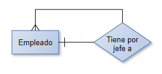
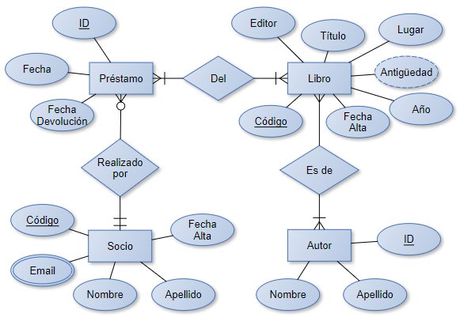

# **Introducción a los sistemas de bases de datos**

**Introducción**
### **Primero, un poco de historia....**
Antes de que se conociera el concepto de bases de datos, las aplicaciones (o programas) utilizaban “procesamiento de archivos” para trabajar con los datos que estaban guardados en ellos. Entonces cada usuario definía e implementaba los archivos necesarios para utilizar los datos como parte de la programación de dicha aplicación.

Recordando de **Técnicas de programación...**

El **programador** de la aplicación definía los datos que se iban a necesitar para el archivo “Clientes” y creaba lo que se denominaba un “record” o “registro” (que contenía por ejemplo el nombre, la dirección, el CódigoPostal, el teléfono del cliente). Quizás los datos del producto que había comprado cada cliente los guardaba en otro archivo, el de “Ventas”. Cuando buscaba, por ejemplo, la historia de las ventas de un cierto cliente, debía recorrer ambos archivos, el de clientes para encontrar los datos del cliente y el de ventas para buscar sus ventas.

Así, **se recorría en forma secuencial (desde el comienzo, registro por registro) cada archivo y se iba mostrando la información a medida que se la encontraba**. Si había que realizar cálculos, debían usarse variables incrementales para ir sumando las ventas de cada cliente. Un proceso bastante largo y que generalmente llevaba mucho tiempo.

**Estructura de una base de datos**

Veamos ahora otro ejemplo en donde se manejan datos. Quizás vos hayas entrado alguna vez a una aplicación de venta libre como la que te mostramos en esta imagen a continuación:

Un ejemplo donde hay una **aplicación utilizada para vender autos** y **dos funcionalidades independientes entre sí**. La **primera** es la que efectivamente se utiliza para gestionar la venta propiamente dicha y guardar los datos del auto, el comprador, la fecha, datos del vendedor, etc. La **segunda** es la que se utiliza todas las semanas para emitir un reporte de ventas para la gerencia.

Utilizando el procesamiento de archivos, antes de poder trabajar en la aplicación del reporte, el programador debe saber dónde se encuentra el archivo de la aplicación de ventas, en qué máquina y en qué disco y carpeta de dicha máquina se encuentra guardado.

Él desarrolla su aplicación y todo anda bien hasta que un día el desarrollador del programa de ventas decide introducir una mejora. Como parte de la misma, decide mover el archivo a otra carpeta dentro del disco.

**¿Qué sucederá cuando la 2° aplicación necesite emitir el reporte de ventas el próximo viernes por la tarde?**

Seguramente nos responderás que, dado que el archivo al que accedía la aplicación del reporte ha sido movido a otra carpeta, no lo podrá acceder y fallará la aplicación con un error de “archivo no encontrado”.

Sigamos con el ejemplo, pero ahora suponiendo que ambos programadores son la misma persona o están en contacto, es decir, que se informan mutuamente de los cambios implementados en sus respectivas aplicaciones.

**¿Qué información te parece que va a impactar en la aplicación del reporte y qué es clave que el programador tenga en cuenta?**

Seguramente, estarás respondiendo que es la ubicación del archivo de las ventas y la descripción de los datos que éste alberga.

Es decir, y, para resumir, ¡El cambio en la programación de la aplicación de ventas ha impactado en la aplicación del reporte y ha provocado que falle!

**¡Este es precisamente uno de las principales motivaciones que impulsó la creación de las bases de datos!** 

Así, las **bases de datos se crearon** para poder tener una independencia entre las aplicaciones o programas y los archivos donde están almacenados los datos, es decir, su ubicación física en los discos rígidos.

Otro motivo importantísimo que afectaba la operatoria en la época del procesamiento de archivos era la imposibilidad de poder acceder al archivo al mismo tiempo para operar, en nuestro ejemplo, ambas aplicaciones. Es decir, si mientras se estaba obteniendo el reporte, leyendo el archivo de ventas, un usuario del sistema de ventas trataba de ingresar una venta, dicho sistema arrojaba un error de acceso indicando que el archivo estaba siendo abierto por otro usuario. Es decir que el **procesamiento era monousuario, no multiusuario.**

**Qué es un Sistema Gestor de Base de Datos (o DBMS en inglés)**

Hoy es imposible imaginar una aplicación que no esté interactuando con una base de datos.

Desde los sistemas de comercio electrónico hasta la tarjeta para viajar en un medio de transporte, utilizan estos sistemas. Son tan comunes que ni siquiera nos damos cuenta de que los estamos utilizando.
### **¿qué es en realidad una base de datos?**
**Una base de datos es una colección de hechos con un significado relevante para el mundo con el que nos interesa trabajar y que tiene un propósito específico.**

Ahora bien, te podrías preguntar lo siguiente: una lista de supermercado en una planilla de cálculo, el conjunto de las inscripciones a una materia en una universidad: 

¿se pueden considerar como bases de datos?

Para responder tu pregunta basta repasar la definición, **¿Tienen un significado? ¿Nos interesan para trabajar con ellos? ¿Tienen un propósito?** ¡Entonces, sí constituyen una base de datos!

Por lo tanto, no cualquier conjunto de datos se puede considerar como una base de datos, el conjunto debe reunir las condiciones mencionadas. Sino, solo es un conjunto de datos.

Una particularidad que deben tener las bases de datos es que su contenido debe reflejar los cambios realizados en los datos, a través de algún medio, tan pronto como sea posible para que su contenido se mantenga fiel a la realidad que representa.
## **DBMS o motor de la base de datos**
### **¿Qué es un DBMS o motor de la base de datos?**
Un **DBMS o motor de una base de datos es una colección de programas que permite a los usuarios crear y mantener una base de datos**. Es un sistema de software de propósito general que facilita la definición, construcción, manipulación y compartición de bases de datos entre usuarios y aplicaciones.

veamos una lista de las posibilidades y ventajas que ofrecen las bases de datos:
### **¿Ventajas y posibilidades...?**
- El **Sistema de base de datos es capaz de describirse a sí mismo a través de su meta-data** (colección de datos que sirve para definir las estructuras básicas de los datos de la base de datos), pudiendo entonces servir para gestionar a la propia base de datos. Es decir, en cierta forma lo podemos ver como que las bases de datos se gestionan a sí mismas.
- **Aislamiento entre programas y datos, y abstracción de datos**: así como la necesidad del aislamiento es lo que originó la idea de crear los DBMS, la abstracción de datos es una técnica que permite definir, diseñar o representar las estructuras escondiendo ciertos detalles de implementación, como por ejemplo dónde está guardado físicamente dicho archivo.
- **Soporte de múltiples vistas de los mismos datos**: es decir por ejemplo, que el personal del departamento de Recursos Humanos pueda ver todos los datos de los empleados pero el coordinador del departamento de Ventas pueda ver solamente el nombre y el teléfono celular de los empleados de su propio departamento.
- **Datos compartidos y procesamiento multiusuario**: debe permitir que los usuarios tengan disponibles “múltiples vistas de los datos” es decir, ver los datos de diferentes maneras o sea de “diferentes vistas”. Algunos, por ejemplo, podrían necesitar ver los sueldos y otros no tendrán permitido verlos. 

Además, **el DBMS deberá tener algún “mecanismo de control de concurrencia”, ya que debe permitir que muchos usuarios accedan al mismo tiempo a trabajar con los datos**. O sea, algunos podrían estar generando un reporte mientras otros están agregando nuevos datos (por ejemplo, ingresando una venta). 

` `**El DBMS debe permitir que ambos usuarios trabajen y que los datos sean consistentes para ambas acciones**.

**Los diferentes tipos de usuario**

Retomando el ejemplo de la aplicación de comercio electrónico, imaginemos por un momento que un usuario va a realizar una compra. Por lo tanto, ingresa con su usuario y contraseña, elige el producto que desea y presiona el botón “Comprar”.

En ese momento puede elegir la forma de pago y se le pedirá que ingrese los datos de su tarjeta y banco. 

Toda esta información que se está mostrando es propia del usuario que está conectado en ese momento y no deben verla otros usuarios. En las bases de datos existen mecanismos para garantizar la privacidad de los usuarios. 
Te imaginarás a estas alturas que para poder implementar esos mecanismos tiene que haber “alguien” con permiso para hacerlo.

Por lo tanto:

En una **base de datos existen diferentes tipos de usuarios** de acuerdo a las actividades que pueden realizar en ella:**

### [**Administrador (DBA)**](https://aulavirtual.codoacodo.com.ar/mod/lesson/view.php#collapse1)
Es el usuario con más poderes dentro de la base de datos. Se ocupa de:

- administrar los permisos de acceso a los demás usuarios,
- que el **DBMS** funcione correctamente,
- analizar el rendimiento (o velocidad) del motor para que los usuarios puedan trabajar en los niveles esperados,
- administrar los recursos necesarios para asegurarse que tanto las bases de datos como el DBMS se comporten de acuerdo a los niveles previamente determinados.
### [**Diseñador**](https://aulavirtual.codoacodo.com.ar/mod/lesson/view.php#collapse2)
Es el usuario que trabajó desde el inicio, mucho antes incluso de la existencia de la base de datos misma. El desarrolló los modelos de datos de acuerdo al requerimiento del cliente (el dueño del mini-mundo que se necesitaba modelar) y también determinó cuáles son las diferentes vistas a las que necesitarán acceder los usuarios.
### [**Usuarios finales**](https://aulavirtual.codoacodo.com.ar/mod/lesson/view.php#collapse3)
Son los usuarios que van a interactuar con las diferentes vistas de la base de datos y para los cuales se la construyó.
### [**Analistas y programadores de aplicaciones**](https://aulavirtual.codoacodo.com.ar/mod/lesson/view.php#collapse4)
Los analistas son los que realizaron el relevamiento de las necesidades que debía cubrir la base de datos y los programadores de aplicaciones crearon los programas que garantizaron que dichas necesidades pudiesen cumplirse.
## **Arquitectura de 3 esquemas**
¿Te imaginás un ejemplo de cada uno de los diferentes niveles que tienen las bases de datos, de acuerdo a los usuarios que pueden acceder a ellos? Quizás te será más fácil identificar los niveles si pensás hasta qué profundidad de detalle podrás ver cada tipo de usuario los datos de la base...

En la siguiente figura, se puede ver la **arquitectura de tres esquemas** de la base de datos: 

Así, la "**arquitectura de tres esquemas**” de la base de datos permite:

- **Aislamiento de los programas y los datos (independencia programa-datos y programa-operación).**
- **Soporte de varias vistas de usuario.**
- **Uso de un catálogo para almacenar la descripción de los datos (esquema).**

Cada nivel oculta hacia arriba algunas características del esquema, así el **nivel interno** expone tanto el modelo físico como las rutas de acceso, de esta manera es posible para el administrador trabajar con ellos para mejorar los rendimientos de los accesos a los datos.

Por otro lado, el **nivel conceptual** permitirá ver la estructura de toda la base para la comunidad de desarrolladores, pero oculta todo el modelo físico y de almacenamiento. Esto es porque no son los desarrolladores a quienes les concierne cómo se organiza la parte física de la base de datos. Pensá en la parte física (interno) como los archivos que están en los discos rígidos, donde se guardan los datos propiamente dichos.

Y finalmente, en el **nivel externo**, solo podrán ver los usuarios finales aquellas vistas que estén disponibles para ellos, en algunos casos de manera personalizada o por grupos según su interés. 

*Pero se les ocultará tanto la parte física como la conceptual*.

**Independencia de los datos**

Imaginemos que estamos trabajando y se solicita agregar un dato adicional a los clientes: un cálculo de una métrica que afecta luego su scoring o sea un número que indica cómo es visto por el negocio (dato preexistente calculado).

Entonces el desarrollador, agrega en el esquema la nueva métrica haciendo un cambio en el nivel conceptual pero no debe cambiar nada en los archivos físicos o en las vistas.

La independencia de los datos puede verse desde dos puntos de vista: **lógico y físico**. 

**Lógico** sería que se cambia el modelo que se hizo originalmente para reflejar algo nuevo. Este cambio sin embargo no impacta en cómo se organiza desde el punto de los archivos donde se guardan los datos.

La **independencia lógica de los datos** es la capacidad de cambiar el esquema conceptual sin tener que cambiar los esquemas externos o los programas de aplicación.

**Físico** sería lo contrario, es decir cambiamos algo en la forma en que guardamos los datos en el/los archivo/s del disco; por ejemplo, agregamos un archivo nuevo o un disco nuevo a la estructura existente. Pero al hacer este agregado, no hemos cambiado nada en nuestro diseño conceptual original.

La **independencia física** de los datos es la capacidad de cambiar el esquema interno(físico) sin tener que cambiar el esquema conceptual. Por lo tanto, no es necesario cambiar el esquema externo (la vista al usuario final sigue igual).

¿cómo es posible cambiar algo en un esquema sin modificar los otros dos?

Esta tarea es una de las tareas más frecuentes del DBA(Administrador), por ejemplo, cuando los discos están llegando a su capacidad debido al crecimiento de los archivos de datos. El DBA agrega archivos adicionales en otro disco sin tocar nada del diseño. 

¡Esto lo puede realizar incluso mientras la base de datos está operando y ninguno de los usuarios se ve afectado por dicha actividad, lo que prueba que: ¡en efecto, la independencia física funciona perfectamente!

**Lenguajes DBMS**

Una vez que se ha realizado el diseño de la base de datos, luego de elegir el DBMS(motor/gestor) apropiado, se debe implementar la misma, usando los lenguajes propios del DBMS. 

Para realizar el diseño, se utiliza el **“lenguaje de definición de datos” o DDL** por sus siglas en inglés. Mediante este lenguaje es que se crea la base de datos, todas las estructuras y sus objetos.

Recordá que en *Técnicas de programación* habíamos visto la función de un compilador y de un traductor. En este caso el DBMS utiliza un compilador DDL que interpreta dicho lenguaje y procesa las sentencias.

Hay motores que tienen implementado un lenguaje para cada nivel, en esos casos existe el lenguaje **SDL o “lenguaje de definición del almacenamiento”** (storage) con el cual se especifica el nivel interno. Con este lenguaje es que crearíamos los archivos de la base de datos y definiríamos qué objetos van en cada uno. Es decir que nos basamos en el esquema conceptual para especificar cómo y dónde quedarán los archivos donde estarán los datos, estos archivos conforman lo que llamamos la parte física de la base de datos. 

Por último, se utiliza el **DML o “lenguaje de manipulación de datos”**(SQL es el más popular) para especificar las vistas de los usuarios finales y los diferentes mapeos a los niveles conceptual y exterior.

**En los DBMS(motores/gestores) actuales, el lenguaje utilizado es el mismo, y son las sentencias las que realizan las diferentes tareas**. Estas sentencias se clasifican en sentencias DML, DDL o SDL.

Puedes ver entonces que con estos lenguajes se especifican primero los esquemas conceptual e interno y el mapeo entre ambos, y luego recién es posible trabajar en la especificación del esquema externo. No podría hacerse en otro orden. Lo debes pensar como cuando se construye una casa, primero se hacen los planos, luego, de acuerdo a ellos se comienza a construir, primero los cimientos y las columnas que van a soportar las paredes y el techo. Una vez hecho todo esto, se puede pintar y adornar cada habitación para que se vea linda estéticamente.

**Módulos componentes de un sistema de bases de datos**

En las secciones anteriores hemos visto algunos componentes de las bases de datos y de los DBMS, utilizando ejemplos para que puedas darte una idea de su funcionalidad y cómo interactúan entre ellos.

Teniendo en cuenta todo lo trabajado hasta ahora, vamos a ver un diagrama que al principio puede resultar un poco complejo de entender, pero si lo analizamos por partes, claramente podremos relacionar cada una de ellas con los temas vistos. Analizaremos entonces el diagrama simplemente como una forma de “atar cabos”, para tener un contexto común a todos para que puedas ver en el **DBMS** cómo contribuye cada uno de ellos.

En la siguiente figura, **podemos observar que el sistema de base de datos o DBMS está formado por una serie de componentes interdependientes entre sí**.

En la parte superior, se puede ver cómo se relacionan los esquemas con los diferentes niveles de usuarios. Así vos notarás que **el DBA(administrador) interactúa con lenguaje DDL y comandos privilegiados**, y que **los programadores de aplicaciones interactúan con el lenguaje DML**, por ejemplo.

**El programador**, se encarga de armar las consultas que luego se ejecutarán cuando los usuarios interactúen a través de la aplicación.

El **DBA** tiene acceso a **comandos privilegiados** para realizar sus actividades de administración.

El **compilador de lenguaje DDL** procesa las definiciones del lenguaje y guarda en el catálogo los metadatos generados. El compilador **DML** recibe los comandos y los transforma en código objeto que accede a la base de datos.

El **catálogo del sistema** y la base de datos se almacenan en el disco. El acceso al disco es controlado por el sistema operativo. El módulo administrador de los datos almacenados del DBMS controla el acceso a la información del DBMS almacenada en disco (catálogo o base de datos).

El **compilador de consultas** analiza sintácticamente los comandos escritos para verificar que los objetos y operaciones existan en el catálogo y que las sentencias estén bien formadas.

Los **subsistemas de control de concurrencia** se ocupan de asegurar que varios usuarios puedan operar al mismo tiempo sin interferir entre ellos. O sea, en el ejemplo de la aplicación de comercio electrónico, podrían comprar al mismo tiempo el mismo o diferente producto.

**Síntesis de unidad**: vimos los conceptos básicos que debés conocer antes de comenzar a trabajar con modelado de datos y bases de datos. Estos conocimientos podrás utilizarlos en la Unidad 2 para pensar los modelos y en la Unidad 3 cuando comencemos a usar las sentencias de los **lenguajes DML y DDL.**

Hemos visto que generalmente un cliente solicita a un consultor realizar un modelo de un sistema de su interés y crear una BASE DE DATOS que refleje el MINI-MUNDO de su interés. 

A partir de este modelo, el DISEÑADOR crea la base de datos y el esquema conceptual utilizando **lenguaje DDL**. 

Luego el desarrollar accederá a esta BASE DE DATOS y creará los programas y el ESQUEMA EXTERNO al que accederán los usuarios. **Utilizará lenguaje DML** dentro de sus programas lo que permitirá acceder a los datos almacenados dentro de la BASE DE DATOS. 

Por último, el **DBA** será el encargado de administrar el ESQUEMA INTERNO de la base de datos utilizando COMANDOS PRIVILEGIADOS.

## **AUTOEVALUACIÓN:** 

Una base de datos es una colección de datos relacionados que refleja un mini-mundo que nos interesa VERDADERO

Un compilador de consultas analiza las consultas sintácticamente. VERDADERO

DBA UTILIZA DDL --> ES UN LENGUAJE D EDEFINICIÓN DE DATOS

# **Diseño lógico de bases de datos**
**Introducción**

En esta unidad nos proponemos explicarte qué es un **Diagrama Entidad-Relación** de una base de datos (o **DER** por sus siglas en inglés). 
Veremos las definiciones y utilidad y algunos ejemplos ilustrativos que servirán para aclarar los conceptos.

Para comenzar con esta unidad, ya que en la Unidad 1 vimos lo que es un modelo conceptual, nos vamos a apoyar en ese conocimiento, y veremos cómo se realiza el diseño conceptual de una base de datos y cuáles son las partes del mismo. Veremos además algunos ejemplos de aplicación que servirán para aclarar las ideas vertidas. 

**Conceptos del Modelo Relacional**

El diseñador arma un esquema conceptual que refleja el sistema o negocio de interés, lo que hemos llamado “el ***mini-mundo***” a modelar. Es decir. antes que nada, debe tener una idea de cuál es ese pequeño entorno que va a modelar, o sea cuál es el alcance del mismo, dónde comienza y dónde termina.

Para saber esto, generalmente los diseñadores se reúnen con el cliente y éste les “cuenta”, con sus palabras, lo que necesita. Es un trabajo arduo que implica mucha capacidad de interpretación por parte de los diseñadores ya que, a menudo, el cliente asume muchas funcionalidades por su amplio conocimiento del negocio y está en la habilidad del diseñador el hacer las preguntas correctas para terminar de entender lo que se desea modelar.

**¿Y cómo pasamos de este simple relato a construir el modelo para una base de datos?**

**Modelo Entidad - Relación**

Continuando desde el apartado anterior y ya conociendo cómo vamos a descubrir los diferentes elementos del modelo para un cierto problema, veremos ahora los pasos a seguir para el armado de dicho modelo.

- Los **sustantivos importantes** son las **ENTIDADES** del modelo. Los sustantivos menos importantes que corresponden a las entidades (en nuestro ejemplo habíamos visto que el mail era uno de ellos) son los **ATRIBUTOS**.
- Las **entidades** interactúan entre sí por medio de acciones, por ejemplo, los VENDEDORES “visitan” LOCALES que “pertenecen a” los CLIENTES para “venderles” los PRODUCTOS. Las acciones son las “**relaciones**” del modelo. 

Las entidades luego contendrán los datos relevantes que hemos indicado son sus atributos. Así en nuestro ejemplo, sabemos que del cliente necesitaremos saber su mail, seguramente también su nombre y dirección o número de teléfono.

Tenemos así los diferentes clientes: 

|**Cliente**|**Nombre**|**Dirección**|**Email**|**Teléfono**|
| :-: | :-: | :-: | :-: | :-: |
|1|J. Pérez|Aráoz 1340|jperez@...com.ar|3302982|
|2|A. López|Frías 239|alopez@...com.ar|4472992|
|3|M. Arias|Palpa 2237|marias@...com.ar|4883937|

`  `Ahora que sabemos esto, estamos en condiciones de definir qué es el modelo relacional....

**Modelo relacional: definición**

**El modelo relacional representa a la base de datos como una colección de “entidades” relacionadas entre sí, donde cada entidad se puede ver como una “tabla”.**

Podrías pensar en una tabla como si fuera una hoja de cálculo, con sus filas y columnas. Las **filas** simbolizan cada una de las instancias de la tabla, por ejemplo, un cliente, un vendedor o una venta. Las **columnas** sirven para interpretar el significado de los valores de la fila.  

\- En el modelo relacional la **fila se denomina “T-upla”**. 
\- Las **columnas** de la tabla **son los “atributos”**. 
`        `- La **tabla,** como dijimos anteriormente, se denomina **“entidad”**. 

Además, como tenemos que construir un diagrama vamos a tener que definir cómo representar cada una de sus partes. Entonces podemos usar la siguiente convención:

Veamos un ejemplo de cómo sería el modelo del relato de los vendedores... 

Notarás que entre clientes y productos hay una relación “compran” que simboliza el hecho de que los clientes van a solicitar ciertos productos a los vendedores. Se puede ver que hay un atributo en la relación. Es decir, el atributo no pertenece a las entidades, sino que es propio de la relación. Este punto lo aclararemos en el apartado siguiente cuando veamos más ejemplos.

¿Podés, a partir del diagrama, “leer” el relato que hizo el cliente al diseñador? 

**Entidades. Grado. Atributos. Dominios**

Hemos visto entonces que las entidades contienen atributos o, mejor dicho, que los atributos describen a las entidades. La cantidad de atributos que tiene una entidad se denomina “grado” de la entidad.

Dijimos que los **atributos se simbolizaban en el modelo E-R con un óvalo**.

En el diagrama de más arriba, se puede ver que hay diferentes tipos de óvalos, que simbolizan diferentes tipos de atributos. Estos son: 

Otros ejemplos son: 

- **Compuestos:** Fecha: {dia, mes, año}; NombreyApellido:{Nombre, Apellido} 
- **Derivado:** Monto= precio \* cantidad \* 1,21 (para calcular el monto a pagar con IVA incluido). 
- **Multivaluado:** teléfono, email, podría ser también una dirección de entrega. 
- **Comunes:** Color, Altura, Descripción, Talle, Departamento, etc. 

Cada atributo puede tomar un conjunto de valores posibles distintos. A ese conjunto de valores lo llamamos **“dominio” del atributo**. Existe la posibilidad de que diferentes atributos compartan el mismo dominio, por ejemplo, en el atributo compuesto dirección, están las calles. Estas calles pueden ser las mismas para las direcciones de los clientes, o las de los empleados; lo mismo puede pasar con las localidades. Se trata de atributos de diferentes entidades y sin embargo sus dominios coinciden.

**Claves candidatas, alternativas y claves primarias**

En una entidad o tabla, hemos visto que existen muchas **t-uplas**, tantas como datos tenga la tabla. Podría suceder que, en el ejemplo de los vendedores, por accidente, dos vendedores diferentes visiten el mismo local e ingresen datos del cliente, generando de esta manera dos t-uplas para el mismo cliente. 

Para evitar esto, es que existe un atributo específico de cada tabla o entidad que se utiliza para diferenciar una t-upla de la otra. Generalmente ese atributo es un tipo de dato de tamaño pequeño y fácil de identificar y diferenciar para los usuarios del sistema.

Por lo tanto:

**La clave candidata es aquel atributo de una entidad que sirve para poder identificar unívocamente un set de valores de esa entidad (cada t-upla o instancia de la entidad).**

Si tomáramos ese atributo conjuntamente con otro, por ejemplo, el código, que es nuestro atributo clave, y el nombre del socio de la biblioteca, ambos conformarían una superclave, ya que entre ambos también podremos identificar unívocamente un dato de otro de dicha entidad, pero, sabemos que con solo el código nos alcanzaría.

Veamos un ejemplo específico.... 

|**Nombre**|**Apellido**|**CUIT**|` `**Código**|
| :-: | :-: | :-: | :-: |
|**Juan**|Pérez|` `27-112329826-0               |` `1234|
|**María**|González|20-156678901-2|` `2312|
|**Juan**|Pérez|20-214549742-1|` `2133|
|**Jorge**|Peres|30-178629743-0|` `2213|
|` `**J**|Perez|20-146652445-7|` `2132|

En el ejemplo vemos varias **t-uplas** que corresponden a cierto socio Juan Pérez (o Jorge Peres? O J Perez?).

¿Cómo sabemos que no se trata del mismo socio y que alguien al tipear sus datos no cometió un error?

En principio, como el código es diferente, debemos suponer que se trata de un socio distinto. Seguramente al ingresarlo se le han tomado los datos suficientes para asegurarse que no se trata de la misma persona. Podés observar que el CUIT es diferente en todos los casos.

¿Por qué no se utilizó el CUIT como clave entonces?

Tranquilamente se podría haber utilizado el CUIT como clave. Es decir, en efecto, el CUIT era una clave candidata, tal como lo era el código, ya que ambos podían utilizarse para diferenciar una t-upla de la otra en la entidad Socios. Pero se eligió finalmente al código porque era un número más pequeño (o sea por comodidad).

El hecho que ambos atributos podían usarse indistintamente como claves hace que sean claves candidatas o alternativas.

Se podrían usar un par de atributos juntos como claves, por ejemplo, nombre y apellido, pero vemos que tenemos dos socios con el mismo nombre y apellido, lo que invalida la posibilidad de utilizar este par como clave.

¿Podríamos utilizar CUIT y apellido como clave?

La respuesta es **NO**, porque en realidad el par {CUIT, Apellido} son una SUPER clave porque si solo usamos el CUIT nos alcanza para identificar una t-upla de otra, es decir nos sobraría el apellido (de ahí que es SUPER, más grande que la clave).

**La clave primaria** es aquella clave candidata que ha sido elegida para identificar unívocamente un set de valores de esa entidad. 

Es decir, de **todas las posibles claves candidatas, hemos elegido a la clave primaria para identificar un set de valores o t-upla, respecto de otra en una cierta entidad**.

**Relaciones. Cardinalidad**

Ya vamos profundizando en los conceptos que conciernen a las diferentes partes del modelo relacional, y esta vez, nos centraremos en las relaciones.

Vimos que la relación se simboliza con un rombo y líneas que unen las entidades relacionadas.

Según cuántas entidades estamos relacionando, tendremos relaciones de diferentes tipos, a saber:

**ACTIVIDAD** 

¿Podrías indicar en un escenario donde tenemos los clientes de un banco que, teniendo una cuenta, pueden solicitar tarjetas de crédito, préstamos, y otros servicios?

Banco-tiene-Cliente: binaria.

Cliente-solicita-Préstamo: binaria.

Cliente-tiene-Tarjeta de Crédito: binaria.

Cliente-tiene-Cuenta: binaria.

Cliente-autorizado por Cliente: unaria (para modelar clientes que pueden compartir una misma cuenta).

**Relaciones. Cardinalidad (II)**

Veamos en el caso de la relación binaria, **“los clientes compran productos”**. 
José que es un cliente, ¿cuántos productos de nuestra compañía podría comprar?

Obviamente le permitiremos comprar muchos, y si es un cliente, es porque nos ha comprado alguna vez, y deseamos que siga comprando. Eso significa que, en la relación entre ambas entidades, en el lado de los productos vamos a poner un símbolo que signifique muchos (o N).

Esto lo hacemos con una patita de gallo como hemos mostrado previamente en el diagrama:

**Relaciones. Cardinalidad (III)**

Ahora volvamos al diagrama:

Ahora que sabemos que ambas tablas tienen una **clave**, podemos entender que la cantidad está modelando cuántas unidades de cada producto compró un cierto cliente.  

¿Qué pasaría si pusiéramos la cantidad como atributo de Clientes?

Como sabemos que cada cliente solo aparece una vez en esa tabla, entonces la **cantidad que figura para su t-upla** indicaría que está destinado a comprar siempre la misma cantidad sin importar qué producto adquiera. De manera similar, si ponemos cantidad en la tabla de productos, indicaría que de un cierto producto solo se admitiría que los clientes compren siempre esa cantidad. 
La cantidad, modelada dentro de la relación y no en las entidades que la conforman, indicará que es la cantidad de cada producto que ha comprado un cliente específico

Pensemos en Juan, uno de nuestros empleados, ¿cuántos jefes directos tiene?

Seguramente uno solo, Federico. Por lo tanto, del lado de los empleados jefes, la **Cardinalidad es 1** (recordá que los jefes son también empleados).

Ahora veamos la relación del lado de Federico.

|**Legajo** |**Nombre**|**Jefe**|
| :-: | :-: | :-: |
|**2**|Juan|` `**4**             |
|**1**|María|` `**4**|
|**4**|Federico|` `**9**|
|**7**|Paula|` `**4**|

Es un empleado que es jefe y pensemos cuantos empleados tiene a cargo. Lo más seguro es que sea más de uno, no importa el número exacto, solo si es uno o muchos. O sea, del lado de los empleados la **Cardinalidad es N**.

Resulta entonces que la relación **“Empleado tiene por jefe a” es N-1**. Es decir:

**Diccionario de datos I**

Ya hemos visto en los apartados anteriores cómo debemos hacer para armar el modelo conceptual o modelo E-R: primero identificando las entidades involucradas y sus atributos, y luego relacionándolas entre sí. 

Pero en la Unidad 1 también habíamos expresado que el diseño conceptual luego derivaba (o se mapeaba) al esquema interno y al de vistas o externo. 

` `Primero tomaremos cada entidad y armaremos la tabla correspondiente.
### [**Libro**](https://aulavirtual.codoacodo.com.ar/mod/lesson/view.php#collapse1)
{Código, Título, Lugar, Año, Fecha Alta, Edición}
### [**Autor**](https://aulavirtual.codoacodo.com.ar/mod/lesson/view.php#collapse2)
{ID, Nombre, Apellido}
### [**Socios**](https://aulavirtual.codoacodo.com.ar/mod/lesson/view.php#collapse3)
{Código, Fecha Alta, Nombre, Apellido}
### [**Préstamo**](https://aulavirtual.codoacodo.com.ar/mod/lesson/view.php#collapse4)
Préstamo: {ID, Fecha, Fecha Devolución} (tentativo y a revisar)

**Te preguntarás...**

¿Qué pasó con el email de los socios que no aparece entre los atributos de la tabla socios, que corresponde a la entidad socios del modelo conceptual? 

Veamos este caso con un ejemplo: tomemos uno de los socios María González cuyo código (o clave de la entidad Socios) es 14.   Ella, al momento de asociarse a nuestra biblioteca, nos dio dos mails, el de su trabajo magonzalez@usu.com.ar y su mail personal magonza@gmail.com. 

Como recordarás, cuando definimos el atributo clave, dijimos que era un atributo que identificaba unívocamente cada t-upla o fila de la tabla. Esto significa que no puede haber dos filas que tengan el código 14. Por lo tanto, sería imposible poner ambos emails en la tabla de socios. 

**Volvamos ahora a la pregunta...** 

¿Cómo hacemos para modelar el email?

Seguramente nos estarás respondiendo que vamos a necesitar una tabla para el Email, de lo contrario no podríamos tener guardado en nuestro modelo más de un email por socio.  

Vamos a ver a continuación cómo se debe modelar esta nueva tabla.

Hay que recordar que debemos mantener los diferentes mails para cada socio y, como hemos establecido, es muy importante tener un atributo clave que nos servirá para poder identificar las t-uplas entre sí. 

No podremos usar el mail como **atributo clave** porque, como ya mencionamos, siempre conviene que este atributo sea un dato de tipo numérico, por lo tanto, debemos utilizar otro atributo como clave.  

¿Y qué nos falta? 
¿Cómo lo hacemos? 

¡Nos falta una manera de “atar” los números de teléfono a María, por supuesto!

Vimos que una de las reglas del mapeo del esquema conceptual al esquema interno, es que cada atributo multivaluado se pasa como una tabla nueva. 

Pero… es necesario que en esta nueva tabla haya además un atributo que se utilizará para relacionar las **t-uplas** de la tabla con su “padre”, en este caso, el socio.

Seguramente te estarás preguntando ¿cómo?   
Agregando en la nueva tabla de Emails, el código del socio (o sea que para estos dos números nos quedará asociado el código 14).

Este nuevo atributo se llama **clave foránea**, ya que es exactamente el mismo valor de la clave de dicha tabla. 
Mostramos como nos quedarían las dos tablas con sus datos de ejemplo:

|<h5>Socios</h5>|||
| :- | :- | :- |

|**Socio**|**Nombre**|**CUIT**|
| :-: | :-: | :-: |
|**14**|María González|...|
|59|Juán Pérez|...|

||  |<h5>Emails</h5>|
| :- | :- | :- |

|**Código**|**Email**|**Código Socio**|
| :-: | :-: | :-: |
|1|mgonzalez@...com.ar|**14**|
|2|mariag@...com.ar|**14**|

||||
| :- | :- | :- |

La **clave de Socios** se relaciona con la **clave foránea de Emails.** 
Así podremos encontrar todos los emails de María y permitirle que nos dé todos los que ella tenga o quiera darnos. 

Queda entonces la nueva tabla:

**Email:** {Código, Dirección de Mail, Código de Socio (FK Socio)}

Le agregamos **FK** ya que queremos indicar que es un atributo que proviene de la tabla Socios (la **clave foránea** por sus siglas en inglés, foreign key). 

Como este atributo de la tabla préstamos, es a su vez clave foránea de la tabla socios, quiere decir que está apuntando a aquella t-upla de socios cuya clave tiene el mismo valor. 

En el ejemplo de la socia María, con código **14**, vemos que la **clave foránea** posee, obviamente, el mismo valor y ambas **t-uplas** contienen los dos mails que María ha dado como contacto al momento de asociarse.

Es importante entender en qué orden se crean los datos en ambas tablas para darse cuenta que es imposible pensar que las dos t-uplas de la tabla Emails con los datos que le corresponden a María (con código de socio = 14) no pueden existir si primero no existe la t-upla con los datos de María en la tabla Socios. 

Por lo tanto, el **DBMS** tiene una operación que “chequea” que exista el socio con código=14 cuando se está ingresando el mail que le corresponde. Si no existe ese socio, el DBMS no permite la creación de la t-upla en la tabla Emails.

Es decir, no podríamos tener un Código de Socio en esta tabla de Emails, que no existiera previamente en la tabla Socios. Esta característica de las claves foráneas de las bases de datos se denomina **Integridad Referencial**.

Un detalle muy importante que nos queda por corregir en el pasaje a tablas es que si observas la tabla Préstamos, no tenemos manera de saber qué socio realizó el préstamo. La relación entre Préstamos y Socios es **1-N**, un socio puede realizar muchos pedidos de préstamos, pero el préstamo es únicamente de él.

Para modelar correctamente esta relación, y en adelante todas las relaciones de cardinalidad **1-N**, debemos tener una clave foránea del socio en la entidad del lado “Muchos”, o sea en Préstamos.

**Diccionario de datos II**

Veamos un ejemplo... 
Si la misma María Gonzalez en algún momento pidió los libros “Cien años de Soledad” y “Sobre héroes y tumbas” tendríamos en la tabla Préstamos:

|**ID**||**FECHA**|**FECHA DEVOLUCIÓN**|**Código de Socio** |
| :-: | :-: | :-: | :-: | :-: |
|2||**2/11/2014**|15/11/2014|14 |
|27||**13/04/2017**|20/04/2017|` `18|
|22||**14/10/2016**|28/10/2016|` `14|

Que sería entonces así: 

**Préstamo:** {ID, Fecha, Fecha Devolución, Código de Socio (FK Socios)}

Además, tendríamos las **t-uplas** correspondientes en la tabla **Libros**:

|**Libro**|`        `**Título** |` `**Edición**|` `**....** |
| :-: | :-: | :-: | :-: |
|10|Cien años de soledad |` `2012| .... |
|19|Sobre héroes y tumbas** |` `2010| .... |

` `Y para terminar, veremos cómo se pasa a tablas una relación **N-M**, tomando por ejemplo la relación Préstamos-Libros, donde vemos que cada libro puede ser prestado muchas veces y en un mismo préstamo se puede prestar más de un libro.

Vimos que María había pedido en el pasado dos libros, uno de Sábato y otro de García Márquez.

Si Jorge (código de socio = 18) solicitó los mismos libros esta semana, y se los otorgaron con el préstamo código= 27 hasta la semana que viene, vamos a ver cómo quedarían las tablas correspondientes con los datos, para que puedas darte cuenta de cómo modelar estos casos. 

Necesitamos poder prever todos los casos en que se han prestado los libros mencionados, pero debemos tener además especial cuidado con la clave que nos debe permitir poder identificar unívocamente cada caso: 

|**CodPréstamo**|**CodLibro**|
| :-: | :-: |
|**2**|10|
|**22**|19|
|**27**|10|
|**27**|19|
|||
Vemos que tenemos en estas **t-uplas** las combinaciones de los préstamos de María (el 2 y el 22) y Jorge (el 27) de ambos libros (el 10 y el 19).

Lo importante para poder diferenciar las **t-uplas**, es que no haya pares repetidos, es decir no podríamos tener otro préstamo 27 con otro libro de código 19, ya que ese par ya existe. 
La clave de esta tabla está formada por el par **CódLibro-CodPrestamo**

**Diccionario de datos III**

Cuando tengamos una **relación N-M,** necesitamos una **nueva tabla** a la que llamaremos, por convención, con la combinación de los nombres de ambas tablas separados por un guion. La clave de dicha tabla será la combinación de las claves de las tablas o entidades participantes en la relación, que serán a su vez claves foráneas de las mismas.
Es decir para nuestro ejemplo:

**Préstamo\_Libro. {CodLibro (FK Libros), CodPréstamo(FK Préstamos)}**

¿cómo quedaría el pasaje a tablas de la relación Autor-Libro?

Como regla general entonces tendremos que, al finalizar el pasaje a tablas habrá:

- **1 tabla por cada entidad**
- **1 tabla por cada atributo multivaluado**
- **1 tabla por cada relación N-M** 

Si tenemos esta regla presente, podremos controlar que el pasaje a tablas sea coherente con el esquema conceptual para luego poder ir armando la base de datos. 

**El diccionario de datos es entonces el resultado del pasaje a tablas del esquema conceptual donde cada entidad y sus atributos quedan plasmados ya en la base de datos.**

¿Podés calcular cuántas tablas tendremos entonces para nuestro diagrama E-R de la biblioteca?

- 4 entidades => 4 tablas
- 1 atributo multivaluado (Email) => 1 tabla
- 2 relaciones N-M=> 2\* (1 tabla)

**Total: 4 + 1 + 2 \* 1 = 7 Tablas**

**Refinamiento del modelo. Diseños de calidad**

Vamos a abordar ahora algunos detalles de diseño que se pueden tener en cuenta cuando se arman los modelos de entidad relación. Estos detalles van a contribuir a una mejor calidad en el diseño de la base de datos.

El primero de estos refinamientos es el uso de la **Especialización**.

Utilizaremos un ejemplo para ilustrar un caso donde se puede utilizar este refinamiento:

Cuando vimos el ejemplo de los préstamos de libros, no profundizamos en los diferentes tipos de libros que podríamos tener en la biblioteca.  
Imaginemos por un momento que los libros fueran digitales o reales (los libros físicos).  
Podría pasar que los digitales se puedan leer desde una página de internet con la utilización de un código de préstamo que permitiría su uso durante el tiempo que dure el préstamo, al cabo del cual sería inaccesible.

Un ejemplo así nos permitiría tener un trato distintivo a ambos tipos de libros: los préstamos de los libros digitales necesitan un código de acceso y los libros físicos no.

Veamos cómo se modela esto:

Cuando hay una **especialización vamos a ver que siempre hay una entidad**, en este caso Libro, que es la superclase de la cual se derivan las subclases especializadas, en este caso Físico y Digital. 
No tendría sentido que un libro físico tenga una URL o que un libro digital tenga número de ejemplar, por lo que se utiliza la especialización para agregar estos atributos solamente a quien corresponda.

¿Qué pasa con los atributos que son comunes a todos los libros, como el autor o el título?

Estos atributos solo se colocan en la entidad padre o superclase y son “**heredados**” por las entidades especializadas. 
Cuando pasamos a tablas la especialización, veremos que tenemos por supuesto 1 tabla para cada entidad. La superclase tendrá la clave y todos los atributos que son comunes a todas las entidades.

Las entidades subclase van a heredar la clave del atributo de la superclase como clave foránea, quedará entonces de esta manera el pasaje a tablas:

- **Libro**: {Código, Título, Edición}
- **Digital:** {ID (FK Libro), URL}
- **Físico:** {ID (FK Libro), Número Ejemplar}
- **Préstamo:** {Código, Fecha, Fecha Devolución, CódLibro (FK Libro)}

**Refinamiento de los modelos: ejemplo**

Un último caso de **refinamiento de los modelos** sería el que se utiliza para modelar una especie de “menú”. 

Pensemos en el menú de un restaurante: donde tenemos ciertas comidas que están formadas por una cantidad de ingredientes. 
Sería impensable que una entrada reuniera dulce de leche, aceite y lechuga. ¡Ciertamente no estaría dentro de un menú! 

Pero dentro de las entradas podremos tener todas las verduras crudas que se utilizan normalmente en las ensaladas, tales como: lechuga, tomate, zanahorias, cebolla; combinadas con los aderezos: aceite, vinagre, limón, mostaza, mayonesa. Lo mismo para los platos principales y los postres.

La mera existencia del menú no tendría sentido si fuera a utilizarse para que los clientes del restaurante seleccionen lo que se van a servir.

Veamos cómo se vería el diseño del modelo del ejemplo de las comidas del menú del restaurante: 

Un **menú es una combinación de casos apareados entre las t-uplas provenientes de dos entidades o tablas,** en los que no son elegibles todas las combinaciones posibles. Este menú se arma primero y termina siendo una tabla.

La existencia del menú es únicamente posible si va a ser utilizado posteriormente, sino, no tiene sentido conformar la tabla subyacente.

Vamos a revisar ahora este diseño para estar seguros de que quedó coherente con todo lo que hablamos 
Vemos que una comida está preparada con ingredientes en diversas cantidades. Este sería el menú. 
Una porción individual de la comida tortilla de papas se prepara con 200 grs de papas, 100 cc de aceite, ½ cebolla picada (100 grs) y 2 huevos.

Cierto día entra un cliente al restaurante, que podría ser nuestra socia de la biblioteca, María Gonzalez. Ella se sienta, el mozo se acerca y le entrega el menú para que elija lo que desea almorzar. Ella elije una porción individual de tortilla de papas y de postre el flan con crema y dulce de leche.  

El mozo entrega el pedido a cocina y el personal que trabaja allí sabrá perfectamente cómo prepararla y con qué proporción de ingredientes, porque las mismas se encuentran en la tabla que corresponde al menú.
##### La **tabla Ingrediente**:

|**Código**|` `**Descripción**|**Unidad**|**Marca** |
| :-: | :-: | :-: | :-: |
|**1**|` `huevo|1|` `GoldenFarm|
|**2**|` `papas|kg|` `La Visión|
|**3**|` `aceite|litro|` `Patito|
|**4**|` `leche|litro|` `La Serenísima|
|**5**|` `cebollas|kg|` `La Visión|
|**6**|` `dulce de leche|kg|` `La Serenísima|
|**7**|` `crema de leche|litro|` `La Serenísima|
|**8**|` `azúcar|` `kg|` `Ledesma|

##### La **tabla Comida:**

|**Código**|**Nombre**|**Descripción** |
| :-: | :-: | :-: |
|**12**|Tortilla de papas|Tortilla de tamaño individual (no porción)|
|**24**|Flan|Individual|
|**33**|Flan c/dulce de leche|Adición por porción|
|**29**|Flan c/ crema chantillí|Adición por porción|
|**39**|Flan con crema y dulce|Flan con crema chantillí y dulce de leche|

Y finalmente veremos la tabla que corresponde al menú del cual estuvimos hablando hasta ahora, nuestra “agregación”. Su nombre se toma de ambas tablas por convención o sea **Comida-Ingrediente.**

Y finalmente veremos la tabla que corresponde al menú del cual estuvimos hablando hasta ahora, nuestra “agregación”. Su nombre se toma de ambas tablas por convención o sea Comida-Ingrediente. Las t-uplas con lo que eligió María serían: 
##### La **tabla Comida-Ingrediente**:

|**CodComida**|**CodIngrediente**|` `**Cant**|
| :-: | :-: | :-: |
|**12**|1|2|
|**12**|2|0,200 |
|**12**|3|0,150|
|**12**|5|0,100|
|**37**|1|1|
|` `**37**|4|0,150  |
|` `**37**|8|0,075 |
|` `**37**|` `6 |` `0,060  |
|` `**37**|7|0,060|

En el diccionario de datos, esta tabla por supuesto corresponderá a: 

**Comida-Ingrediente:{CodComida (FK Comida), CodIngrediente (FK Ingrediente), Cant}**

Veamos ahora lo más importante, que es lo que hace que la agregación exista: el hecho de que María haya podido elegir esas combinaciones de comida-Ingrediente pre-existentes (ya que no existía una combinación de tortilla con el adicional de dulce de leche, obviamente ¡hubiera sido incomible!). 
Suponiendo que María es el cliente número 37 del restaurante:

|**Comensal**|**Comida**|` `**Ingrediente**|
| :-: | :-: | :-: |
|**37**|12|` `1|
|` `**37**|` `12|` `2|
|` `**37**|` `12|` `3|
|` `**37**|` `12|` `5|
|` `**37**|` `39|` `1|
|` `**37**|` `39|` `4|
|` `**37**|` `39|` `8|
|**37**|39|6|
|**37**|39|` `7|

Esta tabla, que corresponde también a la **relación N-M** entre el menú (la agregación) y la entidad Comensal, se arma con las tres tablas provenientes de las entidades involucradas, PERO lo más importante es la manera en que se combinan las claves foráneas en esta tabla: 

**Comensal-Comida-Ingrediente: {CodComensal (FK Comensal), CodComida (FK Comida-Ingrediente), CodIngrediente (FK Comida-Ingrediente)}**

Cabe aclarar la importancia de entender que las claves foráneas de Ingrediente y Comida solo corresponden a las combinaciones existentes en la tabla de la agregación. Es decir, **no son válidas** todas las combinaciones posibles de las claves foráneas provenientes de las tablas Comida e Ingrediente. ¡Si así fuera, hubiera sido posible para María pedir la tortilla con el adicional de dulce de leche!

**Síntesis de la Unidad**: vimos los conceptos básicos que debés conocer antes de comenzar a trabajar con modelado de datos y bases de datos. Estos conocimientos podrás utilizarlos en la Unidad 3 cuando comencemos a usar las sentencias de los lenguajes DML y DDL.

El **ESQUEMA CONCEPTUAL** de una base de datos está representado por el **DIAGRAMA E-R** (entidades-relaciones). Este diagrama está compuesto por **ENTIDADES, RELACIONES**. Las **ENTIDADES** representan TABLAS y las TABLAS están formadas por **T-uplas**.

Las **ENTIDADES** a su vez están compuestas por los ATRIBUTOS. Los **ATRIBUTOS** pueden ser de tipo COMPUESTOS, MULTIVALUADOS, COMUNES o DERIVADOS.

La **CARDINALIDAD** especifica la cantidad de **RELACIONES** y puede ser **1-N**, **N-M** o **1-1**. Además, las **RELACIONES** pueden ser UNARIAS, BINARIAS y TERNARIAS,
## **AUTOEVALUACION:**
Entidad representa tabla

El atributo que sirve para identificar unívocamente una t-upla en una tabla à CLAVE

El modelo relacional representa a la base de datos como una colección de “entidades” relacionadas entre sí

La especialización se utiliza cuando: Varias entidades heredan atributos de una entidad superclase

LOS GRADOS DE UNA RELACIÓN PUEDES SER UNARIO BINARIA Y TERNARIA.

# **Lenguaje SQL**

Recordemos de la Unidad 1 que teníamos **dos tipos de lenguaje, DDL y DML**. Para crear las tablas se utilizará **DDL**. Luego, utilizaremos **DML** para interactuar con los datos de dichas tablas, ya sea que los leamos o los modifiquemos.

**Sentencias DDL: CREATE, ALTER y DROP**

A partir de ahora comenzaremos a ver las distintas **sentencias del lenguaje SQL (**del inglés Structured Query Language) en su forma compatible con ANSI 92. ANSI es un standard del lenguaje, lo que nos asegura que dicha forma es compatible con todos los DBMS del mercado. 

Es decir, que si escribimos una sentencia de código SQL ANSI 92 la podremos ejecutar exitosamente en cualquier DBMS. SI la sentencia no es ANSI, podría darse el caso que se ejecute con éxito en un DBMS (por ejemplo, SQL Server) pero no en otros (por ejemplo, Oracle y MySQL).

Como vimos en la Unidad 1, el lenguaje **DDL** o de **definición de datos**, contiene sentencias que permiten ***crear***, ***modificar*** o ***eliminar objetos*** en el esquema interno de la base de datos en base al esquema conceptual. 

Para ello se utilizan **tres sentencias muy potentes**, ellas son **CREATE, ALTER y DROP**, las que veremos a continuación.

La sentencia **CREATE** tiene la siguiente estructura en su forma más simple:

CREATE <tipo de objeto> "Nombre de objeto"

Luego, dependiendo del tipo de objeto, la sentencia varía. Como nos vamos a concentrar por ahora en la creación de tablas, vamos a ver en detalle la sentencia para este caso:

SQL

CREATE TABLE "Nombre de la tabla" (
`  `Columna1 tipo de dato NULL,
`  `Columna2 tipo de dato NULL,
`  `…
)

Los tipos de datos pueden ser: 

- **Int:** números enteros
- **Datetime:** fecha y hora
- **Varchar** (longitud en cantidad de caracteres): cadenas de caracteres o strings
- **Float:** números decimales

Son los tipos más comunes que estaremos manejando.

### **Sentencia CREATE**

Para crear la **tabla Préstamo** (cuidado que no vamos a poner el acento en la e para el nombre de la tabla):

SQL

CREATE TABLE prestamo (
`  `ID int not NULL,
`  `Fecha datetime NULL,
`  `Fecha\_Devolucion datetime NULL,
`  `PRIMARY KEY (ID),
`  `FOREIGN KEY (CodSocio) REFERENCES Socios(Codigo)
) 

El **NULL** es el valor que tiene un atributo cuando no se le ha asignado aún ningún valor. Por ejemplo, al momento de crear una tabla, ésta no tiene ninguna **t-upla**. Luego los usuarios comienzan a agregar datos y puede suceder que no los conozcan todos, por ejemplo, que al dar de alta un libro, no tengan a mano el año de impresión. Por lo tanto, lo dejan vacío. **El DBMS va a tomar este valor no ingresado como NULL**.

Cuando creamos una tabla, y definimos **en las columnas NULL** quiere decir que ese atributo no es requerido o sea que se podría dejar vacío cuando se ingresan datos. Si definimos **not NULL** quiere decir que no permitiremos que esa columna quede en blanco, es decir que será obligatorio para los usuarios llenar ese campo y el DBMS se encargará de indicarle al usuario que debe ingresar un valor.

La cláusula **Primary Key** contiene entre paréntesis el nombre del atributo que será utilizado como clave de la tabla.

Por último, recordemos que teníamos la **clave foránea** que correspondía al código del socio que solicitaba el préstamo. Esa clave foránea se crea con la cláusula **Foreign Key** indicando en “**References**” el nombre de la tabla y el atributo relacionado.

De la misma manera, si queremos crear la tabla Socios, la sentencia será:

SQL

CREATE TABLE socios (
`  `Codigo int not null,
`  `Nombre varchar(30) null,
`  `Apellido varchar(30) null,
`  `Fecha\_Alta datetime null,
`  `PRIMARY KEY (Codigo)
)

Además, tenemos el **atributo multivaluado Email** que habíamos visto que se pasaba como una tabla. Este se crea de la siguiente manera:

SQL

CREATE TABLE Email (
`  `Codigo int not null,
`  `Email varchar(100) null,
`  `PRIMARY KEY (Codigo),
`  `FOREIGN KEY (CodSocio) REFERENCES Socios (Codigo)
)

¿Podés escribir las sentencias de creación de las tablas que faltan?

Mirá nuestra solución:

Si seguiste los pasos indicados entonces habrás creado las tablas restantes de la siguiente manera (recordarás de la Unidad 2 que las relaciones N-M se pasaban como una tabla adicional con los atributos clave de las tablas participantes en la relación, como clave de dicha tabla): 

SQL

CREATE TABLE Libro (

`  `Codigo int not null,

`  `Título varchar(100) null,

`  `Edición varchar(20) null,

`  `Lugar varchar(50) null,

`  `Año int null,

`  `Fecha\_Alta datetime null,

`  `PRIMARY KEY (Codigo)

);

CREATE TABLE Autor (

`  `ID int not null,

`  `Nombre varchar(30) null,

`  `Apellido varchar(30) null,

`  `PRIMARY KEY (ID)

);

CREATE TABLE Libro\_Autor (

`  `CodLibro int not null,

`  `CodAutor int not null,

`  `PRIMARY KEY (CodLibro,CodAutor) 

`  `FOREIGN KEY (CodLibro)

`  `REFERENCES Libro(Codigo),

`  `FOREIGN KEY (CodAutor)

`  `REFERENCES Autor(ID)

);

CREATE TABLE Prestamo\_Libro (

`  `CodLibro int not null,

`  `CodPrestamo int not null,

`  `PRIMARY KEY (CodLibro,CodPrestamo), 

`  `FOREIGN KEY (CodLibro)

`  `REFERENCES Libro(Codigo),

`  `FOREIGN KEY (CodPrestamo)

`  `REFERENCES Prestamo(ID)

);

Ahora bien… 
¿Qué sucede **si quisiéramos cambiar algo en la tabla que creamos**? 
¿Cómo haríamos si quisiéramos agregar una columna?

En ese caso utilizamos la 
### **sentencia ALTER.** 
Para **agregar** una columna hacemos así:

SQL

ALTER TABLE nombre de tabla
`  `**ADD** nombre de columna tipo de dato;

Y para **eliminar** una columna hacemos así:

SQL

ALTER TABLE nombre de tabla
`  `**DROP** **COLUMN** nombre de columna;

### **Sentencia DROP**
Para eliminar un objeto utilizamos la sentencia DROP indicando el tipo de objeto y su nombre.

Por ejemplo, para eliminar la tabla "socios" hacemos lo siguiente:

**DROP TABLE** socios;

**Sentencias DML: SELECT**

Tomaremos el diagrama E-R de nuestro schema ***Ventas*** creado en la actividad 2 para interactuar con los objetos derivados del mismo e iremos trabajando en base a ejemplos prácticos para guiar el aprendizaje.

**Para consultar los datos de una o varias tablas**, se utiliza la sentencia **SELECT**. La forma más básica de esta sentencia es:

SQL

**SELECT** <lista de atributos> **FROM** <lista de tablas>

`  `**WHERE** <lista de condiciones>

`  `**ORDER BY** <lista de atributos> <asc, desc>

Si quisiéramos seleccionar todos los atributos, en lugar de listarlos de a uno separados por comas, podemos utilizar el \* (asterisco) que simboliza justamente “todos los campos”.

Por ejemplo, utilizando esta forma del **SELECT** para hacer un listado de las descripciones y precios de los productos ordenados alfabéticamente hay que ejecutar la siguiente sentencia:

SQL

**SELECT** descripcion, precio **FROM** productos      

`  `**ORDER BY** descripcion;

Con esta consulta obtendríamos un listado como el siguiente:

|**Descripción**     |`   `**Precio**        |
| :-: | :-: |
|**azúcar** |$15|
|**harina**|$10|
|**huevo**|$1,70|
|**leche**|$22|

Si en lugar de querer todos los productos quisiéramos solamente la lista de aquellos cuyo precio es inferior a $ 20 y ordenados en forma descendente de acuerdo al precio (es decir los más caros al comienzo de la lista):

SQL

SELECT descripcion, precio FROM productos

WHERE precio<20

ORDER BY precio desc;

Obtendríamos este listado:

|**Descripción**     |`   `**Precio**        |
| :-: | :-: |
|**azúcar** |$15|
|**harina**|$10|
|**huevo**|$1,70|

Vemos que el orden ascendente es el que se toma por defecto y por tanto si no se ingresa nada en la cláusula **ORDER BY** significa que es ascendente.

**Cláusula WHERE**

¿Cómo se hace si necesitamos obtener los nombres de los clientes y los productos que compraron, con sus cantidades?

Pues bien, se puede hacer de dos maneras, en la primera utilizaremos la cláusula **WHERE** para armar la correspondencia entre las **t-uplas** que participan en la relación (la unión entre la clave primaria de la tabla clientes y la clave primaria de la tabla productos). Para referirse a los atributos o campos de una tabla, se utiliza la siguiente notación: tabla.atributo de manera que se puedan diferenciar los nombres de los atributos entre las tablas, sobre todo en los casos en que el nombre es el mismo (por ejemplo el código). 

Escribimos entonces:

SQL

SELECT Clientes.Razon\_Social, 

`       `Productos.descripcion,

`       `Productos.precio,

`       `Pedidos\_Productos.cant

`  `FROM Productos, 

`       `Clientes,

`       `Pedidos\_Productos,

`       `Pedidos

` `WHERE Productos.Codigo = Pedidos\_Productos.CodProducto and

`       `Clientes.ID = Pedidos.CodCliente and

`       `Pedidos.Nro = Pedidos\_Productos.Codpedido; 

Se obtendrá una lista como la siguiente:

|**Razón Social**|**Descripción**|**Precio**|**Cantidad**|
| :-: | :-: | :-: | :-: |
|**El Alfil**|harina|10|31|
|**La Salamandra**|azúcar|15|11|
|**La Salamandra**|huevo|1,70|12|
|**El Alfil**|huevo|1,70|18|
|**La Salamandra**|leche|22|13|
|**El Alfil**|leche|22|15|
|**La Salamandra**|harina|10|8|
|**El Alfil**|azúcar|15|10|

Si necesitamos mostrar todos los atributos de una tabla pero no de la otra, ingresamos **tabla.\*** , por ejemplo **cliente.\*** se usaría para mostrar todos los atributos de la tabla clientes. En cambio, si utilizamos **\*** sin especificar, se mostrarán todos los atributos de todas las tablas.

Se pueden usar alias para reemplazar el nombre de las tablas en la consulta y no tener que escribir tanto, por ejemplo, podríamos usar "**c**" para Clientes, "**p**" para Preductos y "**cp**" para Clientes\_Productos. 
Entonces el código queda así:

SQL

SELECT c.Razon\_Social,

`       `p.descripcion,

`       `p.precio,

`       `pp.cant 

`  `FROM Productos p,

`       `Clientes c,

`       `Pedidos\_Productos pp,

`       `Pedidos pe

` `WHERE P.Codigo = pp.CodProducto and

`       `c.ID = pe.CodCliente and

`       `pp.Codpedido = pe.Nro   

Si además quisiéramos calcular el monto gastado incluyendo el I.V.A. habría que realizar este cálculo: **precio\*cant\*1,21** para cada **t-upla**, llamando a este cálculo con el nombre (o alias) "monto", es decir se debería modificar la consulta de la siguiente manera:

SQL

SELECT c.Razon\_Social,

`       `p.descripcion,

`       `p.precio,

`       `pp.cant,

`       `p.precio\*pp.cant\*1,21 as monto 

`  `FROM Productos p,

`       `Clientes c,

`       `Pedidos\_Productos pp,

`       `Pedidos pe

` `WHERE P.Codigo = pp.CodProducto and

`       `c.ID = pe.CodCliente and

`       `pp.Codpedido = pe.Nro

Y, de esta forma, obtenemos así el siguiente listado:

|**Razón Social**|**Descripción**|**Precio**|**Cantidad**|**Monto**|
| :-: | :-: | :-: | :-: | :-: |
|**El Alfil**|harina|10|31|310|
|**La Salamandra**|azúcar|15|11|165|
|**La Salamandra**|huevo|1,70|12|19,40|
|**El Alfil**|huevo|1,70|18|27,90|
|**La Salamandra**|leche|22|13|286|
|**El Alfil**|leche|22|15|330|
|**La Salamandra**|harina|10|8|80|
|**El Alfil** |azúcar|15|10|150|

**Sentencias DML: Cláusula JOIN**

Habíamos dicho que hay dos formas de hacer consultas que “cruzan” varias tablas a través de sus relaciones. La primera que es la que vimos recién, involucra el uso de la cláusula **WHERE** y la otra forma utiliza una nueva cláusula: **JOIN.** 

El **JOIN** se utiliza para indicar la manera en que se están relacionando las tablas, es decir, con qué atributos se está plasmando la relación entre ellas. Se escribe de la siguiente forma:

SQL

SELECT FROM tabla1

`  `JOIN tabla2 ON tabla1.campo1 = tabla2.campo2

`  `JOIN tabla3 ON tabla2.campo3 = tabla3.campo4

...   

Entonces, para escribir la misma consulta que antes, pero utilizando el **JOIN** haríamos así:

SQL

SELECT c.Razon\_Social,

`       `p.descripcion,

`       `p.precio,

`       `pp.cant,

`       `p.precio\*pp.cant\*1,21 Monto

`  `FROM Productos p 

`  `JOIN Pedidos\_Productos pp ON p.Codigo = pp.CodProducto

`  `JOIN Pedidos pe ON pe.Nro = pp.CodPedido

`  `JOIN Clientes c ON c.ID = pe.CodCliente;

Observá que el **WHERE** no se utiliza a menos que sea para reales condiciones que correspondan a características propias de los datos, por ejemplo, si deseamos que solo muestren los datos de los productos para los cuales el precio sea menor a $20:

SQL

SELECT c.Razon\_Social,

`       `p.descripcion,

`       `p.precio,

`       `cp.cant,

`       `p.precio\*cp.cant\*1,21 Monto

`  `FROM Productos p

`  `JOIN Pedidos\_Productos pp ON p.Codigo = pp.CodProducto

`  `JOIN Pedidos pe ON pe.Nro = pp.CodPedido

`  `JOIN Clientes c ON c.ID = cp.CodCliente

`  `WHERE precio < 20; 

**Sentencias DML: Cláusula IN y Cláusula LIKE**
#### ***Cláusula IN:***

Ahora veremos, cómo obtenemos los códigos de ciertos productos específicos, por ejemplo, Harina, Azúcar y Leche:

SQL

SELECT codigo FROM producto 

` `WHERE descripción = 'Harina' OR

`       `descripción = 'Azúcar' OR 

`       `descripción = 'Leche'

Pero si tenemos una lista larga de posibilidades, escribir todas estas cláusulas **OR** encadenadas sería muy tedioso, entonces usamos la sentencia **IN** que funciona de manera equivalente:

SQL

SELECT codigo FROM producto 

` `WHERE descripción IN ('Harina' ,'Azúcar' ,'Leche')

`  `Siempre después de la cláusula IN va una lista de una sola columna o atributo, y siempre antes va un atributo que debe coincidir en su tipo de dato con el tipo de dato de la lista.

#### ***Cláusula LIKE***

Otra cláusula muy potente del lenguaje SQL es la que se utiliza para comparaciones con campos de tipo de cadenas de texto. Esta sentencia se podría utilizar por ejemplo para consultar cuáles son los clientes que viven en una calle que contiene el nombre Martín, pero que no se sabe si se ha escrito Martín o Martin (o sea que podría estar sin acento). ¡O sea podríamos tener en esta lista gente que viva en la localidad de San Martín o en la localidad Martín Coronado o en Martínez!

La cláusula de la que estamos hablando es el **LIKE.** Veamos cómo se utiliza en este caso:

SQL

SELECT \* FROM Clientes c 

` `WHERE calle LIKE '%Mart[ií]n%'

Analicemos un poco esta comparación para entender mejor como trabaja el **LIKE**:

Primero que nada:

Las comparaciones que trabajan con **LIKE** van todas entre comillas simples.

Existen comodines como ser:

% : este comodín representa una cadena de cualquier largo que incluye texto, números y espacios en blanco 
\_ : este comodín representa un solo carácter pero este puede ser una letra o un número 
? : este comodín representa un solo carácter de tipo numérico (o sea un dígito) 
[] : entre corchetes vamos a poder colocar todos aquellos caracteres o números posibles que pueden ir en un solo lugar. O sea, es como si pusiéramos el guion bajo pero le diéramos solo una lista de opciones posibles refinando así los valores que se pueden ingresar en ese lugar.

Veamos entonces en detalle lo que pasó con nuestra consulta:

Al colocar el **%** al comienzo y al final estamos representando un texto que no nos preocupa cómo comienza ni cómo termina, siempre y cuando contenga la palabra que nos interesa. Como no sabíamos si iba a estar escrito o no con acento entonces colocamos entre corchetes las dos opciones de" "i (o sea "i" e "í").

Veamos otro ejemplo:

Buscar los nombres de las calles que comiencen con N o J, luego viene una vocal y a continuación un texto cualquiera que termina con dos números. Esta condición sería así:

SQL

SELECT \* FROM Clientes c 

` `WHERE calle LIKE '[NJ][aeiou]%??'

**Sentencias DML: uso de subconsultas**

Ahora, avanzaremos un poco más sobre las consultas y veremos algunos trucos más avanzados del lenguaje SQL.

Si quisiéramos saber cuáles son los clientes que NO compraron ningún producto en un cierto mes o en un rango de tiempo dado:

¿Qué deberíamos hacer?

Como primer paso, deberíamos ver cuáles son los clientes que efectivamente compraron en el período dado, y a continuación deberíamos pedir los códigos de los clientes que no están en esa lista  ¿Sencillo no?

Como nos iremos dando cuenta durante el estudio de esta unidad, en **SQL siempre encontraremos varias formas de hacer consultar los datos y llegar al mismo resultado,** por eso, en adelante te vamos a mostrar siempre más de una opción de escribir una consulta. 

Veamos un ejemplo muy parecido al anterior, solo que hemos agregado una entidad “pedidos” para mayor comodidad.

El diagrama E-R es:

Supongamos que queremos averiguar quiénes son los clientes que no compraron productos en el mes de enero de 2017.

Primero sacamos los clientes que compraron en enero de 2017:

SQL

SELECT codcliente

`  `FROM pedidos 

`  `WHERE month(fecha)=1 and year(fecha)=2017

Y ahora, necesitaríamos justamente los clientes que no son los de esta lista, por eso pedimos todos los datos de la tabla clientes siempre y cuando el código no esté en la lista de los que hicieron los pedidos del mes de enero de 2017:

SQL

SELECT \* FROM clientes 

`  `WHERE codigo  not IN 
`   `(SELECT codcliente FROM pedidos WHERE month(fecha)=1 and year(fecha)=2017)

**Cláusula EXISTS and NOT EXISTS**

` `Veamos ahora otra manera de hacer lo anterior pero usando la cláusula **EXISTS**:

El **EXISTS** tiene una consulta interna y una externa, que están unidas por una condición WHERE de manera que, si la consulta interna devuelve datos para una determinada T-upla, entonces la consulta externa devuelve esa T-upla, y si la consulta interna no devuelve datos, entonces no se devuelve la T-upla. 

Parece complicado pero veámoslo con el ejemplo anterior:

Parece complicado pero veámoslo con el ejemplo anterior:

SQL

SELECT \* FROM clientes c WHERE EXISTS  -- ⇐ Consulta Externa

` `(SELECT \* FROM pedidos p              -- ⇐ Consulta Interna

`   `WHERE month(fecha)=1 and year(fecha)=2017 and p.codcliente = c.codigo)

`                                          `/\*                  ⇑

`                                               `Condición de unión entre la

`                                              `consulta interna y la externa \*/

*Y ahora con los datos....*

Si la **tabla Pedidos** y la **tabla Clientes** tienes las siguientes T-uplas:

|**N°**|**Fecha**|**CodCliente**|
| :-: | :-: | :-: |
|1|21/10/2016|14|
|2|13/11/2016|24|
|3|15/12/2016|17|
|4|3/1/2017|13|
|5|10/1/2017|22|
|6|28/1/2017|14|
|7|3/3/2017|24|
|8|9/4/2017|19|

|` `**ID**|`   `**Razón Social**|**Email**|
| :-: | :-: | :-: |
|14|La  Salamandra|Salamandra@fuego.com|
|13|El Alfil|Alfil@alfil.com|
|17|Don Luis|DonLuis@donluis.com|
|22|Los Patitos |Info@patitos.com|
|24|Ramos Generales|rgrales@genstore.com|
|19 |El Arca|info@elarca.com|

`  `Recordemos la consulta:

SQL

SELECT \* FROM clientes c WHERE EXISTS 
`  `(SELECT \* FROM pedidos p WHERE month(fecha)=1 and year(fecha)=2017 and p.codcliente=c.codigo)

**Subconsultas**

Las **T-uplas** correspondientes al resultado de la consulta interna son:

|**N°**|**Fecha**|**CodCliente**|
| :-: | :-: | :-: |
|4|3/1/2017|13|
|5|10/1/2017|22|
|6|28/1/2017 |14|

Para estas **T-uplas** de la tabla pedidos (los pedidos 4,5 y 6), la tabla de la relación **Pedidos\_Productos** corresponde a:

|**CodPedido**|**CodProducto**|**Cant**|
| :-: | :-: | :-: |
|4|2|15|
|4|3|25|
|5|2 |21|
|5|` `4|33 |
|5|` `5|29 |
|6|` `1|13|
|6 |` `2|12 |

Luego, si observamos la relación entre ambas consultas:

and p.codcliente=c.codigo

¿Qué ocurrirá?

Lo que va a estas haciendo es tomar los clientes de la lista clientes que además estén en dicho conjunto de T-uplas, es decir el 13, el 22 y el 14.

Por lo tanto, al final, como en realidad en la consulta externa estamos pidiendo todos los datos de los clientes que reúnan esa condición, lo que tendremos son las T-uplas de la tabla Clientes para los ID 13,22 y 14. Es decir:

|` `**ID**|`   `**Razón Social**|**Email**|
| :-: | :-: | :-: |
|14|La  Salamandra|Salamandra@fuego.com|
|13|El Alfil|Alfil@alfil.com|
|22|Los Patitos |Info@patitos.com|

**Uso de funciones agregadas**

Ahora, vamos a ver una de las características que hacen del lenguaje SQL uno de los más usados y potentes cuando se trata de armar reportes. 

Aún hoy, en los tiempos de *Big Data*, SQL sigue siendo popular por la funcionalidad asociada a la agregación de datos. Es decir, a la posibilidad de calcular sumas, promedios, entre otros, a partir de conjuntos de T-uplas agrupando por diferentes atributos que suelen denominarse dimensiones. 

Las **funciones de agregación** más comunes disponibles en el lenguaje, y aquellas en las que nos enfocaremos para los ejemplos, son: **SUM, AVG, MAX, MIN, COUNT** .

La sintaxis del uso de las funciones agregadas es como sigue:

SQL

SELECT <lista de campos>, función agregada FROM <tabla1 JOIN tabla2 ON….>

`  `GROUP BY <lista de campos>

`  `[HAVING función agregada <condición>]

Se utilizan conjuntamente con el SELECT ya que siempre van asociadas a una consulta. Además, conceptualmente lo que hacen es reunir un conjunto de T-uplas de manera de juntar los datos para poder llevar a cabo la operación en cuestión (suma, promedio, cuenta, etc), por lo tanto, van a agrupar T-uplas, de ahí la necesidad de la cláusla **GROUP BY**.

Debés tener en cuenta que la <lista de campos> en el **GROUP BY** y en el SELECT es la misma. 
Si no hay una lista de campos, quiere decir que vamos a obtener una suma total, por lo tanto, la cláusula GROUP BY tampoco es necesaria.

Veamos a continuación un ejemplo para entender cómo funciona la suma y luego lo extenderemos al resto de las funciones agregadas citadas.

Si queremos saber cuánto se vendió en el mes de enero, o sea de las 3 ventas que vimos anteriormente, quisiéramos calcular su suma total, multiplicando el precio por la cantidad y sumando obtendríamos un solo número **$1936.5** calculado así: 

`                               `**15\*10 + 25\*1.7 + 21\*10 + 33\*22 + 29\*17 + 13\*15 + 12\*10**

Seguramente te preguntarás ahora 

¿Cómo haríamos este mismo cálculo con el lenguaje SQL? Y además ¿Cuál es la potencia de SQL en este tipo de cálculo?:

Pues bien, para realizar una consulta que calcule esto mismo, usaremos la consulta interna del ejemplo anterior: 

SQL

SELECT SUM(cant\*pr.precio) FROM pedidos\_productos pp  

`  `JOIN productos pr ON pp.codproducto=pr.codigo

`  `JOIN pedidos p ON p.nro=pp.codpedido  

`  `WHERE month(p.fecha)=1 and year(p.fecha)=2017

Observá que tenemos que usar la tabla pedidos para poder usar la condición del mes= enero y el año=2017 con la fecha, la tabla productos porque necesitamos los precios y la tabla pedidos\_productos porque necesitamos la cantidad comprada de cada producto por cada pedido. Por eso necesitamos hacer esos **tres join.**

Además…

¡Claro que te habrás dado cuenta que la potencia está en que ahora podremos calcular una cuenta similar no solo para el mes de enero sino para todos los meses y podremos entonces saber la venta mensual, y a partir de allí la venta anual!

De manera similar, si quisiéramos saber cuántas unidades se vendieron de cada producto (no importa si son kg, litros o unidades), podríamos formularlo de la siguiente manera:

SQL

SELECT SUM(cant) FROM pedidos\_productos pp 

`  `JOIN productos pr ON pp.codproducto=pr.codigo

`  `JOIN pedidos p ON p.nro=pp.codpedido 

`  `WHERE month(p.fecha)=1 and year(p.fecha)=2017

Y ahora, vamos a ingresar **el mes** para obtener la suma de las ventas de cada uno de los meses del año 2017, así veremos cómo trabaja el **GROUP BY**:

SQL

SELECT month(p.fecha) as Mes, SUM(cant) as Cantidad

`  `FROM pedidos\_productos pp 

`  `JOIN productos pr ON pp.codproducto=pr.codigo

`  `JOIN pedidos p ON p.nro=pp.codpedido 

`  `WHERE year(p.fecha)=2017

`  `GROUP BY month(p.fecha)   

Esta consulta nos retornará las siguientes **T-uplas**:

|**Mes**|**Cantidad**|
| :-: | :-: |
|1|148|
|3|174|
|4|130|

Si hubiéramos querido saber los pedidos cuyo total fuera superior a $ 1000 hubiéramos tenido que hacer lo siguiente:

SQL

SELECT p.Nro, SUM(cant\*precio) as total FROM pedidos\_productos pp  

`  `JOIN productos pr ON pp.codproducto=pr.codigo

`  `JOIN pedidos p ON p.nro=pp.codpedido  

`  `GROUP BY p.nro

`  `HAVING SUM(cant\*precio)>1000

**Uso de sentencias DML para modificar datos: INSERT**

Como habrás observado, hasta ahora estuvimos siempre trabajando con tablas asumiendo que tenían datos.

¿Qué pasa cuando necesitamos **ingresar una T-upla o más aún, modificar alguno de sus atributos**?

Existen sentencias DML especiales para realizar estas actividades dentro del lenguaje SQL. 
Ellas son:

- Para agregar **T-upla** de datos: **INSERT**
- Para modificar atributos de una o varias **T-uplas**: **UPDATE**
- Para borrar **T-uplas** completas de una tabla: **DELETE**

### **INSERT**

La sintaxis más simple del INSERT es:

SQL

INSERT INTO tabla (<lista de atributos>)

`  `VALUES (lista de valores)

La lista de atributos es opcional, pero si no se define entonces el **DBMS** espera una lista de valores coherente con todos los atributos de la tabla. Veamos un ejemplo para entender bien la sintaxis.  

Supongamos nuestra **tabla de Productos del diagrama E-R** que veníamos utilizando en los apartados anteriores: 

Productos: {Codigo, Precio, Descripción} 

Para insertar un nuevo producto utilizando la sintaxis indicada haríamos así:

Si definimos todos los valores de cada uno de los atributos al momento de insertar no necesitamos colocar la lista, es decir las tres sentencias siguientes son equivalentes: 

SQL

INSERT INTO productos (codigo, precio, descripcion)

`  `VALUES (26, 14, 'Fecula de maíz')

INSERT INTO productos (precio, codigo, descripcion)

`  `VALUES (14, 26, 'Fecula de maíz')

O por ejemplo si hubiéramos hecho:

SQL

INSERT INTO productos 

`  `VALUES (14, 26, 'Fecula de maíz')

Habría tomado 26 como el precio, ya que está en el lugar que corresponde a ese atributo en la definición de la tabla.

O si usábamos:

SQL

INSERT INTO productos (precio, codigo, descripcion)

VALUES (26, 14, ’Fecula de maíz’)

Habría tomado 26 como el precio y no como el código, ya que está en el lugar del precio de acuerdo a la lista de atributos utilizada en la sentencia.

Es decir, si se coloca la lista de atributos, la lista de valores sigue esa secuencia, si no se coloca, el DBMS asume que la lista de valores está ordenada de acuerdo a la definición de la tabla.

**Uso de sentencias DML para modificar datos: UPDATE**
### **UPDATE**
Ahora veamos la sentencia **UPDATE** en su forma más simple: 

SQL

UPDATE tabla

`  `SET campo1 = valor1,

`  `Campo2 = valor2,

`  `….

`  `CampoN = valorN

`  `WHERE <lista de condiciones>

**¡CUIDADO!**  
**Si no hay cláusula WHERE lo que ocurrirá es que se actualizarán todas las T-uplas de la tabla.**

Esto es un error muy común que cometen algunos usuarios avanzados, ya hablaremos sobre ese tema en la siguiente unidad.

Veamos algunos ejemplos de aplicación: 

Si queremos **modificar el precio del producto de código 14 que acabamos de insertar en el apartado anterior** (quizás en lugar de 26 queremos que sea $28) podemos hacer lo siguiente:

SQL

UPDATE productos

`  `SET precio = 28

`  `WHERE codigo = 14;

O quizás queríamos **incrementar su precio en un 15%**, en cuyo caso haríamos así: 

SQL

UPDATE productos

`  `SET precio = precio \* 1.15

`  `WHERE codigo = 14;

Si lo queríamos **disminuir en un 15%**, hubiéramos hecho así:

SQL

UPDATE productos

`  `SET precio = precio \* 0.85

`  `WHERE codigo = 14;

Pero, si lo que necesitábamos hacer era **incrementar los precios de TODOS los productos en un 10%,**la sentencia no utiliza la **cláusula WHERE** como habíamos indicado anteriormente. 

SQL

UPDATE productos

`  `SET precio = precio \* 1.1;

**Uso de sentencias DML para modificar datos: DELETE**
**DELETE
Por último, para eliminar registros de una tabla utilizamos ésta sentencia. Su forma más simple es:** 
------------------------------------------------------------------------------------------------------
SQL

DELETE FROM tabla

`  `WHERE <lista de condiciones>;

Acá hacemos la misma salvedad que en el caso del **UPDATE**, si no se usa la cláusula WHERE lo que ocurrirá es que se eliminarán TODAS las T-uplas de la tabla y la misma quedará vacía, lo que no es la intención habitual. 

Usemos un ejemplo para ilustrar cómo borraríamos el producto que acabamos de ingresar cuando vimos la sentencia INSERT: 

SQL

DELETE FROM productos

`  `WHERE codigo=14;

Pero atención, que si hacemos lo siguiente: 

DELETE FROM productos;

¡Nos quedamos sin productos! Pero si estas trabajando con el modo **Safe**, MySQL no deja que se confirmen sentencias que no tienen una cláusula WHERE.

**Interacción con NULLs**

Es posible que, al ingresar los datos de una tabla de la base de datos, no conozcamos el valor de alguno de sus atributos, entonces lo que debemos hacer es no ingresar el valor correspondiente.  Veamos un ejemplo...

Si tenemos que insertar un nuevo cliente y no conocemos su email deberíamos hacer lo siguiente:

SQL

INSERT INTO clientes (ID, razon\_social)

`  `VALUES (32, 'El dulce cañon')

Y **NO** lo siguiente: 

SQL

INSERT INTO clientes

`  `VALUES (32, 'El dulce cañon', '')

**O** 

SQL

INSERT INTO clientes (ID, razon\_social, email)

`  `VALUES (32, 'El dulce cañon', '')

Podrás ver que en el caso correcto (el primer caso), no se está listando el atributo que se desconoce en la lista de campos del **insert** y por lo tanto no se coloca en valor en la cláusula **VALUES**.

Te preguntarás entonces qué sucede con el valor del email cuando se ingresa el registro en la tabla, ¿**Qué valor queda ingresado**?

¡Justamente es de lo que estamos hablando! 
El valor ingresado en ese atributo es un **valor especial denominado NULL.** 
Lo habíamos utilizado cuando definimos la sentencia CREATE TABLE y dijimos que se utilizaba **NOT NULL** cuando se trataba de atributos para los que no era obligatorio colocar el valor en la tabla. 

¡Pues de eso se trata! Como no sabemos qué valor definir, no ingresamos nada. Eso se traduce dentro de la base de datos en un valor **NULL**. 

El **NULL** y el blanco no son lo mismo, el blanco es una cadena de caracteres vacía, pero es un valor de todas maneras. 

Entonces ¿Qué es el **NULL**?

- El **NULL** significa que el atributo en cuestión es desconocido. El **NULL** no es un valor, sino un estado del atributo.
- El **DBMS** maneja los atributos cuyo estado es **NULL** de una manera óptima, los puede clasificar y encontrar más rápido y, además, para nosotros que interactuamos con la base de datos es mucho mejor para encontrar esos datos y poder manejarlos posteriormente. 

Es siempre mejor usar **NULL**s cuando desconocemos el valor a ingresar que ingresar cualquier otra cosa, o ‘Valor Desconocido’ o incluso blancos.  

¿Y si es un número, qué ingresamos para simbolizar el valor desconocido?

¿0? ¡No!. No es lo mismo un **precio=0** que un precio desconocido.

¡Otra muy buena razón es que el 0 ocupa lugar y el NULL no!

¿Cómo encontramos estos NULLs si los queremos buscar?

¡Lo que haremos es simplemente consultar por ellos! Y se hace de la siguiente manera: 

SQL

SELECT \* FROM tabla

`  `WHERE campo IS NULL

No se debe usar el = ya que como dijimos anteriormente, el NULL es un valor desconocido y como tal, no es igual a nada. De hecho, las dos siguientes condiciones resultan falsas:

SQL

NULL = NULL

NULL <> NULL

Por ejemplo, si queremos saber cuáles son los productos cuya descripción es desconocida deberíamos hacer la siguiente consulta:

SQL

SELECT \* FROM productos

`  `WHERE descripcion IS NULL

Y no

SQL

SELECT \* FROM productos

`  `WHERE descripcion = NULL

De la misma manera se debe preguntar si el precio es desconocido:

SQL

SELECT \* FROM productos

`  `WHERE precio IS NULL

**Transacciones**

Ya abordamos todas las sentencias del lenguaje SQL que se utilizan para interactuar con la base de datos y obtener información a partir de sus datos.

Supongamos que nuestra base de datos se utiliza para gestionar las cuentas de un banco y que Juan Perez, cuyo código de CBU es el 23 tiene que hacer una transferencia de dinero a Pedro González cuyo código de CBU es 44. 
El monto que va a transferir es de $550. 
La **transferencia** involucra a Juan que va a retirar los $550 de su cuenta y luego va a ingresar a la cuenta de Pedro esa misma suma de dinero. Si lo pensamos en operaciones DML como las que vimos en los apartados anteriores, lo podríamos realizar con dos updates, uno que incremente el saldo en 550 (en la cuenta de Pedro) y otro que lo disminuya en 550 (en la cuenta de Juan).

Pero tenés que pensar que estamos interactuando con la base de datos desde una aplicación, por ejemplo, un sitio parecido a pagomiscuentas como el sitio de uno de los bancos. Entonces Juan coloca los datos del CBU de la cuenta de Pedro y presiona el botón “Transferir”.  

¿Qué pasaría si se corta la conexión de internet de Juan en el momento en el que está realizando esta operación?

¡Este es un detalle muy importante! 
Debemos tener en cuenta a la hora de interactuar con los datos y las tablas, el hecho de asegurarnos que las dos operaciones ocurran al mismo tiempo, y si por algún motivo una de ellas se cancela, también debe cancelarse la otra.

Una **transacción** es una unidad atómica de operación que debe ser realizada completamente o cancelada en caso de que suceda alguna falla.

En el caso del ejemplo de la transferencia bancaria es muy importante que se aplique este comportamiento ya que si falla el depósito en la cuenta de Pedro pero no la extracción de la cuenta de Juan, ¿Dónde quedarían los $550 de Juan?

Entonces consideraremos esta operación como si fuera una transacción, es decir si falla una de ellas, se cancela todo y los saldos de ambos serían los mismos que antes de comenzar la transferencia.

**Propiedades de las transacciones**

Las transacciones tienen que cumplir **cuatro** propiedades:

- **Atomicidad**: se realizan todas las operaciones involucradas con éxito o no se realiza ninguna.
- **Consistencia**: la base de datos pasa de un estado consistente a otro.
- **Aislamiento**: cada transacción es aislada, es decir que mientras está ocurriendo ninguna otra transacción puede acceder a los datos que están siendo modificados por la misma.
- **Durabilidad**: los cambios ocurridos en la base de datos por causa de la transacción son persistentes, es decir que no se pueden perder por causa de una falla.

`  `Por este motivo se dice que las transacciones tienen propiedades **ACID** (por sus siglas en inglés). 

En el lenguaje SQL, para marcar el comienzo de una transacción, se utiliza la sentencia **START TRANSACTION** y para marcar el fin de la transacción se utiliza **COMMIT**. 
SI en lugar de cerrar la operación deseamos cancelar los cambios tenemos que ejecutar la sentencia **ROLLBACK**.

Volviendo al ejemplo de la transferencia de Juan a Pedro, se haría de esta manera: 

SQL

START TRANSACTION

`  `UPDATE movimientos

`    `SET monto = monto – 550

`    `WHERE CBU = (SELECT CBU from cuentas WHERE ID=23)

`  `UPDATE movimientos

`    `SET monto = monto + 550

`    `WHERE CBU = (SELECT CBU FROM cuentas WHERE ID=44)

COMMIT

El **DBMS** implementa mecanismos que refuerzan el comportamiento de las transacciones y aseguran que, ante una falla, los estados de todas las tablas involucradas vuelvan a ser los mismos que antes de que comenzara la transacción. Estos son los llamados mecanismos de recuperación, ellos utilizan puntos de control o marcas de tiempo que les permiten poder volver a esos estados anteriores al comienzo de la transacción. 

Muchas veces es útil trabajar con variables cuando usamos transacciones. Los nombres de las variables en lenguaje SQL se anteponen con el símbolo @ y a continuación una sucesión de caracteres, por ejemplo @nom21. Se deben declarar previamente a su utilización indicando su tipo.  

Vemos a continuación un ejemplo muy común del uso de una variable:

SQL

set @maxmonto = (SELECT max(monto) from movimientos)

SELECT @maxmonto

Con esta serie de comandos se ha creado la variable @maxmonto, y se le ha asignado el valor del máximo monto de la tabla movimientos, para luego mostrarlo en la siguiente sentencia.

**Síntesis de la Unidad**: El lenguaje SQL se utiliza para resolver consultas en una base de datos, este lenguaje trabaja con **sentencias DML** (SELECT (Funciones de agregación (SUM, COUNT, AVG, MAX, MIN), pueden formar parte de consultas o sub-consultas), INSERT, UPDATE, DELETE), y **sentencias SDL** (CREATE, ALTER Y DROP) y **sentencias DDL** (CREATE, ALTER Y DROP). 

## **AUTOEVALUACION:**
Para crear objetos de una base de datos se utiliza:

Seleccione una:

![ref1]a. AVG

![ref1]b. Alter

![ref2]c. Create 

![ref1]d. Insert 

Respuesta correcta

La respuesta correcta es: Create

Para obtener el máximo valor de un grupo de datos de una o varias tablas de la base de datos se utiliza:

Seleccione una o más de una:

![ref3]a. Having

![ref4]b. Group by 

![ref4]c. MAX 

![ref3]d. Select

Respuesta parcialmente correcta.

Ha seleccionado correctamente 2.

Las respuestas correctas son: Select, Group by, Having, MAX

Para modificar los datos de una tabla de una base de datos se utiliza:

Seleccione una:

![ref2]a. Update 

![ref1]b. SUM

![ref1]c. Drop  

![ref1]d. Delete

Respuesta correcta

La respuesta correcta es: Update

Para agregar datos en una tabla de una base de datos se utiliza:

Seleccione una:

![ref1]a. Create

![ref1]b. Alter  

![ref2]c. Insert  

![ref1]d. AVG   

Respuesta correcta

La respuesta correcta es: Insert 

Para obtener información de una base de datos se utiliza:

Seleccione una:

![ref1]a. Group by

![ref1]b. MAX   

![ref1]c. Having

![ref2]d. Select 

Respuesta correcta

La respuesta correcta es: Select

Para obtener el promedio a partir de los datos de una base de datos se utiliza:

Seleccione una o más de una:

![ref4]a. Group by       

![ref4]b. Having 

![ref4]c. Select 

![ref4]d. AVG 

Respuesta correcta

Las respuestas correctas son: Select , Group by       , Having, AVG

Para eliminar un objeto de una base de datos se utiliza:

Seleccione una:

![ref1]a. SUM

![ref1]b. Update

![ref1]c. Drop  

![ref2]d. Delete 

Respuesta incorrecta.

La respuesta correcta es: Drop  

Para sumar datos de una base de datos se utiliza:

Seleccione una o más de una:

![ref3]a. Group by

![ref4]b. SUM    

![ref3]c. Having

![ref3]d. Select

Respuesta parcialmente correcta.

Ha seleccionado correctamente 1.

Las respuestas correctas son: Select , Group by, Having, SUM   

Para modificar un objeto de una base de datos se utiliza:

Seleccione una:

![ref1]a. AVG   

![ref2]b. Alter   

![ref1]c. Insert

![ref1]d. Create

Respuesta correcta

La respuesta correcta es: Alter  

Para obtener información de una base de datos se utiliza: 

Seleccione una:

![ref1]a. MAX   

![ref1]b. Group by

![ref1]c. Having

![ref2]d. Select 

Respuesta correcta

La respuesta correcta es: Select

# **Conceptos avanzados del SQL, Seguridad y Backups**
**Introducción**

Veremos cómo se crean estructuras de código más complejas. 
También aprenderemos a proteger la base de datos y a recuperarla de daños graves con un mínimo de pérdida de datos. 

Así, nos proponemos explicarte algunos conceptos más avanzados del lenguaje SQL tales como las vistas, los stored procedures y los triggers. También veremos cómo se maneja la seguridad y por último cómo se deben proteger las bases de datos para casos como errores de hardware o de software que provoquen pérdida parcial o completa de los datos o daños de la base de datos. 

**Creación de vistas**

En este apartado veremos formas en que podemos guardar dentro del motor de base de datos porciones de código que sabemos vamos a necesitar ejecutar repetidamente en el futuro.

Recordarás que en la Unidad 3 habíamos visto **consultas y subconsultas** que nos servían para obtener información de nuestra base de datos.

Existen casos en que hay consultas que ejecutamos de manera rutinaria, quizás algunas de ellas las necesitamos todos los fines de mes porque tenemos que generar información para reportar a nuestra gerencia.

Otras podrían ser necesarias diariamente y tal vez hay casos de consultas que solo se necesiten a fin de año.

Para todos esos casos mencionados, y otros, es que se necesitan las **vistas**.

¿Y cómo las creo? Y cuando ya las tengo creadas, ¿cómo las uso? Y, además, ¿dónde están guardadas? ¿Cómo las encuentro?

Vamos a ir respondiendo a todas estas preguntas a partir de los siguientes pasos: 
Primeramente crearemos una vista de la siguiente forma:

SQL

CREATE VIEW <Nombre de la vista>

AS

`  `SELECT <lista de campos>

`    `FROM <lista de tablas>

`    `WHERE <lista de condiciones>

Este código SQL se guardará en el catálogo de la base de datos bajo la categoría objetos, y dentro de ella, las vistas. 
Para poder usar luego este código, lo que se debe hacer es simplemente un **select**, es decir:

SELECT \* FROM <Nombre de la vista>

Éste devolverá el resultado correspondiente al código escrito dentro de la definición de la vista.                                                                                                                                                     

Podemos crear una vista para obtener las ventas por mes, como vimos en el desarrollo de las funciones agregadas de la Unidad 3. 

Veamos un ejemplo…. 

SQL

CREATE VIEW ventas\_por\_mes

AS

`  `SELECT month(fecha) as Mes, year(fecha) as Año, sum(precio\*cant) as Venta

`    `FROM pedidos\_productos pp JOIN pedidos pe ON pe.nro=pp.codpedido

`    `JOIN productos p ON p.codigo=pp.codproducto

`    `GROUP BY month(fecha), year(fecha) 

Ahora para ejecutarla simplemente hacemos: 

SELECT \* FROM ventas\_por\_mes

Cuando ejecutamos esta consulta, el DBMS busca la definición del objeto ventas\_por\_mes y además, como la tiene guardada en el catálogo ya precompilada, la ejecución es más rápida. 

**Creación de Stored Procedures**

Ahora ya podemos pasar a conceptos más avanzados del lenguaje SQL y tal como aprendiste en el apartado anterior, se pueden almacenar los códigos de las consultas que vas a ejecutar con frecuencia en las vistas.  

Pero si lo que queremos ejecutar es más complejo que solo una consulta....

¿Qué hacemos?

¡Para eso se utilizan los **procedimientos almacenados**! (en inglés: Stored Procedures) 

Estos son porciones de código SQL ya precompilados guardados en el catálogo (al igual que las vistas) que sirven para ejecutar varias tareas, proporcionando mucha más versatilidad que las vistas. En general se utilizan para automatizar tareas rutinarias.

La estructura más simple del **código de un stored procedure** es la siguiente:

SQL

DELIMITER//
CREATE PROCEDURE <Nombre del procedimiento>()
BEGIN
` `<lista de sentencias>;
...
END//

La **sentencia DELIMITER** no es parte del stored procedure pero con esta sentencia lo que haremos es permitir el uso del carácter de fin de sentencia dentro del código del store procedure, indicando que se utiliza el delimitador para señalar el inicio y fin del código perteneciente al procedimiento. 

Al finalizar el código volvemos al carácter habitual, colocando a continuación de **END** el delimitador elegido.

Los paréntesis indican que este procedimiento no tiene parámetros. En los casos de procedimientos con parámetros, la declaración de los mismos va dentro de los paréntesis.

Para llamarlo se hace lo siguiente:

Call <Nombre del procedimiento>()

¿Qué pasa si lo que queremos es que se ajusten los valores de los stocks de los productos al final del día, restando al stock existente la venta del día?

Como primer paso modifiquemos la estructura de la tabla productos y agreguémosle una columna nueva llamada Stock:

SQL

ALTER TABLE productos
`  `ADD Stock int;

Ahora si corremos: 

desc productos

Este sería el resultado: 

Salida

Codigo int,
Descripcion varchar(40),
Precio float,
Stock int

Ya estamos listos entonces para crear nuestro primer **stored procedure**. Lo que vamos a hacer antes de crearlo es pensar los pasos que deberíamos seguir cada día para actualizar el stock de cada producto:

- Primero, tenemos que conseguir las ventas del día de todos los productos. 
- Luego, se debe hacer un update de la tabla productos seteando el stock como el valor actual menos la venta, para cada producto. 
- Por último, sería ideal obtener la lista con el stock actualizado de los productos vendidos hoy, ordenados de menor a mayor

Primeramente, vamos a hacer uso del nuevo conocimiento adquirido en el apartado anterior para crear una vista que nos sirva para sacar la venta de las unidades de los productos vendidos en el día:

` `Utilizaremos la función **CURDATE()** que nos devuelve el día de hoy. 

SQL

CREATE VIEW venta\_diaria
AS
`  `SELECT p.codigo, sum(cant) as Unidades\_Vendidas
`  `FROM pedidos\_productos pp JOIN pedidos pe ON pe.nro=pp.codpedido
`  `WHERE fecha= CURDATE()
`  `GROUP BY p.codigo 

DELIMITER //
CREATE PROCEDURE Actualizar\_Stocks()
BEGIN
`  `UPDATE productos JOIN venta\_diaria vd ON productos.codigo=vd.codigo
`  `SET stock=stock-vd.unidades\_vendidas;

`  `SELECT \* FROM productos
`  `ORDER BY stock asc;

END //

DELIMITER ;    

Ahora, todas las tardes se ejecutará este procedimiento que nos asegurará tener siempre actualizados nuestros stocks a la vez que listará los productos.

¿Pero qué pasaría si se ejecutara dos veces seguidas el mismo día este procedimiento?

Claramente el stock se actualizaría otra vez, por supuesto erróneamente.  

Pero es fácil resolver este inconveniente. Podríamos poner una columna adicional de tipo fecha en la tabla productos para guardar la fecha de actualización. Luego al realizar el update en el procedimiento, podemos verificar que la fecha de actualización no sea la actual, y ¡listo! 

Vamos a hacer estas modificaciones a la tabla y al procedimiento… 

Entonces, agregamos la columna fecha\_mod a la tabla productos: 

SQL

ALTER TABLE productos
`  `ADD FechaMod DATE;

Como recordarás de la Unidad 3, si no le asignamos ningún valor a esta fecha, su valor será NULL, por lo tanto, cuando realicemos comparaciones con ella, el resultado será siempre FALSO ya que su valor es desconocido. Por eso, lo que podemos hacer es darle el valor de la fecha actual utilizando la función CURDATE() que usamos antes.

Para modificar el procedimiento, lo debemos borrar primero (usando la sentencia **DDL DROP**) y luego volver a crearlo, entonces procedemos así: 

SQL

DROP PROCEDURE Actualizar\_Stocks(); 

DELIMITER //
CREATE PROCEDURE Actualizar\_Stocks()
BEGIN
`  `UPDATE productos JOIN venta\_diaria vd ON productos.codigo=vd.codigo
`  `SET stock=stock-vd.unidades\_vendidas,
`  `FechaMod = CURDATE()
`  `WHERE FechaMod <> CURDATE() ;  

`  `SELECT \* FROM productos
`  `ORDER BY stock asc; 

END //
DELIMITER ;

Ahora bien, ya hicimos nuestro primer procedimiento y logramos modificar su funcionalidad. Pero podríamos también necesitar crear un procedimiento que realice ciertas tareas dependiendo de algunos parámetros. Dichos parámetros pueden ser de entrada, de salida o de entrada/salida. 

Un ejemplo muy sencillo sería obtener un listado de ventas (parecido al de la vista de ventas por mes) para un mes y año específico, que serían los parámetros que utilizaría el procedimiento.

Le pondremos de nombre **ventas\_para\_un\_mes,** veamos entonces:

SQL

DELIMITER //
CREATE PROCEDURE ventas\_para\_un\_mes (IN mes int, IN anio int)
BEGIN
`  `SELECT sum(precio\*cant) as Venta
`  `FROM pedidos\_productos pp JOIN pedidos pe ON pe.nro=pp.codpedido
`  `JOIN productos p ON p.codigo=pp.codproducto
`  `WHERE month(fecha)=mes AND year(fecha)=anio; 
END //

DELIMITER ;

Luego, para obtener el resultado se llama al procedimiento de la siguiente forma:

CALL** ventas\_para\_un\_mes (1,2017);

Pero el resultado lo obtendremos en la ventana de resultados.  

Si quisiéramos, podríamos guardar el resultado en un parámetro de salida del procedimiento. Modifiquemos entonces el código para hacer eso:

SQL

DELIMITER //

CREATE PROCEDURE ventas\_para\_un\_mes (IN mes int,IN anio int, OUT Venta)
BEGIN
`  `SELECT sum(precio\*cant) INTO Venta
`  `FROM pedidos\_productos pp JOIN pedidos pe ON pe.nro=pp.codpedido
`  `JOIN productos p ON p.codigo=pp.codproducto
`  `WHERE month(fecha)=mes AND year(fecha)=anio;
END //

DELIMITER ;

Y para llamar al procedimiento haremos lo siguiente: 

SQL

CALL** ventas\_para\_un\_mes (1,2017,@monto);
SELECT @monto;

En la primera línea hemos llamado al procedimiento, indicando que el resultado se cargue en la variable @monto, y en la segunda línea hemos hecho un select de dicha variable para obtener su valor. 

**Creación de Triggers**

Como vimos en el apartado anterior, los procedimientos almacenados son porciones de código que se utilizan para realizar tareas rutinarias que los usuarios van a querer correr frecuentemente.

Existen otros escenarios en los que quisiéramos que se corra un código SQL pero, esta vez, ante la ocurrencia de un evento particular. Por ejemplo, con cada venta efectuada quisiéramos que se actualice el stock de los productos relacionados. Algo similar a lo que habíamos hecho antes, pero en lugar de hacer la actualización del stock una vez al día, lo queremos hacer al instante. ¡Mucho mejor! ¿No te parece?

Debés tener en cuenta que, a diferencia de los procedimientos, los **triggers** no los puede correr el usuario cuando él quiera, solo corren cuando ocurre el evento para el que han sido creados. Por lo tanto, es obvio que **no** tienen parámetros.

La sentencia típica para crear un **trigger** es la siguiente:

SQL

CREATE TRIGGER <Nombre del trigger> <evento que lo dispara> ON <objeto>
FOR EACH ROW
BEGIN
...
END;

**Evento BEFORE o AFTER**

Si deseamos **crear un trigger** que se dispare después de un insert en la tabla productos, hay que hacerlo de esta manera:

CREATE TRIGGER after\_productos\_insert AFTER INSERT ON productos

Recordá que debés establecer el **DELIMITER** antes y después del código del **trigger** al igual que con los procedimientos. 

SQL

DELIMITER //

CREATE TRIGGER after\_productos\_insert AFTER INSERT ON pedidos\_productos

FOR EACH ROW

BEGIN

`  `UPDATE productos  

`  `SET stock=stock – NEW.cant,

`  `Fechamod=CURDATE()

`  `WHERE codigo=NEW.codproducto;

END //

DELIMITER ;

***NEW y OLD representan el registro de la tabla que es objeto del trigger***

-----------------------------------------------------------------------------
**NEW** es el registro que está siendo insertado y **OLD** es el viejo registro. 

Se utiliza **OLD** cuando se está haciendo un *update* para representar la fila que es modificada (la vieja fila) y **NEW** para representar los nuevos valores que están siendo utilizados para realizar la modificación.

Por lo tanto, podés ver que, en este **trigger**, lo que estamos haciendo con los datos que se han insertado en la tabla pedidos\_productos, es tomar la cantidad y restársela al stock de la tabla productos para el producto específico del renglón que se está tratando.

De esta manera**, cada vez que se ingrese un renglón de pedido, se actualizará el stock del producto correspondiente.** 

qué sucede si el pedido tiene muchos renglones ....

¿Cómo funciona en esos casos?

Pues bien, lo que sucede es que cuando se haga el insert de cada renglón de pedido (o sea un registro en la tabla pedidos\_productos) se estará haciendo además de ese insert, un update de la tabla productos para el producto afectado por la fila. Es decir, un insert se ha transformado en realidad en dos operaciones: un insert y un update. 

Entonces, podés darte cuenta que no es muy bueno que usemos tantos triggers, porque pueden afectar el comportamiento de las aplicaciones y éstas se pueden hacer más lentas debido a tantas operaciones en la base de datos.

Ésta es precisamente una de las razones por las cuales no se recomienda usar mucho los **triggers**.

Una **aplicación común de los triggers** es para auditar cambios en las tablas, o la actividad de los usuarios o, por ejemplo, para casos de sensibilidad de datos (o sea datos que son muy importantes para las empresas), en los que se quiera saber quiénes fueron los usuarios que borraron los datos de una tabla, específicamente.

Para hacer eso, lo que se necesita primero es una tabla donde ir guardando los datos que se auditarán. La tabla de auditoría generalmente tiene la misma estructura de la tabla original, pero con el agregado de las siguientes columnas:

FechaMov

TipoMov

Usuario

Para obtener el usuario, se utiliza la función **USER()**   
Los demás datos provendrán de las tablas NEW, OLD o del código SQL que pongamos en el trigger.

**Creación de Usuarios**

A continuación, vamos a aprender a organizar los accesos a la base de datos de tal manera que sólo aquellas personas que deben interactuar con ella tengan los permisos, y que dichos permisos sean los adecuados. Esto es, que las personas tengan asignado el mínimo permiso posible que les permita ejecutar sus tareas.

En primer lugar, debemos pensar que dentro de la organización que utiliza nuestra base de datos trabajan muchas personas. Todas estas personas van a necesitar acceder a los datos de alguna u otra manera. Por lo tanto, hay que crear los usuarios para ellos dentro de la base de datos.

La creación de un usuario se realiza con el siguiente comando:

CREATE USER <nombre de usuario>@<servidor> IDENTIFIED BY <contraseña>;

Los nombres de usuario y contraseña se ingresan entre comillas simples, veremos un ejemplo más abajo:

CREATE USER 'Juan'@'localhost' IDENTIFIED BY 'pwd\_segura#!?';

**Permisos**

Hasta ahora hemos creado los usuarios, pero no hemos garantizado ningún acceso, con lo cual ellos aún no pueden realizar ninguna actividad dentro de la base de datos.

Por ejemplo, si una persona pertenece al equipo de recursos humanos de una empresa, ella no debería tener permiso de ver las ventas, ni los datos de los clientes ya que no le compete a su actividad diaria. 
De manera similar, las personas que trabajan en el equipo de ventas o marketing, no deben tener permiso de ver los datos de los empleados, aunque sí deben conocer sus nombres, departamento al que pertenecen y su interno.

` `Recordarás que hemos tratado este tema en la Unidad 1 cuando hablamos de los administradores, desarrolladores y el nivel de vistas de la base de datos. 

Vamos a crear los usuarios y a éstos les asignaremos permisos para realizar las diferentes tareas de acuerdo a los accesos que debemos garantizarles.

Comencemos entonces pensando un ejemplo de cómo organizaremos la seguridad en nuestra base de datos ventas. Seguiremos un proceso similar al que se realiza en la realidad cuando se asignan permisos. 
Para empezar, tenemos los **datos de los clientes, sus locales, y los vendedores** que los deben atender. Tenemos dos empleados que se ocupan de los canales de ventas que son los únicos que pueden agregar, borrar o modificar datos de estas tablas. Pero, podría ser que en el futuro tengamos más empleados con esa misma tarea.

Las **ventas** las manejan los empleados de ese departamento y ellos son los únicos que pueden ingresar o modificar pedidos. Pero recordemos que cuando se cargan los pedidos se dispara un **trigger** que modifica el stock de los productos. O sea que estos usuarios deben tener permiso de modificar los productos

Por último, tenemos a los encargados de los productos que son los únicos que pueden agregar productos nuevos o modificar sus datos tales como el precio o la descripción.

Queda entonces:

|**Usuario**|**Departamento**|**TABLA**  |`  `**Permisos**|
| :-: | :-: | :-: | :-: |
|**JuanV**|Ventas|Pedido/Pedido - Producto  Producto  |S-I-U-D  U|
|` `**MaríaJ**|Ventas|Pedido/Pedido - Producto   Producto|S-I-U-D  U|
|` `**PedroM**|` `Ventas|` `Pedido/Pedido - Producto   Producto|S-I-U-D  U|
|**CelesteM**|Canales|Cliente/Locales/Vendedores|S-I-U-D|
|**LuisH**|Canales|Cliente/Locales/Vendedores|S-I-U-D|
|**PabloP**|Producto|Productos|S-I-U-D|
|**MarielaA**|Producto|Productos|S-I-U-D|
|**GabrielO**|Sistemas|Todas|Administrador|
|**CatalinaM**|Sistemas|Todas|Create-Alter-Drop|

Del apartado anterior ya tenemos creados los usuarios. Resta entonces garantizar los accesos a los diferentes objetos de la base de daos de acuerdo a nuestra definición.

**Accesos a usuarios**

Para garantizar los accesos a un usuario o un rol, se debe ejecutar el siguiente comando:

**GRANT** <permiso> **ON** <base de datos>.<tabla> **TO** <usuario>;

Por ejemplo, para el primer renglón de nuestra tabla de permisos deberíamos hacer:

SQL

GRANT select, insert, update, delete ON ventas.pedidos TO JuanV;

GRANT select, insert, update, delete ON ventas.pedidos\_productos TO JuanV;

Ahora ya podemos estar seguros que los usuarios tendrán el mínimo permiso necesario para realizar sus actividades. Estos son los tipos de permisos que se pueden asignar a usuarios y roles:

**Permisos**

· **ALL PRIVILEGES**: son todos los permisos listados abajo.

· **CREATE**: para crear nuevas tablas o bases de datos.

· **DROP**: para eliminar tablas o bases de datos.

· **DELETE**: para eliminar registros de tablas.

· **INSERT**: para insertar registros en tablas.

· **SELECT**: para leer registros en las tablas.

· **UPDATE**: para actualizar registros seleccionados en tablas.

· **EXECUTE**:  para ejecutar procedimientos almacenados.

· **GRANT OPTION**: permite otorgar o remover privilegios a otros usuarios.

Así, como podemos dar permisos también los podemos quitar, el comando que se utiliza para quitar permisos es **REVOKE** y es diferente al GRANT en su estructura.

Por ejemplo, para quitar el permiso otorgado a grVentas se haría lo siguiente:

REVOKE select, insert, update, delete ON ventas.pedidos\_productos FROM JuanV;

Además de dar permisos a las tablas, recordá que con el uso de vistas podemos exponer únicamente las columnas que necesite ver el usuario con lo cual podemos agregar un nivel más a la seguridad de nuestras bases de datos. Por ejemplo, podemos crear una vista de una tabla empleados que solo contenga su nombre, interno y departamento. Luego le damos permiso de SELECT sobre esa vista a los demás empleados. Solo los empleados de RH pueden tener permiso de SELECT sobre la tabla empleados completa (con todas sus columnas). 

Para ver cuáles son los permisos que un cierto usuario tiene asignado se debe usar el comando siguiente:

**SHOW** **grants** **FOR** JuanV;

También podríamos haber creado usuarios para que las personas del mismo departamento que tienen los mismos permisos puedan compartir. 
Por ejemplo, un usuario denominado **grVentas** para las personas del departamento de ventas. El problema con esto es que no sabríamos quién de ellos realizó una cierta tarea. Es decir que a los fines de auditar las tareas que cada uno realizó, no es una buena práctica, si bien es cierto que cada usuario accede desde su propia máquina.

**Copias de Seguridad y Backups**

Ya hemos creado nuestra base de datos de acuerdo al modelo que nuestros diseñadores idearon en la Unidad 1. En la Unidad 3 creamos todos los objetos de acuerdo a nuestro diagrama E-R y le hemos ido agregando datos mientras trabajábamos. Más recientemente hemos creado los usuarios y vistas procedimientos.

Imagínate que después de tanto trabajo y esfuerzo que hemos puesto, tenemos que proteger esta base de datos por si algo sucede. Este “algo” puede ser un suceso interno o externo.

Un **suceso interno** que puede afectar nuestra base de datos podría ser que un usuario accidentalmente borrara los datos de una de nuestras tablas o que el equipo que la contiene se rompa o se dañe su sistema operativo.

Un **suceso externo** podría ser una catástrofe climática, por ejemplo, terremotos, inundaciones, o edilicia, como sería un incendio.

Es por esto muy importante resguardar nuestra base de datos para estos casos. Este **resguardo** se denomina **BACKUP o Copia de Seguridad.**

El **backup** es un archivo o un conjunto de archivos que permite que, a través de un proceso posterior, podamos tener nuevamente la base de datos exactamente como estaba al momento de finalizar dicha copia de seguridad.

Existen diferentes **tipos de backups**: 
##### [**TOTAL O FULL](https://aulavirtual.codoacodo.com.ar/mod/lesson/view.php?id=196&pageid=511#collapse1)**:** Es una copia completa de la base de datos y todos sus objetos.
##### [**INCREMENTAL](https://aulavirtual.codoacodo.com.ar/mod/lesson/view.php?id=196&pageid=511#collapse2)**:** Es una copia de los cambios ocurridos desde el último backup.
##### [**FÍSICO](https://aulavirtual.codoacodo.com.ar/mod/lesson/view.php?id=196&pageid=511#collapse3)**:** Es una copia de los archivos de la base de datos.
##### [**LÓGICO](https://aulavirtual.codoacodo.com.ar/mod/lesson/view.php?id=196&pageid=511#collapse4)**:** Es una secuencia de comandos SQL que permite recrear los objetos de la base de datos y además ingresar los datos de manera que al final obtengamos la base de datos como estaba al momento de efectuar la copia de seguridad.

Todos estos **backups** son efectuados mientras los usuarios están conectados trabajando, a esto se lo denomina **bachup En Caliente.**

Además, existen los **backups En Frío**, que se realizan desconectando los usuarios de la base de datos y copiando los archivos correspondientes.

Cualquiera sea el **método de backup**, siempre se debe guardar una copia del backup en la empresa y otra fuera de la misma, en una bóveda de un banco, por ejemplo, para proteger la copia de desastres que tengan que ver con daños edilicios. 

Para **crear un backup** podemos hacerlo desde la consola My SQL Workbench simplemente seleccionando desde el **Management/Data Export** o desde el Menú Server la misma opción. 

Se abre una ventana donde tenemos la opción de seleccionar las bases de datos que deseamos backupear, e incluso seleccionar sus objetos.  
Además, podemos elegir si queremos incluir en la copia los procedimientos almacenados, triggers, etc. 

Elegimos un nombre para nuestro archivo de destino y clickeamos en el botón **Start Export**.

Una manera de hacer algo similar desde el shell es utilizando el siguiente comando:

mysqldump --single-transaction --ventas > ventasdmp.sql

Cuando finaliza la copia podremos ver que se ha generado el archivo .sql que contiene la copia de todos los objetos seleccionados. 

La creación y uso de copias de seguridad es una tarea propia de los **administradores de bases de datos.** Hemos incluido estos conceptos simplemente para enfatizar la importancia de proteger las bases de datos.

**Recuperación de bases de datos a partir de backups**

Como hemos visto, tomamos copias de seguridad de nuestras bases de datos “por si acaso” pasa algo y se corrompen o se “arruinan” sus objetos o sus datos.

¿Qué hacemos con el **backup**?

Justamente vamos a ver ahora cómo usamos el **backup** obtenido para recrear nuestra base de datos, e incluso para generar otra base de datos igual, pero con otro nombre.

La operación que permite **utilizar el archivo de backup** para generar nuevamente la base de datos en el estado que estaba cuando se creó el backup, se denomina **RESTAURACIÓN**.

Ésta también es una tarea que realizan los administradores de base de datos. Para proceder a restaurar la base de datos se puede usar este comando desde el **shell**:

mysql < ventasdmp.sql

Se ha recreado así la base de datos y se han llenado las tablas a partir del full backup.

Si tuviéramos que hacer esto mismo desde el entorno visual **MySQL Workbench**, deberías:

**1)**  ir al menú Server y seleccionar Data Import. 
**2)**  seleccionar el nombre de tu archivo de backup
**3)** presionar el botón Start Import.

Al finalizar la restauración obtendrías tu base de datos restaurada al momento del backup.

Si quisieras generar una base de datos nueva, copia de la anterior, podés presionar el botón NEW… y colocar el nombre del nuevo schema.

**Síntesis de la Unidad**: En esta Unidad vimos los comandos avanzados del lenguaje SQL que permiten crear código que se almacena en el DBMS y está listo para ser ejecutado cuando se lo llame. Estos son las **vistas** (Consultas precompiladas que se guardan en el DBMS para ser utilizadas posteriormente), los **stored procedures (**solo ejecutados por usuarios(los usuarios tienen permisos para ejecutar comandos DML à INSERT, UPDATE, DELETE, SELECT y comandos DDL à CREATE, ALTER, DROP)) y los **triggers** (Son disparados por eventos que afectan las tablas, tales como operaciones de INSERT, UPDATE, DELETE, SELECT) (Ambos son porciones de código precompilado que ejecuta secuencias de acciones más complejas).

También vimos cómo se estructura la seguridad de las bases de datos y por último la forma en que puede resguardarse o recuperarse la base de datos ante una catástrofe que puede afectar una tabla, la base de datos completa o incluso la organización (inundaciones, incendios, etc.).

## **AUTOEVALUACION:**
Completar las oraciones indicando qué objeto se usa de acuerdo con la consigna:

|Para proteger mi base de datos de cualquier tipo de catástrofe uso un .............|Respuesta 1|
| :- | :- |
|Para automatizar algunas tareas a realizarse usando datos de diferentes tablas se debe usar un.........|Respuesta 2|
|Si varios usuarios van a tener los mismos privilegios me conviene crear un ........................|Respuesta 3|
|Si se rompió el equipo donde guardaba mi base de datos debo hacer una ............|Respuesta 4|
|Cuando tengo que quitar permisos sobre un objeto uso la cláusula ...................|Respuesta 5|
|Para ver algunos datos de una tabla pero no todos puedo crear un/a ...........|Respuesta 6|

Respuesta correcta

La respuesta correcta es: Para proteger mi base de datos de cualquier tipo de catástrofe uso un ............. → backup, Para automatizar algunas tareas a realizarse usando datos de diferentes tablas se debe usar un......... → stored procedure, Si varios usuarios van a tener los mismos privilegios me conviene crear un ........................ → role, Si se rompió el equipo donde guardaba mi base de datos debo hacer una ............ → restauración, Cuando tengo que quitar permisos sobre un objeto uso la cláusula ................... → revoke, Para ver algunos datos de una tabla pero no todos puedo crear un/a ........... → vista

[ref1]: Aspose.Words.61bacdbc-f6af-403f-98e4-99b50dae345d.024.png
[ref2]: Aspose.Words.61bacdbc-f6af-403f-98e4-99b50dae345d.025.png
[ref3]: Aspose.Words.61bacdbc-f6af-403f-98e4-99b50dae345d.026.png
[ref4]: Aspose.Words.61bacdbc-f6af-403f-98e4-99b50dae345d.027.png
